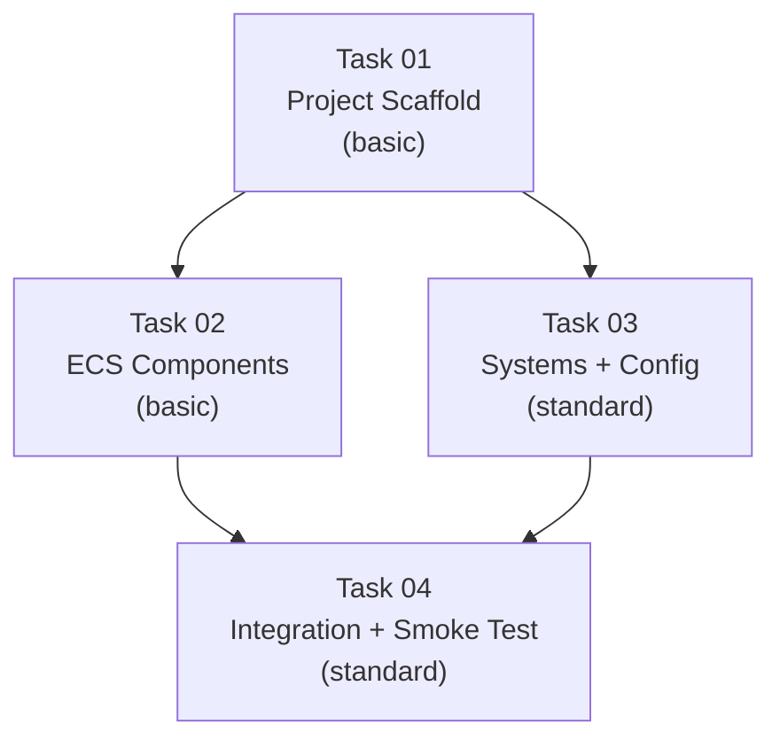

# AGENT ROLE: EXECUTION SPECIALIST

You are an **Execution Specialist** in a multi-agent DAG workflow.
You have been assigned ONE specific task. You implement it with surgical precision.

---

## Your Assignment

| Field   | Value |
|---------|-------|
| Task ID | `task_03_systems_config` |
| Feature | P1-MP1 Rust/Bevy Scaffold + Minimal ECS |
| Tier    | standard |

## Context Loading (Tier-Dependent)

**If your tier is `basic`:**
- Skip all external file reading. Your Task Brief below IS your complete instruction.
- Write the code exactly as specified, then create a changelog and run `./task_tool.sh done task_03_systems_config`.

**If your tier is `standard` or `advanced`:**
1. Read `.agents/context.md` — Thin index pointing to context sub-files
2. Load ONLY the `context/*` sub-files listed in your `Context_Bindings` below
3. Scan `.agents/knowledge/` — Lessons from previous sessions relevant to your task

**Workflow:**
- `.agents/workflows/execution-lifecycle.md` — Your 4-step execution loop

**Rules:**
- `.agents/rules/execution-boundary.md` — Scope and contract constraints
_No additional context bindings specified._

---

## Task Brief

# Task 03: Systems + Config

```yaml
Task_ID: task_03_systems_config
Feature: P1-MP1 Rust/Bevy Scaffold + Minimal ECS
Execution_Phase: B (parallel with Task 02 — zero file overlap)
Model_Tier: standard
```

## Target Files
- `micro-core/src/systems/mod.rs` [MODIFY]
- `micro-core/src/systems/movement.rs` [NEW]
- `micro-core/src/systems/spawning.rs` [NEW]
- `micro-core/src/config.rs` [NEW]
- `micro-core/src/lib.rs` [MODIFY] (add `pub mod config;`)

## Dependencies
- **Task 01** must be complete (project must compile)
- **Reads contract from Task 02** (component types) — but does NOT modify Task 02's files. Import paths are known from the shared contract in `implementation_plan.md`.

## Context_Bindings
- context/conventions
- context/architecture
- skills/rust-code-standards

## Strict Instructions

### 1. Create `src/config.rs`

```rust
use bevy::prelude::*;
use serde::{Deserialize, Serialize};

/// Global simulation configuration. Inserted as a Bevy Resource at app startup.
#[derive(Resource, Debug, Clone, Serialize, Deserialize)]
pub struct SimulationConfig {
    pub world_width: f32,
    pub world_height: f32,
    pub initial_entity_count: u32,
}

impl Default for SimulationConfig {
    fn default() -> Self {
        Self {
            world_width: 1000.0,
            world_height: 1000.0,
            initial_entity_count: 100,
        }
    }
}

/// Monotonically increasing tick counter. Incremented once per ECS tick.
#[derive(Resource, Debug, Default)]
pub struct TickCounter {
    pub tick: u64,
}
```

### 2. Update `src/lib.rs`

Add the config module. The file should now be:

```rust
pub mod components;
pub mod config;
pub mod systems;
```

### 3. Create `src/systems/movement.rs`

```rust
use bevy::prelude::*;
use crate::components::{Position, Velocity};
use crate::config::SimulationConfig;

/// Applies velocity to position each tick, with world-boundary wrapping.
///
/// Entities that exit the [0, world_width] × [0, world_height] bounds
/// wrap around to the opposite edge. This prevents entities from
/// drifting off into infinity in the pre-pathfinding phase.
pub fn movement_system(
    mut query: Query<(&mut Position, &Velocity)>,
    config: Res<SimulationConfig>,
) {
    for (mut pos, vel) in &mut query {
        pos.x += vel.dx;
        pos.y += vel.dy;

        // Wrap around world boundaries
        if pos.x < 0.0 {
            pos.x += config.world_width;
        } else if pos.x >= config.world_width {
            pos.x -= config.world_width;
        }

        if pos.y < 0.0 {
            pos.y += config.world_height;
        } else if pos.y >= config.world_height {
            pos.y -= config.world_height;
        }
    }
}
```

### 4. Create `src/systems/spawning.rs`

```rust
use bevy::prelude::*;
use rand::Rng;
use crate::components::{EntityId, NextEntityId, Position, Team, Velocity};
use crate::config::SimulationConfig;

/// Startup system: spawns `initial_entity_count` entities with random
/// positions, small random velocities, and alternating teams.
///
/// Uses a seeded RNG for deterministic, reproducible results.
pub fn initial_spawn_system(
    mut commands: Commands,
    config: Res<SimulationConfig>,
    mut next_id: ResMut<NextEntityId>,
) {
    let mut rng = rand::rng();

    for i in 0..config.initial_entity_count {
        let team = if i % 2 == 0 { Team::Swarm } else { Team::Defender };

        let entity_id = EntityId { id: next_id.0 };
        next_id.0 += 1;

        commands.spawn((
            entity_id,
            Position {
                x: rng.random_range(0.0..config.world_width),
                y: rng.random_range(0.0..config.world_height),
            },
            Velocity {
                dx: rng.random_range(-1.0..1.0),
                dy: rng.random_range(-1.0..1.0),
            },
            team,
        ));
    }
}
```

> **Note on RNG:** Using `rand::rng()` which creates a thread-local RNG. For reproducibility, we could use `StdRng::seed_from_u64(42)` later. For now, we use the default RNG for simplicity.

### 5. Create `tick_counter_system` (in `systems/mod.rs` or a separate file)

Add the tick counter system. Place it in `systems/mod.rs` since it's trivial:

### 6. Update `src/systems/mod.rs`

```rust
pub mod movement;
pub mod spawning;

use bevy::prelude::*;
use crate::config::TickCounter;

pub use movement::movement_system;
pub use spawning::initial_spawn_system;

/// Increments the global tick counter each frame.
pub fn tick_counter_system(mut counter: ResMut<TickCounter>) {
    counter.tick += 1;
}
```

### 7. Write Unit Tests

**movement.rs tests:**

```rust
#[cfg(test)]
mod tests {
    use super::*;
    use bevy::app::App;

    #[test]
    fn test_movement_applies_velocity() {
        let mut app = App::new();
        app.insert_resource(SimulationConfig::default());
        app.add_systems(Update, movement_system);

        let entity = app.world_mut().spawn((
            Position { x: 100.0, y: 200.0 },
            Velocity { dx: 1.5, dy: -0.5 },
        )).id();

        app.update();

        let pos = app.world().get::<Position>(entity).unwrap();
        assert!((pos.x - 101.5).abs() < f32::EPSILON);
        assert!((pos.y - 199.5).abs() < f32::EPSILON);
    }

    #[test]
    fn test_movement_wraps_at_right_boundary() {
        let mut app = App::new();
        app.insert_resource(SimulationConfig {
            world_width: 100.0,
            world_height: 100.0,
            initial_entity_count: 0,
        });
        app.add_systems(Update, movement_system);

        let entity = app.world_mut().spawn((
            Position { x: 99.5, y: 50.0 },
            Velocity { dx: 1.0, dy: 0.0 },
        )).id();

        app.update();

        let pos = app.world().get::<Position>(entity).unwrap();
        assert!(pos.x < 1.0, "Entity should have wrapped to near 0, got {}", pos.x);
    }

    #[test]
    fn test_movement_wraps_at_left_boundary() {
        let mut app = App::new();
        app.insert_resource(SimulationConfig {
            world_width: 100.0,
            world_height: 100.0,
            initial_entity_count: 0,
        });
        app.add_systems(Update, movement_system);

        let entity = app.world_mut().spawn((
            Position { x: 0.5, y: 50.0 },
            Velocity { dx: -1.0, dy: 0.0 },
        )).id();

        app.update();

        let pos = app.world().get::<Position>(entity).unwrap();
        assert!(pos.x > 99.0, "Entity should have wrapped to near 100, got {}", pos.x);
    }
}
```

**config.rs tests:**

```rust
#[cfg(test)]
mod tests {
    use super::*;

    #[test]
    fn test_default_config() {
        let config = SimulationConfig::default();
        assert!((config.world_width - 1000.0).abs() < f32::EPSILON);
        assert!((config.world_height - 1000.0).abs() < f32::EPSILON);
        assert_eq!(config.initial_entity_count, 100);
    }

    #[test]
    fn test_tick_counter_default() {
        let counter = TickCounter::default();
        assert_eq!(counter.tick, 0);
    }
}
```

## Verification_Strategy

```yaml
Test_Type: unit
Test_Stack: cargo (Rust toolchain)
Acceptance_Criteria:
  - "`cargo build` succeeds"
  - "`cargo clippy` — zero warnings"
  - "movement_system correctly applies velocity to position"
  - "boundary wrapping works for left, right, top, and bottom edges"
  - "initial_spawn_system creates exactly `initial_entity_count` entities"
  - "All spawned entities have unique EntityId values"
  - "SimulationConfig::default() returns 1000x1000 world, 100 entities"
  - "TickCounter::default() starts at 0"
  - "`cargo test` — all unit tests pass"
Suggested_Test_Commands:
  - "cd micro-core && cargo test systems 2>&1"
  - "cd micro-core && cargo test config 2>&1"
  - "cd micro-core && cargo clippy 2>&1"
```

---

## Shared Contracts

# Phase 1 — Micro-Phase 1: Rust/Bevy Scaffold + Minimal ECS

> **Parent:** Phase 1 (Vertical Slice) from the [5-phase roadmap](file:///Users/manifera/.gemini/antigravity/brain/5b98b12b-904d-4b26-ada5-daed7b94875b/implementation_plan.md)
> **Scope:** Stand up the Rust Micro-Core project with Bevy 0.18 headless, minimal ECS components, a movement system, and entity spawning. **No bridges, no visualizer** — those are separate micro-phases.

---

## Micro-Phase Breakdown Strategy

Phase 1 (Vertical Slice) is split into the following micro-phases:

| Micro-Phase | Scope | Depends On |
|-------------|-------|------------|
| **MP1 (this plan)** | Rust project scaffold + Bevy ECS + movement system | None |
| **MP2 (future)** | WebSocket bridge (`ws_bridge.rs`) + delta-sync tracking | MP1 |
| **MP3 (future)** | ZeroMQ bridge (`zmq_bridge.rs`) + stub AI round-trip | MP1 |
| **MP4 (future)** | Debug Visualizer (HTML/Canvas/JS) + WS client | MP2 |
| **MP5 (future)** | Integration wiring + end-to-end vertical slice test | MP2, MP3, MP4 |

> [!NOTE]
> MP2 and MP3 can run **in parallel** since they touch different files and communicate through the same ECS state. MP4 depends on MP2 (needs WS server). MP5 wires everything together.

---

## Proposed Changes

### Component 1: Project Scaffold

#### [NEW] [Cargo.toml](file:///Users/manifera/Documents/Study/mass-swarm-ai-simulator/micro-core/Cargo.toml)
- Create `micro-core/` directory with a properly configured `Cargo.toml`
- Package name: `micro-core`
- Edition: `2024`
- Crate type: `cdylib` + `rlib` (C-ABI readiness from day one, `rlib` for tests)
- Dependencies (only what MP1 needs — bridges add theirs later):
  - `bevy = { version = "0.18", default-features = false, features = ["bevy_app", "bevy_ecs"] }`
  - `serde = { version = "1.0", features = ["derive"] }`
  - `serde_json = "1.0"`
  - `rand = "0.9"` (for random initial positions/velocities)

> [!IMPORTANT]
> **Bevy 0.18 feature selection:** We deliberately use `default-features = false` and cherry-pick only `bevy_app` and `bevy_ecs`. This avoids pulling in rendering, audio, windowing, and asset pipelines that we don't need in headless mode. The `ScheduleRunnerPlugin` is available from `bevy_app`. Future micro-phases will add `tokio`, `tokio-tungstenite`, and `zeromq` when bridges are needed.

#### [NEW] [main.rs](file:///Users/manifera/Documents/Study/mass-swarm-ai-simulator/micro-core/src/main.rs)
- Bevy app entry point using `MinimalPlugins`
- `ScheduleRunnerPlugin::run_loop(Duration::from_secs_f64(1.0 / 60.0))` for 60 TPS
- Register all ECS systems and startup system for initial entity spawning

---

### Component 2: ECS Components

#### [NEW] [mod.rs](file:///Users/manifera/Documents/Study/mass-swarm-ai-simulator/micro-core/src/components/mod.rs)
- Module barrel file re-exporting all components

#### [NEW] [position.rs](file:///Users/manifera/Documents/Study/mass-swarm-ai-simulator/micro-core/src/components/position.rs)
- `Position` component: `x: f32, y: f32`
- Derives: `Component, Debug, Clone, Serialize, Deserialize`

#### [NEW] [velocity.rs](file:///Users/manifera/Documents/Study/mass-swarm-ai-simulator/micro-core/src/components/velocity.rs)
- `Velocity` component: `dx: f32, dy: f32`
- Derives: `Component, Debug, Clone, Serialize, Deserialize`

#### [NEW] [team.rs](file:///Users/manifera/Documents/Study/mass-swarm-ai-simulator/micro-core/src/components/team.rs)
- `Team` enum: `Swarm`, `Defender`
- Derives: `Component, Debug, Clone, PartialEq, Serialize, Deserialize`
- Custom `Display` impl for JSON-compatible lowercase output (`"swarm"`, `"defender"`)

#### [NEW] [entity_id.rs](file:///Users/manifera/Documents/Study/mass-swarm-ai-simulator/micro-core/src/components/entity_id.rs)
- `EntityId` component: `id: u32`  
- Derives: `Component, Debug, Clone, Serialize, Deserialize`
- A `Resource` counter `NextEntityId(u32)` for monotonic ID assignment

---

### Component 3: ECS Systems

#### [NEW] [mod.rs](file:///Users/manifera/Documents/Study/mass-swarm-ai-simulator/micro-core/src/systems/mod.rs)
- Module barrel file re-exporting all systems

#### [NEW] [movement.rs](file:///Users/manifera/Documents/Study/mass-swarm-ai-simulator/micro-core/src/systems/movement.rs)
- `movement_system`: queries `(&mut Position, &Velocity)`, applies `pos.x += vel.dx; pos.y += vel.dy` per tick
- World-boundary wrapping: entities that exit `[0, WORLD_WIDTH]` × `[0, WORLD_HEIGHT]` wrap around

#### [NEW] [spawning.rs](file:///Users/manifera/Documents/Study/mass-swarm-ai-simulator/micro-core/src/systems/spawning.rs)
- `initial_spawn_system` (startup system): spawns `INITIAL_ENTITY_COUNT` entities with random positions, small random velocities, and alternating teams
- Uses `NextEntityId` resource for ID assignment

---

### Component 4: Simulation Config Resource

#### [NEW] [config.rs](file:///Users/manifera/Documents/Study/mass-swarm-ai-simulator/micro-core/src/config.rs)
- `SimulationConfig` resource with:
  - `world_width: f32` (default: `1000.0`)
  - `world_height: f32` (default: `1000.0`)
  - `initial_entity_count: u32` (default: `100`)
- `TickCounter` resource: `tick: u64` (incremented each frame by a `tick_counter_system`)

---

## Shared Contracts

These are the exact data structures that MP2/MP3/MP4 will depend on. They are defined here so future micro-phases code against them.

### ECS Components (Rust types)

```rust
// components/position.rs
#[derive(Component, Debug, Clone, Serialize, Deserialize)]
pub struct Position {
    pub x: f32,
    pub y: f32,
}

// components/velocity.rs
#[derive(Component, Debug, Clone, Serialize, Deserialize)]
pub struct Velocity {
    pub dx: f32,
    pub dy: f32,
}

// components/team.rs
#[derive(Component, Debug, Clone, PartialEq, Serialize, Deserialize)]
pub enum Team {
    Swarm,
    Defender,
}

// components/entity_id.rs
#[derive(Component, Debug, Clone, Serialize, Deserialize)]
pub struct EntityId {
    pub id: u32,
}

#[derive(Resource, Debug)]
pub struct NextEntityId(pub u32);
```

### Resources (Rust types)

```rust
// config.rs
#[derive(Resource, Debug, Clone, Serialize, Deserialize)]
pub struct SimulationConfig {
    pub world_width: f32,
    pub world_height: f32,
    pub initial_entity_count: u32,
}

impl Default for SimulationConfig {
    fn default() -> Self {
        Self {
            world_width: 1000.0,
            world_height: 1000.0,
            initial_entity_count: 100,
        }
    }
}

#[derive(Resource, Debug, Default)]
pub struct TickCounter {
    pub tick: u64,
}
```

### System Signatures

```rust
// systems/movement.rs
pub fn movement_system(
    mut query: Query<(&mut Position, &Velocity)>,
    config: Res<SimulationConfig>,
) { /* boundary wrapping logic */ }

// systems/spawning.rs
pub fn initial_spawn_system(
    mut commands: Commands,
    config: Res<SimulationConfig>,
    mut next_id: ResMut<NextEntityId>,
) { /* spawn INITIAL_ENTITY_COUNT entities */ }

// tick_counter lives alongside config or in systems/
pub fn tick_counter_system(mut counter: ResMut<TickCounter>) {
    counter.tick += 1;
}
```

---

## DAG Execution Graph



| Phase | Tasks | Parallelism |
|-------|-------|-------------|
| Phase A | Task 01 (scaffold) | Sequential — creates the project |
| Phase B | Task 02 (components), Task 03 (systems + config) | **Parallel** — zero file overlap |
| Phase C | Task 04 (integration wiring + smoke test) | Sequential — wires Phase B outputs into `main.rs` |

---

## Task Summaries

### Task 01 — Project Scaffold
- **Tier:** `basic`
- **Files:** `micro-core/Cargo.toml`, `micro-core/src/main.rs` (stub only), `micro-core/src/components/mod.rs` (empty), `micro-core/src/systems/mod.rs` (empty)
- **Description:** Create the Rust project directory structure. `main.rs` contains a minimal Bevy app with `MinimalPlugins` + `ScheduleRunnerPlugin` at 60 TPS that compiles and runs (exits cleanly or loops with no systems). Module directories exist but are empty stubs.
- **Verification:** `cd micro-core && cargo build` succeeds with zero errors. `cargo clippy` has zero warnings.

### Task 02 — ECS Components
- **Tier:** `basic`
- **Files:** `micro-core/src/components/mod.rs`, `micro-core/src/components/position.rs`, `micro-core/src/components/velocity.rs`, `micro-core/src/components/team.rs`, `micro-core/src/components/entity_id.rs`
- **Description:** Implement all ECS component structs exactly as defined in the shared contracts above. Each file contains one struct/enum with all required derives. `mod.rs` re-exports everything.
- **Verification:** `cargo build` succeeds. Unit test: instantiate each component, serialize to JSON, deserialize back, assert equality.

### Task 03 — Systems + Config
- **Tier:** `standard`
- **Files:** `micro-core/src/systems/mod.rs`, `micro-core/src/systems/movement.rs`, `micro-core/src/systems/spawning.rs`, `micro-core/src/config.rs`
- **Context Bindings:** `context/conventions`, `context/architecture`
- **Description:** Implement `movement_system`, `initial_spawn_system`, `tick_counter_system`, `SimulationConfig`, and `TickCounter` exactly as defined in the shared contracts. Movement system applies velocity to position with world-boundary wrapping. Spawning system creates entities with random positions/velocities.
- **Verification:** Unit tests: (1) `movement_system` moves an entity correctly, (2) boundary wrapping works at edges, (3) `initial_spawn_system` creates the correct number of entities with valid IDs.

### Task 04 — Integration Wiring + Smoke Test  
- **Tier:** `standard`
- **Files:** `micro-core/src/main.rs` (update only)
- **Context Bindings:** `context/tech-stack`, `context/conventions`
- **Description:** Wire all components, systems, and resources into `main.rs`. The final binary should: start Bevy app → spawn 100 entities → tick at 60 TPS → entities move each tick → print tick count every 60 ticks (1 second) to stdout for verification. Add a log-based exit after 300 ticks (5 seconds) for CI-friendly smoke test mode.
- **Verification:** `cargo run` executes, prints tick logs, and exits after ~5 seconds. `cargo test` passes all unit tests. `cargo clippy` clean.

---

## User Review Required

> [!IMPORTANT]
> **Bevy 0.18 feature flags:** I've specified `bevy_app` + `bevy_ecs` as the minimal feature set. Need to verify these exact feature names exist in Bevy 0.18. If they've changed, we'll adjust before dispatching tasks.

> [!IMPORTANT]
> **Scope boundary:** This micro-phase deliberately excludes bridges and the visualizer. The output is a standalone Rust binary that spawns entities and moves them in a headless loop. Is this the right granularity for MP1, or would you prefer to include the WS bridge in this first pass?

## Open Questions

1. **Entity count for MP1:** The roadmap says 100 for the initial vertical slice. Should MP1 use 100, or should we start with a smaller number (e.g., 10) for faster iteration and bump it in MP5?
2. **Random seed:** Should entity positions/velocities be deterministic (seeded RNG) for reproducible debugging, or truly random?
3. **Exit behavior:** For the smoke test, I've proposed auto-exit after 300 ticks. Should the binary also support a "run forever" mode for when we add bridges in MP2/MP3?

---

## Verification Plan

### Automated Tests
```bash
cd micro-core && cargo build          # Compilation check
cd micro-core && cargo clippy         # Lint check (zero warnings)
cd micro-core && cargo test           # Unit tests for components + systems
cd micro-core && cargo run            # Smoke test: exits after ~5 seconds with tick logs
```

### Manual Verification
- Inspect stdout output to confirm tick counter increments and entity count matches config
- Verify that `Cargo.toml` dependencies match the pinned versions from `context/tech-stack.md`
