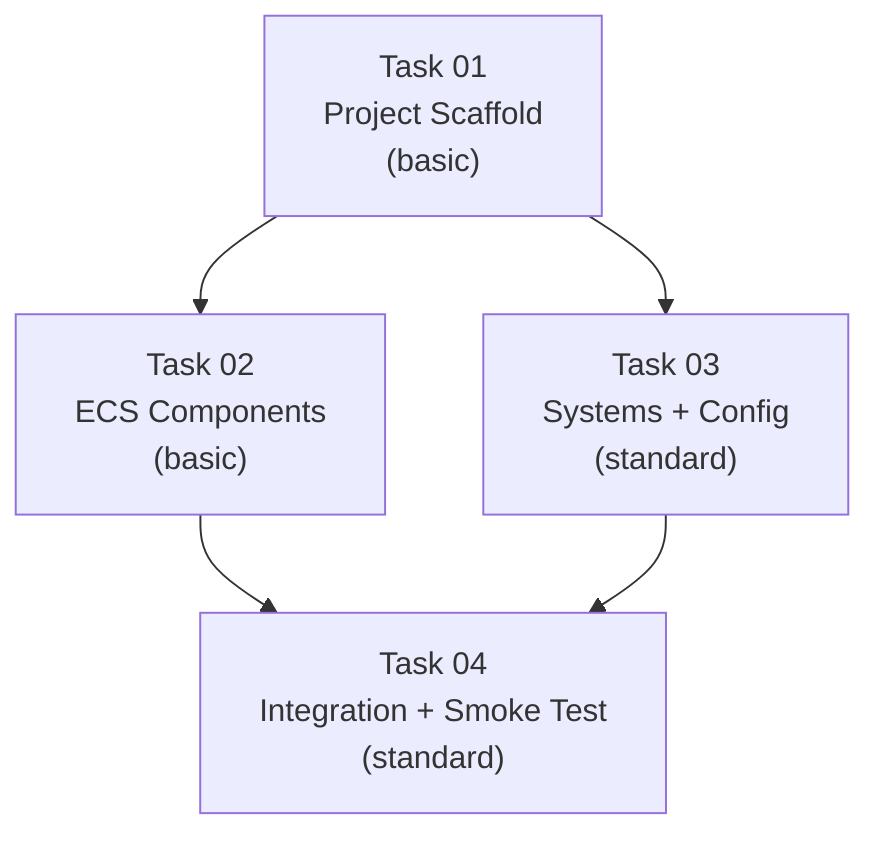

# AGENT ROLE: EXECUTION SPECIALIST

You are an **Execution Specialist** in a multi-agent DAG workflow.
You have been assigned ONE specific task. You implement it with surgical precision.

---

## Your Assignment

| Field   | Value |
|---------|-------|
| Task ID | `task_04_integration_smoke` |
| Feature | P1-MP1 Rust/Bevy Scaffold + Minimal ECS |
| Tier    | standard |

## Context Loading (Tier-Dependent)

**If your tier is `basic`:**
- Skip all external file reading. Your Task Brief below IS your complete instruction.
- Write the code exactly as specified, then create a changelog and run `./task_tool.sh done task_04_integration_smoke`.

**If your tier is `standard` or `advanced`:**
1. Read `.agents/context.md` — Thin index pointing to context sub-files
2. Load ONLY the `context/*` sub-files listed in your `Context_Bindings` below
3. Scan `.agents/knowledge/` — Lessons from previous sessions relevant to your task

**Workflow:**
- `.agents/workflows/execution-lifecycle.md` — Your 4-step execution loop

**Rules:**
- `.agents/rules/execution-boundary.md` — Scope and contract constraints
_No additional context bindings specified._

---

## Task Brief

# Task 04: Integration Wiring + Smoke Test (REVISION 2)

```yaml
Task_ID: task_04_integration_smoke
Feature: P1-MP1 Rust/Bevy Scaffold + Minimal ECS
Execution_Phase: C (sequential — depends on Task 02 + Task 03)
Model_Tier: standard
```

> [!CAUTION]
> **REVISION 2 — Previous attempt FAILED.** Root cause: `ScheduleRunnerPlugin::run_loop` ticks at ~2-3 FPS on macOS instead of 60 TPS. The fix is to replace it with a **custom runner** using explicit `thread::sleep` for precise timing control. Read the "Previous Failure" section below before coding.

## Previous Failure Analysis

**Symptoms:**
- The simulation ticked at 2-3 FPS instead of 60 TPS
- `cargo run` produced zero tick log output in 8 seconds
- Tests hung indefinitely waiting for 300 ticks

**Root Cause:**
`ScheduleRunnerPlugin::run_loop(Duration)` in headless mode (without `WinitPlugin`) has poor timing behavior on macOS. Without a windowing event loop to pace frames, the plugin's internal loop doesn't yield efficiently, resulting in extremely slow tick rates.

**Fix:**
Replace `MinimalPlugins.set(ScheduleRunnerPlugin::run_loop(...))` with a **custom app runner** that calls `app.update()` in a manual loop with explicit `std::thread::sleep()` for timing.

## Target Files
- `micro-core/src/main.rs` [MODIFY] (rewrite — replace the current broken version)

## Dependencies
- **Task 02** (ECS components must exist and compile)
- **Task 03** (Systems + config must exist and compile)

## Context_Bindings
- context/tech-stack
- context/conventions
- context/architecture
- skills/rust-code-standards

## Strict Instructions

### 1. Rewrite `src/main.rs` with a Custom Runner

Replace the **entire** contents of `main.rs` with the following:

```rust
//! # Entry Point
//!
//! Headless Bevy application with a custom runner for precise 60 TPS timing.
//!
//! ## Ownership
//! - **Task:** task_04_integration_smoke (revision 2)
//! - **Contract:** implementation_plan.md → Task 04
//!
//! ## Depends On
//! - `micro_core::components`
//! - `micro_core::config`
//! - `micro_core::systems`
//!
//! ## Design Note
//! We use a **custom app runner** instead of `ScheduleRunnerPlugin::run_loop`
//! because the latter has poor timing behavior on macOS in headless mode
//! (ticks at ~2-3 FPS instead of 60 TPS). The custom runner uses explicit
//! `thread::sleep()` to guarantee consistent tick rates.

use bevy::prelude::*;
use std::thread;
use std::time::{Duration, Instant};

use micro_core::components::NextEntityId;
use micro_core::config::{SimulationConfig, TickCounter};
use micro_core::systems::{initial_spawn_system, movement_system, tick_counter_system};

/// Maximum ticks before auto-exit in smoke test mode.
/// Set to 0 to disable auto-exit (run forever mode for bridges).
const SMOKE_TEST_MAX_TICKS: u64 = 300; // ~5 seconds at 60 TPS

/// Target ticks per second for the simulation loop.
const TARGET_TPS: f64 = 60.0;

fn main() {
    App::new()
        // DO NOT use MinimalPlugins — it forces ScheduleRunnerPlugin which
        // has broken timing on macOS. Instead, add only what we need.
        .add_plugins(TaskPoolPlugin::default())
        .add_plugins(TypeRegistrationPlugin::default())
        .add_plugins(FrameCountPlugin::default())
        // Resources
        .init_resource::<SimulationConfig>()
        .init_resource::<TickCounter>()
        .init_resource::<NextEntityId>()
        // Startup systems (run once)
        .add_systems(Startup, initial_spawn_system)
        // Per-tick systems (run every frame)
        .add_systems(Update, (
            tick_counter_system,
            movement_system,
            log_system,
        ))
        // Custom runner replaces ScheduleRunnerPlugin
        .set_runner(custom_runner)
        .run();
}

/// Custom application runner that ticks at exactly TARGET_TPS.
///
/// Replaces `ScheduleRunnerPlugin::run_loop` which had timing issues
/// on macOS in headless mode. Uses `thread::sleep` for frame pacing.
fn custom_runner(mut app: App) -> AppExit {
    let frame_duration = Duration::from_secs_f64(1.0 / TARGET_TPS);

    loop {
        let frame_start = Instant::now();

        // Run one ECS tick
        app.update();

        // Check if we should exit (read TickCounter from the world)
        if SMOKE_TEST_MAX_TICKS > 0 {
            if let Some(counter) = app.world().get_resource::<TickCounter>() {
                if counter.tick >= SMOKE_TEST_MAX_TICKS {
                    println!("[Tick {}] Smoke test complete. Exiting.", counter.tick);
                    return AppExit::Success;
                }
            }
        }

        // Sleep to maintain target TPS
        let elapsed = frame_start.elapsed();
        if elapsed < frame_duration {
            thread::sleep(frame_duration - elapsed);
        }
    }
}

/// Logs simulation status every 60 ticks (~1 second).
fn log_system(
    counter: Res<TickCounter>,
    query: Query<&micro_core::components::Position>,
) {
    if counter.tick > 0 && counter.tick % 60 == 0 {
        let entity_count = query.iter().count();
        println!("[Tick {}] Entities alive: {}", counter.tick, entity_count);
    }
}
```

### Key Changes from Revision 1

1. **Removed `MinimalPlugins`** — it bundles `ScheduleRunnerPlugin` which was the root cause of slow ticking.
2. **Added individual plugins** — `TaskPoolPlugin`, `TypeRegistrationPlugin`, and `FrameCountPlugin` are the core plugins Bevy needs without the problematic runner. Check what `MinimalPlugins` expands to in Bevy 0.18 and add the individual plugins it contains MINUS `ScheduleRunnerPlugin`.
3. **`custom_runner` function** — Uses `Instant::now()` + `thread::sleep()` for precise 60 TPS timing. This is the standard pattern for headless Bevy apps.
4. **Exit logic moved to runner** — Instead of an ECS system writing `AppExit` events, the runner reads `TickCounter` directly from the world and returns `AppExit::Success`. This is more reliable for headless exit.
5. **Removed `smoke_test_exit_system`** — Exit is now handled in the custom runner, avoiding the `EventWriter<AppExit>` / `MessageWriter<AppExit>` API ambiguity.

### 2. IMPORTANT: Verify Bevy 0.18 MinimalPlugins Composition

Before coding, you MUST check what plugins `MinimalPlugins` contains in Bevy 0.18. Run:

```bash
cd micro-core && grep -r "MinimalPlugins" $(cargo metadata --format-version 1 2>/dev/null | python3 -c "import sys,json; print(json.load(sys.stdin)['workspace_root'])")/../.cargo/registry/src/*/bevy-0.18*/crates/bevy_internal/src/lib.rs 2>/dev/null || echo "Check Bevy source or docs.rs for MinimalPlugins definition"
```

Or check [docs.rs/bevy/0.18/bevy/struct.MinimalPlugins.html](https://docs.rs/bevy/0.18/bevy/struct.MinimalPlugins.html).

Add ALL plugins from `MinimalPlugins` EXCEPT `ScheduleRunnerPlugin`. The code above lists `TaskPoolPlugin`, `TypeRegistrationPlugin`, and `FrameCountPlugin` as a best guess — **verify and adjust**.

### 3. Verify the Fix

After updating `main.rs`, run:

```bash
cd micro-core && cargo build
cd micro-core && cargo clippy
cd micro-core && cargo test
cd micro-core && cargo run
```

Expected `cargo run` output (must complete in ~5 seconds):
```
[Tick 60] Entities alive: 100
[Tick 120] Entities alive: 100
[Tick 180] Entities alive: 100
[Tick 240] Entities alive: 100
[Tick 300] Smoke test complete. Exiting.
```

**If it still hangs or ticks slowly**, the `MinimalPlugins` decomposition is wrong. Check which plugins are actually needed and adjust.

## Verification_Strategy

```yaml
Test_Type: integration
Test_Stack: cargo (Rust toolchain)
Acceptance_Criteria:
  - "`cargo build` succeeds with zero errors"
  - "`cargo clippy` — zero warnings"
  - "`cargo test` — all unit tests from Tasks 02 and 03 still pass"
  - "`cargo run` completes in approximately 5 seconds (300 ticks at 60 TPS)"
  - "Log output shows 5 tick checkpoints: Tick 60, 120, 180, 240, 300"
  - "Each checkpoint shows exactly 100 entities alive"
  - "Process exits with code 0"
  - "NO use of ScheduleRunnerPlugin anywhere in the codebase"
Suggested_Test_Commands:
  - "cd micro-core && cargo build 2>&1"
  - "cd micro-core && cargo clippy 2>&1"
  - "cd micro-core && cargo test 2>&1"
  - "cd micro-core && timeout 15 cargo run 2>&1"
Manual_Steps:
  - "Run `cargo run` and time it — should complete in ~5-6 seconds"
  - "Count the tick log lines — should be exactly 5 (at ticks 60, 120, 180, 240, 300)"
  - "Verify 'Smoke test complete. Exiting.' appears as the final line"
```

---

## Shared Contracts

# Phase 1 — Micro-Phase 1: Rust/Bevy Scaffold + Minimal ECS

> **Parent:** Phase 1 (Vertical Slice) from the [5-phase roadmap](file:///Users/manifera/.gemini/antigravity/brain/5b98b12b-904d-4b26-ada5-daed7b94875b/implementation_plan.md)
> **Scope:** Stand up the Rust Micro-Core project with Bevy 0.18 headless, minimal ECS components, a movement system, and entity spawning. **No bridges, no visualizer** — those are separate micro-phases.

---

## Micro-Phase Breakdown Strategy

Phase 1 (Vertical Slice) is split into the following micro-phases:

| Micro-Phase | Scope | Depends On |
|-------------|-------|------------|
| **MP1 (this plan)** | Rust project scaffold + Bevy ECS + movement system | None |
| **MP2 (future)** | WebSocket bridge (`ws_bridge.rs`) + delta-sync tracking | MP1 |
| **MP3 (future)** | ZeroMQ bridge (`zmq_bridge.rs`) + stub AI round-trip | MP1 |
| **MP4 (future)** | Debug Visualizer (HTML/Canvas/JS) + WS client | MP2 |
| **MP5 (future)** | Integration wiring + end-to-end vertical slice test | MP2, MP3, MP4 |

> [!NOTE]
> MP2 and MP3 can run **in parallel** since they touch different files and communicate through the same ECS state. MP4 depends on MP2 (needs WS server). MP5 wires everything together.

---

## Proposed Changes

### Component 1: Project Scaffold

#### [NEW] [Cargo.toml](file:///Users/manifera/Documents/Study/mass-swarm-ai-simulator/micro-core/Cargo.toml)
- Create `micro-core/` directory with a properly configured `Cargo.toml`
- Package name: `micro-core`
- Edition: `2024`
- Crate type: `cdylib` + `rlib` (C-ABI readiness from day one, `rlib` for tests)
- Dependencies (only what MP1 needs — bridges add theirs later):
  - `bevy = { version = "0.18", default-features = false, features = ["bevy_app", "bevy_ecs"] }`
  - `serde = { version = "1.0", features = ["derive"] }`
  - `serde_json = "1.0"`
  - `rand = "0.9"` (for random initial positions/velocities)

> [!IMPORTANT]
> **Bevy 0.18 feature selection:** We deliberately use `default-features = false` and cherry-pick only `bevy_app` and `bevy_ecs`. This avoids pulling in rendering, audio, windowing, and asset pipelines that we don't need in headless mode. The `ScheduleRunnerPlugin` is available from `bevy_app`. Future micro-phases will add `tokio`, `tokio-tungstenite`, and `zeromq` when bridges are needed.

#### [NEW] [main.rs](file:///Users/manifera/Documents/Study/mass-swarm-ai-simulator/micro-core/src/main.rs)
- Bevy app entry point using `MinimalPlugins`
- `ScheduleRunnerPlugin::run_loop(Duration::from_secs_f64(1.0 / 60.0))` for 60 TPS
- Register all ECS systems and startup system for initial entity spawning

---

### Component 2: ECS Components

#### [NEW] [mod.rs](file:///Users/manifera/Documents/Study/mass-swarm-ai-simulator/micro-core/src/components/mod.rs)
- Module barrel file re-exporting all components

#### [NEW] [position.rs](file:///Users/manifera/Documents/Study/mass-swarm-ai-simulator/micro-core/src/components/position.rs)
- `Position` component: `x: f32, y: f32`
- Derives: `Component, Debug, Clone, Serialize, Deserialize`

#### [NEW] [velocity.rs](file:///Users/manifera/Documents/Study/mass-swarm-ai-simulator/micro-core/src/components/velocity.rs)
- `Velocity` component: `dx: f32, dy: f32`
- Derives: `Component, Debug, Clone, Serialize, Deserialize`

#### [NEW] [team.rs](file:///Users/manifera/Documents/Study/mass-swarm-ai-simulator/micro-core/src/components/team.rs)
- `Team` enum: `Swarm`, `Defender`
- Derives: `Component, Debug, Clone, PartialEq, Serialize, Deserialize`
- Custom `Display` impl for JSON-compatible lowercase output (`"swarm"`, `"defender"`)

#### [NEW] [entity_id.rs](file:///Users/manifera/Documents/Study/mass-swarm-ai-simulator/micro-core/src/components/entity_id.rs)
- `EntityId` component: `id: u32`  
- Derives: `Component, Debug, Clone, Serialize, Deserialize`
- A `Resource` counter `NextEntityId(u32)` for monotonic ID assignment

---

### Component 3: ECS Systems

#### [NEW] [mod.rs](file:///Users/manifera/Documents/Study/mass-swarm-ai-simulator/micro-core/src/systems/mod.rs)
- Module barrel file re-exporting all systems

#### [NEW] [movement.rs](file:///Users/manifera/Documents/Study/mass-swarm-ai-simulator/micro-core/src/systems/movement.rs)
- `movement_system`: queries `(&mut Position, &Velocity)`, applies `pos.x += vel.dx; pos.y += vel.dy` per tick
- World-boundary wrapping: entities that exit `[0, WORLD_WIDTH]` × `[0, WORLD_HEIGHT]` wrap around

#### [NEW] [spawning.rs](file:///Users/manifera/Documents/Study/mass-swarm-ai-simulator/micro-core/src/systems/spawning.rs)
- `initial_spawn_system` (startup system): spawns `INITIAL_ENTITY_COUNT` entities with random positions, small random velocities, and alternating teams
- Uses `NextEntityId` resource for ID assignment

---

### Component 4: Simulation Config Resource

#### [NEW] [config.rs](file:///Users/manifera/Documents/Study/mass-swarm-ai-simulator/micro-core/src/config.rs)
- `SimulationConfig` resource with:
  - `world_width: f32` (default: `1000.0`)
  - `world_height: f32` (default: `1000.0`)
  - `initial_entity_count: u32` (default: `100`)
- `TickCounter` resource: `tick: u64` (incremented each frame by a `tick_counter_system`)

---

## Shared Contracts

These are the exact data structures that MP2/MP3/MP4 will depend on. They are defined here so future micro-phases code against them.

### ECS Components (Rust types)

```rust
// components/position.rs
#[derive(Component, Debug, Clone, Serialize, Deserialize)]
pub struct Position {
    pub x: f32,
    pub y: f32,
}

// components/velocity.rs
#[derive(Component, Debug, Clone, Serialize, Deserialize)]
pub struct Velocity {
    pub dx: f32,
    pub dy: f32,
}

// components/team.rs
#[derive(Component, Debug, Clone, PartialEq, Serialize, Deserialize)]
pub enum Team {
    Swarm,
    Defender,
}

// components/entity_id.rs
#[derive(Component, Debug, Clone, Serialize, Deserialize)]
pub struct EntityId {
    pub id: u32,
}

#[derive(Resource, Debug)]
pub struct NextEntityId(pub u32);
```

### Resources (Rust types)

```rust
// config.rs
#[derive(Resource, Debug, Clone, Serialize, Deserialize)]
pub struct SimulationConfig {
    pub world_width: f32,
    pub world_height: f32,
    pub initial_entity_count: u32,
}

impl Default for SimulationConfig {
    fn default() -> Self {
        Self {
            world_width: 1000.0,
            world_height: 1000.0,
            initial_entity_count: 100,
        }
    }
}

#[derive(Resource, Debug, Default)]
pub struct TickCounter {
    pub tick: u64,
}
```

### System Signatures

```rust
// systems/movement.rs
pub fn movement_system(
    mut query: Query<(&mut Position, &Velocity)>,
    config: Res<SimulationConfig>,
) { /* boundary wrapping logic */ }

// systems/spawning.rs
pub fn initial_spawn_system(
    mut commands: Commands,
    config: Res<SimulationConfig>,
    mut next_id: ResMut<NextEntityId>,
) { /* spawn INITIAL_ENTITY_COUNT entities */ }

// tick_counter lives alongside config or in systems/
pub fn tick_counter_system(mut counter: ResMut<TickCounter>) {
    counter.tick += 1;
}
```

---

## DAG Execution Graph



| Phase | Tasks | Parallelism |
|-------|-------|-------------|
| Phase A | Task 01 (scaffold) | Sequential — creates the project |
| Phase B | Task 02 (components), Task 03 (systems + config) | **Parallel** — zero file overlap |
| Phase C | Task 04 (integration wiring + smoke test) | Sequential — wires Phase B outputs into `main.rs` |

---

## Task Summaries

### Task 01 — Project Scaffold
- **Tier:** `basic`
- **Files:** `micro-core/Cargo.toml`, `micro-core/src/main.rs` (stub only), `micro-core/src/components/mod.rs` (empty), `micro-core/src/systems/mod.rs` (empty)
- **Description:** Create the Rust project directory structure. `main.rs` contains a minimal Bevy app with `MinimalPlugins` + `ScheduleRunnerPlugin` at 60 TPS that compiles and runs (exits cleanly or loops with no systems). Module directories exist but are empty stubs.
- **Verification:** `cd micro-core && cargo build` succeeds with zero errors. `cargo clippy` has zero warnings.

### Task 02 — ECS Components
- **Tier:** `basic`
- **Files:** `micro-core/src/components/mod.rs`, `micro-core/src/components/position.rs`, `micro-core/src/components/velocity.rs`, `micro-core/src/components/team.rs`, `micro-core/src/components/entity_id.rs`
- **Description:** Implement all ECS component structs exactly as defined in the shared contracts above. Each file contains one struct/enum with all required derives. `mod.rs` re-exports everything.
- **Verification:** `cargo build` succeeds. Unit test: instantiate each component, serialize to JSON, deserialize back, assert equality.

### Task 03 — Systems + Config
- **Tier:** `standard`
- **Files:** `micro-core/src/systems/mod.rs`, `micro-core/src/systems/movement.rs`, `micro-core/src/systems/spawning.rs`, `micro-core/src/config.rs`
- **Context Bindings:** `context/conventions`, `context/architecture`
- **Description:** Implement `movement_system`, `initial_spawn_system`, `tick_counter_system`, `SimulationConfig`, and `TickCounter` exactly as defined in the shared contracts. Movement system applies velocity to position with world-boundary wrapping. Spawning system creates entities with random positions/velocities.
- **Verification:** Unit tests: (1) `movement_system` moves an entity correctly, (2) boundary wrapping works at edges, (3) `initial_spawn_system` creates the correct number of entities with valid IDs.

### Task 04 — Integration Wiring + Smoke Test  
- **Tier:** `standard`
- **Files:** `micro-core/src/main.rs` (update only)
- **Context Bindings:** `context/tech-stack`, `context/conventions`
- **Description:** Wire all components, systems, and resources into `main.rs`. The final binary should: start Bevy app → spawn 100 entities → tick at 60 TPS → entities move each tick → print tick count every 60 ticks (1 second) to stdout for verification. Add a log-based exit after 300 ticks (5 seconds) for CI-friendly smoke test mode.
- **Verification:** `cargo run` executes, prints tick logs, and exits after ~5 seconds. `cargo test` passes all unit tests. `cargo clippy` clean.

---

## User Review Required

> [!IMPORTANT]
> **Bevy 0.18 feature flags:** I've specified `bevy_app` + `bevy_ecs` as the minimal feature set. Need to verify these exact feature names exist in Bevy 0.18. If they've changed, we'll adjust before dispatching tasks.

> [!IMPORTANT]
> **Scope boundary:** This micro-phase deliberately excludes bridges and the visualizer. The output is a standalone Rust binary that spawns entities and moves them in a headless loop. Is this the right granularity for MP1, or would you prefer to include the WS bridge in this first pass?

## Open Questions

1. **Entity count for MP1:** The roadmap says 100 for the initial vertical slice. Should MP1 use 100, or should we start with a smaller number (e.g., 10) for faster iteration and bump it in MP5?
2. **Random seed:** Should entity positions/velocities be deterministic (seeded RNG) for reproducible debugging, or truly random?
3. **Exit behavior:** For the smoke test, I've proposed auto-exit after 300 ticks. Should the binary also support a "run forever" mode for when we add bridges in MP2/MP3?

---

## Verification Plan

### Automated Tests
```bash
cd micro-core && cargo build          # Compilation check
cd micro-core && cargo clippy         # Lint check (zero warnings)
cd micro-core && cargo test           # Unit tests for components + systems
cd micro-core && cargo run            # Smoke test: exits after ~5 seconds with tick logs
```

### Manual Verification
- Inspect stdout output to confirm tick counter increments and entity count matches config
- Verify that `Cargo.toml` dependencies match the pinned versions from `context/tech-stack.md`
