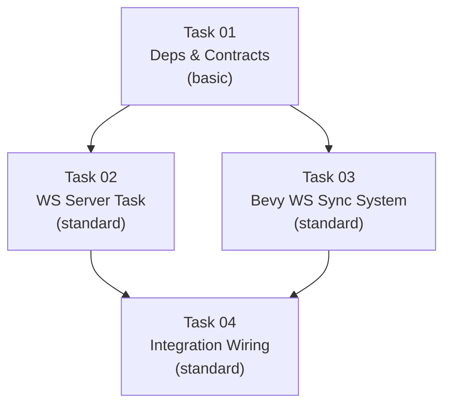

# AGENT ROLE: EXECUTION SPECIALIST

You are an **Execution Specialist** in a multi-agent DAG workflow.
You have been assigned ONE specific task. You implement it with surgical precision.

---

## Your Assignment

| Field   | Value |
|---------|-------|
| Task ID | `task_04_integration_ws` |
| Feature | Phase 1 Micro-Phase 2: WebSocket Bridge |
| Tier    | standard |

## Context Loading (Tier-Dependent)

**If your tier is `basic`:**
- Skip all external file reading. Your Task Brief below IS your complete instruction.
- Write the code exactly as specified, then create a changelog and run `./task_tool.sh done task_04_integration_ws`.

**If your tier is `standard` or `advanced`:**
1. Read `.agents/context.md` — Thin index pointing to context sub-files
2. Load ONLY the `context/*` sub-files listed in your `Context_Bindings` below
3. Scan `.agents/knowledge/` — Lessons from previous sessions relevant to your task

**Workflow:**
- `.agents/workflows/execution-lifecycle.md` — Your 4-step execution loop

**Rules:**
- `.agents/rules/execution-boundary.md` — Scope and contract constraints
- `./.agents/context/tech-stack.md`

---

## Task Brief

---
Task_ID: 04_integration_ws
Execution_Phase: Phase C (Sequential Integration)
Model_Tier: standard
Target_Files:
  - micro-core/src/main.rs
Dependencies:
  - Task 02 (ws_server)
  - Task 03 (ws_sync_system)
Context_Bindings:
  - context/tech-stack.md
---

# STRICT INSTRUCTIONS

1. **Update `micro-core/src/main.rs`** to wire the Tokio WS server and Bevy WS sync system.
2. Initialize the broadcast channel before Bevy app creation:
   ```rust
   let (tx, rx) = tokio::sync::broadcast::channel::<String>(100);
   ```
3. Boot the Tokio Server asynchronously in a separate operating system thread:
   ```rust
   std::thread::spawn(move || {
       let rt = tokio::runtime::Runtime::new().unwrap();
       rt.block_on(async {
           micro_core::bridges::ws_server::start_server(rx).await;
       });
   });
   ```
4. Expose `tx` to Bevy using `.insert_resource(micro_core::systems::ws_sync::BroadcastSender(tx))`.
5. Add `micro_core::systems::ws_sync::ws_sync_system` to `Update` systems.
6. Modify `smoke_test_exit_system` so it only runs if `--smoke-test` is requested:
   ```rust
   if std::env::args().any(|a| a == "--smoke-test") {
       app.add_systems(Update, smoke_test_exit_system);
   }
   ```
   (Alternatively, you can always register the system but evaluate the argument inside it. Or you can remove `app.add_systems(Update, smoke_test_exit_system)` from the default tuple and conditionally add it.)

---

# Verification_Strategy
Test_Type: manual_steps
Test_Stack: bash
Acceptance_Criteria:
  - "Running the project continuously emits WS delta messages via `ws://127.0.0.1:8080`, without crashing the 60 TPS headless ECS."
  - "The smoke-test argument properly auto-exits the simulation."
Manual_Steps:
  - "Run `cargo run`."
  - "Wait a few seconds ensuring it doesn't crash."
  - "Run `cargo run -- --smoke-test`."
  - "Verify it exits cleanly after 300 ticks."

---

## Shared Contracts

# Phase 1 — Micro-Phase 2: WebSocket Bridge & Delta-Sync

Provide a brief description of the problem, any background context, and what the change accomplishes.
> **Parent:** Phase 1 (Vertical Slice)
> **Scope:** Add a local WebSocket server to track state changes in the headless simulation and broadcast delta updates to connected clients at 60 TPS without blocking the main Bevy thread.

## User Review Required

> [!IMPORTANT]
> **Performance vs Accuracy:** For now (MP2), we will run at 60 TPS and send delta updates on every frame. We will keep the entity count to a small baseline (a few hundred) to ensure smooth operation. We'll introduce bandwidth optimization (throttling or binary protocols) in a later algorithmic phase when we scale to 10k+.

> [!WARNING]
> **Smoke Test Auto-Exit:** Per user feedback, we will NOT remove the smoke test system. Instead, we will wrap it behind a simple command-line flag check (e.g., `if std::env::args().any(|arg| arg == "--smoke-test")`). If the flag is present, the app will auto-exit after `SMOKE_TEST_MAX_TICKS`. Otherwise, it will run forever, allowing clients to connect to the WS server.

## Proposed Changes

### Cargo.toml & Bridge Scaffold

#### [MODIFY] [Cargo.toml](file:///Users/manifera/Documents/Study/mass-swarm-ai-simulator/micro-core/Cargo.toml)
- Add `tokio = { version = "1.51.0", features = ["rt-multi-thread", "macros", "sync"] }`
- Add `tokio-tungstenite = "0.29.0"`
- Add `futures-util = "0.3.32"` (for Stream splitting)

#### [NEW] [mod.rs](file:///Users/manifera/Documents/Study/mass-swarm-ai-simulator/micro-core/src/bridges/mod.rs)
- Module barrel file for `ws_server` and `ws_protocol`.

#### [NEW] [ws_protocol.rs](file:///Users/manifera/Documents/Study/mass-swarm-ai-simulator/micro-core/src/bridges/ws_protocol.rs)
- Defines the `WsMessage` and `EntityState` DTOs (Data Transfer Objects) for JSON serialization.

### Server & System Boundaries

#### [NEW] [ws_server.rs](file:///Users/manifera/Documents/Study/mass-swarm-ai-simulator/micro-core/src/bridges/ws_server.rs)
- Asynchronous Tokio WS server listening on `127.0.0.1:8080`.
- Listens to a `tokio::sync::broadcast::Receiver<String>`.
- Forwards any received string to all connected WebSocket clients.

#### [NEW] [ws_sync.rs](file:///Users/manifera/Documents/Study/mass-swarm-ai-simulator/micro-core/src/systems/ws_sync.rs)
- Bevy system that extracts changed entities `Query<(&EntityId, &Position, &Team), Changed<Position>>`.
- Builds a `WsMessage::SyncDelta`.
- Serializes to JSON and sends it via a `BroadcastSender` resource (which wraps `tokio::sync::broadcast::Sender<String>`).

#### [MODIFY] [mod.rs](file:///Users/manifera/Documents/Study/mass-swarm-ai-simulator/micro-core/src/systems/mod.rs)
- Export `ws_sync.rs`.

#### [MODIFY] [main.rs](file:///Users/manifera/Documents/Study/mass-swarm-ai-simulator/micro-core/src/main.rs)
- Setup channel: `let (tx, _) = tokio::sync::broadcast::channel::<String>(100);`
- Spawn an OS thread that creates a Tokio runtime and starts `ws_server::start_server`.
- Expose `tx` as a `BroadcastSender` Resource to Bevy.
- Register `ws_sync_system` to `Update`.
- Disable `smoke_test_exit_system`.

---

## Shared Contracts (The Handshake Protocol)

### WebSocket Message Schema (`ws_protocol.rs`)
```rust
use serde::{Deserialize, Serialize};
use crate::components::team::Team;

#[derive(Serialize, Deserialize, Debug, Clone)]
pub struct EntityState {
    pub id: u32,
    pub x: f32,
    pub y: f32,
    pub team: Team,
}

#[derive(Serialize, Deserialize, Debug, Clone)]
#[serde(tag = "type")]
pub enum WsMessage {
    SyncDelta {
        tick: u64,
        moved: Vec<EntityState>,
        // Note: For MP2 simplicity, 'spawned' and 'died' are omitted in this initial iteration.
        // We will just send 'moved' since all entities spawn at tick 0 and none die yet.
    }
}
```

### Channel Dependency Injection (`ws_sync.rs`)
```rust
use bevy::prelude::Resource;
use tokio::sync::broadcast::Sender;

#[derive(Resource, Clone)]
pub struct BroadcastSender(pub Sender<String>);
```

### Function Signatures
```rust
// bridges/ws_server.rs
pub async fn start_server(mut rx: tokio::sync::broadcast::Receiver<String>)

// systems/ws_sync.rs
pub fn ws_sync_system(
    query: Query<(&EntityId, &Position, &Team), Changed<Position>>,
    tick: Res<TickCounter>,
    sender: Res<BroadcastSender>,
)
```

---

## DAG Execution Graph



### Task Splitting & Verification

#### Task 01: Deps & Contracts
- **Tier:** `basic`
- **Output:** Add crates to Cargo.toml. Write `src/bridges/mod.rs` and `src/bridges/ws_protocol.rs`.
- **Verification Strategy:**
  - `Test_Type`: unit
  - `Test_Stack`: cargo
  - `Acceptance_Criteria`: "cargo check succeeds. Structs serialize correctly to JSON."

#### Task 02: WS Server Task
- **Tier:** `standard`
- **Context Bindings:** `context/ipc-protocol.md`, `context/architecture.md`
- **Output:** Write `src/bridges/ws_server.rs`. Implements `start_server`. Uses `tokio::net::TcpListener` and `tokio-tungstenite`. Loops over `rx.recv()` and broadcasts to a managed list of active WebSocket Sink connections. Wait for client disconnects cleanly.
- **Verification Strategy:**
  - `Test_Type`: unit
  - `Test_Stack`: cargo
  - `Acceptance_Criteria`: "cargo clippy succeeds with zero warnings."

#### Task 03: Bevy WS Sync System
- **Tier:** `standard`
- **Context Bindings:** `context/architecture.md`
- **Output:** Write `src/systems/ws_sync.rs`. Extracts `Changed<Position>`, maps to `EntityState`, packages into `WsMessage::SyncDelta`, serializes to string, and sends via `BroadcastSender` resource. Include `BroadcastSender` definition here.
- **Verification Strategy:**
  - `Test_Type`: unit
  - `Test_Stack`: cargo test
  - `Acceptance_Criteria`: "A unit test with a mock Bevy App and mocked Sender successfully catches the emitted JSON string when an entity's Position is manually changed."

#### Task 04: Integration Wiring
- **Tier:** `standard`
- **Context Bindings:** `context/tech-stack.md`
- **Output:** Update `main.rs`. Initialize tokio runtime in a background `std::thread`, pass `rx`, insert `tx` as `BroadcastSender`. Add `ws_sync_system`. Update `main.rs` to only run the `smoke_test_exit_system` if `std::env::args().any(|a| a == "--smoke-test")`.
- **Verification Strategy:**
  - `Test_Type`: manual_steps
  - `Test_Stack`: none
  - `Acceptance_Criteria`: "Run binary without flags, verify it runs forever. Run binary with `--smoke-test`, verify it exits after 5s. With binary running, connect WS client and verify JSON tick streams."
  - `Manual_Steps`:
      - Run `cargo run` in one terminal process via tools.
      - Wait 2 seconds.
      - Use tool to read `ws://localhost:8080` (or `wscat` if available in the environment) to see received JSON stream.

---

## Verification Plan

### Automated Tests
- `cd micro-core && cargo check`
- `cd micro-core && cargo test`

### Manual Verification
- We will write a small python/bash scratch script to connect as a WebSocket client and assert we receive `{"type":"SyncDelta", "tick": <...>, "moved": [...]}` exactly matching our DTO format.
