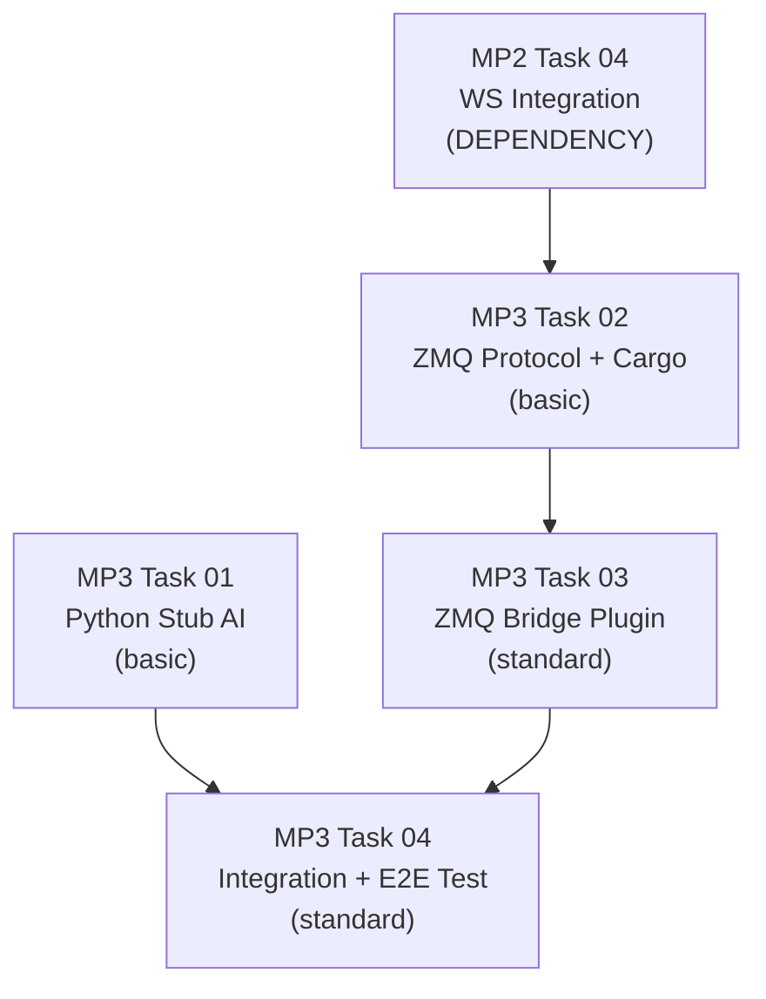

# AGENT ROLE: EXECUTION SPECIALIST

You are an **Execution Specialist** in a multi-agent DAG workflow.
You have been assigned ONE specific task. You implement it with surgical precision.

---

## Your Assignment

| Field   | Value |
|---------|-------|
| Task ID | `task_07_zmq_bridge_plugin` |
| Feature | Phase 1 Micro-Phase 2: WebSocket Bridge |
| Tier    | standard |

---

## ⛔ MANDATORY PROCESS — ALL TIERS (DO NOT SKIP)

> **These rules apply to EVERY executor, regardless of tier. Violating them
> causes an automatic QA FAIL and project BLOCK.**

### Rule 1: Scope Isolation
- You may ONLY create or modify files listed in `Target_Files` in your Task Brief.
- If a file must be changed but is NOT in `Target_Files`, **STOP and report the gap** — do NOT modify it.
- NEVER edit `task_state.json`, `implementation_plan.md`, or any file outside your scope.

### Rule 2: Changelog (Handoff Documentation)
After ALL code is written and BEFORE calling `./task_tool.sh done`, you MUST:

1. **Create** `tasks_pending/task_07_zmq_bridge_plugin_changelog.md`
2. **Include in the changelog:**
   - **Touched Files:** A bulleted list of every file you created or modified.
   - **Contract Fulfillment:** Brief confirmation of the interfaces/DTOs you implemented.
   - **Deviations/Notes:** Any edge cases you handled or deviations from the brief the QA agent should verify.
3. **Then and only then** run:
   ```bash
   ./task_tool.sh done task_07_zmq_bridge_plugin
   ```

> **⚠️ Calling `./task_tool.sh done` without creating the changelog file is FORBIDDEN.**

### Rule 3: No Placeholders
- Do not use `// TODO`, `/* FIXME */`, or stub implementations.
- Output fully functional, production-ready code.

---

## Context Loading (Tier-Dependent)

**If your tier is `basic`:**
- Skip all external file reading. Your Task Brief below IS your complete instruction.
- Implement the code exactly as specified in the Task Brief.
- Follow the MANDATORY PROCESS rules above (changelog + scope), then halt.

**If your tier is `standard` or `advanced`:**
1. Read `.agents/context.md` — Thin index pointing to context sub-files
2. Load ONLY the `context/*` sub-files listed in your `Context_Bindings` below
3. Scan `.agents/knowledge/` — Lessons from previous sessions relevant to your task
4. Read `.agents/workflows/execution-lifecycle.md` — Your 4-step execution loop
5. Read `.agents/rules/execution-boundary.md` — Scope and contract constraints

- `./.agents/context/architecture.md`
- `./.agents/context/ipc-protocol.md`
- `./.agents/skills/rust-code-standards/SKILL.md`

---

## Task Brief

---
Task_ID: 07_zmq_bridge_plugin
Execution_Phase: Phase B (Sequential — after Task 06)
Model_Tier: standard
Target_Files:
  - micro-core/src/bridges/zmq_bridge.rs
Dependencies:
  - Task 06 (zmq_protocol_cargo)
Context_Bindings:
  - context/architecture.md
  - context/ipc-protocol.md
  - skills/rust-code-standards
---

# STRICT INSTRUCTIONS

> **Feature:** P1_MP3 — ZeroMQ Bridge + Stub AI Round-Trip
> **Role:** Implement the `ZmqBridgePlugin` — the Bevy plugin that manages the non-blocking AI communication lifecycle using a State Machine pattern.

## Architecture Overview

The plugin uses a **non-blocking State Machine** to pause/resume simulation while waiting for AI:

```
SimState::Running
  └─ ai_trigger_system: every N ticks → serialize state → send to channel → transition to WaitingForAI
  └─ (movement_system is gated behind Running — handled by Task 08)

SimState::WaitingForAI
  └─ ai_poll_system: try_recv() → if response: parse action, resume → transition to Running
```

A background `std::thread` runs a tokio runtime with the async ZMQ I/O loop. Communication between Bevy (sync) and the background thread (async) uses `std::sync::mpsc` channels.

## File: `micro-core/src/bridges/zmq_bridge.rs`

Implement the following items exactly as specified. Follow `skills/rust-code-standards` for all doc comments, test structure, and naming conventions.

### Module doc comment

```rust
//! # ZMQ Bridge Plugin
//!
//! Non-blocking AI communication bridge using ZeroMQ REQ/REP.
//! Uses a Bevy State Machine (SimState) to gate simulation systems
//! while waiting for the Python Macro-Brain to respond.
//!
//! ## Ownership
//! - **Task:** task_07_zmq_bridge_plugin
//! - **Contract:** implementation_plan.md → Proposed Changes → 3. Rust System Layer
//!
//! ## Depends On
//! - `crate::bridges::zmq_protocol::{StateSnapshot, MacroAction, EntitySnapshot, SummarySnapshot, WorldSize}`
//! - `crate::components::{EntityId, Position, Team}`
//! - `crate::config::{SimulationConfig, TickCounter}`
//! - `std::sync::mpsc`
//! - `tokio` (background runtime)
//! - `zeromq` (REQ socket)
```

### 1. SimState Enum

```rust
/// Simulation state for AI communication gating.
///
/// Systems like `movement_system` only run in `Running` state.
/// When `WaitingForAI`, the simulation pauses movement but keeps
/// ticking (tick counter, WS sync, logging continue).
#[derive(States, Debug, Clone, PartialEq, Eq, Hash, Default)]
pub enum SimState {
    #[default]
    Running,
    WaitingForAI,
}
```

### 2. AiBridgeConfig Resource

```rust
/// Configuration for AI bridge timing and resilience.
///
/// Public and serializable so the Debug Visualizer GUI can
/// reconfigure it at runtime via the WS command bridge.
#[derive(Resource, Debug, Clone, Serialize, Deserialize)]
pub struct AiBridgeConfig {
    /// Send state to Python every N ticks (default: 30 → ~2 Hz at 60 TPS).
    pub send_interval_ticks: u64,
    /// Timeout in seconds for ZMQ send/recv before falling back to
    /// the default HOLD action. Prevents simulation hang on AI disconnect.
    pub zmq_timeout_secs: u64,
}

impl Default for AiBridgeConfig {
    fn default() -> Self {
        Self {
            send_interval_ticks: 30,
            zmq_timeout_secs: 5,
        }
    }
}
```

### 3. AiBridgeChannels Resource

```rust
/// Channel endpoints for Bevy ↔ background thread communication.
///
/// Capacity is 1 (bounded) — the bridge processes one REQ/REP cycle at a time.
#[derive(Resource)]
pub struct AiBridgeChannels {
    /// Send serialized state snapshots TO the background ZMQ thread.
    pub state_tx: mpsc::SyncSender<String>,
    /// Receive macro action responses FROM the background ZMQ thread.
    pub action_rx: mpsc::Receiver<String>,
}
```

### 4. ZmqBridgePlugin

```rust
/// Bevy plugin that initializes the ZMQ AI bridge.
///
/// Spawns a background thread with a tokio runtime for async ZMQ I/O.
/// Registers `SimState`, `AiBridgeConfig`, `AiBridgeChannels`, and
/// the trigger/poll systems.
pub struct ZmqBridgePlugin;

impl Plugin for ZmqBridgePlugin {
    fn build(&self, app: &mut App) {
        let config = AiBridgeConfig::default();
        let timeout_secs = config.zmq_timeout_secs;

        let (state_tx, state_rx) = mpsc::sync_channel::<String>(1);
        let (action_tx, action_rx) = mpsc::sync_channel::<String>(1);

        std::thread::spawn(move || {
            let rt = tokio::runtime::Runtime::new().unwrap();
            rt.block_on(zmq_io_loop(state_rx, action_tx, timeout_secs));
        });

        app.init_state::<SimState>()
           .insert_resource(config)
           .insert_resource(AiBridgeChannels { state_tx, action_rx })
           .add_systems(Update, (
               ai_trigger_system.run_if(in_state(SimState::Running)),
               ai_poll_system.run_if(in_state(SimState::WaitingForAI)),
           ));
    }
}
```

### 5. Background I/O Loop (with timeout + fallback)

```rust
/// Default fallback action when ZMQ times out or disconnects.
const FALLBACK_ACTION: &str =
    r#"{"type":"macro_action","action":"HOLD","params":{}}"#;

/// Async ZMQ I/O loop running in a dedicated background thread.
///
/// Receives serialized state snapshots from Bevy via `state_rx`,
/// sends them to Python via ZMQ REQ, waits for the REP response
/// with a timeout, and forwards it back to Bevy via `action_tx`.
///
/// On timeout or error, sends a default HOLD fallback and recreates
/// the ZMQ socket (required to reset the strict REQ send/recv alternation).
async fn zmq_io_loop(
    state_rx: mpsc::Receiver<String>,
    action_tx: mpsc::SyncSender<String>,
    timeout_secs: u64,
) {
    use zeromq::{ReqSocket, SocketSend, SocketRecv};
    use tokio::time::{timeout, Duration};

    let mut socket = ReqSocket::new();
    socket.connect("tcp://127.0.0.1:5555")
        .await
        .expect("Failed to connect ZMQ REQ socket to tcp://127.0.0.1:5555");

    println!("[ZMQ Bridge] Connected to tcp://127.0.0.1:5555");

    let zmq_timeout = Duration::from_secs(timeout_secs);

    while let Ok(state_json) = state_rx.recv() {
        // Attempt send with timeout
        let send_result = timeout(zmq_timeout, socket.send(state_json.into())).await;
        match send_result {
            Ok(Ok(())) => {}
            Ok(Err(e)) => {
                eprintln!("[ZMQ Bridge] Send error: {}. Falling back to HOLD.", e);
                let _ = action_tx.send(FALLBACK_ACTION.to_string());
                continue;
            }
            Err(_) => {
                eprintln!(
                    "[ZMQ Bridge] Send timeout ({}s). Python may not be running. Falling back to HOLD.",
                    timeout_secs
                );
                socket = ReqSocket::new();
                let _ = socket.connect("tcp://127.0.0.1:5555").await;
                let _ = action_tx.send(FALLBACK_ACTION.to_string());
                continue;
            }
        }

        // Attempt recv with timeout
        let recv_result = timeout(zmq_timeout, socket.recv()).await;
        match recv_result {
            Ok(Ok(reply)) => {
                let reply_str = String::from_utf8_lossy(&reply.into_vec()[0]).to_string();
                if action_tx.send(reply_str).is_err() {
                    break; // Bevy has shut down
                }
            }
            Ok(Err(e)) => {
                eprintln!("[ZMQ Bridge] Recv error: {}. Falling back to HOLD.", e);
                let _ = action_tx.send(FALLBACK_ACTION.to_string());
            }
            Err(_) => {
                eprintln!(
                    "[ZMQ Bridge] Recv timeout ({}s). Python may be stuck. Falling back to HOLD.",
                    timeout_secs
                );
                socket = ReqSocket::new();
                let _ = socket.connect("tcp://127.0.0.1:5555").await;
                let _ = action_tx.send(FALLBACK_ACTION.to_string());
            }
        }
    }
}
```

### 6. Helper: build_state_snapshot

```rust
/// Builds a StateSnapshot from the current ECS state.
///
/// Queries all entities with EntityId, Position, and Team components
/// and packages them into the IPC-compatible StateSnapshot format.
///
/// # Arguments
/// * `tick` - Current simulation tick
/// * `sim_config` - World dimensions for the world_size field
/// * `query` - All entities with EntityId, Position, and Team
fn build_state_snapshot(
    tick: &TickCounter,
    sim_config: &SimulationConfig,
    query: &Query<(&EntityId, &Position, &Team)>,
) -> StateSnapshot {
    let mut swarm_count: u32 = 0;
    let mut defender_count: u32 = 0;
    let mut entities = Vec::new();

    for (eid, pos, team) in query.iter() {
        let team_str = match team {
            Team::Swarm => {
                swarm_count += 1;
                "swarm"
            }
            Team::Defender => {
                defender_count += 1;
                "defender"
            }
        };

        entities.push(EntitySnapshot {
            id: eid.id,
            x: pos.x,
            y: pos.y,
            team: team_str.to_string(),
        });
    }

    StateSnapshot {
        msg_type: "state_snapshot".to_string(),
        tick: tick.tick,
        world_size: WorldSize {
            w: sim_config.world_width,
            h: sim_config.world_height,
        },
        entities,
        summary: SummarySnapshot {
            swarm_count,
            defender_count,
            // Health is not yet implemented — default to 1.0
            avg_swarm_health: 1.0,
            avg_defender_health: 1.0,
        },
    }
}
```

### 7. Bevy Systems

```rust
/// Triggers AI communication every N ticks.
///
/// Runs only when `SimState::Running`. Builds a state snapshot from
/// the current ECS state, serializes it to JSON, and sends it to the
/// background ZMQ thread. Transitions to `WaitingForAI` on success.
///
/// # Arguments
/// * `tick` - Current tick counter
/// * `config` - AI bridge configuration (send interval)
/// * `sim_config` - World dimensions
/// * `channels` - Channel to background ZMQ thread
/// * `query` - All entities with EntityId, Position, and Team
/// * `next_state` - State transition handle
fn ai_trigger_system(
    tick: Res<TickCounter>,
    config: Res<AiBridgeConfig>,
    sim_config: Res<SimulationConfig>,
    channels: Res<AiBridgeChannels>,
    query: Query<(&EntityId, &Position, &Team)>,
    mut next_state: ResMut<NextState<SimState>>,
) {
    if tick.tick == 0 || tick.tick % config.send_interval_ticks != 0 {
        return;
    }

    let snapshot = build_state_snapshot(&tick, &sim_config, &query);
    let json = serde_json::to_string(&snapshot).unwrap();

    // try_send is non-blocking. If the channel is full (previous request
    // still in flight), skip this tick.
    if channels.state_tx.try_send(json).is_ok() {
        next_state.set(SimState::WaitingForAI);
    }
}

/// Polls for AI response from the background ZMQ thread.
///
/// Runs only when `SimState::WaitingForAI`. Uses non-blocking
/// `try_recv()` so other systems (tick counter, WS sync) keep running.
/// On response (real or fallback HOLD), transitions back to `Running`.
///
/// # Arguments
/// * `channels` - Channel from background ZMQ thread
/// * `next_state` - State transition handle
fn ai_poll_system(
    channels: Res<AiBridgeChannels>,
    mut next_state: ResMut<NextState<SimState>>,
) {
    match channels.action_rx.try_recv() {
        Ok(reply_json) => {
            match serde_json::from_str::<MacroAction>(&reply_json) {
                Ok(action) => {
                    println!("[AI Bridge] Received action: {} (tick resume)", action.action);
                    // TODO: In Phase 3 (Macro-Brain), apply the action to ECS
                }
                Err(e) => {
                    eprintln!("[AI Bridge] Failed to parse macro action: {}", e);
                }
            }
            next_state.set(SimState::Running);
        }
        Err(mpsc::TryRecvError::Empty) => {
            // Still waiting — do nothing, system will run again next tick
        }
        Err(mpsc::TryRecvError::Disconnected) => {
            eprintln!("[AI Bridge] Background thread disconnected!");
            next_state.set(SimState::Running);
        }
    }
}
```

### 8. Required Imports

The file needs these imports at the top (after the module doc comment):

```rust
use bevy::prelude::*;
use serde::{Deserialize, Serialize};
use std::sync::mpsc;

use crate::bridges::zmq_protocol::{
    EntitySnapshot, MacroAction, StateSnapshot, SummarySnapshot, WorldSize,
};
use crate::components::{EntityId, Position, Team};
use crate::config::{SimulationConfig, TickCounter};
```

### 9. Unit Tests

Add tests in the standard `#[cfg(test)] mod tests` block:

1. **`test_ai_bridge_config_default`** — Assert `send_interval_ticks == 30` and `zmq_timeout_secs == 5`.
2. **`test_ai_bridge_config_serialization_roundtrip`** — Serialize `AiBridgeConfig::default()` to JSON, deserialize back, assert equality.
3. **`test_ai_trigger_system_skips_non_interval_ticks`** — Create a minimal Bevy `App` with `ai_trigger_system`, set `TickCounter.tick = 15` (not divisible by 30), run `app.update()`, verify `SimState` is still `Running`.
4. **`test_ai_trigger_system_fires_on_interval`** — Set `TickCounter.tick = 30`, run `app.update()`, verify `SimState` transitions to `WaitingForAI`.

> **Note for test 3 & 4:** You need to insert `AiBridgeConfig`, `AiBridgeChannels` (with real mpsc channels), `SimulationConfig`, and `TickCounter` as resources in the test app. You also need to `init_state::<SimState>()`. Spawn at least one entity with `(EntityId, Position, Team)` components so the query isn't empty.

---

# Verification_Strategy
Test_Type: unit
Test_Stack: cargo test
Acceptance_Criteria:
  - "`cargo check` succeeds."
  - "`cargo clippy` has zero warnings."
  - "`cargo test zmq_bridge` passes all 4 unit tests."
  - "All public items have doc comments per `skills/rust-code-standards`."
Suggested_Test_Commands:
  - `cd micro-core && cargo check`
  - `cd micro-core && cargo clippy`
  - `cd micro-core && cargo test zmq_bridge`

---

## Shared Contracts

# Phase 1 — Micro-Phase 3: ZeroMQ Bridge + Stub AI Round-Trip

> **Parent:** Phase 1 (Vertical Slice)
> **Predecessor:** MP2 (WebSocket Bridge & Delta-Sync) — plan finalized and tasks dispatched.
> **Scope:** Add the ZeroMQ REQ/REP AI bridge and a Python stub responder to prove the simulation-pause/resume round-trip.

---

## Relationship to MP2

> [!IMPORTANT]
> This plan is designed to **layer on top of the MP2 plan** (currently executing). The shared files (`Cargo.toml`, `bridges/mod.rs`, `lib.rs`, `main.rs`) are modified **additively** — all MP3 tasks explicitly depend on MP2's Task 04 (Integration Wiring) being complete first. No parallel conflicts.

### Shared File Coordination

| File | MP2 owns | MP3 adds |
|------|----------|----------|
| `Cargo.toml` | `tokio`, `tokio-tungstenite`, `futures-util` | `zeromq` |
| `bridges/mod.rs` | `pub mod ws_protocol; pub mod ws_server;` | `pub mod zmq_protocol; pub mod zmq_bridge;` |
| `systems/mod.rs` | `pub mod ws_sync;` | *(no changes)* |
| `lib.rs` | `pub mod bridges;` (added by MP2) | *(no changes — MP2 already exposes bridges)* |
| `main.rs` | WS channel + tokio thread + `BroadcastSender` + `ws_sync_system` | ZMQ channel + `AiBridgePlugin` + `SimState` enum |

---

## AI Communication Architecture (Non-Blocking State Machine)

> [!IMPORTANT]
> **Research conclusion: Never block inside a Bevy system.** Even in headless mode, a blocking `recv()` would prevent other systems (WS sync, tick counter) in the same schedule from running. The correct Bevy pattern is a **State Machine** combined with **non-blocking channel polling**.

### How It Works

```
┌──────────────────────────────────────────────────────────────┐
│                     Bevy ECS (main thread)                   │
│                                                              │
│  SimState::Running                                           │
│    ├── movement_system         (run_if Running)              │
│    ├── tick_counter_system     (always runs)                 │
│    ├── ws_sync_system          (always runs - MP2)           │
│    └── ai_trigger_system       (run_if Running)              │
│         └── every N ticks: serialize state → send to tx      │
│             → transition to SimState::WaitingForAI           │
│                                                              │
│  SimState::WaitingForAI                                      │
│    └── ai_poll_system          (run_if WaitingForAI)         │
│         └── try_recv() on response channel                   │
│             → if Some(action): apply action, transition      │
│               back to SimState::Running                      │
│             → if None: return (system runs again next tick)  │
│                                                              │
├──────────────────────────────────────────────────────────────┤
│  Background Thread (tokio runtime)                           │
│    └── zmq_io_task (async loop)                              │
│         └── recv state from bevy channel                     │
│         └── zmq_socket.send(state).await                     │
│         └── zmq_socket.recv().await                          │
│         └── send response back to bevy channel               │
└──────────────────────────────────────────────────────────────┘
```

**Why this is correct:**
1. **No blocking:** `try_recv()` returns immediately. Other systems (WS sync, tick counter) keep running even while waiting for Python.
2. **Deterministic pausing:** The simulation systems (`movement_system`) are gated behind `SimState::Running`. They don't execute while waiting for AI — achieving the same "pause" behavior described in the CASE_STUDY, but without blocking the thread.
3. **WS bridge keeps working:** The `ws_sync_system` runs regardless of `SimState`, so connected debug visualizer clients still get updates (including a "paused" state indicator).
4. **Custom runner compatibility:** The `custom_runner` (from MP1's macOS fix) continues to call `app.update()` at 60 TPS. When in `WaitingForAI`, the update cycle simply skips gated systems and polls the channel.

---

## Proposed Changes

### 1. Python Stub AI

#### [NEW] [macro-brain/requirements.txt](file:///Users/manifera/Documents/Study/mass-swarm-ai-simulator/macro-brain/requirements.txt)
- `pyzmq>=25.1.2`

#### [NEW] [macro-brain/src/__init__.py](file:///Users/manifera/Documents/Study/mass-swarm-ai-simulator/macro-brain/src/__init__.py)
- Empty `__init__.py` for Python package structure.

#### [NEW] [macro-brain/src/stub_ai.py](file:///Users/manifera/Documents/Study/mass-swarm-ai-simulator/macro-brain/src/stub_ai.py)
- Bind a ZMQ REP socket to `tcp://*:5555`.
- Infinite loop: `socket.recv_json()` → log tick + entity count → reply `{"type": "macro_action", "action": "HOLD", "params": {}}` via `socket.send_json()`.
- Graceful exit on `KeyboardInterrupt`.

---

### 2. Rust Data Layer (Schemas + Dependencies)

#### [MODIFY] [Cargo.toml](file:///Users/manifera/Documents/Study/mass-swarm-ai-simulator/micro-core/Cargo.toml)
- Add (after MP2's dependencies are already present):
  ```toml
  zeromq = "0.5"
  ```

> [!NOTE]
> `tokio` is already added by MP2 Task 01. `crossbeam-channel` is NOT needed — we use `std::sync::mpsc` (bounded) or `tokio::sync::mpsc` since tokio is already in the dependency tree. We will use `std::sync::mpsc` for the Bevy↔background-thread channel since the Bevy side is synchronous (`try_recv()`).

#### [MODIFY] [bridges/mod.rs](file:///Users/manifera/Documents/Study/mass-swarm-ai-simulator/micro-core/src/bridges/mod.rs)
- Add `pub mod zmq_protocol;` and `pub mod zmq_bridge;` (after MP2's `ws_protocol` and `ws_server` modules).

#### [NEW] [bridges/zmq_protocol.rs](file:///Users/manifera/Documents/Study/mass-swarm-ai-simulator/micro-core/src/bridges/zmq_protocol.rs)
- Implements the exact JSON schemas from `ipc-protocol.md` for the AI bridge:

```rust
use serde::{Deserialize, Serialize};

/// Entity snapshot for the AI state payload.
#[derive(Serialize, Deserialize, Debug, Clone)]
pub struct EntitySnapshot {
    pub id: u32,
    pub x: f32,
    pub y: f32,
    pub team: String,  // "swarm" or "defender" — matches IPC protocol
}

/// Summary statistics for the neural network observation space.
#[derive(Serialize, Deserialize, Debug, Clone)]
pub struct SummarySnapshot {
    pub swarm_count: u32,
    pub defender_count: u32,
    pub avg_swarm_health: f32,
    pub avg_defender_health: f32,
}

/// World size descriptor.
#[derive(Serialize, Deserialize, Debug, Clone)]
pub struct WorldSize {
    pub w: f32,
    pub h: f32,
}

/// Full state snapshot sent from Rust → Python.
#[derive(Serialize, Deserialize, Debug, Clone)]
pub struct StateSnapshot {
    #[serde(rename = "type")]
    pub msg_type: String,  // Always "state_snapshot"
    pub tick: u64,
    pub world_size: WorldSize,
    pub entities: Vec<EntitySnapshot>,
    pub summary: SummarySnapshot,
}

/// Macro action received from Python → Rust.
#[derive(Serialize, Deserialize, Debug, Clone)]
pub struct MacroAction {
    #[serde(rename = "type")]
    pub msg_type: String,  // Always "macro_action"
    pub action: String,    // e.g. "HOLD", "FLANK_LEFT", etc.
    pub params: serde_json::Value,  // Flexible params object
}
```

---

### 3. Rust System Layer (ZMQ Bridge Plugin)

#### [NEW] [bridges/zmq_bridge.rs](file:///Users/manifera/Documents/Study/mass-swarm-ai-simulator/micro-core/src/bridges/zmq_bridge.rs)

**Resources:**
```rust
use bevy::prelude::*;
use serde::{Deserialize, Serialize};
use std::sync::mpsc;

/// Simulation state for AI communication gating.
#[derive(States, Debug, Clone, PartialEq, Eq, Hash, Default)]
pub enum SimState {
    #[default]
    Running,
    WaitingForAI,
}

/// Configuration for AI bridge timing.
/// Public + Serializable so the Debug Visualizer (WS bridge) can
/// read/modify it at runtime via the `command` protocol.
#[derive(Resource, Debug, Clone, Serialize, Deserialize)]
pub struct AiBridgeConfig {
    /// Send state to Python every N ticks (default: 30 → ~2 Hz at 60 TPS).
    pub send_interval_ticks: u64,
    /// Timeout in seconds for ZMQ send/recv before falling back to
    /// the default action. Prevents simulation hang on AI disconnect.
    pub zmq_timeout_secs: u64,
}

impl Default for AiBridgeConfig {
    fn default() -> Self {
        Self {
            send_interval_ticks: 30,
            zmq_timeout_secs: 5,
        }
    }
}

/// Channel endpoints for Bevy ↔ background thread communication.
#[derive(Resource)]
pub struct AiBridgeChannels {
    /// Send serialized state snapshots TO the background ZMQ thread.
    pub state_tx: mpsc::SyncSender<String>,
    /// Receive macro action responses FROM the background ZMQ thread.
    pub action_rx: mpsc::Receiver<String>,
}
```

**Plugin:**
```rust
pub struct ZmqBridgePlugin;

impl Plugin for ZmqBridgePlugin {
    fn build(&self, app: &mut App) {
        let config = AiBridgeConfig::default();
        let timeout_secs = config.zmq_timeout_secs;

        // Create bounded channels (capacity 1: the bridge processes one
        // request-reply at a time)
        let (state_tx, state_rx) = mpsc::sync_channel::<String>(1);
        let (action_tx, action_rx) = mpsc::sync_channel::<String>(1);

        // Spawn background thread with tokio runtime for async ZMQ I/O
        std::thread::spawn(move || {
            let rt = tokio::runtime::Runtime::new().unwrap();
            rt.block_on(zmq_io_loop(state_rx, action_tx, timeout_secs));
        });

        app.init_state::<SimState>()
           .insert_resource(config)
           .insert_resource(AiBridgeChannels { state_tx, action_rx })
           .add_systems(Update, (
               ai_trigger_system.run_if(in_state(SimState::Running)),
               ai_poll_system.run_if(in_state(SimState::WaitingForAI)),
           ));
    }
}
```

**Background I/O loop (async with timeout + fallback):**
```rust
/// Default fallback action when ZMQ times out or disconnects.
const FALLBACK_ACTION: &str =
    r#"{"type":"macro_action","action":"HOLD","params":{}}"#;

async fn zmq_io_loop(
    state_rx: mpsc::Receiver<String>,
    action_tx: mpsc::SyncSender<String>,
    timeout_secs: u64,
) {
    use zeromq::{ReqSocket, SocketSend, SocketRecv};
    use tokio::time::{timeout, Duration};

    let mut socket = ReqSocket::new();
    // ZMQ connect is lazy — it does not fail even if Python isn't running.
    socket.connect("tcp://127.0.0.1:5555")
        .await
        .expect("Failed to connect ZMQ REQ socket to tcp://127.0.0.1:5555");

    println!("[ZMQ Bridge] Connected to tcp://127.0.0.1:5555");

    let zmq_timeout = Duration::from_secs(timeout_secs);

    while let Ok(state_json) = state_rx.recv() {
        // Attempt send with timeout
        let send_result = timeout(zmq_timeout, socket.send(state_json.into())).await;
        match send_result {
            Ok(Ok(())) => {} // Send succeeded
            Ok(Err(e)) => {
                eprintln!("[ZMQ Bridge] Send error: {}. Falling back to HOLD.", e);
                let _ = action_tx.send(FALLBACK_ACTION.to_string());
                continue;
            }
            Err(_) => {
                eprintln!("[ZMQ Bridge] Send timeout ({}s). Python may not be running. Falling back to HOLD.", timeout_secs);
                // Recreate socket to reset ZMQ state machine (REQ expects strict send/recv alternation)
                socket = ReqSocket::new();
                let _ = socket.connect("tcp://127.0.0.1:5555").await;
                let _ = action_tx.send(FALLBACK_ACTION.to_string());
                continue;
            }
        }

        // Attempt recv with timeout
        let recv_result = timeout(zmq_timeout, socket.recv()).await;
        match recv_result {
            Ok(Ok(reply)) => {
                let reply_str = String::from_utf8_lossy(&reply.into_vec()[0]).to_string();
                if action_tx.send(reply_str).is_err() {
                    break; // Bevy has shut down
                }
            }
            Ok(Err(e)) => {
                eprintln!("[ZMQ Bridge] Recv error: {}. Falling back to HOLD.", e);
                let _ = action_tx.send(FALLBACK_ACTION.to_string());
            }
            Err(_) => {
                eprintln!("[ZMQ Bridge] Recv timeout ({}s). Python may be stuck. Falling back to HOLD.", timeout_secs);
                // Recreate socket to reset ZMQ REQ state
                socket = ReqSocket::new();
                let _ = socket.connect("tcp://127.0.0.1:5555").await;
                let _ = action_tx.send(FALLBACK_ACTION.to_string());
            }
        }
    }
}
```

**Bevy Systems:**
```rust
/// Triggers AI communication every N ticks.
/// Runs only when SimState::Running.
fn ai_trigger_system(
    tick: Res<TickCounter>,
    config: Res<AiBridgeConfig>,
    sim_config: Res<SimulationConfig>,
    channels: Res<AiBridgeChannels>,
    query: Query<(&EntityId, &Position, &Team)>,
    mut next_state: ResMut<NextState<SimState>>,
) {
    if tick.tick == 0 || tick.tick % config.send_interval_ticks != 0 {
        return;
    }

    // Build state snapshot from ECS
    let snapshot = build_state_snapshot(&tick, &sim_config, &query);
    let json = serde_json::to_string(&snapshot).unwrap();

    // Send to background thread (non-blocking — channel capacity is 1)
    if channels.state_tx.try_send(json).is_ok() {
        next_state.set(SimState::WaitingForAI);
    }
    // If channel is full, skip this tick (previous request still in flight)
}

/// Polls for AI response. Runs only when SimState::WaitingForAI.
fn ai_poll_system(
    channels: Res<AiBridgeChannels>,
    mut next_state: ResMut<NextState<SimState>>,
) {
    match channels.action_rx.try_recv() {
        Ok(reply_json) => {
            match serde_json::from_str::<MacroAction>(&reply_json) {
                Ok(action) => {
                    println!("[AI Bridge] Received action: {} (tick resume)", action.action);
                    // TODO: In Phase 3 (Macro-Brain), apply the action to ECS
                }
                Err(e) => {
                    eprintln!("[AI Bridge] Failed to parse macro action: {}", e);
                }
            }
            next_state.set(SimState::Running);
        }
        Err(mpsc::TryRecvError::Empty) => {
            // Still waiting — do nothing, system will run again next tick
        }
        Err(mpsc::TryRecvError::Disconnected) => {
            eprintln!("[AI Bridge] Background thread disconnected!");
            next_state.set(SimState::Running);
        }
    }
}
```

---

### 4. Integration (main.rs update)

#### [MODIFY] [main.rs](file:///Users/manifera/Documents/Study/mass-swarm-ai-simulator/micro-core/src/main.rs)
- After MP2's integration is complete, add:
  - `.add_plugins(micro_core::bridges::zmq_bridge::ZmqBridgePlugin)`
  - Gate `movement_system` behind `run_if(in_state(SimState::Running))`
  - Import `SimState` from bridges

> [!WARNING]
> The `movement_system` must be gated behind `SimState::Running` so entities don't move during the AI pause. The `tick_counter_system`, `log_system`, `ws_sync_system`, and `smoke_test_exit_system` should NOT be gated — they run regardless (the tick counter must always advance for timeout/exit logic to work).

---

## DAG Execution Graph



| Phase | Tasks | Notes |
|-------|-------|-------|
| **Pre-req** | MP2 Task 04 must be COMPLETE | MP3 tasks modify files that MP2 also touched |
| **Phase A** | T1 (Python stub), T2 (Cargo.toml + zmq_protocol.rs) | **Parallel** — zero file overlap. T2 explicitly waits for MP2 T04 |
| **Phase B** | T3 (zmq_bridge.rs — plugin, systems, IO loop) | Sequential — depends on T2 contracts |
| **Phase C** | T4 (Wire plugin into main.rs + E2E smoke test) | Sequential — wires T3 + requires T1 for round-trip |

---

## Task Summaries

### Task 01 — Python Stub AI
- **Tier:** `basic`
- **Files:** `macro-brain/requirements.txt`, `macro-brain/src/__init__.py`, `macro-brain/src/stub_ai.py`
- **Description:** Create the Python-side ZMQ REP responder. Binds to `tcp://*:5555`, receives JSON state snapshots, logs them, and replies with `{"type": "macro_action", "action": "HOLD", "params": {}}`.
- **Verification:** `python3 -m py_compile macro-brain/src/stub_ai.py` succeeds.

### Task 02 — ZMQ Protocol + Cargo Dependencies
- **Tier:** `basic`
- **Dependencies:** MP2 Task 04 (complete)
- **Files:** `micro-core/Cargo.toml` (append `zeromq`), `micro-core/src/bridges/mod.rs` (append modules), `micro-core/src/bridges/zmq_protocol.rs`
- **Description:** Add `zeromq = "0.5"` to Cargo.toml. Append `pub mod zmq_protocol; pub mod zmq_bridge;` to `bridges/mod.rs`. Create `zmq_protocol.rs` with `StateSnapshot`, `EntitySnapshot`, `SummarySnapshot`, `WorldSize`, and `MacroAction` structs matching `ipc-protocol.md` exactly.
- **Context Bindings:** `context/ipc-protocol.md`
- **Verification:** `cargo check` succeeds. Unit tests serialize `StateSnapshot` → JSON → deserialize round-trip matching `ipc-protocol.md` schema.

### Task 03 — ZMQ Bridge Plugin
- **Tier:** `standard`
- **Dependencies:** Task 02
- **Files:** `micro-core/src/bridges/zmq_bridge.rs`
- **Context Bindings:** `context/architecture.md`, `context/ipc-protocol.md`, `skills/rust-code-standards`
- **Description:** Implement `ZmqBridgePlugin` with:
  - `SimState` enum (Running / WaitingForAI) as a Bevy State
  - `AiBridgeConfig` resource — **public, `Serialize`/`Deserialize`**, with `send_interval_ticks: 30` and `zmq_timeout_secs: 5` defaults. GUI-configurable via WS command bridge in future phases.
  - `AiBridgeChannels` resource (mpsc sync channels, capacity 1)
  - Background thread with tokio runtime running `zmq_io_loop` with **timeout + fallback**: on ZMQ send/recv timeout or error, send default `HOLD` action back to Bevy and log a warning. Recreate socket on timeout to reset ZMQ REQ state machine.
  - `ai_trigger_system` (gated by Running) — builds `StateSnapshot`, sends via channel, transitions to WaitingForAI
  - `ai_poll_system` (gated by WaitingForAI) — polls `try_recv()`, parses `MacroAction`, transitions back to Running. Handles both real responses and fallback HOLD identically.
- **Verification:** Unit tests:
  1. `SimState` derives work correctly
  2. `AiBridgeConfig::default()` returns `send_interval_ticks: 30` and `zmq_timeout_secs: 5`
  3. `AiBridgeConfig` serializes/deserializes correctly (round-trip test)
  4. `ai_trigger_system` only fires on correct tick intervals (mock test with Bevy App)

### Task 04 — Integration Wiring + E2E Smoke Test
- **Tier:** `standard`
- **Dependencies:** Task 01 (Python stub), Task 03 (ZMQ plugin)
- **Files:** `micro-core/src/main.rs`
- **Context Bindings:** `context/tech-stack.md`, `skills/rust-code-standards`
- **Description:** Wire `ZmqBridgePlugin` into `main.rs`. Gate `movement_system` behind `run_if(in_state(SimState::Running))`. Keep `tick_counter_system`, `log_system`, `ws_sync_system`, and `smoke_test_exit_system` ungated.
- **Verification:**
  - `Test_Type`: manual_steps + integration
  - `Acceptance_Criteria`:
    - "Without Python running: `cargo run` starts, simulation runs, logs warn that ZMQ cannot connect but does not crash"
    - "With Python running: `python3 macro-brain/src/stub_ai.py` in background → `cargo run` → Python stdout logs state snapshots → Rust stdout logs 'Received action: HOLD' every ~0.5s"
    - "`cargo run -- --smoke-test` exits cleanly after 300 ticks even when ZMQ is connected"
  - `Manual_Steps`:
    1. Start `stub_ai.py` in a background terminal
    2. Run `cargo run` in micro-core
    3. Observe interleaved tick logs and AI bridge logs
    4. Kill both processes
    5. Run `cargo run -- --smoke-test` and verify clean exit

---

## Design Decisions (Resolved)

1. **AI trigger frequency:** `AiBridgeConfig.send_interval_ticks` defaults to `30` (~2 Hz at 60 TPS). The resource is `pub` + `Serialize`/`Deserialize` so the Debug Visualizer GUI can reconfigure it at runtime via the WS command bridge (e.g., `{"cmd": "set_ai_interval", "params": {"ticks": 60}}`).

2. **Graceful degradation:** The background ZMQ thread wraps every `send()` and `recv()` in `tokio::time::timeout(zmq_timeout_secs)`. On timeout or error:
   - Logs a warning (e.g., `"[ZMQ Bridge] Recv timeout (5s). Python may be stuck. Falling back to HOLD."`)
   - Sends a default `{"type": "macro_action", "action": "HOLD", "params": {}}` back to Bevy via the channel
   - Recreates the ZMQ REQ socket (required to reset the strict send/recv alternation state machine)
   - The simulation resumes normally with the HOLD fallback
   - This pattern is designed to be upgradeable: in the Algorithm phase, the fallback logic can be replaced with configurable retry strategies, circuit breakers, or model-service health checks.

---

## Verification Plan

### Automated Tests
```bash
cd micro-core && cargo check          # Compilation
cd micro-core && cargo clippy         # Lint (zero warnings)
cd micro-core && cargo test           # Unit tests for zmq_protocol + zmq_bridge
python3 -m py_compile macro-brain/src/stub_ai.py  # Python syntax
```

### Integration Test (E2E)
```bash
# Terminal 1: Start Python stub
cd macro-brain && python3 src/stub_ai.py

# Terminal 2: Start Rust simulation
cd micro-core && cargo run -- --smoke-test

# Expected: Python logs state snapshots, Rust logs macro actions, exits after 300 ticks
```

