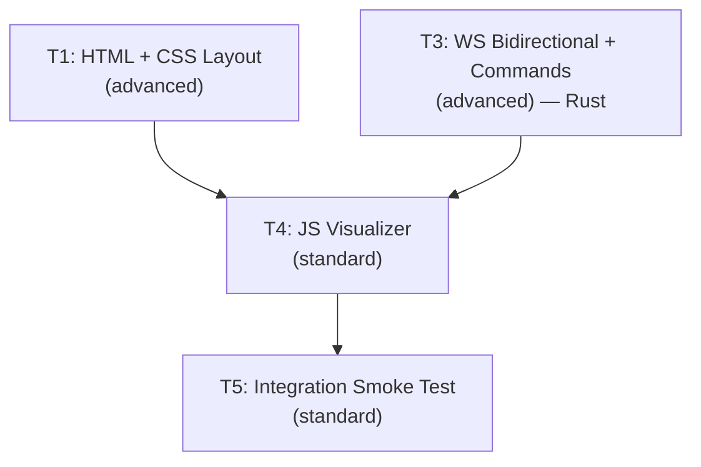

# AGENT ROLE: EXECUTION SPECIALIST

You are an **Execution Specialist** in a multi-agent DAG workflow.
You have been assigned ONE specific task. You implement it with surgical precision.

---

## Your Assignment

| Field   | Value |
|---------|-------|
| Task ID | `task_03_ws_bidirectional_commands` |
| Feature | Phase 1 Micro-Phase 4: Debug Visualizer + Bidirectional WS |
| Tier    | advanced |

---

## ⛔ MANDATORY PROCESS — ALL TIERS (DO NOT SKIP)

> **These rules apply to EVERY executor, regardless of tier. Violating them
> causes an automatic QA FAIL and project BLOCK.**

### Rule 1: Scope Isolation
- You may ONLY create or modify files listed in `Target_Files` in your Task Brief.
- If a file must be changed but is NOT in `Target_Files`, **STOP and report the gap** — do NOT modify it.
- NEVER edit `task_state.json`, `implementation_plan.md`, or any file outside your scope.

### Rule 2: Changelog (Handoff Documentation)
After ALL code is written and BEFORE calling `./task_tool.sh done`, you MUST:

1. **Create** `tasks_pending/task_03_ws_bidirectional_commands_changelog.md`
2. **Include in the changelog:**
   - **Touched Files:** A bulleted list of every file you created or modified.
   - **Contract Fulfillment:** Brief confirmation of the interfaces/DTOs you implemented.
   - **Deviations/Notes:** Any edge cases you handled or deviations from the brief the QA agent should verify.
3. **Then and only then** run:
   ```bash
   ./task_tool.sh done task_03_ws_bidirectional_commands
   ```

> **⚠️ Calling `./task_tool.sh done` without creating the changelog file is FORBIDDEN.**

### Rule 3: No Placeholders
- Do not use `// TODO`, `/* FIXME */`, or stub implementations.
- Output fully functional, production-ready code.

---

## Context Loading (Tier-Dependent)

**If your tier is `basic`:**
- Skip all external file reading. Your Task Brief below IS your complete instruction.
- Implement the code exactly as specified in the Task Brief.
- Follow the MANDATORY PROCESS rules above (changelog + scope), then halt.

**If your tier is `standard` or `advanced`:**
1. Read `.agents/context.md` — Thin index pointing to context sub-files
2. Load ONLY the `context/*` sub-files listed in your `Context_Bindings` below
3. Scan `.agents/knowledge/` — Lessons from previous sessions relevant to your task
4. Read `.agents/workflows/execution-lifecycle.md` — Your 4-step execution loop
5. Read `.agents/rules/execution-boundary.md` — Scope and contract constraints

_No additional context bindings specified._

---

## Task Brief

# Task 03: WS Bidirectional Command System

Task_ID: task_03_ws_bidirectional_commands
Execution_Phase: A
Model_Tier: advanced

## Target_Files
- `micro-core/src/bridges/ws_protocol.rs` [MODIFY]
- `micro-core/src/bridges/ws_server.rs` [MODIFY]
- `micro-core/src/systems/ws_sync.rs` [MODIFY]
- `micro-core/src/systems/ws_command.rs` [NEW]
- `micro-core/src/config.rs` [MODIFY]
- `micro-core/src/systems/movement.rs` [MODIFY]
- `micro-core/src/systems/mod.rs` [MODIFY]
- `micro-core/src/main.rs` [MODIFY]

## Dependencies
- MP2/MP3 complete (already done)

## Context_Bindings
- context/ipc-protocol
- context/tech-stack
- skills/rust-code-standards

## Strict_Instructions

### Step 1: Extend EntityState in ws_protocol.rs with velocity data

The Debug Visualizer needs velocity data to render direction vectors. Add `dx` and `dy` to `EntityState`:

```rust
#[derive(Serialize, Deserialize, Debug, Clone)]
pub struct EntityState {
    pub id: u32,
    pub x: f32,
    pub y: f32,
    pub dx: f32,  // NEW: velocity X component
    pub dy: f32,  // NEW: velocity Y component
    pub team: Team,
}
```

Also add the incoming command type:

```rust
/// Incoming command from the Debug Visualizer (Browser → Rust).
#[derive(Deserialize, Debug, Clone)]
pub struct WsCommand {
    #[serde(rename = "type")]
    pub msg_type: String,
    pub cmd: String,
    #[serde(default)]
    pub params: serde_json::Value,
}
```

### Step 2: Update ws_sync.rs to include velocity

Update the query in `ws_sync_system` to also fetch `&Velocity` and populate `dx`/`dy` in `EntityState`:

```rust
pub fn ws_sync_system(
    query: Query<(&EntityId, &Position, &Velocity, &Team), Changed<Position>>,
    // ...
) {
    for (id, pos, vel, team) in query.iter() {
        moved.push(EntityState {
            id: id.id, x: pos.x, y: pos.y,
            dx: vel.dx, dy: vel.dy,
            team: team.clone(),
        });
    }
}
```

Update the existing ws_sync test to include a `Velocity` component in the spawned test entity.

### Step 3: Add SimPaused, SimSpeed, SimStepRemaining to config.rs

```rust
/// User-controlled simulation pause (from Debug Visualizer).
/// Independent of `SimState::WaitingForAI`.
#[derive(Resource, Debug, Clone, PartialEq)]
pub struct SimPaused(pub bool);

impl Default for SimPaused {
    fn default() -> Self { Self(false) }
}

/// Speed multiplier for entity movement.
#[derive(Resource, Debug, Clone, Serialize, Deserialize)]
pub struct SimSpeed {
    pub multiplier: f32,
}

impl Default for SimSpeed {
    fn default() -> Self { Self { multiplier: 1.0 } }
}

/// Step mode: when > 0, movement runs for this many ticks even if paused,
/// then auto-pauses when it reaches 0. Used for single-step debugging.
#[derive(Resource, Debug, Clone, Default)]
pub struct SimStepRemaining(pub u32);
```

Add unit tests for all defaults.

### Step 4: Upgrade ws_server.rs for bidirectional communication

Modify `start_server` signature to accept a command sender:

```rust
pub async fn start_server(
    mut rx: tokio::sync::broadcast::Receiver<String>,
    cmd_tx: std::sync::mpsc::Sender<String>,
) { ... }
```

In the per-connection handler, forward incoming `Message::Text` to Bevy:

```rust
while let Some(Ok(msg)) = stream.next().await {
    if let Message::Text(text) = msg {
        let _ = cmd_tx_clone.send(text.to_string());
    }
}
```

Clone `cmd_tx` for each connection. Update existing test to pass a dummy sender.

### Step 5: Create systems/ws_command.rs

Implement `WsCommandReceiver` resource and `ws_command_system` with these commands:

| Command | Params | Action |
|---------|--------|--------|
| `toggle_sim` | `{}` | Toggle `SimPaused.0` |
| `step` | `{ "count": N }` | Set `SimStepRemaining(N)`, works even when paused |
| `spawn_wave` | `{ "team", "amount", "x", "y" }` | Spawn N entities at (x,y) |
| `set_speed` | `{ "multiplier": F }` | Set `SimSpeed.multiplier` |
| `kill_all` | `{ "team" }` | Despawn all entities of given team |

```rust
#[derive(Resource)]
pub struct WsCommandReceiver(pub Mutex<mpsc::Receiver<String>>);

pub fn ws_command_system(
    receiver: Res<WsCommandReceiver>,
    mut commands: Commands,
    mut next_id: ResMut<NextEntityId>,
    mut paused: ResMut<SimPaused>,
    mut speed: ResMut<SimSpeed>,
    mut step: ResMut<SimStepRemaining>,
    config: Res<SimulationConfig>,
    team_query: Query<(Entity, &Team)>,
) {
    let rx = receiver.0.lock().unwrap();
    while let Ok(json) = rx.try_recv() {
        // Parse and dispatch commands...
        match cmd.cmd.as_str() {
            "toggle_sim" => {
                paused.0 = !paused.0;
                println!("[WS Command] Simulation {}", if paused.0 { "paused" } else { "resumed" });
            }
            "step" => {
                let count = cmd.params.get("count")
                    .and_then(|v| v.as_u64()).unwrap_or(1) as u32;
                step.0 = count;
                println!("[WS Command] Stepping {} tick(s)", count);
            }
            "spawn_wave" => { /* spawn entities at x,y with team */ }
            "set_speed" => { /* update SimSpeed.multiplier */ }
            "kill_all" => { /* despawn entities by team */ }
            other => { eprintln!("[WS Command] Unknown: {}", other); }
        }
    }
}
```

### Step 6: Update systems/mod.rs

Add `pub mod ws_command;`

### Step 7: Update movement.rs

Accept `Res<SimSpeed>` and multiply velocity by `speed.multiplier`:

```rust
pos.x += vel.dx * speed.multiplier;
pos.y += vel.dy * speed.multiplier;
```

Update existing movement tests to insert `SimSpeed::default()`.

### Step 8: Create step_system for step mode

Create a system that decrements `SimStepRemaining` and auto-pauses when done:

```rust
/// Decrements step counter and auto-pauses when step mode completes.
/// Runs every tick when steps remain (regardless of SimPaused).
pub fn step_tick_system(
    mut step: ResMut<SimStepRemaining>,
    mut paused: ResMut<SimPaused>,
) {
    if step.0 > 0 {
        step.0 -= 1;
        if step.0 == 0 {
            paused.0 = true;
            println!("[Step Mode] Step complete, auto-paused");
        }
    }
}
```

This system should run AFTER the movement system in the Update schedule.

### Step 9: Update main.rs

1. Create `mpsc::channel` for WS commands, pass `cmd_tx` to `start_server()`
2. Register resources: `SimPaused`, `SimSpeed`, `SimStepRemaining`, `WsCommandReceiver`
3. Movement system gated by: `in_state(SimState::Running)` AND (`!paused` OR `step_remaining > 0`)
4. Add `ws_command_system` and `step_tick_system` to Update
5. `step_tick_system` must run AFTER movement (use `.after(movement_system)`)

Movement gating logic:
```rust
movement_system
    .run_if(in_state(SimState::Running))
    .run_if(|paused: Res<SimPaused>, step: Res<SimStepRemaining>| !paused.0 || step.0 > 0)
```

Step tick system:
```rust
step_tick_system
    .run_if(in_state(SimState::Running))
    .after(movement_system)
```

## Verification_Strategy
  Test_Type: unit + integration
  Test_Stack: cargo test (Rust)
  Acceptance_Criteria:
    - "cargo check succeeds with zero errors"
    - "cargo clippy has zero warnings"
    - "cargo test passes all existing + new tests"
    - "WsCommand deserializes from JSON with and without params"
    - "SimPaused::default() is false, SimSpeed::default().multiplier is 1.0, SimStepRemaining::default().0 is 0"
    - "EntityState now includes dx, dy fields"
    - "SyncDelta messages include velocity data"
    - "Movement system multiplies velocity by SimSpeed.multiplier"
    - "toggle_sim toggles SimPaused"
    - "step sets SimStepRemaining and movement runs for N ticks then auto-pauses"
    - "cargo run starts without errors"
  Suggested_Test_Commands:
    - "cd micro-core && cargo check"
    - "cd micro-core && cargo clippy"
    - "cd micro-core && cargo test"

---

## Shared Contracts

# Phase 1 — Micro-Phase 4: Debug Visualizer + Bidirectional WS

> **Parent:** Phase 1 (Vertical Slice)
> **Predecessors:** MP2 (WS Bridge) ✅, MP3 (ZMQ Bridge) ✅
> **Scope:** Create browser debug dashboard + upgrade Rust WS server for bidirectional commands.

---

## Shared Contracts

### DOM Element IDs (T1 → T4 dependency)

These are the minimum required IDs. T1 may add more for its design.

```
Canvas:          sim-canvas
Telemetry:       stat-tps, stat-ping, stat-ai-latency, stat-entities, stat-swarm, stat-defender, stat-tick
Controls:        play-pause-btn, step-btn, step-count-input
Layer toggles:   toggle-grid, toggle-velocity, toggle-fog
Connection:      status-dot, status-text
```

### WS Protocol (Rust → Browser)

SyncDelta now includes velocity data for direction vector rendering:

```json
{
  "type": "SyncDelta",
  "tick": 1234,
  "moved": [
    { "id": 1, "x": 150.3, "y": 200.1, "dx": 0.5, "dy": -0.3, "team": "swarm" }
  ]
}
```

### WS Command Schema (Browser → Rust)

```json
{ "type": "command", "cmd": "toggle_sim", "params": {} }
{ "type": "command", "cmd": "step", "params": { "count": 5 } }
{ "type": "command", "cmd": "spawn_wave", "params": { "team": "swarm", "amount": 10, "x": 500.0, "y": 500.0 } }
{ "type": "command", "cmd": "set_speed", "params": { "multiplier": 2.0 } }
{ "type": "command", "cmd": "kill_all", "params": { "team": "swarm" } }
```

### Rust Types (T3)

```rust
// config.rs
#[derive(Resource)] pub struct SimPaused(pub bool);          // Default: false
#[derive(Resource)] pub struct SimSpeed { pub multiplier: f32 } // Default: 1.0
#[derive(Resource)] pub struct SimStepRemaining(pub u32);      // Default: 0

// ws_protocol.rs — EntityState extended with velocity
pub struct EntityState { pub id: u32, pub x: f32, pub y: f32, pub dx: f32, pub dy: f32, pub team: Team }

// ws_protocol.rs — incoming command
pub struct WsCommand { pub msg_type: String, pub cmd: String, pub params: serde_json::Value }

// systems/ws_command.rs
pub struct WsCommandReceiver(pub Mutex<mpsc::Receiver<String>>);
```

---

## Proposed Changes

### 1. HTML + CSS (Debug Visualizer Page)

#### [NEW] [debug-visualizer/index.html](file:///Users/manifera/Documents/Study/mass-swarm-ai-simulator/debug-visualizer/index.html)
#### [NEW] [debug-visualizer/style.css](file:///Users/manifera/Documents/Study/mass-swarm-ai-simulator/debug-visualizer/style.css)

Functional requirements (creative freedom on design):
- **F1** Main canvas viewport (hero element, fills majority of viewport)
- **F2** Telemetry panel: TPS, WS Ping, AI Latency, Entity/Swarm/Defender counts, Tick
- **F3** Control panel: Play/Pause toggle, Step button + step count input
- **F4** Layer toggles: Grid (default ON), Velocity Vectors (default OFF), Fog of War (default OFF)
- **F5** Connection status indicator (connected/disconnected/reconnecting)
- **F6** Legend (swarm vs defender colors)
- **F7** Canvas is click target for spawning entities

### 2. WS Bidirectional Command System (Rust)

#### [MODIFY] [ws_protocol.rs](file:///Users/manifera/Documents/Study/mass-swarm-ai-simulator/micro-core/src/bridges/ws_protocol.rs)
- Add `dx`, `dy` to `EntityState` for velocity vector rendering
- Add `WsCommand` struct for incoming commands

#### [MODIFY] [ws_server.rs](file:///Users/manifera/Documents/Study/mass-swarm-ai-simulator/micro-core/src/bridges/ws_server.rs)
- Add `cmd_tx` parameter, forward incoming messages to Bevy

#### [MODIFY] [ws_sync.rs](file:///Users/manifera/Documents/Study/mass-swarm-ai-simulator/micro-core/src/systems/ws_sync.rs)
- Query `Velocity` component, populate `dx`/`dy` in `EntityState`

#### [NEW] [systems/ws_command.rs](file:///Users/manifera/Documents/Study/mass-swarm-ai-simulator/micro-core/src/systems/ws_command.rs)
- `WsCommandReceiver` + `ws_command_system` handling: `toggle_sim`, `step`, `spawn_wave`, `set_speed`, `kill_all`

#### [MODIFY] [config.rs](file:///Users/manifera/Documents/Study/mass-swarm-ai-simulator/micro-core/src/config.rs)
- Add `SimPaused`, `SimSpeed`, `SimStepRemaining` resources

#### [MODIFY] [movement.rs](file:///Users/manifera/Documents/Study/mass-swarm-ai-simulator/micro-core/src/systems/movement.rs)
- Multiply velocity by `SimSpeed.multiplier`

#### [MODIFY] [main.rs](file:///Users/manifera/Documents/Study/mass-swarm-ai-simulator/micro-core/src/main.rs)
- Wire command channel, resources, systems. Movement gated by pause AND step mode.

### 3. JS Visualizer

#### [NEW] [debug-visualizer/visualizer.js](file:///Users/manifera/Documents/Study/mass-swarm-ai-simulator/debug-visualizer/visualizer.js)

- WS client with auto-reconnect, SyncDelta parsing (including velocity)
- Entity state buffer with velocity data for direction rendering
- requestAnimationFrame render loop: grid, entities, velocity vectors
- Pan/zoom (drag + wheel + double-click reset)
- Click-to-spawn on canvas
- Layer toggles (grid, velocity vectors, fog)
- Play/Pause, Step, and telemetry updates

---

## DAG Execution Graph



| Phase | Tasks | Parallelism |
|-------|-------|-------------|
| **A** | T1 (HTML+CSS), T3 (Rust) | **Parallel** — zero file overlap |
| **B** | T4 (JS visualizer) | Sequential — needs T1 DOM IDs + T3 command schema |
| **C** | T5 (Integration test) | Sequential — needs everything |

---

## Task Summaries

### Task 01 — HTML + CSS Layout & Styling
- **Tier:** `advanced` | **Files:** `debug-visualizer/index.html`, `debug-visualizer/style.css`
- **Description:** Create Debug Visualizer page with full creative freedom. Functional requirements: canvas viewport, telemetry panel, control panel (play/pause, step), layer toggles, connection status, legend. Dark theme. Must include all mandatory DOM IDs.
- **Verification:** Open in browser → polished dark dashboard, all IDs present, responsive.

### Task 03 — WS Bidirectional Command System
- **Tier:** `advanced`
- **Files:** `ws_protocol.rs`, `ws_server.rs`, `ws_sync.rs`, `ws_command.rs` [NEW], `config.rs`, `movement.rs`, `mod.rs`, `main.rs`
- **Description:** Upgrade WS server for bidirectional communication. Add velocity to SyncDelta. Implement `toggle_sim`, `step` (with auto-pause), `spawn_wave`, `set_speed`, `kill_all` commands. Add `SimPaused`, `SimSpeed`, `SimStepRemaining` resources. Step mode overrides pause for N ticks then auto-pauses.
- **Verification:** `cargo test`, `cargo clippy`. All commands work end-to-end.

### Task 04 — JS Visualizer
- **Tier:** `standard` | **Dependencies:** T1, T3
- **Files:** `debug-visualizer/visualizer.js`
- **Description:** WS client + render engine. Pan/zoom, 100×100 grid, entity rendering with velocity vectors, click-to-spawn, layer toggles, telemetry (TPS/ping), step mode UI.
- **Verification:** Full manual test with Micro-Core running.

### Task 05 — Integration Smoke Test
- **Tier:** `standard` | **Dependencies:** All
- **Description:** 8-gate verification: build, files, rendering, pan/zoom, layer toggles, command round-trip, reconnection, error-free.

---

## Design Decisions

1. **`toggle_sim`** replaces separate `pause`/`resume` — simpler single-button UX
2. **Step mode** — `SimStepRemaining(N)` overrides pause for N ticks, then auto-pauses. Enables single-frame collision debugging.
3. **Velocity in SyncDelta** — `dx`/`dy` fields added so the visualizer can render movement direction vectors
4. **Click-to-spawn** — click on canvas converts to world coordinates, sends `spawn_wave` with `amount: 10`
5. **Layer toggles** — Grid/Velocity/Fog are toggleable. Fog is a placeholder (no fog system yet)
6. **T1 creative freedom** — task defines functional requirements only, not specific CSS colors, fonts, or layout direction

---

## Verification Plan

### Automated (Rust)
```bash
cd micro-core && cargo check && cargo clippy && cargo test
```

### Manual (Browser)
```bash
cd micro-core && cargo run
# Open debug-visualizer/index.html
# Test: rendering, pan/zoom, click-to-spawn, toggle_sim, step, velocity vectors, layer toggles, reconnect
```

