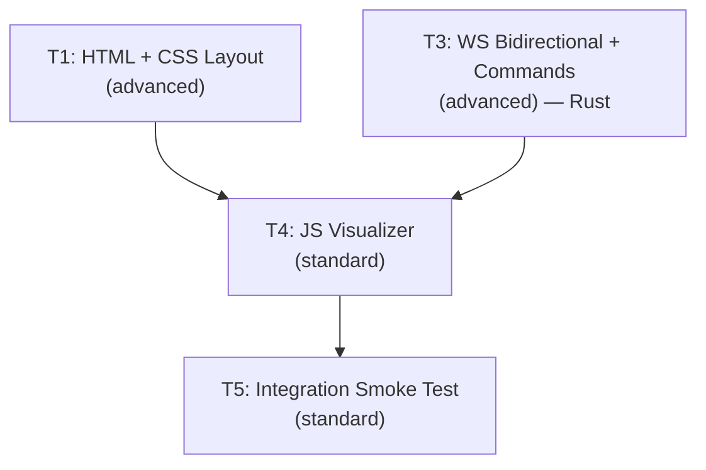

# AGENT ROLE: EXECUTION SPECIALIST

You are an **Execution Specialist** in a multi-agent DAG workflow.
You have been assigned ONE specific task. You implement it with surgical precision.

---

## Your Assignment

| Field   | Value |
|---------|-------|
| Task ID | `task_04_js_visualizer` |
| Feature | Phase 1 Micro-Phase 4: Debug Visualizer + Bidirectional WS |
| Tier    | standard |

---

## ⛔ MANDATORY PROCESS — ALL TIERS (DO NOT SKIP)

> **These rules apply to EVERY executor, regardless of tier. Violating them
> causes an automatic QA FAIL and project BLOCK.**

### Rule 1: Scope Isolation
- You may ONLY create or modify files listed in `Target_Files` in your Task Brief.
- If a file must be changed but is NOT in `Target_Files`, **STOP and report the gap** — do NOT modify it.
- NEVER edit `task_state.json`, `implementation_plan.md`, or any file outside your scope.

### Rule 2: Changelog (Handoff Documentation)
After ALL code is written and BEFORE calling `./task_tool.sh done`, you MUST:

1. **Create** `tasks_pending/task_04_js_visualizer_changelog.md`
2. **Include in the changelog:**
   - **Touched Files:** A bulleted list of every file you created or modified.
   - **Contract Fulfillment:** Brief confirmation of the interfaces/DTOs you implemented.
   - **Deviations/Notes:** Any edge cases you handled or deviations from the brief the QA agent should verify.
3. **Then and only then** run:
   ```bash
   ./task_tool.sh done task_04_js_visualizer
   ```

> **⚠️ Calling `./task_tool.sh done` without creating the changelog file is FORBIDDEN.**

### Rule 3: No Placeholders
- Do not use `// TODO`, `/* FIXME */`, or stub implementations.
- Output fully functional, production-ready code.

---

## Context Loading (Tier-Dependent)

**If your tier is `basic`:**
- Skip all external file reading. Your Task Brief below IS your complete instruction.
- Implement the code exactly as specified in the Task Brief.
- Follow the MANDATORY PROCESS rules above (changelog + scope), then halt.

**If your tier is `standard` or `advanced`:**
1. Read `.agents/context.md` — Thin index pointing to context sub-files
2. Load ONLY the `context/*` sub-files listed in your `Context_Bindings` below
3. Scan `.agents/knowledge/` — Lessons from previous sessions relevant to your task
4. Read `.agents/workflows/execution-lifecycle.md` — Your 4-step execution loop
5. Read `.agents/rules/execution-boundary.md` — Scope and contract constraints

_No additional context bindings specified._

---

## Task Brief

# Task 04: JS Visualizer — WS Client + Render Engine + Interactions

Task_ID: task_04_js_visualizer
Execution_Phase: B
Model_Tier: standard

## Target_Files
- `debug-visualizer/visualizer.js` [NEW]

## Dependencies
- Task 01 (DOM element IDs — see DOM ID Contract below)
- Task 03 (WS protocol: SyncDelta with velocity, command schema)

## Context_Bindings
- context/ipc-protocol
- context/conventions

## Strict_Instructions

Create `debug-visualizer/visualizer.js` — the complete JavaScript application.

### DOM ID Contract (from Task 01)

These IDs MUST exist in the HTML. Reference them via `document.getElementById()`:

```
Canvas:          sim-canvas
Telemetry:       stat-tps, stat-ping, stat-ai-latency, stat-entities, stat-swarm, stat-defender, stat-tick
Controls:        play-pause-btn, step-btn, step-count-input
Layer toggles:   toggle-grid, toggle-velocity, toggle-fog
Connection:      status-dot, status-text
```

### WS Message Schema (from Task 03)

**Incoming (Server → Browser):**
```json
{
  "type": "SyncDelta",
  "tick": 1234,
  "moved": [
    { "id": 1, "x": 150.3, "y": 200.1, "dx": 0.5, "dy": -0.3, "team": "swarm" },
    { "id": 2, "x": 400.0, "y": 300.5, "dx": -0.1, "dy": 0.7, "team": "defender" }
  ]
}
```

**Outgoing (Browser → Server) — Command schema:**
```json
{ "type": "command", "cmd": "toggle_sim", "params": {} }
{ "type": "command", "cmd": "step", "params": { "count": 1 } }
{ "type": "command", "cmd": "spawn_wave", "params": { "team": "swarm", "amount": 10, "x": 500.0, "y": 500.0 } }
{ "type": "command", "cmd": "set_speed", "params": { "multiplier": 2.0 } }
{ "type": "command", "cmd": "kill_all", "params": { "team": "swarm" } }
```

---

### 1. Constants

```javascript
const WS_URL = "ws://127.0.0.1:8080";
const WORLD_WIDTH = 1000.0;
const WORLD_HEIGHT = 1000.0;
const GRID_DIVISIONS = 100;
const ENTITY_RADIUS = 3;
const RECONNECT_INTERVAL_MS = 2000;
const VELOCITY_VECTOR_SCALE = 15; // pixel length multiplier for velocity lines
```

### 2. State

```javascript
const entities = new Map();  // Map<id, { x, y, dx, dy, team }>
let currentTick = 0;
let ws = null;
let isPaused = false;

// View transform (pan/zoom)
let viewX = WORLD_WIDTH / 2;
let viewY = WORLD_HEIGHT / 2;
let viewScale = 1.0;

// Layer visibility
let showGrid = true;       // Reads initial state from toggle-grid checkbox
let showVelocity = false;  // Reads from toggle-velocity
let showFog = false;       // Reads from toggle-fog

// Telemetry
let lastTickTime = 0;
let tpsCounter = 0;
let currentTps = 0;
```

### 3. Canvas Setup

- Get canvas and 2D context
- `resizeCanvas()`: set `canvas.width/height` to match `clientWidth/clientHeight`
- Listen to `window.resize` event
- Call `resizeCanvas()` on init

### 4. Coordinate Transforms

- `worldToCanvas(wx, wy)` → `[cx, cy]`: maps world coordinates to canvas pixels using viewX, viewY, viewScale
- `canvasToWorld(cx, cy)` → `[wx, wy]`: inverse for click-to-spawn
- Scale factor: `Math.min(canvas.width, canvas.height) / WORLD_WIDTH * viewScale`

### 5. WebSocket Client

- `connectWebSocket()`: create `new WebSocket(WS_URL)`
- `onopen`: set connection status to "connected", clear entity buffer
- `onmessage`: parse JSON, handle `SyncDelta`:
  - Update `currentTick`
  - For each entity in `moved`: `entities.set(id, { x, y, dx, dy, team })`
  - Compute TPS: count SyncDelta messages per second
  - Update telemetry displays
- `onclose`: set status "disconnected", schedule reconnect after `RECONNECT_INTERVAL_MS`
- `onerror`: no-op (onclose handles reconnect)

Connection status display: update `status-dot` class and `status-text` content.

### 6. Render Loop (`requestAnimationFrame`)

```
renderFrame():
  1. Clear canvas
  2. Fill background (dark color)
  3. If showGrid: drawGrid() — 100×100 grid, major lines every 10 cells
  4. drawEntities() — for each entity in Map:
     - worldToCanvas(x, y) → canvas position
     - Skip if outside visible canvas (frustum culling)
     - Draw filled circle: team color (swarm=red-ish, defender=blue-ish)
     - If showVelocity: draw line from entity center in (dx, dy) direction
  5. If showFog: drawFog() — semi-transparent overlay (placeholder, basic implementation)
  6. Update FPS counter
  7. requestAnimationFrame(renderFrame)
```

Entity colors: use distinct colors for swarm vs defender. Choose any specific hex values that look good on dark background.

### 7. Pan/Zoom

- **Pan**: mousedown → track start position; mousemove → update viewX/viewY; mouseup → stop
- **Zoom**: wheel event → multiply viewScale by factor (e.g., 1.1); zoom toward cursor position; clamp viewScale (0.5–20.0)
- **Reset**: double-click → reset viewX, viewY, viewScale to defaults

### 8. Click to Spawn

- Canvas `click` event (when NOT dragging):
  - Convert click position to world coordinates via `canvasToWorld()`
  - Send `spawn_wave` command with `{ team: "swarm", amount: 10, x, y }`
  - Distinguish click from drag: only spawn if mouse didn't move significantly between mousedown and mouseup

### 9. Control Panel Handlers

```javascript
// Play/Pause toggle
getElementById("play-pause-btn").onclick = () => {
    isPaused = !isPaused;
    sendCommand("toggle_sim");
    // Update button text/icon
};

// Step
getElementById("step-btn").onclick = () => {
    const count = parseInt(getElementById("step-count-input").value) || 1;
    sendCommand("step", { count });
};

// Layer toggles
getElementById("toggle-grid").onchange = (e) => { showGrid = e.target.checked; };
getElementById("toggle-velocity").onchange = (e) => { showVelocity = e.target.checked; };
getElementById("toggle-fog").onchange = (e) => { showFog = e.target.checked; };
```

### 10. Command Sender

```javascript
function sendCommand(cmd, params = {}) {
    if (ws && ws.readyState === WebSocket.OPEN) {
        ws.send(JSON.stringify({ type: "command", cmd, params }));
    }
}
```

### 11. Telemetry Updates

- **TPS**: Count ticks received per second (compare `currentTick` deltas), update `stat-tps`
- **WS Ping**: Measure time between sending and receiving (or just show "< 1ms" for localhost), update `stat-ping`
- **AI Latency**: Show "N/A" for now (no data source yet), update `stat-ai-latency`
- **Entity counts**: Count from entity Map, update `stat-entities`, `stat-swarm`, `stat-defender`
- **Tick**: Update `stat-tick` with `currentTick`
- **FPS**: Count render frames per second

### 12. Initialization

```javascript
resizeCanvas();
connectWebSocket();
requestAnimationFrame(renderFrame);
```

## Verification_Strategy
  Test_Type: manual_steps + integration
  Acceptance_Criteria:
    - "Without Micro-Core: shows 'Disconnected', auto-retries every 2s"
    - "With Micro-Core: 'Connected', entities render as colored dots, tick counter increments"
    - "Pan (drag) and zoom (scroll wheel) work on canvas"
    - "Double-click resets view"
    - "Grid overlay toggles on/off via checkbox"
    - "Velocity vector toggle shows/hides direction lines on entities"
    - "Click on canvas spawns entities at that position"
    - "Play/Pause button sends toggle_sim command"
    - "Step button sends step command with count from input"
    - "TPS counter shows simulation tick rate"
    - "Entity counts in telemetry match simulation"
  Manual_Steps:
    - "Open index.html without Micro-Core → verify Disconnected"
    - "Start cargo run → verify rendering and telemetry"
    - "Test pan/zoom/reset"
    - "Toggle grid off/on"
    - "Enable velocity vectors → verify direction lines"
    - "Click canvas → verify entities spawn at click position"
    - "Click Play/Pause → verify simulation toggles"
    - "Enter step count, click Step → verify single-step advance"
    - "Stop cargo run → verify reconnect"

---

## Shared Contracts

# Phase 1 — Micro-Phase 4: Debug Visualizer + Bidirectional WS

> **Parent:** Phase 1 (Vertical Slice)
> **Predecessors:** MP2 (WS Bridge) ✅, MP3 (ZMQ Bridge) ✅
> **Scope:** Create browser debug dashboard + upgrade Rust WS server for bidirectional commands.

---

## Shared Contracts

### DOM Element IDs (T1 → T4 dependency)

These are the minimum required IDs. T1 may add more for its design.

```
Canvas:          sim-canvas
Telemetry:       stat-tps, stat-ping, stat-ai-latency, stat-entities, stat-swarm, stat-defender, stat-tick
Controls:        play-pause-btn, step-btn, step-count-input
Layer toggles:   toggle-grid, toggle-velocity, toggle-fog
Connection:      status-dot, status-text
```

### WS Protocol (Rust → Browser)

SyncDelta now includes velocity data for direction vector rendering:

```json
{
  "type": "SyncDelta",
  "tick": 1234,
  "moved": [
    { "id": 1, "x": 150.3, "y": 200.1, "dx": 0.5, "dy": -0.3, "team": "swarm" }
  ]
}
```

### WS Command Schema (Browser → Rust)

```json
{ "type": "command", "cmd": "toggle_sim", "params": {} }
{ "type": "command", "cmd": "step", "params": { "count": 5 } }
{ "type": "command", "cmd": "spawn_wave", "params": { "team": "swarm", "amount": 10, "x": 500.0, "y": 500.0 } }
{ "type": "command", "cmd": "set_speed", "params": { "multiplier": 2.0 } }
{ "type": "command", "cmd": "kill_all", "params": { "team": "swarm" } }
```

### Rust Types (T3)

```rust
// config.rs
#[derive(Resource)] pub struct SimPaused(pub bool);          // Default: false
#[derive(Resource)] pub struct SimSpeed { pub multiplier: f32 } // Default: 1.0
#[derive(Resource)] pub struct SimStepRemaining(pub u32);      // Default: 0

// ws_protocol.rs — EntityState extended with velocity
pub struct EntityState { pub id: u32, pub x: f32, pub y: f32, pub dx: f32, pub dy: f32, pub team: Team }

// ws_protocol.rs — incoming command
pub struct WsCommand { pub msg_type: String, pub cmd: String, pub params: serde_json::Value }

// systems/ws_command.rs
pub struct WsCommandReceiver(pub Mutex<mpsc::Receiver<String>>);
```

---

## Proposed Changes

### 1. HTML + CSS (Debug Visualizer Page)

#### [NEW] [debug-visualizer/index.html](file:///Users/manifera/Documents/Study/mass-swarm-ai-simulator/debug-visualizer/index.html)
#### [NEW] [debug-visualizer/style.css](file:///Users/manifera/Documents/Study/mass-swarm-ai-simulator/debug-visualizer/style.css)

Functional requirements (creative freedom on design):
- **F1** Main canvas viewport (hero element, fills majority of viewport)
- **F2** Telemetry panel: TPS, WS Ping, AI Latency, Entity/Swarm/Defender counts, Tick
- **F3** Control panel: Play/Pause toggle, Step button + step count input
- **F4** Layer toggles: Grid (default ON), Velocity Vectors (default OFF), Fog of War (default OFF)
- **F5** Connection status indicator (connected/disconnected/reconnecting)
- **F6** Legend (swarm vs defender colors)
- **F7** Canvas is click target for spawning entities

### 2. WS Bidirectional Command System (Rust)

#### [MODIFY] [ws_protocol.rs](file:///Users/manifera/Documents/Study/mass-swarm-ai-simulator/micro-core/src/bridges/ws_protocol.rs)
- Add `dx`, `dy` to `EntityState` for velocity vector rendering
- Add `WsCommand` struct for incoming commands

#### [MODIFY] [ws_server.rs](file:///Users/manifera/Documents/Study/mass-swarm-ai-simulator/micro-core/src/bridges/ws_server.rs)
- Add `cmd_tx` parameter, forward incoming messages to Bevy

#### [MODIFY] [ws_sync.rs](file:///Users/manifera/Documents/Study/mass-swarm-ai-simulator/micro-core/src/systems/ws_sync.rs)
- Query `Velocity` component, populate `dx`/`dy` in `EntityState`

#### [NEW] [systems/ws_command.rs](file:///Users/manifera/Documents/Study/mass-swarm-ai-simulator/micro-core/src/systems/ws_command.rs)
- `WsCommandReceiver` + `ws_command_system` handling: `toggle_sim`, `step`, `spawn_wave`, `set_speed`, `kill_all`

#### [MODIFY] [config.rs](file:///Users/manifera/Documents/Study/mass-swarm-ai-simulator/micro-core/src/config.rs)
- Add `SimPaused`, `SimSpeed`, `SimStepRemaining` resources

#### [MODIFY] [movement.rs](file:///Users/manifera/Documents/Study/mass-swarm-ai-simulator/micro-core/src/systems/movement.rs)
- Multiply velocity by `SimSpeed.multiplier`

#### [MODIFY] [main.rs](file:///Users/manifera/Documents/Study/mass-swarm-ai-simulator/micro-core/src/main.rs)
- Wire command channel, resources, systems. Movement gated by pause AND step mode.

### 3. JS Visualizer

#### [NEW] [debug-visualizer/visualizer.js](file:///Users/manifera/Documents/Study/mass-swarm-ai-simulator/debug-visualizer/visualizer.js)

- WS client with auto-reconnect, SyncDelta parsing (including velocity)
- Entity state buffer with velocity data for direction rendering
- requestAnimationFrame render loop: grid, entities, velocity vectors
- Pan/zoom (drag + wheel + double-click reset)
- Click-to-spawn on canvas
- Layer toggles (grid, velocity vectors, fog)
- Play/Pause, Step, and telemetry updates

---

## DAG Execution Graph



| Phase | Tasks | Parallelism |
|-------|-------|-------------|
| **A** | T1 (HTML+CSS), T3 (Rust) | **Parallel** — zero file overlap |
| **B** | T4 (JS visualizer) | Sequential — needs T1 DOM IDs + T3 command schema |
| **C** | T5 (Integration test) | Sequential — needs everything |

---

## Task Summaries

### Task 01 — HTML + CSS Layout & Styling
- **Tier:** `advanced` | **Files:** `debug-visualizer/index.html`, `debug-visualizer/style.css`
- **Description:** Create Debug Visualizer page with full creative freedom. Functional requirements: canvas viewport, telemetry panel, control panel (play/pause, step), layer toggles, connection status, legend. Dark theme. Must include all mandatory DOM IDs.
- **Verification:** Open in browser → polished dark dashboard, all IDs present, responsive.

### Task 03 — WS Bidirectional Command System
- **Tier:** `advanced`
- **Files:** `ws_protocol.rs`, `ws_server.rs`, `ws_sync.rs`, `ws_command.rs` [NEW], `config.rs`, `movement.rs`, `mod.rs`, `main.rs`
- **Description:** Upgrade WS server for bidirectional communication. Add velocity to SyncDelta. Implement `toggle_sim`, `step` (with auto-pause), `spawn_wave`, `set_speed`, `kill_all` commands. Add `SimPaused`, `SimSpeed`, `SimStepRemaining` resources. Step mode overrides pause for N ticks then auto-pauses.
- **Verification:** `cargo test`, `cargo clippy`. All commands work end-to-end.

### Task 04 — JS Visualizer
- **Tier:** `standard` | **Dependencies:** T1, T3
- **Files:** `debug-visualizer/visualizer.js`
- **Description:** WS client + render engine. Pan/zoom, 100×100 grid, entity rendering with velocity vectors, click-to-spawn, layer toggles, telemetry (TPS/ping), step mode UI.
- **Verification:** Full manual test with Micro-Core running.

### Task 05 — Integration Smoke Test
- **Tier:** `standard` | **Dependencies:** All
- **Description:** 8-gate verification: build, files, rendering, pan/zoom, layer toggles, command round-trip, reconnection, error-free.

---

## Design Decisions

1. **`toggle_sim`** replaces separate `pause`/`resume` — simpler single-button UX
2. **Step mode** — `SimStepRemaining(N)` overrides pause for N ticks, then auto-pauses. Enables single-frame collision debugging.
3. **Velocity in SyncDelta** — `dx`/`dy` fields added so the visualizer can render movement direction vectors
4. **Click-to-spawn** — click on canvas converts to world coordinates, sends `spawn_wave` with `amount: 10`
5. **Layer toggles** — Grid/Velocity/Fog are toggleable. Fog is a placeholder (no fog system yet)
6. **T1 creative freedom** — task defines functional requirements only, not specific CSS colors, fonts, or layout direction

---

## Verification Plan

### Automated (Rust)
```bash
cd micro-core && cargo check && cargo clippy && cargo test
```

### Manual (Browser)
```bash
cd micro-core && cargo run
# Open debug-visualizer/index.html
# Test: rendering, pan/zoom, click-to-spawn, toggle_sim, step, velocity vectors, layer toggles, reconnect
```

