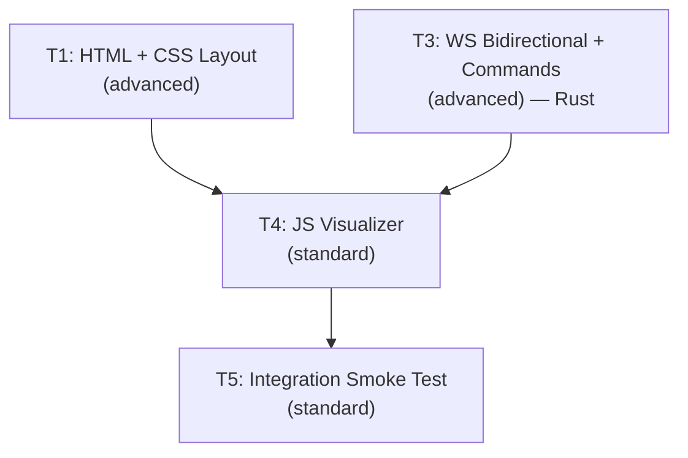

# Phase 1 — Micro-Phase 4: Debug Visualizer + Bidirectional WS

> **Parent:** Phase 1 (Vertical Slice)
> **Predecessors:** MP2 (WS Bridge) ✅, MP3 (ZMQ Bridge) ✅
> **Scope:** Create browser debug dashboard + upgrade Rust WS server for bidirectional commands.

---

## Shared Contracts

### DOM Element IDs (T1 → T4 dependency)

These are the minimum required IDs. T1 may add more for its design.

```
Canvas:          sim-canvas
Telemetry:       stat-tps, stat-ping, stat-ai-latency, stat-entities, stat-swarm, stat-defender, stat-tick
Controls:        play-pause-btn, step-btn, step-count-input
Layer toggles:   toggle-grid, toggle-velocity, toggle-fog
Connection:      status-dot, status-text
```

### WS Protocol (Rust → Browser)

SyncDelta now includes velocity data for direction vector rendering:

```json
{
  "type": "SyncDelta",
  "tick": 1234,
  "moved": [
    { "id": 1, "x": 150.3, "y": 200.1, "dx": 0.5, "dy": -0.3, "team": "swarm" }
  ]
}
```

### WS Command Schema (Browser → Rust)

```json
{ "type": "command", "cmd": "toggle_sim", "params": {} }
{ "type": "command", "cmd": "step", "params": { "count": 5 } }
{ "type": "command", "cmd": "spawn_wave", "params": { "team": "swarm", "amount": 10, "x": 500.0, "y": 500.0 } }
{ "type": "command", "cmd": "set_speed", "params": { "multiplier": 2.0 } }
{ "type": "command", "cmd": "kill_all", "params": { "team": "swarm" } }
```

### Rust Types (T3)

```rust
// config.rs
#[derive(Resource)] pub struct SimPaused(pub bool);          // Default: false
#[derive(Resource)] pub struct SimSpeed { pub multiplier: f32 } // Default: 1.0
#[derive(Resource)] pub struct SimStepRemaining(pub u32);      // Default: 0

// ws_protocol.rs — EntityState extended with velocity
pub struct EntityState { pub id: u32, pub x: f32, pub y: f32, pub dx: f32, pub dy: f32, pub team: Team }

// ws_protocol.rs — incoming command
pub struct WsCommand { pub msg_type: String, pub cmd: String, pub params: serde_json::Value }

// systems/ws_command.rs
pub struct WsCommandReceiver(pub Mutex<mpsc::Receiver<String>>);
```

---

## Proposed Changes

### 1. HTML + CSS (Debug Visualizer Page)

#### [NEW] [debug-visualizer/index.html](file:///Users/manifera/Documents/Study/mass-swarm-ai-simulator/debug-visualizer/index.html)
#### [NEW] [debug-visualizer/style.css](file:///Users/manifera/Documents/Study/mass-swarm-ai-simulator/debug-visualizer/style.css)

Functional requirements (creative freedom on design):
- **F1** Main canvas viewport (hero element, fills majority of viewport)
- **F2** Telemetry panel: TPS, WS Ping, AI Latency, Entity/Swarm/Defender counts, Tick
- **F3** Control panel: Play/Pause toggle, Step button + step count input
- **F4** Layer toggles: Grid (default ON), Velocity Vectors (default OFF), Fog of War (default OFF)
- **F5** Connection status indicator (connected/disconnected/reconnecting)
- **F6** Legend (swarm vs defender colors)
- **F7** Canvas is click target for spawning entities

### 2. WS Bidirectional Command System (Rust)

#### [MODIFY] [ws_protocol.rs](file:///Users/manifera/Documents/Study/mass-swarm-ai-simulator/micro-core/src/bridges/ws_protocol.rs)
- Add `dx`, `dy` to `EntityState` for velocity vector rendering
- Add `WsCommand` struct for incoming commands

#### [MODIFY] [ws_server.rs](file:///Users/manifera/Documents/Study/mass-swarm-ai-simulator/micro-core/src/bridges/ws_server.rs)
- Add `cmd_tx` parameter, forward incoming messages to Bevy

#### [MODIFY] [ws_sync.rs](file:///Users/manifera/Documents/Study/mass-swarm-ai-simulator/micro-core/src/systems/ws_sync.rs)
- Query `Velocity` component, populate `dx`/`dy` in `EntityState`

#### [NEW] [systems/ws_command.rs](file:///Users/manifera/Documents/Study/mass-swarm-ai-simulator/micro-core/src/systems/ws_command.rs)
- `WsCommandReceiver` + `ws_command_system` handling: `toggle_sim`, `step`, `spawn_wave`, `set_speed`, `kill_all`

#### [MODIFY] [config.rs](file:///Users/manifera/Documents/Study/mass-swarm-ai-simulator/micro-core/src/config.rs)
- Add `SimPaused`, `SimSpeed`, `SimStepRemaining` resources

#### [MODIFY] [movement.rs](file:///Users/manifera/Documents/Study/mass-swarm-ai-simulator/micro-core/src/systems/movement.rs)
- Multiply velocity by `SimSpeed.multiplier`

#### [MODIFY] [main.rs](file:///Users/manifera/Documents/Study/mass-swarm-ai-simulator/micro-core/src/main.rs)
- Wire command channel, resources, systems. Movement gated by pause AND step mode.

### 3. JS Visualizer

#### [NEW] [debug-visualizer/visualizer.js](file:///Users/manifera/Documents/Study/mass-swarm-ai-simulator/debug-visualizer/visualizer.js)

- WS client with auto-reconnect, SyncDelta parsing (including velocity)
- Entity state buffer with velocity data for direction rendering
- requestAnimationFrame render loop: grid, entities, velocity vectors
- Pan/zoom (drag + wheel + double-click reset)
- Click-to-spawn on canvas
- Layer toggles (grid, velocity vectors, fog)
- Play/Pause, Step, and telemetry updates

---

## DAG Execution Graph



| Phase | Tasks | Parallelism |
|-------|-------|-------------|
| **A** | T1 (HTML+CSS), T3 (Rust) | **Parallel** — zero file overlap |
| **B** | T4 (JS visualizer) | Sequential — needs T1 DOM IDs + T3 command schema |
| **C** | T5 (Integration test) | Sequential — needs everything |

---

## Task Summaries

### Task 01 — HTML + CSS Layout & Styling
- **Tier:** `advanced` | **Files:** `debug-visualizer/index.html`, `debug-visualizer/style.css`
- **Description:** Create Debug Visualizer page with full creative freedom. Functional requirements: canvas viewport, telemetry panel, control panel (play/pause, step), layer toggles, connection status, legend. Dark theme. Must include all mandatory DOM IDs.
- **Verification:** Open in browser → polished dark dashboard, all IDs present, responsive.

### Task 03 — WS Bidirectional Command System
- **Tier:** `advanced`
- **Files:** `ws_protocol.rs`, `ws_server.rs`, `ws_sync.rs`, `ws_command.rs` [NEW], `config.rs`, `movement.rs`, `mod.rs`, `main.rs`
- **Description:** Upgrade WS server for bidirectional communication. Add velocity to SyncDelta. Implement `toggle_sim`, `step` (with auto-pause), `spawn_wave`, `set_speed`, `kill_all` commands. Add `SimPaused`, `SimSpeed`, `SimStepRemaining` resources. Step mode overrides pause for N ticks then auto-pauses.
- **Verification:** `cargo test`, `cargo clippy`. All commands work end-to-end.

### Task 04 — JS Visualizer
- **Tier:** `standard` | **Dependencies:** T1, T3
- **Files:** `debug-visualizer/visualizer.js`
- **Description:** WS client + render engine. Pan/zoom, 100×100 grid, entity rendering with velocity vectors, click-to-spawn, layer toggles, telemetry (TPS/ping), step mode UI.
- **Verification:** Full manual test with Micro-Core running.

### Task 05 — Integration Smoke Test
- **Tier:** `standard` | **Dependencies:** All
- **Description:** 8-gate verification: build, files, rendering, pan/zoom, layer toggles, command round-trip, reconnection, error-free.

---

## Design Decisions

1. **`toggle_sim`** replaces separate `pause`/`resume` — simpler single-button UX
2. **Step mode** — `SimStepRemaining(N)` overrides pause for N ticks, then auto-pauses. Enables single-frame collision debugging.
3. **Velocity in SyncDelta** — `dx`/`dy` fields added so the visualizer can render movement direction vectors
4. **Click-to-spawn** — click on canvas converts to world coordinates, sends `spawn_wave` with `amount: 10`
5. **Layer toggles** — Grid/Velocity/Fog are toggleable. Fog is a placeholder (no fog system yet)
6. **T1 creative freedom** — task defines functional requirements only, not specific CSS colors, fonts, or layout direction

---

## Verification Plan

### Automated (Rust)
```bash
cd micro-core && cargo check && cargo clippy && cargo test
```

### Manual (Browser)
```bash
cd micro-core && cargo run
# Open debug-visualizer/index.html
# Test: rendering, pan/zoom, click-to-spawn, toggle_sim, step, velocity vectors, layer toggles, reconnect
```
