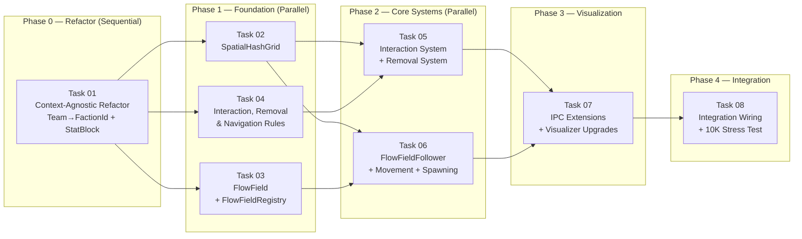

# AGENT ROLE: EXECUTION SPECIALIST

You are an **Execution Specialist** in a multi-agent DAG workflow.
You have been assigned ONE specific task. You implement it with surgical precision.

---

## Your Assignment

| Field   | Value |
|---------|-------|
| Task ID | `task_05_interaction_removal_systems` |
| Feature | phase_2_universal_core_algorithms |
| Tier    | standard |

---

## ⛔ MANDATORY PROCESS — ALL TIERS (DO NOT SKIP)

> **These rules apply to EVERY executor, regardless of tier. Violating them
> causes an automatic QA FAIL and project BLOCK.**

### Rule 1: Scope Isolation
- You may ONLY create or modify files listed in `Target_Files` in your Task Brief.
- If a file must be changed but is NOT in `Target_Files`, **STOP and report the gap** — do NOT modify it.
- NEVER edit `task_state.json`, `implementation_plan.md`, or any file outside your scope.

### Rule 2: Changelog (Handoff Documentation)
After ALL code is written and BEFORE calling `./task_tool.sh done`, you MUST:

1. **Create** `tasks_pending/task_05_interaction_removal_systems_changelog.md`
2. **Include in the changelog:**
   - **Touched Files:** A bulleted list of every file you created or modified.
   - **Contract Fulfillment:** Brief confirmation of the interfaces/DTOs you implemented.
   - **Deviations/Notes:** Any edge cases you handled or deviations from the brief the QA agent should verify.
3. **Then and only then** run:
   ```bash
   ./task_tool.sh done task_05_interaction_removal_systems
   ```

> **⚠️ Calling `./task_tool.sh done` without creating the changelog file is FORBIDDEN.**

### Rule 3: No Placeholders
- Do not use `// TODO`, `/* FIXME */`, or stub implementations.
- Output fully functional, production-ready code.

### Rule 4: Human Intervention Protocol
During execution, a human may intercept your work and propose changes, provide code snippets, or redirect your approach. When this happens:

1. **ADOPT the concept, VERIFY the details.** Humans are exceptional at architectural vision but make detail mistakes (wrong API, typos, outdated syntax). Independently verify all human-provided code against the actual framework version and project contracts.
2. **TRACK every human intervention in the changelog.** Add a dedicated `## Human Interventions` section to your changelog documenting:
   - What the human proposed (1-2 sentence summary)
   - What you adopted vs. what you corrected
   - Any deviations from the original task brief caused by the intervention
3. **DO NOT silently incorporate changes.** The QA agent and Architect must be able to trace exactly what came from the spec vs. what came from a human mid-flight. Untracked changes are invisible to the verification pipeline.

---

## Context Loading (Tier-Dependent)

**If your tier is `basic`:**
- Skip all external file reading. Your Task Brief below IS your complete instruction.
- Implement the code exactly as specified in the Task Brief.
- Follow the MANDATORY PROCESS rules above (changelog + scope), then halt.

**If your tier is `standard` or `advanced`:**
1. Read `.agents/context.md` — Thin index pointing to context sub-files
2. Load ONLY the `context/*` sub-files listed in your `Context_Bindings` below
3. Scan `.agents/knowledge/` — Lessons from previous sessions relevant to your task
4. Read `.agents/workflows/execution-lifecycle.md` — Your 4-step execution loop
5. Read `.agents/rules/execution-boundary.md` — Scope and contract constraints

- `./.agents/context/conventions.md`
- `./.agents/context/architecture.md`
- `./.agents/skills/rust-code-standards/SKILL.md`

---

## Task Brief

---
Task_ID: task_05_interaction_removal_systems
Execution_Phase: Phase 2 (Parallel)
Model_Tier: standard
Target_Files:
  - micro-core/src/systems/interaction.rs
  - micro-core/src/systems/removal.rs
Dependencies:
  - task_02_spatial_hash_grid
  - task_04_rule_resources
Context_Bindings:
  - context/conventions
  - context/architecture
  - skills/rust-code-standards
---

# STRICT INSTRUCTIONS

Implement the Interaction System and Removal System using **Zero-Allocation Disjoint Queries**.

**Read `implementation_plan.md` Contracts 5, 6, 7 AND the deep-dive spec `implementation_plan_task_05.md` for the exact architecture, safety proofs, and unit tests.**

> **CRITICAL:** The spec file `implementation_plan_task_05.md` (project root) contains the Disjoint Query architecture. Adopt the concept and verify correctness before implementation. DO NOT fall back to Collect→Apply or monolithic queries.

**DO NOT modify `systems/mod.rs` — Task 08 handles wiring.**

## Architecture: Zero-Allocation Disjoint Queries

The interaction system MUST use two disjoint queries:

```rust
q_ro: Query<(Entity, &Position, &FactionId)>,   // Read-only spatial data
mut q_rw: Query<&mut StatBlock>,                  // Write-only stat mutation
```

**Why:**
- `{Position, FactionId}` ∩ `{StatBlock}` = ∅ → Bevy allows simultaneous access
- `q_ro.get(neighbor)` inside `q_ro.iter()` → multiple shared borrows → safe
- `q_rw.get_mut(neighbor)` inside `q_ro.iter()` → disjoint components → safe
- Zero Vec snapshots, zero HashMaps, zero heap allocations

**REJECTED patterns:**
- ❌ Monolithic `Query<(Entity, &Position, &mut StatBlock, &FactionId)>` → panics on `get_mut()` during `iter()`
- ❌ Collect→Apply with Vec/HashMap → 600K allocations/sec, trashes L1/L2 cache
- ❌ `par_iter()` → data race on shared targets (5K→1 Defender crush)

## Mandatory Design Decisions

1. **Fixed delta `1.0 / 60.0`** — NOT `Res<Time>`. ML determinism: same initial state must yield identical outcomes across runs.
2. **No stat clamping** — Stats can go negative. "Overkill Gradient" signal for RL training.
3. **Self-skip** — `if neighbor_entity == source_entity { continue; }` — SpatialHashGrid returns self in results.
4. **Single-threaded** — NO `par_iter()`. Hot Defender's StatBlock stays in L1 cache.

## File Structure

### 1. `micro-core/src/systems/interaction.rs` [NEW]

`interaction_system` with disjoint queries. See spec for complete code:
- Early return if rules empty
- Pre-calc `tick_delta = 1.0 / 60.0`
- Iterate `q_ro`, match source faction, query spatial grid
- Self-skip, faction check via `q_ro.get()`, stat mutation via `q_rw.get_mut()`
- Stat index bounds check

### 2. `micro-core/src/systems/removal.rs` [NEW]

`removal_system` using `Commands::despawn()` (deferred). See spec for complete code:
- Clear `RemovalEvents` each tick
- Check each entity against removal rules
- Record entity ID, despawn, break after first match

## Unit Tests (6 tests)

### Interaction:
- Two enemies in range: stats decrease by `delta_per_second * (1.0/60.0)`
- Same faction: no interaction (no matching rule)
- Out of range: no interaction

### Removal:
- Entity with stat[0] = 0.0 → despawned, ID in RemovalEvents
- Entity with stat[0] = 50.0 → alive
- GreaterOrEqual condition: stat[0] = 100.0, threshold 100.0 → removed

---

# Verification_Strategy
Test_Type: unit
Test_Stack: cargo test
Acceptance_Criteria:
  - "interaction_system reduces target stat by delta_per_second * (1.0/60.0) per tick"
  - "Same-faction entities do not interact"
  - "Out-of-range entities do not interact"
  - "Self-interaction is prevented"
  - "Uses disjoint queries (q_ro + q_rw), NOT monolithic query"
  - "Uses fixed delta 1.0/60.0, NOT Res<Time>"
  - "Stats are NOT clamped"
  - "removal_system despawns entities crossing threshold"
  - "RemovalEvents contains despawned entity IDs"
Suggested_Test_Commands:
  - "cd micro-core && cargo test interaction"
  - "cd micro-core && cargo test removal"

---

## Shared Contracts

# Phase 2 — Universal Core Algorithms (Context-Agnostic Architecture)

**TDD Reference:** CASE_STUDY.md §2.2, ROADMAP.md Phase 2
**Depends On:** Phase 1 (complete ✅)
**Architectural Pivot:** Universal Brain System — context-agnostic Micro-Core

---

## Architectural Vision: The Black-Box Universal Core

Phase 2 adopts the **Universal Brain System** thesis: the Rust Micro-Core and Python Macro-Brain must be **semantically blind** — they handle mathematical quantities, spatial vectors, numeric identifiers, and anonymous data blocks. They never know whether they're running a swarm RTS, an Action RPG's Nemesis-style system, an FPS combat arena, or a real-world drone swarm.

### Validated Principles

| Principle | Status | Notes |
|-----------|--------|-------|
| Context-agnostic core | ✅ Adopted | Core never knows "health" or "team" — only stat indices and faction IDs |
| Dynamic Payload Array (`Stats: [f32; N]`) | ✅ Adopted with refinement | Fixed `[f32; 8]` array per entity — cache-friendly, zero allocation |
| 4-Layer Architecture | ✅ Adopted | Dumb Client → Adapter → Universal Core → Macro-Brain |
| FlatBuffers/Protobuf | ⏸️ Deferred to Phase 4 | JSON remains for Phases 2–3 (debuggability). Binary serialization is a throughput optimization, not an algorithmic concern |
| Config-driven rule sets | ✅ Adopted | Interaction rules, removal rules loaded from config — zero hardcoded game logic |

### Design Refinement: ECS × Stats Array

The analysis proposes `Stats: [f32; 8]` as a flat array. This is correct but needs ECS-friendly refinement:

```
❌ Anti-pattern: Put EVERYTHING in Stats array (position, velocity, faction)
   → Loses Bevy query efficiency, can't filter "entities at position X"

✅ Best practice: Keep spatial components (Position, Velocity) as native ECS components.
   Use StatBlock ONLY for game-logic attributes (health, mana, fuel, damage, etc.)
   Use FactionId as a separate queryable component (critical for spatial queries)
```

**Why?** `Position` and `Velocity` are already context-agnostic (pure math). Merging them into a generic array would destroy Bevy's `Changed<Position>` tracking and `With<FactionId>` filtering — both critical for 10K+ entity performance.

### What Changes from Phase 1

| Phase 1 Concept | Phase 2 Replacement | Reason |
|-----------------|---------------------|--------|
| `Team` enum (`Swarm`/`Defender`) | `FactionId(u32)` | Numeric ID = context-agnostic. Adapter maps ID → name |
| No health/stats | `StatBlock([f32; 8])` | Anonymous stat array. Adapter maps index → meaning |
| Hardcoded "combat" | `InteractionRuleSet` config | Rules define what happens when factions proximity-interact |
| Hardcoded "death" | `RemovalRuleSet` config | Rules define when entities are removed (stat thresholds) |
| `Team::Swarm` string in IPC | `faction_id: 0` integer in IPC | Protocol becomes numeric, adapter adds labels |

### Adapter Layer in Phase 2

The formal Adapter layer (Layer 2 in the user's analysis) is a Phase 5 concern (engine integration). In Phase 2, the **Debug Visualizer acts as the adapter** — it contains a small `ADAPTER_CONFIG` object that maps:

```javascript
// debug-visualizer/visualizer.js — Adapter Config
const ADAPTER_CONFIG = {
    factions: {
        0: { name: "Swarm",    color: "#ff3b30" },
        1: { name: "Defender", color: "#0a84ff" },
    },
    stats: {
        0: { name: "Health", display: "bar", color_low: "#ff3b30", color_high: "#30d158" },
    },
};
```

This proves the adapter concept without building a separate layer.

---

## User Review Required

> [!IMPORTANT]
> **Breaking Refactor — `Team` → `FactionId`:** All Phase 1 code referencing `Team::Swarm`/`Team::Defender` will be refactored to `FactionId(0)`/`FactionId(1)`. This is a coordinated refactor touching 10 files (components, systems, bridges, visualizer). The refactor must run first (Phase 0) before any new features.

> [!IMPORTANT]
> **StatBlock Size:** Proposing `MAX_STATS = 8` (32 bytes per entity). For 10K entities = 320KB total. Is 8 slots sufficient? Can be changed at compile time, but increasing it later requires recompilation.

> [!IMPORTANT]
> **Movement Change:** Replacing world-edge wrapping with boundary clamping. Flow field navigation is incompatible with toroidal topology (entities chasing a target would wrap to the opposite side).

> [!WARNING]
> **FlatBuffers Deferral:** The analysis recommends "absolutely no JSON" for 10K+. I recommend keeping JSON for Phase 2–3 because: (1) algorithm development needs debuggable messages in browser DevTools; (2) the bottleneck is CPU (algorithms), not I/O; (3) ROADMAP already plans binary serialization for Phase 4. Switching to FlatBuffers now adds schema compilation complexity without algorithmic benefit.

> [!IMPORTANT]
> **ZMQ Protocol also refactored:** The `zmq_protocol.rs` currently uses `team: String` and game-specific `SummarySnapshot` fields (`swarm_count`, `defender_count`, `avg_swarm_health`). These must be made context-agnostic too: `faction_id: u32` and per-faction summary arrays.

---

## Shared Contracts

### Contract 1: `FactionId` Component (replaces `Team`)

```rust
// File: micro-core/src/components/faction.rs (replaces team.rs)
use bevy::prelude::*;
use serde::{Deserialize, Serialize};

/// Numeric faction identifier. Context-agnostic — the adapter maps ID to meaning.
/// Example: 0 = "swarm", 1 = "defender" (in the swarm demo adapter config).
#[derive(Component, Debug, Clone, Copy, PartialEq, Eq, Hash, Serialize, Deserialize)]
pub struct FactionId(pub u32);

impl std::fmt::Display for FactionId {
    fn fmt(&self, f: &mut std::fmt::Formatter<'_>) -> std::fmt::Result {
        write!(f, "faction_{}", self.0)
    }
}
```

### Contract 2: `StatBlock` Component (anonymous stat array)

```rust
// File: micro-core/src/components/stat_block.rs
use bevy::prelude::*;
use serde::{Deserialize, Serialize};

/// Maximum number of stats per entity. Compile-time constant.
pub const MAX_STATS: usize = 8;

/// Anonymous stat array. The Micro-Core never knows what each index means.
/// The Adapter layer defines the mapping (e.g., index 0 = "health", index 1 = "mana").
///
/// Default: all zeros. Initialize via `StatBlock::with_defaults(&[...])`.
#[derive(Component, Debug, Clone, Serialize, Deserialize, PartialEq)]
pub struct StatBlock(pub [f32; MAX_STATS]);

impl Default for StatBlock {
    fn default() -> Self {
        Self([0.0; MAX_STATS])
    }
}

impl StatBlock {
    /// Create a StatBlock with specified (index, value) pairs.
    /// Unspecified indices default to 0.0.
    pub fn with_defaults(pairs: &[(usize, f32)]) -> Self {
        let mut block = Self::default();
        for &(idx, val) in pairs {
            if idx < MAX_STATS {
                block.0[idx] = val;
            }
        }
        block
    }
}
```

### Contract 3: `SpatialHashGrid` Resource

> **CRITICAL:** Use `bevy::utils::HashMap` (AHash), NOT `std::collections::HashMap` (SipHash).
> AHash is ~3× faster for integer key lookups in game loops.
> **Full spec:** [`implementation_plan_task_02.md`](./implementation_plan_task_02.md)

```rust
// File: micro-core/src/spatial/hash_grid.rs
use bevy::prelude::*;
use bevy::utils::HashMap;  // AHash — NOT std::collections::HashMap

/// Spatial hash grid for O(1) proximity lookups.
/// Rebuilt every tick by `update_spatial_grid_system`.
#[derive(Resource, Debug)]
pub struct SpatialHashGrid {
    pub cell_size: f32,
    grid: HashMap<IVec2, Vec<(Entity, Vec2)>>,
}

impl SpatialHashGrid {
    pub fn new(cell_size: f32) -> Self;
    pub fn rebuild(&mut self, entities: &[(Entity, Vec2)]);
    pub fn query_radius(&self, center: Vec2, radius: f32) -> Vec<(Entity, Vec2)>;
    fn world_to_cell(&self, pos: Vec2) -> IVec2;
}
```

### Contract 4: `FlowField` + `FlowFieldRegistry` (N-Faction Pathfinding)

> **ALGORITHM:** 8-Connected Chamfer Dijkstra (NOT 4-connected BFS).
> **DIRECTIONS:** Central Difference Gradient (NOT point-to-lowest-neighbor).
> **Full spec:** [`implementation_plan_task_03.md`](./implementation_plan_task_03.md)

```rust
// File: micro-core/src/pathfinding/flow_field.rs
use bevy::prelude::*;
use bevy::utils::HashMap;  // AHash — NOT std::collections::HashMap
use std::collections::{BinaryHeap, HashSet};  // Dijkstra min-heap

/// Pre-computed vector flow field for mass pathfinding.
/// Uses 8-Connected Chamfer Dijkstra (ortho=10, diag=14) for
/// octagonal wavefronts, and Central Difference Gradient for
/// smooth 360° direction vectors.
/// NOT a Resource — owned by FlowFieldRegistry.
#[derive(Debug)]
pub struct FlowField {
    pub width: u32,
    pub height: u32,
    pub cell_size: f32,
    /// Direction vectors, indexed as [y * width + x].
    /// Generated by Central Difference Gradient — smooth 360° angles.
    pub directions: Vec<Vec2>,
    /// Integration field costs (Chamfer distance, scale=10).
    /// Goal=0, unreachable=u16::MAX. True distance ≈ cost/10.0.
    pub costs: Vec<u16>,
}

impl FlowField {
    pub fn new(width: u32, height: u32, cell_size: f32) -> Self;
    pub fn calculate(&mut self, goals: &[Vec2], obstacles: &[IVec2]);
    pub fn sample(&self, world_pos: Vec2) -> Vec2;
}

/// Registry of flow fields, keyed by target faction ID.
/// Each field converges on entities of that faction.
/// Supports N-faction scenarios (e.g., Wolves→Sheep, Sheep→Grass).
/// Deduplication automatic — targeting faction 1 from 5 factions
/// calculates field for faction 1 only ONCE.
#[derive(Resource, Debug, Default)]
pub struct FlowFieldRegistry {
    pub fields: HashMap<u32, FlowField>,
}
```

### Contract 5: Interaction, Removal & Navigation Rules (Config-Driven)

```rust
// File: micro-core/src/rules/interaction.rs

/// Defines what happens when entities of different factions are in proximity.
/// Loaded from config — zero hardcoded game logic.
#[derive(Resource, Debug, Clone, Serialize, Deserialize)]
pub struct InteractionRuleSet {
    pub rules: Vec<InteractionRule>,
}

#[derive(Debug, Clone, Serialize, Deserialize)]
pub struct InteractionRule {
    /// Faction ID of the source entity
    pub source_faction: u32,
    /// Faction ID of the target entity
    pub target_faction: u32,
    /// Range in world units at which this interaction activates
    pub range: f32,
    /// Effects to apply to TARGET entity's StatBlock
    pub effects: Vec<StatEffect>,
}

#[derive(Debug, Clone, Serialize, Deserialize)]
pub struct StatEffect {
    /// Index into target's StatBlock
    pub stat_index: usize,
    /// Change per second (positive = buff, negative = debuff). Normalized to ticks internally.
    pub delta_per_second: f32,
}
```

```rust
// File: micro-core/src/rules/removal.rs

/// Defines when entities are removed from simulation.
#[derive(Resource, Debug, Clone, Serialize, Deserialize)]
pub struct RemovalRuleSet {
    pub rules: Vec<RemovalRule>,
}

#[derive(Debug, Clone, Serialize, Deserialize)]
pub struct RemovalRule {
    /// Which stat index to monitor
    pub stat_index: usize,
    /// Threshold value
    pub threshold: f32,
    /// Removal condition
    pub condition: RemovalCondition,
}

#[derive(Debug, Clone, Serialize, Deserialize)]
pub enum RemovalCondition {
    /// Remove when stat <= threshold (e.g., "health" drops to 0)
    LessOrEqual,
    /// Remove when stat >= threshold (e.g., "corruption" reaches 100)
    GreaterOrEqual,
}
```

```rust
// File: micro-core/src/rules/navigation.rs

/// Defines which factions navigate toward which other factions.
/// This is the N-faction navigation matrix — fully config-driven.
///
/// The flow_field_update_system reads this to decide:
/// 1. Which target factions need flow fields calculated.
/// 2. Which follower factions use which flow field.
///
/// Runtime-modifiable: the Macro-Brain can send IPC commands to
/// update this rule set mid-simulation (e.g., redirect swarm).
#[derive(Resource, Debug, Clone, Serialize, Deserialize)]
pub struct NavigationRuleSet {
    pub rules: Vec<NavigationRule>,
}

#[derive(Debug, Clone, Serialize, Deserialize)]
pub struct NavigationRule {
    /// Faction ID of entities that will follow the flow field
    pub follower_faction: u32,
    /// Faction ID of entities used as goals (flow field converges on them)
    pub target_faction: u32,
}
```

**Default "Swarm Demo" Config:**
```rust
// This is what the adapter config defines. The core just processes numbers.
InteractionRuleSet {
    rules: vec![
        InteractionRule {
            source_faction: 0,     // (swarm in adapter)
            target_faction: 1,     // (defender in adapter)
            range: 15.0,
            effects: vec![StatEffect { stat_index: 0, delta_per_second: -10.0 }],
        },
        InteractionRule {
            source_faction: 1,     // (defender in adapter)
            target_faction: 0,     // (swarm in adapter)
            range: 15.0,
            effects: vec![StatEffect { stat_index: 0, delta_per_second: -20.0 }],
        },
    ],
}
RemovalRuleSet {
    rules: vec![
        RemovalRule {
            stat_index: 0,        // (health in adapter)
            threshold: 0.0,
            condition: RemovalCondition::LessOrEqual,
        },
    ],
}
NavigationRuleSet {
    rules: vec![
        NavigationRule {
            follower_faction: 0,   // swarm follows flow field toward...
            target_faction: 1,     // ...defenders
        },
    ],
}
```

This same core handles ANY genre:
- **RTS 3-way:** `[{0→1}, {1→2}, {2→0}]` — triangle of pursuit
- **Ecosystem:** `[{0→1 (wolves→sheep)}, {1→2 (sheep→grass)}]`
- **RPG:** faction 0 heals faction 0 → `effects: [(0, +5.0)]`
- **Racing:** stat[1] = fuel, removal when `stat[1] <= 0.0`
- **Drones:** faction 0 converges on faction 1 (waypoints as entities)
- **Dynamic retargeting:** Macro-Brain sends IPC to change `target_faction` mid-game

### Contract 6: `RemovalEvents` Resource

```rust
/// Accumulates entity IDs removed this tick for WS broadcast.
#[derive(Resource, Debug, Default)]
pub struct RemovalEvents {
    pub removed_ids: Vec<u32>,
}
```

### Contract 10: `FactionBehaviorMode` Resource

```rust
// File: micro-core/src/rules/behavior.rs
use bevy::prelude::*;
use std::collections::HashSet;

/// Controls per-faction behavior mode at runtime.
/// Factions in `static_factions` use random drift (Phase 1 behavior).
/// All other factions follow NavigationRuleSet flow fields (brain-driven).
///
/// Toggleable via Debug Visualizer: `set_faction_mode` WS command.
/// This enables testing scenarios like:
/// - Both factions static (baseline)
/// - One faction brain-driven, other static (flow field validation)
/// - Both brain-driven (multi-brain combat testing in Phase 3)
#[derive(Resource, Debug, Clone)]
pub struct FactionBehaviorMode {
    /// Set of faction IDs currently in "static" mode (random drift).
    /// Factions NOT in this set follow flow fields.
    pub static_factions: HashSet<u32>,
}

impl Default for FactionBehaviorMode {
    fn default() -> Self {
        let mut static_factions = HashSet::new();
        static_factions.insert(1); // Defenders start in static mode (swarm demo default)
        Self { static_factions }
    }
}
```

### Contract 7: System Signatures

| System | Signature | Schedule | Run Condition |
|--------|-----------|----------|---------------|
| `update_spatial_grid_system` | `(ResMut<SpatialHashGrid>, Query<(Entity, &Position)>)` | `Update` | Always (runs before interaction) |
| `flow_field_update_system` | `(ResMut<FlowFieldRegistry>, Res<NavigationRuleSet>, Query<(&Position, &FactionId)>, Res<SimulationConfig>)` | `Update` | `SimState::Running`, every N ticks |
| `interaction_system` | `(Res<SpatialHashGrid>, Res<InteractionRuleSet>, q_ro: Query<(Entity, &Position, &FactionId)>, q_rw: Query<&mut StatBlock>)` | `Update` | `SimState::Running`, after spatial grid |
| `removal_system` | `(Res<RemovalRuleSet>, Query<(Entity, &EntityId, &StatBlock)>, Cmds, ResMut<RemovalEvents>)` | `Update` | After interaction |
| `movement_system` (modified) | `+Res<FlowFieldRegistry>, +Res<NavigationRuleSet>, +Res<FactionBehaviorMode>, +Option<&FlowFieldFollower>` | `Update` | `SimState::Running` (unchanged) |
| `wave_spawn_system` | `(Res<TickCounter>, Res<SimulationConfig>, Cmds, ResMut<NextEntityId>)` | `Update` | `SimState::Running` |

### Contract 8: IPC Protocol Changes

**WS EntityState** (Rust → Browser):
```json
{
    "id": 42,
    "x": 150.3,
    "y": 201.0,
    "dx": 0.5,
    "dy": -0.3,
    "faction_id": 0,
    "stats": [0.85, 0.0, 0.0, 0.0, 0.0, 0.0, 0.0, 0.0]
}
```

**WS SyncDelta** extended with `removed`:
```json
{
    "type": "SyncDelta",
    "tick": 1234,
    "moved": [ ... ],
    "removed": [42, 99, 107]
}
```

**WS Command — `set_faction_mode`** (Browser → Rust):
```json
{
    "type": "command",
    "cmd": "set_faction_mode",
    "params": { "faction_id": 1, "mode": "brain" }
}
```
`mode` values: `"static"` (random drift) | `"brain"` (flow field / Macro-Brain driven).
Updates `FactionBehaviorMode` resource at runtime.

**ZMQ EntitySnapshot** (Rust → Python):
```json
{
    "id": 42,
    "x": 150.3,
    "y": 201.0,
    "faction_id": 0,
    "stats": [0.85, 0.0, 0.0, 0.0, 0.0, 0.0, 0.0, 0.0]
}
```

**ZMQ SummarySnapshot** — made generic:
```json
{
    "faction_counts": { "0": 5000, "1": 200 },
    "faction_avg_stats": {
        "0": [0.72, 0.0, 0.0, 0.0, 0.0, 0.0, 0.0, 0.0],
        "1": [0.91, 0.0, 0.0, 0.0, 0.0, 0.0, 0.0, 0.0]
    }
}
```

### Contract 9: SimulationConfig Extensions

```rust
// Added to config.rs:
pub flow_field_cell_size: f32,       // default: 20.0 world units
pub flow_field_update_interval: u64, // default: 30 ticks
// NOTE: flow_field_target_faction / flow_field_follower_faction REMOVED.
// Navigation targeting is now fully defined by NavigationRuleSet (Contract 5).
pub wave_spawn_interval: u64,        // default: 300 ticks (5 seconds)
pub wave_spawn_count: u32,           // default: 50 entities per wave
pub wave_spawn_faction: u32,         // default: 0
pub wave_spawn_stat_defaults: Vec<(usize, f32)>, // default: [(0, 1.0)] — stat[0] = 1.0
```

---

## DAG Execution Phases



---

## Task Summaries

---

### Task 01 — Context-Agnostic Refactor
**Phase:** 0 (Sequential — must complete before all others) | **Tier:** `advanced` | **Domain:** Cross-cutting refactor

| Property | Value |
|----------|-------|
| **Target Files** | `components/faction.rs` [NEW], `components/stat_block.rs` [NEW], `components/team.rs` [DELETE], `components/mod.rs` [MODIFY], `systems/spawning.rs` [MODIFY], `systems/ws_sync.rs` [MODIFY], `systems/ws_command.rs` [MODIFY], `bridges/ws_protocol.rs` [MODIFY], `bridges/zmq_protocol.rs` [MODIFY], `bridges/zmq_bridge/systems.rs` [MODIFY], `debug-visualizer/visualizer.js` [MODIFY] |
| **Dependencies** | None |
| **Context Bindings** | `context/conventions`, `context/architecture`, `context/ipc-protocol`, `skills/rust-code-standards` |

**Strict Instructions:**

1. **Create `components/faction.rs`** — `FactionId(u32)` per Contract 1. Full serde derives, Display impl, unit tests.
2. **Create `components/stat_block.rs`** — `StatBlock([f32; MAX_STATS])` per Contract 2. `MAX_STATS = 8`. Default, `with_defaults()`, unit tests.
3. **Delete `components/team.rs`** — Remove the file entirely.
4. **Update `components/mod.rs`** — Remove `pub mod team` / `pub use Team`. Add `pub mod faction` / `pub mod stat_block` / re-exports `FactionId`, `StatBlock`, `MAX_STATS`.
5. **Update `systems/spawning.rs`** — Replace `Team` import with `FactionId` + `StatBlock`. Replace `Team::Swarm`/`Defender` with `FactionId(0)`/`FactionId(1)`. Add `StatBlock::with_defaults(&[(0, 1.0)])` to entity bundles (stat[0] = initial "health").
6. **Update `systems/ws_sync.rs`** — Replace `Team` import with `FactionId` + `StatBlock`. Query now includes `&StatBlock`. Serialize `faction_id: u32` and `stats: [f32; 8]` into `EntityState`.
7. **Update `systems/ws_command.rs`** — Replace `Team` import with `FactionId`. `spawn_wave` parses `faction_id: u32` from params (default 0). `kill_all` matches by `FactionId` instead of `Team`. Add `StatBlock::with_defaults(&[(0, 1.0)])` to spawned entities.
8. **Update `bridges/ws_protocol.rs`** — Replace `team: Team` with `faction_id: u32` and `stats: Vec<f32>` in `EntityState`. Remove `use crate::components::team::Team`.
9. **Update `bridges/zmq_protocol.rs`** — Replace `team: String` with `faction_id: u32` and `stats: Vec<f32>` in `EntitySnapshot`. Replace `SummarySnapshot` fields with generic `faction_counts: HashMap<u32, u32>` and `faction_avg_stats: HashMap<u32, Vec<f32>>`.
10. **Update `bridges/zmq_bridge/systems.rs`** — Replace `Team` import/usage with `FactionId`. Replace `Team::Swarm`/`Defender` match arms with `FactionId` numeric checks. Build generic summary by iterating factions dynamically.
11. **Update `debug-visualizer/visualizer.js`** — Add `ADAPTER_CONFIG` at top (faction→color, stat→display mapping). Replace `ent.team === "swarm"` with `ent.faction_id === 0` using adapter config. Replace `team: "swarm"` in `sendCommand` with `faction_id: 0`. Support `stats` array in entity data; render stat[0] as health bar if configured.

**Verification Strategy:**
```yaml
Verification_Strategy:
  Test_Type: unit + integration
  Test_Stack: cargo test (Rust), manual browser validation (JS)
  Acceptance_Criteria:
    - "cargo test passes with all existing tests updated for FactionId/StatBlock"
    - "cargo clippy -- -D warnings is clean"
    - "Debug Visualizer renders entities with correct colors based on faction_id"
    - "spawn_wave command works with faction_id parameter"
    - "kill_all command works with faction_id parameter"
  Suggested_Test_Commands:
    - "cd micro-core && cargo test"
    - "cd micro-core && cargo clippy -- -D warnings"
  Manual_Steps:
    - "Run micro-core, open debug-visualizer/index.html"
    - "Verify entities render as red (faction 0) and blue (faction 1)"
    - "Click canvas to spawn entities — verify they appear correctly"
```

---

### Task 02 — Spatial Hash Grid
**Phase:** 1 (Parallel) | **Tier:** `standard` | **Domain:** Data Structure

> **📄 DEEP-DIVE SPEC:** [`implementation_plan_task_02.md`](./implementation_plan_task_02.md)
> Executor agents: read the spec file for complete Rust code, math, edge cases, and unit tests.

| Property | Value |
|----------|-------|
| **Target Files** | `spatial/mod.rs` [NEW], `spatial/hash_grid.rs` [NEW], `lib.rs` [MODIFY] |
| **Dependencies** | Task 01 (only needs `Position` component — unchanged) |
| **Context Bindings** | `context/conventions`, `context/architecture`, `skills/rust-code-standards` |

**Key Design Decisions:**
- **`bevy::utils::HashMap`** (AHash) — NOT `std::collections::HashMap` (SipHash). ~3× faster.
- **AABB radius query** — NOT fixed 9-cell. Supports `radius > cell_size` correctly.
- **Squared distance filtering** — avoids expensive `sqrt` in tight loops.

**Verification:** `cd micro-core && cargo test spatial`

---

### Task 03 — Flow Field + Flow Field Registry
**Phase:** 1 (Parallel) | **Tier:** `standard` | **Domain:** Algorithm

> **📄 DEEP-DIVE SPEC:** [`implementation_plan_task_03.md`](./implementation_plan_task_03.md)
> Executor agents: read the spec file for complete Rust code, math, worked examples, and unit tests.

| Property | Value |
|----------|-------|
| **Target Files** | `pathfinding/mod.rs` [NEW], `pathfinding/flow_field.rs` [NEW], `lib.rs` [MODIFY] |
| **Dependencies** | None |
| **Context Bindings** | `context/conventions`, `context/architecture`, `skills/rust-code-standards` |

**Key Design Decisions:**
- **8-Connected Chamfer Dijkstra** (ortho=10, diag=14) — NOT 4-connected BFS. Eliminates Manhattan diamond artifacts.
- **Central Difference Gradient** — NOT point-to-lowest-neighbor. Produces smooth 360° direction vectors.
- **Anti-corner-cutting** — diagonal blocked if adjacent orthogonal is obstacle.
- **`BinaryHeap`** (min-heap via reversed Ord) — NOT `VecDeque` (BFS).
- **`bevy::utils::HashMap`** for `FlowFieldRegistry` — AHash performance.

**Verification:** `cd micro-core && cargo test pathfinding`

---

### Task 04 — Interaction, Removal & Navigation Rule Resources
**Phase:** 1 (Parallel) | **Tier:** `basic` | **Domain:** Data Model

> **📄 DEEP-DIVE SPEC:** [`implementation_plan_task_04.md`](./implementation_plan_task_04.md)
> Executor agents: read the spec file for complete Rust code, defaults, and unit tests.

| Property | Value |
|----------|-------|
| **Target Files** | `rules/mod.rs` [NEW], `rules/interaction.rs` [NEW], `rules/removal.rs` [NEW], `rules/navigation.rs` [NEW], `rules/behavior.rs` [NEW], `lib.rs` [MODIFY] |
| **Dependencies** | None |
| **Context Bindings** | `context/conventions`, `skills/rust-code-standards` |

**Summary:** Pure data structures + default configs. No systems. 5 files, 10 unit tests.

> [!NOTE]
> This task creates only the **data structures and default configs**. The systems that USE these rules (interaction_system, removal_system, flow_field_update_system) are in Tasks 05 and 06.

**Verification:** `cd micro-core && cargo test rules`

---

### Task 05 — Interaction System + Removal System
**Phase:** 2 (Parallel) | **Tier:** `standard` | **Domain:** ECS Systems

> **📄 DEEP-DIVE SPEC:** [`implementation_plan_task_05.md`](./implementation_plan_task_05.md)
> Executor agents: read the spec file for the Zero-Allocation Disjoint Query architecture, safety proofs, and unit tests.

| Property | Value |
|----------|-------|
| **Target Files** | `systems/interaction.rs` [NEW], `systems/removal.rs` [NEW] |
| **Dependencies** | Task 02 (SpatialHashGrid), Task 04 (InteractionRuleSet, RemovalRuleSet, RemovalEvents) |
| **Context Bindings** | `context/conventions`, `context/architecture`, `skills/rust-code-standards` |

**Key Design Decisions:**
- **Disjoint Queries** (`q_ro` + `q_rw`) — NOT monolithic `Query<..., &mut StatBlock, ...>`. Zero-allocation.
- **NO Collect→Apply** — No Vec snapshots, no HashMap. Direct mutation in the loop.
- **Fixed delta `1.0/60.0`** — NOT `Res<Time>`. ML determinism mandate.
- **No stat clamping** — Negative values provide "Overkill Gradient" for RL training.
- **Single-threaded** — NO `par_iter()`. L1 cache coherence on hot targets.

**Verification:** `cd micro-core && cargo test interaction && cargo test removal`

---

### Task 06 — Composite Steering + Movement + Spawning
**Phase:** 2 (Parallel) | **Tier:** `standard` | **Domain:** ECS Components + Systems

> **📄 DEEP-DIVE SPEC:** [`implementation_plan_task_06.md`](./implementation_plan_task_06.md)
> Executor agents: read the spec file for the Composite Steering architecture, Zero-Sqrt separation math, par_iter_mut parallelism, and unit tests.

| Property | Value |
|----------|-------|
| **Target Files** | `components/movement_config.rs` [NEW], `components/mod.rs` [MODIFY], `config.rs` [MODIFY], `systems/movement.rs` [MODIFY], `systems/flow_field_update.rs` [NEW], `systems/spawning.rs` [MODIFY] |
| **Dependencies** | Task 02 (SpatialHashGrid + `for_each_in_radius`), Task 03 (FlowField + FlowFieldRegistry), Task 04 (NavigationRuleSet, FactionBehaviorMode) |
| **Context Bindings** | `context/conventions`, `context/architecture`, `skills/rust-code-standards` |

**Key Design Decisions:**
- **Composite Steering** — Macro Flow Field + Micro Boids Separation. Prevents "Infinite Density Singularity".
- **Zero-Sqrt Separation** — `diff / dist_sq` (inverse-linear). No `sqrt()` calls.
- **`par_iter_mut()`** — Multi-threaded movement. Safe: each entity mutates only its own data.
- **`for_each_in_radius`** — Zero-allocation closure queries. NOT `query_radius()` (avoids 600K allocs/sec).
- **`MovementConfig` component** — Replaces `FlowFieldFollower` marker. Carries per-entity tuning.
- **Position clamping** — NOT toroidal wrapping. Entities stay within boundaries.
- **Flow field update at ~2 TPS** — Decoupled from 60 TPS physics loop.

**Verification:** `cd micro-core && cargo test movement && cargo test spawning && cargo test flow_field_update`

---

### Task 07 — Telemetry & Debug Visualizer
**Phase:** 2–3 (Starts Phase 2, completes Phase 3) | **Tier:** `advanced` | **Domain:** IPC + Web UI + Instrumentation

> **📄 DEEP-DIVE SPEC:** [`implementation_plan_task_07.md`](./implementation_plan_task_07.md)
> Executor agents: read the spec file for the Dual-Canvas architecture, PerfTelemetry pipeline, Sparkline graphs, Flow Field arrows, Entity Inspector, and all JS code.

| Property | Value |
|----------|-------|
| **Target Files** | `Cargo.toml` [MODIFY], `plugins/mod.rs` [NEW], `plugins/telemetry.rs` [NEW], `lib.rs` [MODIFY], `bridges/ws_protocol.rs` [MODIFY], `systems/ws_sync.rs` [MODIFY], `systems/ws_command.rs` [MODIFY], `debug-visualizer/index.html` [MODIFY], `debug-visualizer/style.css` [MODIFY], `debug-visualizer/visualizer.js` [MODIFY] |
| **Dependencies** | Task 03 (FlowFieldRegistry type), Task 04 (RemovalEvents, FactionBehaviorMode types) |
| **Context Bindings** | `context/conventions`, `context/ipc-protocol`, `skills/rust-code-standards` |

**Key Design Decisions:**
- **Zero-Cost Plugin Architecture** — `TelemetryPlugin` behind `debug-telemetry` Cargo feature flag. Production: `--no-default-features` → zero overhead. Systems use `Option<ResMut<PerfTelemetry>>`.
- **Terminal for strings, Browser for numbers** — NEVER forward `info!()` strings to WS. Only numeric PerfTelemetry.
- **Dual Canvas** — `#canvas-bg` (grid + flow field, ~2 TPS) + `#canvas-entities` (dots + health, 60 FPS).
- **FlowFieldSync message** — `#[cfg(feature = "debug-telemetry")]` — doesn't exist in production builds.
- **Sparkline graphs** — ALL telemetry values (TPS, ping, entity counts, system timings) get rolling 60-sample sparkline.
- **Click-to-Inspect** — Single O(N) distance check on mousedown. Lock entity ID, update panel each frame.
- **Performance bar chart** — Color-coded: green < 200µs, yellow < 1000µs, red > 1000µs.

**Verification:** `cd micro-core && cargo test ws_sync && cargo test ws_command` + browser manual tests

---

### Task 08 — Integration Wiring + 10K Stress Test
**Phase:** 4 (Sequential) | **Tier:** `advanced` | **Domain:** Integration

| Property | Value |
|----------|-------|
| **Target Files** | `main.rs` [MODIFY], `systems/mod.rs` [MODIFY], `config.rs` [MODIFY] |
| **Dependencies** | ALL previous tasks (01–07) |
| **Context Bindings** | `context/conventions`, `context/architecture`, `context/tech-stack`, `context/ipc-protocol`, `skills/rust-code-standards` |

**Strict Instructions:**

1. **Update `config.rs`** — Add all Phase 2 config fields from Contract 9 to `SimulationConfig`. Update `Default` impl with swarm demo defaults.
2. **Update `systems/mod.rs`** — Add `pub mod` for all new system modules: `interaction`, `removal`, `flow_field_update`. Re-export public system functions.
3. **Update `main.rs`**:
   - Insert new resources: `SpatialHashGrid::new(20.0)`, `FlowFieldRegistry::default()`, `InteractionRuleSet::default()`, `RemovalRuleSet::default()`, `NavigationRuleSet::default()`, `FactionBehaviorMode::default()`, `RemovalEvents::default()`.
   - Register new systems with ordering:
     ```
     update_spatial_grid_system
       → interaction_system (after spatial grid)
       → removal_system (after interaction)
       → ws_sync_system (after removal — to include removed IDs)
     flow_field_update_system (periodic, independent)
     wave_spawn_system (periodic, independent)
     ```
   - All new simulation systems gated by `SimState::Running` and pause/step conditions.
   - Add `--entity-count <N>` CLI arg to override `initial_entity_count`.
4. **Stress test:** Run with 10,000 entities:
   - `cargo run -- --entity-count 10000 --smoke-test`
   - Verify 60 TPS sustained over 600+ ticks.
   - Log average tick time each second.

**Verification Strategy:**
```yaml
Verification_Strategy:
  Test_Type: integration + manual_steps
  Test_Stack: cargo build + cargo run
  Acceptance_Criteria:
    - "cargo build succeeds with zero warnings"
    - "cargo clippy -- -D warnings is clean"
    - "cargo test passes all tests (existing + new)"
    - "10K entities sustain 60 TPS for 10+ seconds"
    - "Entities navigate via flow field visible in Debug Visualizer"
    - "Interaction causes stat[0] to decrease (health bars turning red)"
    - "Entities removed when stat[0] reaches 0 (visible in visualizer)"
    - "Wave spawning adds entities periodically at map edges"
  Suggested_Test_Commands:
    - "cd micro-core && cargo build"
    - "cd micro-core && cargo clippy -- -D warnings"
    - "cd micro-core && cargo test"
    - "cd micro-core && cargo run -- --entity-count 10000 --smoke-test"
  Manual_Steps:
    - "Run micro-core with default config, open debug-visualizer"
    - "Observe swarm entities navigating toward defenders"
    - "Observe health bars decreasing during proximity interaction"
    - "Observe dead entities disappearing"
    - "Observe wave spawning at map edges every 5 seconds"
    - "Toggle faction 1 (Defender) to 'Brain' mode — verify they start following flow fields"
    - "Toggle faction 0 (Swarm) to 'Static' — verify they revert to random drift"
```

---

## Phase 1 Refactoring Impact (File-Level Diff Summary)

| File | Change | Touched By |
|------|--------|------------|
| `components/team.rs` | **DELETED** | T01 |
| `components/faction.rs` | **NEW** — `FactionId(u32)` | T01 |
| `components/stat_block.rs` | **NEW** — `StatBlock([f32; 8])` | T01 |
| `components/flow_field_follower.rs` | **NEW** — marker | T06 |
| `components/mod.rs` | Remove Team, add FactionId + StatBlock | T01, T06 |
| `spatial/mod.rs` | **NEW** | T02 |
| `spatial/hash_grid.rs` | **NEW** | T02 |
| `pathfinding/mod.rs` | **NEW** | T03 |
| `pathfinding/flow_field.rs` | **NEW** — FlowField + FlowFieldRegistry | T03 |
| `rules/mod.rs` | **NEW** | T04 |
| `rules/interaction.rs` | **NEW** | T04 |
| `rules/navigation.rs` | **NEW** — NavigationRuleSet | T04 |
| `rules/behavior.rs` | **NEW** — FactionBehaviorMode | T04 |
| `rules/removal.rs` | **NEW** | T04 |
| `systems/interaction.rs` | **NEW** | T05 |
| `systems/removal.rs` | **NEW** | T05 |
| `systems/flow_field_update.rs` | **NEW** | T06 |
| `systems/movement.rs` | Modify — flow field + clamp | T06 |
| `systems/spawning.rs` | Modify — FactionId + wave spawn | T01, T06 |
| `systems/ws_sync.rs` | Modify — StatBlock + RemovalEvents | T01, T07 |
| `systems/ws_command.rs` | Modify — FactionId + set_faction_mode | T01, T07 |
| `systems/mod.rs` | Add new modules | T08 |
| `bridges/ws_protocol.rs` | Modify — faction_id + stats + removed | T01, T07 |
| `bridges/zmq_protocol.rs` | Modify — generic summary | T01 |
| `bridges/zmq_bridge/systems.rs` | Modify — FactionId | T01 |
| `config.rs` | Add Phase 2 config fields | T08 |
| `lib.rs` | Add spatial, pathfinding, rules modules | T02, T03, T04 |
| `main.rs` | Wire all new systems + resources | T08 |
| `debug-visualizer/visualizer.js` | Adapter config + health bars + removal | T01, T07 |

---

## Open Questions

> [!NOTE]
> **Flow Field Targeting: RESOLVED.** Adopted the `FlowFieldRegistry` + `NavigationRuleSet` architecture per user's design. Supports N-faction targeting with deduplication. Single-faction config fields removed.

> [!NOTE]
> **Defender Behavior: RESOLVED.** Added `FactionBehaviorMode` resource (Contract 10) with per-faction static/brain toggle. Default: faction 1 (defenders) starts in static mode. Debug Visualizer gets a per-faction toggle button. This enables testing flow fields independently per faction and prepares for multi-brain combat sessions in Phase 3 (one brain per faction, or one brain controlling multiple factions).

---

## Verification Plan

### Automated Tests
```bash
# All unit tests
cd micro-core && cargo test

# Lint gate
cd micro-core && cargo clippy -- -D warnings

# 10K entity stress test
cd micro-core && cargo run -- --entity-count 10000 --smoke-test
```

### Manual Verification (Debug Visualizer)
1. Open `debug-visualizer/index.html` while Micro-Core runs
2. ✅ Entities colored by faction via adapter config (not hardcoded "swarm"/"defender")
3. ✅ Swarm entities (faction 0) navigate toward defenders (faction 1) via flow field
4. ✅ Health bars render above entities (green → red as stat[0] decreases)
5. ✅ Entities in proximity interact — health (stat[0]) decreases
6. ✅ Dead entities disappear with fade animation
7. ✅ Wave spawning adds entities at map edges every 5 seconds
8. ✅ 10K entities render without browser lag
9. ✅ Per-faction behavior toggle works (Static ↔ Brain)

### Performance Gate
| Metric | Target |
|--------|--------|
| Tick Rate | 60 TPS sustained with 10K entities |
| Avg Tick Time | < 16.6ms |
| Spatial Grid Rebuild | < 2ms for 10K entities |
| Flow Field Calculate | < 5ms for 50×50 grid |

