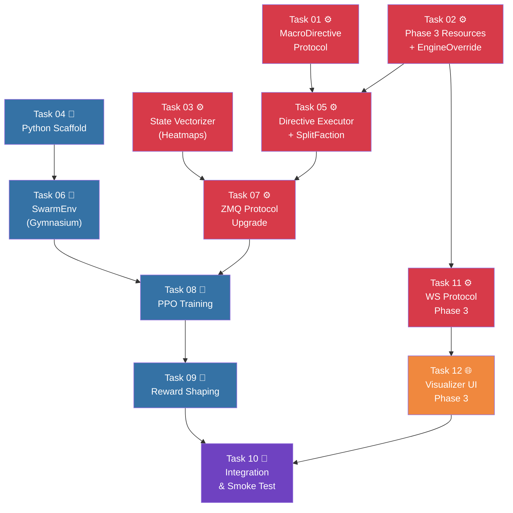

# AGENT ROLE: EXECUTION SPECIALIST

You are an **Execution Specialist** in a multi-agent DAG workflow.
You have been assigned ONE specific task. You implement it with surgical precision.

---

## Your Assignment

| Field   | Value |
|---------|-------|
| Task ID | `task_09_reward_shaping` |
| Feature | Phase 3: Multi-Master Arbitration & RL Training |
| Tier    | standard |

---

## ⛔ MANDATORY PROCESS — ALL TIERS (DO NOT SKIP)

> **These rules apply to EVERY executor, regardless of tier. Violating them
> causes an automatic QA FAIL and project BLOCK.**

### Rule 1: Scope Isolation
- You may ONLY create or modify files listed in `Target_Files` in your Task Brief.
- If a file must be changed but is NOT in `Target_Files`, **STOP and report the gap** — do NOT modify it.
- NEVER edit `task_state.json`, `implementation_plan.md`, or any file outside your scope.

### Rule 2: Changelog (Handoff Documentation)
After ALL code is written and BEFORE calling `./task_tool.sh done`, you MUST:

1. **Create** `tasks_pending/task_09_reward_shaping_changelog.md`
2. **Include in the changelog:**
   - **Touched Files:** A bulleted list of every file you created or modified.
   - **Contract Fulfillment:** Brief confirmation of the interfaces/DTOs you implemented.
   - **Deviations/Notes:** Any edge cases you handled or deviations from the brief the QA agent should verify.
3. **Then and only then** run:
   ```bash
   ./task_tool.sh done task_09_reward_shaping
   ```

> **⚠️ Calling `./task_tool.sh done` without creating the changelog file is FORBIDDEN.**

### Rule 3: No Placeholders
- Do not use `// TODO`, `/* FIXME */`, or stub implementations.
- Output fully functional, production-ready code.

### Rule 4: Human Intervention Protocol
During execution, a human may intercept your work and propose changes, provide code snippets, or redirect your approach. When this happens:

1. **ADOPT the concept, VERIFY the details.** Humans are exceptional at architectural vision but make detail mistakes (wrong API, typos, outdated syntax). Independently verify all human-provided code against the actual framework version and project contracts.
2. **TRACK every human intervention in the changelog.** Add a dedicated `## Human Interventions` section to your changelog documenting:
   - What the human proposed (1-2 sentence summary)
   - What you adopted vs. what you corrected
   - Any deviations from the original task brief caused by the intervention
3. **DO NOT silently incorporate changes.** The QA agent and Architect must be able to trace exactly what came from the spec vs. what came from a human mid-flight. Untracked changes are invisible to the verification pipeline.

---

## Context Loading (Tier-Dependent)

**If your tier is `basic`:**
- Skip all external file reading. Your Task Brief below IS your complete instruction.
- Implement the code exactly as specified in the Task Brief.
- Follow the MANDATORY PROCESS rules above (changelog + scope), then halt.

**If your tier is `standard` or `advanced`:**
1. Read `.agents/context.md` — Thin index pointing to context sub-files
2. Load ONLY the `context/*` sub-files listed in your `Context_Bindings` below
3. Scan `.agents/knowledge/` — Lessons from previous sessions relevant to your task
4. Read `.agents/workflows/execution-lifecycle.md` — Your 4-step execution loop
5. Read `.agents/rules/execution-boundary.md` — Scope and contract constraints

- `implementation_plan_feature_3.md` → Task 09 section (FULL — includes P5 patch)` _(not found — verify path)_
- `skills/rl_env_safety_patterns.md` _(not found — verify path)_

---

## Task Brief

# Task 09: Reward Shaping & Curriculum

**Task_ID:** `task_09_reward_shaping`
**Execution_Phase:** 5
**Model_Tier:** `advanced`
**Target_Files:**
  - `macro-brain/src/env/rewards.py` (NEW)
  - `macro-brain/src/env/swarm_env.py` (MODIFY — wire `_compute_reward`)
  - `macro-brain/tests/test_rewards.py` (NEW)
**Dependencies:** Task 08 (training loop)
**Context_Bindings:**
  - `implementation_plan_feature_3.md` → Task 09 section (FULL — includes P5 patch)
  - `skills/rl_env_safety_patterns.md`

## Strict Instructions

See `implementation_plan_feature_3.md` → **Task 09: Reward Shaping** for full instructions.

**Summary:**
1. Create `rewards.py` with `flanking_bonus()` and `compute_shaped_reward()`
2. Wire `_compute_reward` in `swarm_env.py` to call `compute_shaped_reward`
3. 5 reward components: survival, kill, territory, health, flanking (weighted)

## CRITICAL: Pacifist Flank Exploit Fix (P5)
- Distance cutoff: sub-faction must be within `max_engage_radius` of enemy
- Distance attenuation: bonus decays linearly with distance
- Without this, RL agent parks sub-faction at map corner for free points

## Verification_Strategy
```
Test_Type: unit
Test_Stack: pytest (Python)
Acceptance_Criteria:
  - P5: Distant sub-faction returns 0.0 flanking bonus
  - P5: Genuine close-range flank returns > 0.0
  - P5: Distance attenuation is monotonically decreasing
  - P5: No sub-faction density → 0.0 bonus
  - Shaped reward combines all 5 components correctly
Suggested_Test_Commands:
  - "cd macro-brain && python -m pytest tests/test_rewards.py -v"
```

---

## Shared Contracts

# Phase 3: Macro-Brain & RL Training — The Multi-Master Arbitration Architecture

> **Phase:** 3 of 5 | **Depends on:** Phase 2 (Complete)
> **TDD Reference:** Section 3 + Case Study: ML Communication Protocol (Q&A)

---

## Problem Statement

Phase 2 delivered a fully functional simulation with terrain, fog of war, flow fields, and combat. But the simulation currently runs on **static rules** — no learning, no adaptation. Phase 3 introduces the **Macro-Brain**: a Python RL agent (PPO via SB3) that observes the simulation via spatial heatmaps and issues macro-level strategic directives to control swarm behavior.

The central design challenge is the **Multi-Master Arbitration Problem**: when multiple authority sources (Game Engine, ML Brain, Physics Core) attempt to control the same entities simultaneously, who wins?

The deeper challenge (from the case study question) is the **ID-blind Swarm Splitting Paradox**: how can the ML brain command "100 flank left, 50 flank right" when it never sees individual Entity IDs? The answer lies in three complementary strategies:

1. **Pheromone Gravity Wells** (fuzzy splitting via flow field attractors)
2. **Dynamic Sub-Faction Tagging** (precise splitting via `SplitFaction`)
3. **Boids Self-Organizing Flanking** (emergent behavior from separation physics)

The RL agent must learn **when to use which strategy** — this IS the Phase 3 training objective.

## Core Design Principles

### 1. Subsumption Architecture (Three-Tier Authority)

| Tier | Authority | Scope | Examples |
|------|-----------|-------|----------|
| **Tier 1: Engine** | Absolute Override | Micro (specific Entity IDs) | Cutscenes, player abilities, scripted events |
| **Tier 2: ML Brain** | Strategic Control | Macro (factions, rulesets, flow fields) | Navigation targets, aggro masks, faction splits |
| **Tier 3: Rust Core** | Autonomic Execution | Universal (all entities) | Boids, flow field following, collision, damage |

### 2. ID-Blind Macromanagement

ML Brain **never** touches Entity IDs. It controls:
- **Where** entities go → `UpdateNavigation`, `SetZoneModifier`
- **Which group** goes → `SplitFaction`, `MergeFaction`
- **Who fights whom** → `SetAggroMask`
- **How fast** they move → `TriggerFrenzy`

Rust Core translates these macro-commands into per-entity behavior.

### 3. Data Isolation via Disjoint ECS Queries

The `EngineOverride` component pattern uses Bevy's `Without<T>` / `With<T>` filters to create **zero-cost branching**.

### 4. Tensor-Friendly Observation Space

10,000+ entities compressed into spatial heatmaps (density grids per faction). Sub-factions get their own density channel.

### 5. MDP Safety via Intervention Flags

Engine overrides trigger `intervention_active: true` → Python masks reward for that step.

### 6. Data Isolation: Physics vs NN Concerns

Rust exports **raw** density data (`HashMap<u32, Vec<f32>>`). Python packs it into fixed NN channels. Channel count, packing order, and tensor reshaping are NN architecture decisions — never embedded in the simulation core.

---

## Safety Invariants (v3 Patches)

> [!CAUTION]
> **Eight** critical vulnerabilities were identified during architectural review (4 Rust, 4 Python). All patches are **mandatory** and have corresponding regression tests.

### Rust Core (P1–P4)

| # | Vulnerability | Severity | Fix | Regression Test |
|---|--------------|----------|-----|----------------|
| **P1** | **Vaporization Bug** — `ref` reads directive without consuming; SplitFaction fires 60×/sec | 🔴 Critical | `latest.directive.take()` — consume once | `test_vaporization_guard_*` |
| **P2** | **Moses Effect** — negative cost_modifier on wall tile makes it traversable | 🔴 Critical | `if cost == u16::MAX { continue; }` before overlay | `test_moses_effect_*` |
| **P3** | **Ghost State Leakage** — MergeFaction doesn't purge zones/buffs/aggro | 🟠 High | Deep cleanup of ALL registries | `test_ghost_state_*` |
| **P4** | **f32 Sort Panic** — `f32` doesn't impl `Ord`, full sort is O(N log N) | 🔴 Critical | `select_nth_unstable_by` with `partial_cmp` — O(N) | `test_split_faction_quickselect_*` |

See [Feature 1 (v3)](./implementation_plan_feature_1.md) for full Rust patch details and code.

### Python RL (P5–P8)

| # | Vulnerability | Severity | Fix | Regression Test |
|---|--------------|----------|-----|----------------|
| **P5** | **Pacifist Flank Exploit** — sub-faction runs to map corner, earns infinite flanking reward | 🔴 Critical | Distance cutoff + attenuation in `flanking_bonus` | `test_patch5_pacifist_flank_*` |
| **P6** | **Static Epicenter** — hardcoded split point misses swarm → agent learns "split is useless" | 🟠 High | Dynamic epicenter from density centroid | `test_patch6_dynamic_epicenter_*` |
| **P7** | **Sub-Faction Desync** — Python tracks ghost IDs locally, diverges from Rust truth | 🟠 High | Read `active_sub_factions` from Rust snapshot | `test_patch7_sub_factions_*` |
| **P8** | **ZMQ Deadlock + MDP Pollution** — timeout crashes SB3; interventions poison value estimates | 🔴 Critical | Timeout → truncate episode; Tick swallowing loop (recv→send ordering) | `test_patch8_*` |

See [Feature 3 (v3)](./implementation_plan_feature_3.md) for full Python patch details and code.

### Knowledge Base

See [ecs_safety_patterns.md](file:///Users/manifera/Documents/Study/mass-swarm-ai-simulator/.agents/skills/rust-code-standards/ecs_safety_patterns.md) for permanent Rust knowledge base entry.

---

## User Review Required

> [!IMPORTANT]
> **Full Vocabulary from Day 1:** The plan includes the **complete 8-action** `MacroDirective` vocabulary with `SplitFaction`, `MergeFaction`, and `SetAggroMask` for the Flanking Playbook.

> [!IMPORTANT]
> **DAG Restructured: Debug Visualizer First (v5).** Feature 5 (T11 + T12) has been moved from Phase 3–4 to **Phase 1** so that every subsequent task has visual debugging tools available. This is achieved by expanding T02 to define ALL Phase 3 resource types (data-only structs) alongside `EngineOverride`. T05 still implements the logic (systems) that operates on those resources. No circular dependencies introduced.

---

## Proposed Changes

### DAG Execution Phases (v5 — Visualizer First)

> [!TIP]
> **Key Change:** T02 is expanded to "Phase 3 Resource Scaffolding" — defines ALL resource structs (`ActiveZoneModifiers`, `AggroMaskRegistry`, `LatestDirective`, etc.) as data-only types. This unblocks T11 (WS backend) to run in Phase 1, giving developers visual debugging tools before any core logic is implemented.



| Phase | Tasks | Parallelism | Rationale |
|-------|-------|-------------|----------|
| **Phase 1** | T01, T02, T03, T04, T11, T12 | All parallel (T02→T11→T12 chain, rest independent) | Debug tools ready before logic |
| **Phase 2** | T05, T06 | Parallel (Rust / Python) | Core executor needs T01+T02 resource types |
| **Phase 3** | T07 | Sequential | Bridges Rust↔Python, needs T03+T05 |
| **Phase 4** | T08 | Sequential | PPO needs env (T06) + protocol (T07) |
| **Phase 5** | T09, T10 | Sequential | Reward tuning, then end-to-end smoke test |

> **Phase count reduced from 6 → 5** because T11/T12 now run in Phase 1.

---

## Feature Details

- [Feature 1: Rust Input Contracts & Override System](./implementation_plan_feature_1.md) — Tasks 01, 02, 05
- [Feature 2: State Vectorization & ZMQ Protocol Upgrade](./implementation_plan_feature_2.md) — Tasks 03, 07
- [Feature 3: Python Gymnasium Environment & Training](./implementation_plan_feature_3.md) — Tasks 04, 06, 08, 09
- [Feature 4: Integration & Smoke Test](./implementation_plan_feature_4.md) — Task 10
- [Feature 5: Debug Visualizer — Phase 3 Observability](./implementation_plan_feature_5.md) — Tasks 11, 12


---

## Shared Contracts (Cross-Feature)

### Contract 1: `MacroDirective` Enum — Full Vocabulary (Rust ↔ Python)

The complete macro-level action vocabulary, enabling all three swarm-splitting strategies:

```rust
// micro-core/src/bridges/zmq_protocol.rs

#[derive(Serialize, Deserialize, Debug, Clone, PartialEq)]
#[serde(tag = "directive")]
pub enum MacroDirective {
    // ── Strategy Selection ──

    /// Action 0: Maintain current behavior (no-op)
    Hold,

    // ── Navigation Control ──

    /// Action 1: Redirect a faction's flow field
    UpdateNavigation {
        follower_faction: u32,
        target: NavigationTarget,
    },

    /// Action 2: Temporary speed boost for a faction
    TriggerFrenzy {
        faction: u32,
        speed_multiplier: f32,
        duration_ticks: u32,
    },

    /// Action 3: Pull faction toward a coordinate (retreat waypoint)
    Retreat {
        faction: u32,
        retreat_x: f32,
        retreat_y: f32,
    },

    // ── Spatial Control (Strategy 1: Pheromone Gravity Wells) ──

    /// Action 4: Create/modify a flow field cost zone
    /// Positive cost_modifier = repel (entities avoid this zone)
    /// Negative cost_modifier = attract (entities drawn to this zone)
    SetZoneModifier {
        target_faction: u32,
        x: f32,
        y: f32,
        radius: f32,
        cost_modifier: f32,
    },

    // ── Formation Control (Strategy 2: Sub-Faction Tagging) ──

    /// Action 5: Split a percentage of a faction into a new sub-faction
    /// Rust selects entities nearest to `epicenter` first
    SplitFaction {
        source_faction: u32,
        new_sub_faction: u32,
        percentage: f32,        // 0.0 to 1.0
        epicenter: [f32; 2],    // Spatial selection bias
    },

    /// Action 6: Merge a sub-faction back into its parent
    MergeFaction {
        source_faction: u32,
        target_faction: u32,
    },

    // ── Combat Control ──

    /// Action 7: Toggle combat between two factions
    /// "The Blinders" — lets a flanking unit pass through the frontline
    SetAggroMask {
        source_faction: u32,
        target_faction: u32,
        allow_combat: bool,
    },
}

/// Navigation target: dynamic (chase a faction) or static (go to a point)
#[derive(Serialize, Deserialize, Debug, Clone, PartialEq)]
#[serde(tag = "type")]
pub enum NavigationTarget {
    Faction { faction_id: u32 },
    Waypoint { x: f32, y: f32 },
}
```

### Contract 2: `EngineOverride` Component (unchanged)

```rust
#[derive(Component, Debug, Clone)]
pub struct EngineOverride {
    pub forced_velocity: Vec2,
    pub ticks_remaining: Option<u32>,
}
```

### Contract 3: Enhanced State Snapshot (Rust → Python)

```rust
pub struct StateSnapshot {
    // ... existing fields ...

    /// Spatial density heatmap per faction (including sub-factions).
    /// Key = faction_id, Value = flat Vec<f32> of size (grid_w × grid_h).
    /// Values normalized to [0.0, 1.0].
    pub density_maps: HashMap<u32, Vec<f32>>,

    /// True if any Tier 1 (Engine) override is active this tick.
    pub intervention_active: bool,

    /// Active zone modifiers for observation feedback
    pub active_zones: Vec<ZoneModifierSnapshot>,

    /// List of currently active sub-factions (created by SplitFaction)
    pub active_sub_factions: Vec<u32>,

    /// Current aggro mask state per faction pair
    pub aggro_masks: HashMap<String, bool>,  // "0_1" → true/false
}

pub struct ZoneModifierSnapshot {
    pub target_faction: u32,
    pub x: f32,
    pub y: f32,
    pub radius: f32,
    pub cost_modifier: f32,
    pub ticks_remaining: u32,
}
```

### Contract 4: Python Observation & Action Spaces

```python
# Observation: Dict space
observation_space = Dict({
    # Density heatmap — 4 channels (faction 0, 1, sub-faction slot 0, sub-faction slot 1)
    "density_ch0": Box(low=0.0, high=1.0, shape=(50, 50), dtype=np.float32),
    "density_ch1": Box(low=0.0, high=1.0, shape=(50, 50), dtype=np.float32),
    "density_ch2": Box(low=0.0, high=1.0, shape=(50, 50), dtype=np.float32),
    "density_ch3": Box(low=0.0, high=1.0, shape=(50, 50), dtype=np.float32),
    # Terrain hard cost map — 50×50
    "terrain": Box(low=0.0, high=1.0, shape=(50, 50), dtype=np.float32),
    # Summary: [own_count, enemy_count, own_avg_health, enemy_avg_health,
    #           sub_faction_count, active_zones_count]
    "summary": Box(low=0.0, high=1.0, shape=(6,), dtype=np.float32),
})

# Action: Discrete(8) — maps to MacroDirective enum
# 0=Hold, 1=UpdateNav(→enemy), 2=TriggerFrenzy, 3=Retreat(→spawn),
# 4=SetZoneModifier(center, attract), 5=SplitFaction(30%, →nearest cluster),
# 6=MergeFaction(sub→parent), 7=SetAggroMask(toggle)
action_space = Discrete(8)
```

### Contract 5: ZMQ Message Flow

```
Rust → Python (REQ):
{
  "type": "state_snapshot",
  "tick": 1234,
  "density_maps": { "0": [...], "1": [...], "101": [...] },
  "terrain_hard": [...],
  "summary": { "faction_counts": {0: 3500, 1: 200, 101: 1500}, ... },
  "intervention_active": false,
  "active_zones": [{ "target_faction": 0, "x": 500, "y": 500, "radius": 100, "cost_modifier": -50, "ticks_remaining": 60 }],
  "active_sub_factions": [101],
  "aggro_masks": { "101_1": false }
}

Python → Rust (REP):
{
  "type": "macro_directive",
  "directive": "SplitFaction",
  "source_faction": 0,
  "new_sub_faction": 101,
  "percentage": 0.3,
  "epicenter": [700.0, 200.0]
}
```

---

## File Summary

| Task | File | Action | Domain |
|------|------|--------|--------|
| T01 | `micro-core/src/bridges/zmq_protocol.rs` | MODIFY | Rust |
| T02 | `micro-core/src/components/engine_override.rs` | NEW | Rust |
| T02 | `micro-core/src/components/mod.rs` | MODIFY | Rust |
| T03 | `micro-core/src/systems/state_vectorizer.rs` | NEW | Rust |
| T03 | `micro-core/src/systems/mod.rs` | MODIFY | Rust |
| T04 | `macro-brain/requirements.txt` | MODIFY | Python |
| T04 | `macro-brain/src/env/__init__.py` | NEW | Python |
| T04 | `macro-brain/src/env/spaces.py` | NEW | Python |
| T04 | `macro-brain/src/utils/__init__.py` | NEW | Python |
| T04 | `macro-brain/src/utils/vectorizer.py` | NEW | Python |
| T04 | `macro-brain/src/training/__init__.py` | NEW | Python |
| T05 | `micro-core/src/systems/directive_executor.rs` | NEW | Rust |
| T05 | `micro-core/src/systems/engine_override.rs` | NEW | Rust |
| T05 | `micro-core/src/systems/mod.rs` | MODIFY | Rust |
| T05 | `micro-core/src/systems/movement.rs` | MODIFY | Rust |
| T05 | `micro-core/src/config.rs` | MODIFY | Rust |
| T05 | `micro-core/src/rules/interaction.rs` | MODIFY | Rust |
| T05 | `micro-core/src/rules/navigation.rs` | MODIFY | Rust |
| T06 | `macro-brain/src/env/swarm_env.py` | NEW | Python |
| T07 | `micro-core/src/bridges/zmq_bridge/systems.rs` | MODIFY | Rust |
| T07 | `micro-core/src/bridges/zmq_protocol.rs` | MODIFY | Rust |
| T07 | `micro-core/src/bridges/zmq_bridge/mod.rs` | MODIFY | Rust |
| T07 | `micro-core/src/systems/flow_field_update.rs` | MODIFY | Rust |
| T08 | `macro-brain/src/training/train.py` | NEW | Python |
| T08 | `macro-brain/src/training/callbacks.py` | NEW | Python |
| T09 | `macro-brain/src/env/rewards.py` | NEW | Python |
| T10 | `micro-core/src/main.rs` | MODIFY | Rust |
| T11 | `micro-core/src/bridges/ws_protocol.rs` | MODIFY | Rust |
| T11 | `micro-core/src/systems/ws_sync.rs` | MODIFY | Rust |
| T11 | `micro-core/src/systems/ws_command.rs` | MODIFY | Rust |
| T12 | `debug-visualizer/index.html` | MODIFY | HTML |
| T12 | `debug-visualizer/style.css` | MODIFY | CSS |
| T12 | `debug-visualizer/visualizer.js` | MODIFY | JS |

---

## Resolved Design Decisions

| # | Question | Decision | Rationale | Phase 4 Upgrade |
|---|---------|----------|-----------|----------------|
| **Q1** | SB3 vs RLlib? | **SB3 (PPO)** | Single-machine, simpler API, `MultiInputPolicy` supports Dict obs natively. ~2 steps/sec is acceptable for Phase 3 prototyping. | RLlib for distributed multi-env training |
| **Q2** | Heatmap grid size? | **50×50** | Matches `TerrainGrid` dimensions (50×50 cells at 20px). 2,500 cells × 4 bytes = 10 KB/channel — well within ZMQ real-time budget. | Experiment with 100×100 |
| **Q3** | Fixed vs dynamic density channels? | **Fixed 4-channel** | Standard CNNs need fixed input dims. Ch0=own, Ch1=enemy, Ch2-3=sub-faction slots. Python vectorizer packs dynamically (Data Isolation principle). | Attention-based encoder for N-faction |
| **Q4** | AI evaluation frequency? | **2 Hz (every 30 ticks)** | Macro strategy doesn't need per-frame decisions. Matches flow field update rate. Lower freq = less ZMQ overhead = faster training. | Experiment with 5 Hz |
| **Q5** | Discrete(8) vs parameterized actions? | **Discrete(8) with preset templates** | Simpler exploration, each action equally likely. Dynamic epicenter (P6 fix) already makes `SplitFaction` context-aware via density centroid. | Hybrid continuous/discrete action space |

---

## Verification Plan

### Automated Tests

**Rust Side:**
```bash
cd micro-core && cargo test
cd micro-core && cargo clippy -- -D warnings
```

Expected new tests:
- `MacroDirective` serde roundtrip (all 8 variants)
- `NavigationTarget` serde roundtrip (Faction + Waypoint)
- `EngineOverride` lifecycle (insert, countdown, auto-remove)
- State vectorizer: density heatmap, summary stats (NO channel packing in Rust)
- Directive executor: all 8 directives handled correctly
- `SplitFaction`: correct percentage of entities reassigned by `epicenter` proximity
- `MergeFaction`: entities return to parent faction + deep cleanup verified
- `SetAggroMask`: interaction system respects aggro mask
- `SetZoneModifier`: flow field cost map modified within radius
- Engine override system: tick countdown, auto-removal, velocity forcing
- Movement system: `Without<EngineOverride>` filter, speed buff application

**Mandatory Patch Regression Tests (8):**
- `test_vaporization_guard_directive_consumed_once` — SplitFaction executes once, not 60×/sec
- `test_vaporization_guard_latest_is_none_after_execution` — directive is None after system runs
- `test_moses_effect_wall_remains_impassable` — u16::MAX tiles immune to zone modifiers
- `test_moses_effect_non_wall_reduced_by_modifier` — normal tiles correctly modified
- `test_ghost_state_merge_cleans_zones` — MergeFaction purges zone modifiers
- `test_ghost_state_merge_cleans_speed_buffs` — MergeFaction purges speed buffs
- `test_ghost_state_merge_cleans_aggro_masks` — MergeFaction purges aggro masks
- `test_split_faction_quickselect_correct_count` — O(N) selection, f32-safe

**Python Side:**
```bash
cd macro-brain && python -m pytest tests/ -v
```

Expected new tests:
- Vectorizer: JSON snapshot → numpy 4-channel tensor conversion (packing done in Python)
- Space definitions: observation/action space shapes
- Action-to-directive mapping for all 8 actions
- Reward components: survival, kill, territory, health, flanking bonus
- Intervention flag → reward masking
- SwarmEnv: offline mocked tests for all action types

### End-to-End Smoke Test

1. Start Rust core: `cd micro-core && cargo run`
2. Start training: `cd macro-brain && python -m src.training.train --timesteps 5000`
3. Verify: reward curve non-zero, entities respond to directives
4. SplitFaction test: observe sub-faction entities split on Debug Visualizer
5. SetAggroMask test: flanking units pass through frontline without fighting
6. Moses Effect test: place wall, apply zone modifier, verify entities don't clip through


---
<!-- Source: implementation_plan_feature_1.md -->

# Feature 1: Rust Input Contracts & Override System (v3 — Patched)

> **Tasks:** 01 (MacroDirective Protocol), 02 (EngineOverride Component), 05 (Directive Executor System)
> **Domain:** Rust / Bevy ECS
> **v3 Patches:** Vaporization Bug, Moses Effect, Ghost State Leakage, f32 Sort Panic

---

## Task 01: MacroDirective Protocol

**Task_ID:** `task_01_macro_directive_protocol`
**Execution_Phase:** 1 (parallel)
**Model_Tier:** `standard`
**Target_Files:** `micro-core/src/bridges/zmq_protocol.rs`
**Dependencies:** None
**Context_Bindings:**
  - `context/ipc-protocol`
  - `context/conventions`
  - `skills/rust-code-standards`

### Strict Instructions

1. Open `micro-core/src/bridges/zmq_protocol.rs`

2. Add the `NavigationTarget` enum:

```rust
/// Navigation target: dynamic (chase a faction) or static (go to a point).
#[derive(Serialize, Deserialize, Debug, Clone, PartialEq)]
#[serde(tag = "type")]
pub enum NavigationTarget {
    Faction { faction_id: u32 },
    Waypoint { x: f32, y: f32 },
}
```

3. Add the full `MacroDirective` enum (after existing `MacroAction` struct):

```rust
/// Macro-level strategic directives from ML Brain → Rust Core.
/// 8-action vocabulary enabling all three swarm-splitting strategies:
/// - Pheromone Gravity Wells (SetZoneModifier)
/// - Dynamic Sub-Faction Tagging (SplitFaction/MergeFaction)
/// - Boids Self-Organizing Flanking (emergent, no directive needed)
#[derive(Serialize, Deserialize, Debug, Clone, PartialEq)]
#[serde(tag = "directive")]
pub enum MacroDirective {
    Hold,

    UpdateNavigation {
        follower_faction: u32,
        target: NavigationTarget,
    },

    TriggerFrenzy {
        faction: u32,
        speed_multiplier: f32,
        duration_ticks: u32,
    },

    Retreat {
        faction: u32,
        retreat_x: f32,
        retreat_y: f32,
    },

    /// Positive cost_modifier = repel, Negative = attract
    SetZoneModifier {
        target_faction: u32,
        x: f32,
        y: f32,
        radius: f32,
        cost_modifier: f32,
    },

    /// Rust selects entities nearest to epicenter first (Quickselect O(N))
    SplitFaction {
        source_faction: u32,
        new_sub_faction: u32,
        percentage: f32,
        epicenter: [f32; 2],
    },

    MergeFaction {
        source_faction: u32,
        target_faction: u32,
    },

    SetAggroMask {
        source_faction: u32,
        target_faction: u32,
        allow_combat: bool,
    },
}
```

4. Add `ZoneModifierSnapshot`:

```rust
#[derive(Serialize, Deserialize, Debug, Clone, PartialEq)]
pub struct ZoneModifierSnapshot {
    pub target_faction: u32,
    pub x: f32,
    pub y: f32,
    pub radius: f32,
    pub cost_modifier: f32,
    pub ticks_remaining: u32,
}
```

5. Extend `StateSnapshot` (all with `#[serde(default)]`):
   - `pub density_maps: std::collections::HashMap<u32, Vec<f32>>`
   - `pub intervention_active: bool`
   - `pub active_zones: Vec<ZoneModifierSnapshot>`
   - `pub active_sub_factions: Vec<u32>`
   - `pub aggro_masks: std::collections::HashMap<String, bool>`

6. Unit tests for all 8 variants + `NavigationTarget` (12 tests total).

> **Anti-pattern:** Do NOT remove existing `MacroAction`. Task 07 handles migration.

### Verification_Strategy
```
Test_Type: unit
Test_Stack: cargo test (Rust)
Acceptance_Criteria:
  - All 8 MacroDirective variants serde roundtrip correctly
  - NavigationTarget both variants roundtrip correctly
  - JSON uses "directive" tag key, NavigationTarget uses "type" tag key
  - Existing MacroAction tests still pass
Suggested_Test_Commands:
  - "cd micro-core && cargo test zmq_protocol"
```

---

## Task 02: Phase 3 Resource Scaffolding + EngineOverride

**Task_ID:** `task_02_phase3_resources`
**Execution_Phase:** 1 (parallel)
**Model_Tier:** `basic`
**Target_Files:**
  - `micro-core/src/components/engine_override.rs` (NEW)
  - `micro-core/src/components/mod.rs` (MODIFY)
  - `micro-core/src/config.rs` (MODIFY)
  - `micro-core/src/systems/directive_executor.rs` (NEW — resource type only)
**Dependencies:** None
**Context_Bindings:**
  - `context/conventions`
  - `skills/rust-code-standards`

> [!TIP]
> **Why expand T02?** By defining ALL Phase 3 resource types here (data-only structs, no logic),
> T11 (WS Protocol) can also run in Phase 1. This gives us debug visualizer tools
> before any core AI logic is implemented.

### Strict Instructions

#### 1. EngineOverride Component (`components/engine_override.rs`)

```rust
#[derive(Component, Debug, Clone)]
pub struct EngineOverride {
    pub forced_velocity: Vec2,
    pub ticks_remaining: Option<u32>,
}
```

#### 2. Phase 3 Resources (`config.rs`)

Add these data-only resource types. **NO system logic** — systems are in T05.

```rust
/// Active zone modifiers (flow field cost overlays).
#[derive(Resource, Debug, Default)]
pub struct ActiveZoneModifiers {
    pub zones: Vec<ZoneModifier>,
}

#[derive(Debug, Clone)]
pub struct ZoneModifier {
    pub target_faction: u32,
    pub x: f32,
    pub y: f32,
    pub radius: f32,
    pub cost_modifier: f32,
    pub ticks_remaining: u32,
}

/// Tracks active Tier 1 overrides for intervention flag.
#[derive(Resource, Debug, Default)]
pub struct InterventionTracker {
    pub active: bool,
}

/// Per-faction speed buffs.
#[derive(Resource, Debug, Default)]
pub struct FactionSpeedBuffs {
    pub buffs: std::collections::HashMap<u32, (f32, u32)>,
}

/// Aggro mask: controls which faction pairs can fight.
/// Missing entry = combat allowed (default true).
#[derive(Resource, Debug, Default)]
pub struct AggroMaskRegistry {
    pub masks: std::collections::HashMap<(u32, u32), bool>,
}

impl AggroMaskRegistry {
    /// Missing entry = true (combat allowed by default).
    pub fn is_combat_allowed(&self, source: u32, target: u32) -> bool {
        *self.masks.get(&(source, target)).unwrap_or(&true)
    }
}

/// Tracks currently active sub-factions.
#[derive(Resource, Debug, Default)]
pub struct ActiveSubFactions {
    pub factions: Vec<u32>,
}
```

#### 3. LatestDirective Resource (`systems/directive_executor.rs`)

Create the file with ONLY the resource type. The system function is added by T05.

```rust
//! # Directive Executor (Resource scaffold)
//!
//! This file contains the LatestDirective resource type.
//! The directive_executor_system function is added by Task 05.

use bevy::prelude::*;
use crate::bridges::zmq_protocol::MacroDirective;

/// Holds the most recently received MacroDirective.
/// Set by ai_poll_system (T07), consumed by directive_executor_system (T05).
#[derive(Resource, Debug, Default)]
pub struct LatestDirective {
    pub directive: Option<MacroDirective>,
}
```

> **Note:** T05 appends to this file, adding the system and tick functions.
> T11 reads `LatestDirective` to show last directive in the debug visualizer.

#### 4. Register resources in `main.rs` during `app.build()`

All resources are registered with `init_resource::<T>()` so they exist from startup.

### Unit Tests

1. `test_engine_override_default_no_ticks`
2. `test_aggro_mask_default_allows_combat`
3. `test_aggro_mask_explicit_deny`
4. `test_zone_modifier_fields`
5. `test_all_resources_impl_default`

---

## Task 05: Directive Executor & Engine Override Systems (Patched)

**Task_ID:** `task_05_directive_executor_system`
**Execution_Phase:** 2
**Model_Tier:** `advanced`
**Target_Files:**
  - `micro-core/src/systems/directive_executor.rs` (NEW)
  - `micro-core/src/systems/engine_override.rs` (NEW)
  - `micro-core/src/systems/mod.rs` (MODIFY)
  - `micro-core/src/systems/movement.rs` (MODIFY)
  - `micro-core/src/config.rs` (MODIFY)
  - `micro-core/src/rules/interaction.rs` (MODIFY)
  - `micro-core/src/rules/navigation.rs` (MODIFY)
**Dependencies:** Task 01 (MacroDirective), Task 02 (EngineOverride)
**Context_Bindings:**
  - `context/architecture`
  - `context/conventions`
  - `context/ipc-protocol`
  - `skills/rust-code-standards`

> [!CAUTION]
> ## Critical Vulnerability Patches (v3)
> This task contains four architectural safety patches identified during review.
> **All four MUST be implemented as specified. Deviations will produce runtime panics or simulation corruption.**

### Resources (Defined in T02 — `config.rs`)

> [!NOTE]
> All resource structs (`ActiveZoneModifiers`, `AggroMaskRegistry`, `FactionSpeedBuffs`,
> `InterventionTracker`, `ActiveSubFactions`) are defined in **Task 02** (`config.rs`).
> `LatestDirective` is defined in **Task 02** (`systems/directive_executor.rs`).
> This task only adds the **system functions** that operate on them.

### Directive Executor System (`directive_executor.rs`)

```rust
//! # Directive Executor System
//!
//! Consumes the latest MacroDirective and applies ECS mutations.
//!
//! ## SAFETY INVARIANTS (v3 Patches)
//! 1. VAPORIZATION GUARD: directive.take() — consume once, never re-execute
//! 2. GHOST STATE CLEANUP: MergeFaction purges ALL registry entries for dissolved faction
//! 3. QUICKSELECT: SplitFaction uses select_nth_unstable_by (O(N), f32-safe)

use bevy::prelude::*;
use crate::bridges::zmq_protocol::{MacroDirective, NavigationTarget};
use crate::rules::{NavigationRuleSet, NavigationRule};
use crate::config::{ActiveZoneModifiers, ZoneModifier, FactionSpeedBuffs, AggroMaskRegistry, ActiveSubFactions};
use crate::components::{Position, FactionId};

/// Holds the most recently received MacroDirective.
/// Set by ai_poll_system, consumed by directive_executor_system.
#[derive(Resource, Debug, Default)]
pub struct LatestDirective {
    pub directive: Option<MacroDirective>,
}

/// Applies the latest MacroDirective to the ECS world.
///
/// ## PATCH 1: Vaporization Guard
/// Uses `latest.directive.take()` to consume the directive. Without this,
/// the system re-executes the same directive at 60Hz — SplitFaction 30%
/// would vaporize the entire army in <1 second (30% of 30% of 30%...).
pub fn directive_executor_system(
    mut latest: ResMut<LatestDirective>,    // ← ResMut, NOT Res
    mut nav_rules: ResMut<NavigationRuleSet>,
    mut speed_buffs: ResMut<FactionSpeedBuffs>,
    mut zones: ResMut<ActiveZoneModifiers>,
    mut aggro: ResMut<AggroMaskRegistry>,
    mut sub_factions: ResMut<ActiveSubFactions>,
    mut faction_query: Query<(Entity, &Position, &mut FactionId)>,
) {
    // ══════════════════════════════════════════════════════════════
    // PATCH 1: VAPORIZATION GUARD
    // take() consumes the Option, replacing it with None.
    // The directive executes EXACTLY ONCE, then is gone.
    // ══════════════════════════════════════════════════════════════
    let Some(directive) = latest.directive.take() else { return; };

    match directive {
        MacroDirective::Hold => { /* no-op */ },

        MacroDirective::UpdateNavigation { follower_faction, target } => {
            if let Some(rule) = nav_rules.rules.iter_mut()
                .find(|r| r.follower_faction == follower_faction)
            {
                rule.target = target;
            } else {
                nav_rules.rules.push(NavigationRule {
                    follower_faction,
                    target,
                });
            }
        },

        MacroDirective::TriggerFrenzy { faction, speed_multiplier, duration_ticks } => {
            speed_buffs.buffs.insert(faction, (speed_multiplier, duration_ticks));
        },

        MacroDirective::Retreat { faction, retreat_x, retreat_y } => {
            let target = NavigationTarget::Waypoint { x: retreat_x, y: retreat_y };
            if let Some(rule) = nav_rules.rules.iter_mut()
                .find(|r| r.follower_faction == faction)
            {
                rule.target = target;
            } else {
                nav_rules.rules.push(NavigationRule {
                    follower_faction: faction,
                    target,
                });
            }
        },

        MacroDirective::SetZoneModifier { target_faction, x, y, radius, cost_modifier } => {
            zones.zones.push(ZoneModifier {
                target_faction, x, y, radius, cost_modifier,
                ticks_remaining: 120, // ~2 seconds at 60 TPS
            });
        },

        MacroDirective::SplitFaction { source_faction, new_sub_faction, percentage, epicenter } => {
            // ══════════════════════════════════════════════════════════
            // PATCH 4: QUICKSELECT (O(N), f32-safe)
            //
            // Why not .sort()?
            //   1. f32 does NOT implement Ord (NaN violates total ordering).
            //      .sort() won't compile. .sort_by(f32::total_cmp) is O(N log N).
            //   2. We only need the K closest — full sort is wasteful.
            //
            // select_nth_unstable_by partitions in O(N) average:
            //   After the call, candidates[..split_count] contains the
            //   K smallest distances (unordered). Exactly what we need.
            // ══════════════════════════════════════════════════════════
            let epi_vec = Vec2::new(epicenter[0], epicenter[1]);

            // Pass 1: Collect (Entity, dist_squared) for source faction
            let mut candidates: Vec<(Entity, f32)> = faction_query.iter()
                .filter(|(_, _, f)| f.0 == source_faction)
                .map(|(entity, pos, _)| {
                    let dist_sq = Vec2::new(pos.x, pos.y).distance_squared(epi_vec);
                    (entity, dist_sq)
                })
                .collect();

            let split_count = ((candidates.len() as f32) * percentage).round() as usize;
            if split_count == 0 || split_count > candidates.len() { return; }

            // Quickselect: partition so [..split_count] are the K closest
            if split_count < candidates.len() {
                candidates.select_nth_unstable_by(split_count - 1, |a, b| {
                    a.1.partial_cmp(&b.1).unwrap_or(std::cmp::Ordering::Equal)
                });
            }

            // Pass 2: Reassign FactionId for selected entities
            for i in 0..split_count {
                if let Ok((_, _, mut faction)) = faction_query.get_mut(candidates[i].0) {
                    faction.0 = new_sub_faction;
                }
            }

            // Register sub-faction
            if !sub_factions.factions.contains(&new_sub_faction) {
                sub_factions.factions.push(new_sub_faction);
            }
        },

        MacroDirective::MergeFaction { source_faction, target_faction } => {
            // Re-tag all entities
            for (_, _, mut faction) in faction_query.iter_mut() {
                if faction.0 == source_faction {
                    faction.0 = target_faction;
                }
            }

            // ══════════════════════════════════════════════════════════
            // PATCH 3: GHOST STATE CLEANUP
            //
            // Purge ALL registry entries for the dissolved faction.
            // Without this, if Python reuses the same sub-faction ID,
            // the new army inherits stale speed buffs, aggro masks,
            // and zone modifiers — causing RL data divergence.
            // ══════════════════════════════════════════════════════════
            sub_factions.factions.retain(|&f| f != source_faction);
            nav_rules.rules.retain(|r| r.follower_faction != source_faction);
            zones.zones.retain(|z| z.target_faction != source_faction);
            speed_buffs.buffs.remove(&source_faction);
            aggro.masks.retain(|&(s, t), _| s != source_faction && t != source_faction);
        },

        MacroDirective::SetAggroMask { source_faction, target_faction, allow_combat } => {
            // Bidirectional: both directions must be set for symmetric combat rules
            aggro.masks.insert((source_faction, target_faction), allow_combat);
            aggro.masks.insert((target_faction, source_faction), allow_combat);
        },
    }
}
```

### Aggro Mask Integration (`interaction.rs`)

The existing `interaction_system` at line 62-66 already filters by `rule.source_faction`. Add `AggroMaskRegistry` check:

```rust
pub fn interaction_system(
    // ... existing params ...
    aggro: Res<AggroMaskRegistry>,  // NEW parameter
) {
    // ... existing setup ...

    for (source_entity, source_pos, source_faction) in q_ro.iter() {
        for rule in &rules.rules {
            if rule.source_faction != source_faction.0 {
                continue;
            }

            // ═══ NEW: Check aggro mask before processing ═══
            // "The Blinders" — SetAggroMask can disable combat between
            // specific faction pairs (e.g., flanking unit ignores frontline)
            if !aggro.is_combat_allowed(rule.source_faction, rule.target_faction) {
                continue;
            }

            // ... existing neighbor loop unchanged ...
        }
    }
}
```

### NavigationRule Update (`navigation.rs`)

```rust
use crate::bridges::zmq_protocol::NavigationTarget;

#[derive(Debug, Clone, Serialize, Deserialize, PartialEq)]
pub struct NavigationRule {
    pub follower_faction: u32,
    pub target: NavigationTarget,  // replaces target_faction: u32
}

impl Default for NavigationRuleSet {
    fn default() -> Self {
        Self {
            rules: vec![NavigationRule {
                follower_faction: 0,
                target: NavigationTarget::Faction { faction_id: 1 },
            }],
        }
    }
}
```

### Zone Modifier Cost Overlay in `flow_field_update_system`

> [!CAUTION]
> ## PATCH 2: MOSES EFFECT GUARD
> Zone modifier cost overlays MUST skip tiles where `cost == u16::MAX` (impassable walls).
> Without this guard, a negative `cost_modifier` (attraction pheromone) converts walls
> into traversable terrain — entities clip through solid rock.
>
> The existing Dijkstra guard at `flow_field.rs:160` (`if terrain_penalty == u16::MAX { continue; }`)
> operates on the cost_map AFTER overlay. If the overlay already reduced `u16::MAX` to `65035`,
> Dijkstra's guard never fires. The fix MUST be applied at the overlay step.

```rust
// In flow_field_update_system, AFTER copying terrain.hard_costs into a mutable cost_map,
// BEFORE passing cost_map to field.calculate():

for zone in active_zones.zones.iter() {
    if zone.target_faction != follower_faction { continue; }

    let cx = (zone.x / cell_size).floor() as i32;
    let cy = (zone.y / cell_size).floor() as i32;
    let r_cells = (zone.radius / cell_size).ceil() as i32;

    for dy in -r_cells..=r_cells {
        for dx in -r_cells..=r_cells {
            let nx = cx + dx;
            let ny = cy + dy;
            if nx < 0 || nx >= grid_w as i32 || ny < 0 || ny >= grid_h as i32 {
                continue;
            }
            let dist = ((dx * dx + dy * dy) as f32).sqrt() * cell_size;
            if dist > zone.radius { continue; }

            let idx = (ny as u32 * grid_w as u32 + nx as u32) as usize;
            let current_cost = cost_map[idx];

            // ══════════════════════════════════════════════════════
            // PATCH 2: MOSES EFFECT GUARD
            // NEVER modify impassable tiles. A wall is a wall is a wall.
            // Without this, cost_modifier = -500 on a wall tile converts
            // u16::MAX (65535) → 65035, making it traversable.
            // ══════════════════════════════════════════════════════
            if current_cost == u16::MAX { continue; }

            // Clamp upper to u16::MAX - 1 to prevent accidentally
            // creating phantom walls via positive cost_modifier
            let adjusted = (current_cost as f32 + zone.cost_modifier)
                .clamp(1.0, (u16::MAX - 1) as f32);
            cost_map[idx] = adjusted as u16;
        }
    }
}
```

### Engine Override System (`engine_override.rs`)

*(Unchanged from previous version)*

```rust
pub fn engine_override_system(
    mut commands: Commands,
    mut query: Query<(Entity, &mut Velocity, &mut EngineOverride)>,
    mut tracker: ResMut<InterventionTracker>,
) {
    tracker.active = !query.is_empty();
    for (entity, mut vel, mut over) in query.iter_mut() {
        vel.0 = over.forced_velocity;
        if let Some(ref mut ticks) = over.ticks_remaining {
            *ticks = ticks.saturating_sub(1);
            if *ticks == 0 {
                commands.entity(entity).remove::<EngineOverride>();
            }
        }
    }
}
```

### Tick-Down Systems

```rust
/// Decrements zone modifier timers and removes expired ones.
pub fn zone_tick_system(mut zones: ResMut<ActiveZoneModifiers>) {
    zones.zones.retain_mut(|z| {
        z.ticks_remaining = z.ticks_remaining.saturating_sub(1);
        z.ticks_remaining > 0
    });
}

/// Decrements speed buff timers and removes expired ones.
pub fn speed_buff_tick_system(mut buffs: ResMut<FactionSpeedBuffs>) {
    buffs.buffs.retain(|_, (_, ticks)| {
        *ticks = ticks.saturating_sub(1);
        *ticks > 0
    });
}
```

### Movement System Split (`movement.rs`)

Add `Without<EngineOverride>` filter and speed buff application:

```rust
pub fn movement_system(
    mut query: Query<
        (&mut Position, &mut Velocity, &FactionId, &MovementConfig),
        Without<EngineOverride>,  // ← Tier 1 override: skip these
    >,
    speed_buffs: Res<FactionSpeedBuffs>,
    // ... existing params ...
) {
    // ... existing logic ...

    // Apply speed buff:
    let speed_mult = speed_buffs.buffs.get(&faction.0)
        .map(|(mult, _)| *mult)
        .unwrap_or(1.0);
    // final_speed *= speed_mult;
}
```

### Module Registration (`systems/mod.rs`)

```rust
pub mod directive_executor;
pub mod engine_override;
```

---

## Unit Tests (Expanded with Regression Tests for Patches)

### Standard Tests (14)
1. `test_directive_hold_is_noop`
2. `test_directive_update_navigation_faction`
3. `test_directive_update_navigation_waypoint`
4. `test_directive_trigger_frenzy_sets_buff`
5. `test_directive_retreat_sets_waypoint`
6. `test_directive_set_zone_modifier`
7. `test_directive_split_faction_by_epicenter`
8. `test_directive_split_faction_percentage`
9. `test_directive_merge_faction`
10. `test_directive_set_aggro_mask_disables_combat`
11. `test_aggro_mask_default_allows_combat`
12. `test_engine_override_forces_velocity`
13. `test_engine_override_countdown_and_removal`
14. `test_movement_system_skips_overridden`

### Patch Regression Tests (8)

> [!IMPORTANT]
> **These tests are MANDATORY. They specifically reproduce the four vulnerabilities.**

15. **`test_vaporization_guard_directive_consumed_once`**
    - Setup: Insert a SplitFaction(30%) directive into LatestDirective
    - Run directive_executor_system **twice** (simulating 2 consecutive ticks)
    - Assert: First run splits 30% of entities. Second run is a no-op (directive is None).
    - Without patch: second run would split 30% of the remaining 70%, creating a cascade.

16. **`test_vaporization_guard_latest_is_none_after_execution`**
    - After running the system once, assert `latest.directive.is_none()`.

17. **`test_moses_effect_wall_remains_impassable`**
    - Setup: Create a TerrainGrid with a wall at (2,2) (`cost = u16::MAX`)
    - Apply a SetZoneModifier with `cost_modifier = -500.0` covering cell (2,2)
    - Run flow_field_update_system
    - Assert: The wall cell's cost in the flow field is STILL `u16::MAX`, not `65035`.
    - Assert: Flow field direction at wall cell is `Vec2::ZERO`.

18. **`test_moses_effect_non_wall_reduced_by_modifier`**
    - Same setup but on a normal tile (cost=100)
    - Assert: Cost is reduced from 100 to max(100 - 500, 1) = 1 (clamped).

19. **`test_ghost_state_merge_cleans_zones`**
    - Setup: SplitFaction → SetZoneModifier targeting sub-faction → MergeFaction
    - Assert: After merge, `active_zones.zones` has no entries for the dissolved faction.

20. **`test_ghost_state_merge_cleans_speed_buffs`**
    - Setup: SplitFaction → TriggerFrenzy for sub-faction → MergeFaction
    - Assert: After merge, `speed_buffs.buffs` has no entry for the dissolved faction.

21. **`test_ghost_state_merge_cleans_aggro_masks`**
    - Setup: SplitFaction → SetAggroMask for sub-faction → MergeFaction
    - Assert: After merge, `aggro.masks` has no entries involving the dissolved faction.

22. **`test_split_faction_quickselect_correct_count`**
    - Setup: 100 entities of faction 0, SplitFaction(30%, epicenter=[500,500])
    - Assert: Exactly 30 entities have FactionId changed to new_sub_faction.
    - Assert: The 30 selected entities are the closest to epicenter (verify min/max distances).

### Verification_Strategy
```
Test_Type: unit
Test_Stack: cargo test (Rust)
Acceptance_Criteria:
  - All 8 directives handled correctly
  - PATCH 1: Directive consumed on first read, None on second
  - PATCH 2: u16::MAX tiles immune to zone modifier cost changes
  - PATCH 3: MergeFaction purges ALL registry entries for dissolved faction
  - PATCH 4: SplitFaction uses select_nth_unstable_by (compiles, O(N))
  - All existing 111+ tests still pass
Suggested_Test_Commands:
  - "cd micro-core && cargo test directive_executor"
  - "cd micro-core && cargo test engine_override"
  - "cd micro-core && cargo test interaction"
  - "cd micro-core && cargo test movement"
  - "cd micro-core && cargo test flow_field"
```


---
<!-- Source: implementation_plan_feature_2.md -->

# Feature 2: State Vectorization & ZMQ Protocol Upgrade (v3 — Patched)

> **Tasks:** 03 (State Vectorizer), 07 (ZMQ Protocol Upgrade)
> **Domain:** Rust / Bevy ECS + IPC Bridge
> **v3 Patches:** Removed Rust-side channel packing (Vectorization Redundancy fix)

---

## Task 03: State Vectorizer System

**Task_ID:** `task_03_state_vectorizer`
**Execution_Phase:** 1 (parallel)
**Model_Tier:** `standard`
**Target_Files:**
  - `micro-core/src/systems/state_vectorizer.rs` (NEW)
  - `micro-core/src/systems/mod.rs` (MODIFY)
**Dependencies:** None
**Context_Bindings:**
  - `context/architecture`
  - `context/conventions`
  - `skills/rust-code-standards`

### Strict Instructions

> [!IMPORTANT]
> ## Vectorization Redundancy Fix
> This module contains ONLY raw data export functions (`build_density_maps`, `build_summary_stats`).
>
> **DO NOT** implement `pack_density_channels` or any NN-specific channel packing in Rust.
> Rust is the **Physics Engine** — it exports raw `HashMap<u32, Vec<f32>>` (one density grid per faction, including sub-factions).
> Python's `vectorizer.py` is the **Adapter** — it packs dynamic faction maps into fixed 4-channel tensors for the neural network.
>
> This follows the Data Isolation principle: NN architecture concerns (channel count, packing order) belong in Python, not in the simulation core.

Create `micro-core/src/systems/state_vectorizer.rs`:

```rust
//! # State Vectorizer
//!
//! Compresses 10,000+ entity positions into fixed-size spatial heatmaps.
//! Produces one density channel per faction (including sub-factions).
//!
//! ## Responsibility Boundary
//! This module produces RAW density data as HashMap<faction_id, Vec<f32>>.
//! It does NOT pack data into fixed NN channels — that is Python's job.
//!
//! ## Algorithm
//! 1. Iterate all entities with Position + FactionId
//! 2. Map world position → grid cell: floor(pos / cell_size)
//! 3. Increment cell counter for that faction
//! 4. Normalize: cell_value / max_density (configurable)
//!
//! ## Ownership
//! - **Task:** task_03_state_vectorizer

use std::collections::HashMap;

/// Default maximum density for normalization.
/// Cells with more entities than this are clamped to 1.0.
pub const DEFAULT_MAX_DENSITY: f32 = 50.0;

/// Builds density heatmaps from entity positions.
///
/// Returns a HashMap where each key is a faction_id and each value
/// is a flat Vec<f32> of size (grid_w × grid_h), row-major order.
/// Values are normalized to [0.0, 1.0].
///
/// Sub-factions (created by SplitFaction) automatically get their own
/// density channel — no special handling needed.
pub fn build_density_maps(
    entities: &[(f32, f32, u32)],
    grid_w: u32,
    grid_h: u32,
    cell_size: f32,
    max_density: f32,
) -> HashMap<u32, Vec<f32>> {
    let total_cells = (grid_w * grid_h) as usize;
    let mut count_maps: HashMap<u32, Vec<u32>> = HashMap::new();

    for &(x, y, faction) in entities {
        let cx = (x / cell_size).floor() as i32;
        let cy = (y / cell_size).floor() as i32;

        if cx < 0 || cx >= grid_w as i32 || cy < 0 || cy >= grid_h as i32 {
            continue;
        }

        let idx = (cy as u32 * grid_w + cx as u32) as usize;
        let counts = count_maps
            .entry(faction)
            .or_insert_with(|| vec![0u32; total_cells]);
        counts[idx] += 1;
    }

    count_maps
        .into_iter()
        .map(|(faction, counts)| {
            let normalized: Vec<f32> = counts
                .iter()
                .map(|&c| (c as f32 / max_density).min(1.0))
                .collect();
            (faction, normalized)
        })
        .collect()
}

/// Builds summary statistics from entity data.
///
/// Returns (own_count, enemy_count, own_avg_stat0, enemy_avg_stat0)
/// normalized to [0.0, 1.0] for NN input.
pub fn build_summary_stats(
    entities: &[(f32, f32, u32, f32)],
    brain_faction: u32,
    max_entities: f32,
) -> [f32; 4] {
    let mut own_count = 0u32;
    let mut enemy_count = 0u32;
    let mut own_stat_sum = 0.0f32;
    let mut enemy_stat_sum = 0.0f32;

    for &(_, _, faction, stat0) in entities {
        if faction == brain_faction {
            own_count += 1;
            own_stat_sum += stat0;
        } else {
            enemy_count += 1;
            enemy_stat_sum += stat0;
        }
    }

    [
        (own_count as f32 / max_entities).min(1.0),
        (enemy_count as f32 / max_entities).min(1.0),
        if own_count > 0 { own_stat_sum / own_count as f32 } else { 0.0 },
        if enemy_count > 0 { enemy_stat_sum / enemy_count as f32 } else { 0.0 },
    ]
}
```

### Module Registration (`systems/mod.rs`)

```rust
pub mod state_vectorizer;
```

### Unit Tests

1. `test_density_map_single_entity` — 1 entity at known position → correct cell
2. `test_density_map_multiple_factions` — 2 factions → 2 separate density maps
3. `test_density_map_sub_faction` — Faction 101 (sub-faction) gets its own map
4. `test_density_map_normalization` — 50 entities at max_density=50 → 1.0
5. `test_density_map_clamping` — 100 entities at max_density=50 → clamped to 1.0
6. `test_density_map_out_of_bounds_ignored` — Entity at (-10, -10) doesn't crash
7. `test_density_map_empty_entities` — Empty input → empty HashMap
8. `test_density_map_grid_boundaries` — Entity at exact grid edge
9. `test_summary_stats_basic` — Correct counts and averages
10. `test_summary_stats_empty` — No entities → all zeros

### Verification_Strategy
```
Test_Type: unit
Test_Stack: cargo test (Rust)
Acceptance_Criteria:
  - Density maps produced for all factions including sub-factions
  - NO pack_density_channels function exists in this module
  - Normalization clamps to [0.0, 1.0]
  - Out-of-bounds entities don't panic
Suggested_Test_Commands:
  - "cd micro-core && cargo test state_vectorizer"
```

---

## Task 07: ZMQ Protocol Upgrade

**Task_ID:** `task_07_zmq_protocol_upgrade`
**Execution_Phase:** 3 (sequential)
**Model_Tier:** `advanced`
**Target_Files:**
  - `micro-core/src/bridges/zmq_bridge/systems.rs` (MODIFY)
  - `micro-core/src/bridges/zmq_protocol.rs` (MODIFY)
  - `micro-core/src/bridges/zmq_bridge/mod.rs` (MODIFY)
  - `micro-core/src/systems/flow_field_update.rs` (MODIFY)
**Dependencies:** Task 01, Task 03, Task 05
**Context_Bindings:**
  - `context/ipc-protocol`
  - `context/architecture`
  - `context/conventions`
  - `skills/rust-code-standards`

### Strict Instructions

#### 1. Upgrade `build_state_snapshot`

Integrate raw density maps (no channel packing) and new snapshot fields:

```rust
use crate::systems::state_vectorizer::{build_density_maps, DEFAULT_MAX_DENSITY};
use crate::config::{ActiveZoneModifiers, InterventionTracker, ActiveSubFactions, AggroMaskRegistry};

fn build_state_snapshot(
    // ... existing params ...
    zones: &ActiveZoneModifiers,
    intervention: &InterventionTracker,
    sub_factions: &ActiveSubFactions,
    aggro: &AggroMaskRegistry,
) -> StateSnapshot {
    // ... existing entity loop (fog-filtered) ...

    // Raw density maps — HashMap<faction_id, Vec<f32>>
    // Sub-factions automatically get their own key
    let entity_positions: Vec<(f32, f32, u32)> = entities
        .iter()
        .map(|e| (e.x, e.y, e.faction_id))
        .collect();

    let density_maps = build_density_maps(
        &entity_positions,
        terrain.width, terrain.height,
        terrain.cell_size, DEFAULT_MAX_DENSITY,
    );

    // Zone modifier snapshots
    let active_zones = zones.zones.iter()
        .map(|z| ZoneModifierSnapshot {
            target_faction: z.target_faction,
            x: z.x, y: z.y, radius: z.radius,
            cost_modifier: z.cost_modifier,
            ticks_remaining: z.ticks_remaining,
        })
        .collect();

    // Aggro mask serialization
    let aggro_masks = aggro.masks.iter()
        .map(|((s, t), &v)| (format!("{}_{}", s, t), v))
        .collect();

    StateSnapshot {
        // ... existing fields ...
        density_maps,
        intervention_active: intervention.active,
        active_zones,
        active_sub_factions: sub_factions.factions.clone(),
        aggro_masks,
    }
}
```

#### 2. Upgrade `ai_poll_system` — Parse `MacroDirective`

```rust
// Try new MacroDirective first, fallback to legacy MacroAction
match serde_json::from_str::<MacroDirective>(&reply_json) {
    Ok(directive) => {
        latest_directive.directive = Some(directive);
    }
    Err(_) => {
        if let Ok(_action) = serde_json::from_str::<MacroAction>(&reply_json) {
            latest_directive.directive = Some(MacroDirective::Hold);
        }
    }
}
```

#### 3. Update `flow_field_update_system`

Two changes:

**A. Handle `NavigationTarget` variants:**

```rust
// Replace the current target_faction extraction (line 45-47):
// BEFORE: .map(|r| (r.follower_faction, r.target_faction))
// AFTER:  Handle NavigationTarget enum

for rule in nav_rules.rules.iter() {
    let follower = rule.follower_faction;

    match &rule.target {
        NavigationTarget::Faction { faction_id } => {
            // Existing logic: fog-filtered enemy positions as goals
            let goals = /* ... query visible entities of faction_id ... */;
            // ... calculate flow field ...
        }
        NavigationTarget::Waypoint { x, y } => {
            // Static waypoint: single goal coordinate, no fog filtering
            let goals = vec![Vec2::new(*x, *y)];
            // ... calculate flow field ...
        }
    }
}
```

**B. Zone modifier cost overlay (with MOSES EFFECT GUARD):**

Before calling `field.calculate()`, create a mutable cost_map clone and overlay zone modifiers:

```rust
// Clone terrain costs for modification
let mut cost_map = terrain.hard_costs.clone();

// Apply zone modifier overlays (see Feature 1 PATCH 2 for the guard)
for zone in active_zones.zones.iter() {
    if zone.target_faction != follower { continue; }

    let cx = (zone.x / cell_size).floor() as i32;
    let cy = (zone.y / cell_size).floor() as i32;
    let r_cells = (zone.radius / cell_size).ceil() as i32;

    for dy in -r_cells..=r_cells {
        for dx in -r_cells..=r_cells {
            let nx = cx + dx;
            let ny = cy + dy;
            if nx < 0 || nx >= grid_w as i32 || ny < 0 || ny >= grid_h as i32 { continue; }
            let dist = ((dx * dx + dy * dy) as f32).sqrt() * cell_size;
            if dist > zone.radius { continue; }

            let idx = (ny as u32 * grid_w as u32 + nx as u32) as usize;
            let current_cost = cost_map[idx];

            // PATCH 2: MOSES EFFECT GUARD — never modify walls
            if current_cost == u16::MAX { continue; }

            let adjusted = (current_cost as f32 + zone.cost_modifier)
                .clamp(1.0, (u16::MAX - 1) as f32);
            cost_map[idx] = adjusted as u16;
        }
    }
}

// Pass modified cost_map to flow field calculation
field.calculate(&goals, &terrain.hard_obstacles(), Some(&cost_map));
```

#### 4. Register Resources in ZmqBridgePlugin (`mod.rs`)

```rust
app.init_resource::<LatestDirective>();
app.init_resource::<ActiveZoneModifiers>();
app.init_resource::<InterventionTracker>();
app.init_resource::<FactionSpeedBuffs>();
app.init_resource::<AggroMaskRegistry>();
app.init_resource::<ActiveSubFactions>();
```

### Unit Tests

1. `test_snapshot_includes_density_maps`
2. `test_snapshot_sub_faction_density` — Faction 101 has its own density map key
3. `test_snapshot_intervention_flag`
4. `test_snapshot_active_zones`
5. `test_snapshot_aggro_masks_serialization`
6. `test_ai_poll_parses_all_directive_variants`
7. `test_ai_poll_legacy_fallback`
8. `test_flow_field_waypoint_target`
9. `test_flow_field_zone_modifier_attract`
10. `test_flow_field_zone_modifier_repel`
11. **`test_flow_field_zone_modifier_wall_immune`** — (PATCH 2 regression: wall cell unchanged after overlay)

### Verification_Strategy
```
Test_Type: unit + integration
Test_Stack: cargo test (Rust)
Acceptance_Criteria:
  - StateSnapshot includes all new fields (density_maps, active_zones, aggro_masks, etc.)
  - density_maps is raw HashMap, NOT pre-packed channels
  - Zone modifier cost overlay respects MOSES EFFECT GUARD
  - NavigationTarget::Waypoint produces correct flow field
  - All existing tests pass after NavigationRule migration
Suggested_Test_Commands:
  - "cd micro-core && cargo test zmq"
  - "cd micro-core && cargo test flow_field"
  - "cd micro-core && cargo test state_vectorizer"
```


---
<!-- Source: implementation_plan_feature_3.md -->

# Feature 3: Python Gymnasium Environment & Training (v3 — Patched)

> **Tasks:** 04 (Project Scaffold), 06 (SwarmEnv), 08 (PPO Training), 09 (Reward Shaping)
> **Domain:** Python / PyTorch / Gymnasium
> **v3 Patches:** Pacifist Flank exploit, Static Epicenter, Sub-Faction Desync, ZMQ Deadlock, MDP Pollution

---

> [!CAUTION]
> ## Critical Vulnerability Patches (P5–P8)
> Four vulnerabilities were identified during RL stress-testing. All patches are **mandatory**.
>
> | # | Vulnerability | Severity | Fix |
> |---|--------------|----------|-----|
> | **P5** | **Pacifist Flank** — sub-faction runs to corner, gets infinite flanking reward | 🔴 Critical | Distance cutoff + attenuation in `flanking_bonus` |
> | **P6** | **Static Epicenter** — hardcoded split point misses the swarm | 🟠 High | Dynamic epicenter from density centroid |
> | **P7** | **Sub-Faction Desync** — Python tracks ghost sub-factions | 🟠 High | Read from Rust snapshot (single source of truth) |
> | **P8** | **ZMQ Deadlock + MDP Pollution** — timeout crashes SB3, interventions poison value estimates | 🔴 Critical | Timeout → truncate episode; Tick swallowing loop |

---

## Task 04: Python Project Scaffold

**Task_ID:** `task_04_python_scaffold`
**Execution_Phase:** 1 (parallel)
**Model_Tier:** `basic`
**Target_Files:**
  - `macro-brain/requirements.txt` (MODIFY)
  - `macro-brain/src/env/__init__.py` (NEW)
  - `macro-brain/src/env/spaces.py` (NEW)
  - `macro-brain/src/utils/__init__.py` (NEW)
  - `macro-brain/src/utils/vectorizer.py` (NEW)
  - `macro-brain/src/training/__init__.py` (NEW)
  - `macro-brain/tests/__init__.py` (NEW)
  - `macro-brain/tests/test_vectorizer.py` (NEW)
**Dependencies:** None

### Strict Instructions

#### 1. Update `requirements.txt`

```
pyzmq>=25.1.2
gymnasium>=1.2.0
numpy>=2.0.0
stable-baselines3>=2.6.0
torch>=2.11.0
tensorboard>=2.19.0
pytest>=8.0.0
```

#### 2. Create Package Structure (`__init__.py` files)

```python
# macro-brain/src/env/__init__.py
"""Gymnasium environment for the Mass-Swarm AI Simulator."""

# macro-brain/src/utils/__init__.py
"""Utility functions for state vectorization and data processing."""

# macro-brain/src/training/__init__.py
"""Training scripts and callbacks for PPO."""

# macro-brain/tests/__init__.py
"""Test suite for macro-brain."""
```

#### 3. Observation/Action Space Definitions (`spaces.py`)

```python
"""
Observation and Action space definitions for SwarmEnv.

Observation:
  4-channel density heatmaps (brain, enemy, sub-faction ×2)
  + terrain + summary stats

Action: Discrete(8) → MacroDirective mapping
"""

import gymnasium as gym
from gymnasium import spaces
import numpy as np

GRID_WIDTH = 50
GRID_HEIGHT = 50
NUM_DENSITY_CHANNELS = 4

# Action indices
ACTION_HOLD = 0
ACTION_UPDATE_NAV = 1
ACTION_FRENZY = 2
ACTION_RETREAT = 3
ACTION_ZONE_MODIFIER = 4
ACTION_SPLIT_FACTION = 5
ACTION_MERGE_FACTION = 6
ACTION_SET_AGGRO_MASK = 7

ACTION_NAMES = {
    ACTION_HOLD: "Hold",
    ACTION_UPDATE_NAV: "UpdateNavigation",
    ACTION_FRENZY: "TriggerFrenzy",
    ACTION_RETREAT: "Retreat",
    ACTION_ZONE_MODIFIER: "SetZoneModifier",
    ACTION_SPLIT_FACTION: "SplitFaction",
    ACTION_MERGE_FACTION: "MergeFaction",
    ACTION_SET_AGGRO_MASK: "SetAggroMask",
}

def make_observation_space() -> spaces.Dict:
    return spaces.Dict({
        "density_ch0": spaces.Box(0.0, 1.0, shape=(GRID_HEIGHT, GRID_WIDTH), dtype=np.float32),
        "density_ch1": spaces.Box(0.0, 1.0, shape=(GRID_HEIGHT, GRID_WIDTH), dtype=np.float32),
        "density_ch2": spaces.Box(0.0, 1.0, shape=(GRID_HEIGHT, GRID_WIDTH), dtype=np.float32),
        "density_ch3": spaces.Box(0.0, 1.0, shape=(GRID_HEIGHT, GRID_WIDTH), dtype=np.float32),
        "terrain": spaces.Box(0.0, 1.0, shape=(GRID_HEIGHT, GRID_WIDTH), dtype=np.float32),
        "summary": spaces.Box(0.0, 1.0, shape=(6,), dtype=np.float32),
    })

def make_action_space() -> spaces.Discrete:
    return spaces.Discrete(8)
```

#### 4. Vectorizer Utility (`vectorizer.py`)

*Channel packing is Python's responsibility (not Rust's — see Data Isolation principle).*

```python
"""State vectorization: JSON snapshot → numpy observation dict.

This is the SINGLE location where raw Rust density maps (HashMap<u32, Vec<f32>>)
are packed into fixed 4-channel tensors for the neural network.
Channel assignment:
  ch0 = brain_faction
  ch1 = primary enemy
  ch2 = first sub-faction (sorted by ID)
  ch3 = second sub-faction or overflow aggregation
"""

import numpy as np
from typing import Any

from macro_brain.src.env.spaces import GRID_WIDTH, GRID_HEIGHT, NUM_DENSITY_CHANNELS


def vectorize_snapshot(
    snapshot: dict[str, Any],
    brain_faction: int = 0,
    enemy_faction: int = 1,
) -> dict[str, np.ndarray]:
    """Convert Rust StateSnapshot → numpy observation dict."""
    density_maps = snapshot.get("density_maps", {})
    grid_size = GRID_HEIGHT * GRID_WIDTH

    channels = [np.zeros((GRID_HEIGHT, GRID_WIDTH), dtype=np.float32)
                for _ in range(NUM_DENSITY_CHANNELS)]

    # ch0: brain's own forces
    key = str(brain_faction)
    if key in density_maps:
        flat = np.array(density_maps[key], dtype=np.float32)
        if len(flat) == grid_size:
            channels[0] = flat.reshape(GRID_HEIGHT, GRID_WIDTH)

    # ch1: primary enemy
    key = str(enemy_faction)
    if key in density_maps:
        flat = np.array(density_maps[key], dtype=np.float32)
        if len(flat) == grid_size:
            channels[1] = flat.reshape(GRID_HEIGHT, GRID_WIDTH)

    # ch2-3: sub-factions (sorted by ID for determinism)
    sub_factions = sorted([
        int(k) for k in density_maps.keys()
        if int(k) != brain_faction and int(k) != enemy_faction
    ])
    for i, sf in enumerate(sub_factions):
        ch_idx = min(2 + i, NUM_DENSITY_CHANNELS - 1)
        flat = np.array(density_maps[str(sf)], dtype=np.float32)
        if len(flat) == grid_size:
            if i >= NUM_DENSITY_CHANNELS - 2:
                channels[ch_idx] += flat.reshape(GRID_HEIGHT, GRID_WIDTH)
            else:
                channels[ch_idx] = flat.reshape(GRID_HEIGHT, GRID_WIDTH)

    # Terrain
    terrain = np.ones((GRID_HEIGHT, GRID_WIDTH), dtype=np.float32) * 0.5
    terrain_hard = snapshot.get("terrain_hard", [])
    if len(terrain_hard) == grid_size:
        raw = np.array(terrain_hard, dtype=np.float32)
        terrain = np.clip(raw / 65535.0, 0.0, 1.0).reshape(GRID_HEIGHT, GRID_WIDTH)

    # Summary: 6 elements
    summary_data = snapshot.get("summary", {})
    faction_counts = summary_data.get("faction_counts", {})
    faction_avg = summary_data.get("faction_avg_stats", {})
    own_count = faction_counts.get(str(brain_faction), 0)
    enemy_count = faction_counts.get(str(enemy_faction), 0)
    max_entities = 10000.0

    own_health = 0.0
    if str(brain_faction) in faction_avg:
        h = faction_avg[str(brain_faction)]
        own_health = h[0] if h else 0.0

    enemy_health = 0.0
    if str(enemy_faction) in faction_avg:
        h = faction_avg[str(enemy_faction)]
        enemy_health = h[0] if h else 0.0

    sub_faction_count = len(snapshot.get("active_sub_factions", []))
    active_zones_count = len(snapshot.get("active_zones", []))

    summary = np.array([
        min(own_count / max_entities, 1.0),
        min(enemy_count / max_entities, 1.0),
        own_health,
        enemy_health,
        min(sub_faction_count / 5.0, 1.0),
        min(active_zones_count / 10.0, 1.0),
    ], dtype=np.float32)

    return {
        "density_ch0": channels[0],
        "density_ch1": channels[1],
        "density_ch2": channels[2],
        "density_ch3": channels[3],
        "terrain": terrain,
        "summary": summary,
    }
```

---

## Task 06: SwarmEnv Gymnasium Environment (Patched)

**Task_ID:** `task_06_swarm_env`
**Execution_Phase:** 2
**Model_Tier:** `advanced` *(upgraded from standard — tick swallowing + deadlock handling is complex)*
**Target_Files:**
  - `macro-brain/src/env/swarm_env.py` (NEW)
  - `macro-brain/tests/test_swarm_env.py` (NEW)
**Dependencies:** Task 04
**Context_Bindings:**
  - `context/ipc-protocol`
  - `context/tech-stack`
  - `context/conventions`

### Strict Instructions

> [!IMPORTANT]
> ## ZMQ Socket Protocol: REP (Python) ↔ REQ (Rust)
> Python uses `zmq.REP` (binds on `tcp://*:5555`).
> Rust uses `zmq.REQ` (connects to `tcp://127.0.0.1:5555`).
>
> **REP enforces strict `recv → send` alternation.  You CANNOT send before recv.**
>
> The flow per tick is:
> 1. Rust sends state snapshot (REQ.send)
> 2. Python receives it (REP.recv)
> 3. Python sends directive (REP.send)
> 4. Rust receives directive (REQ.recv)
>
> Every `recv` MUST be followed by exactly one `send`. No exceptions.

#### SwarmEnv Implementation

```python
"""
SwarmEnv — Gymnasium environment for Mass-Swarm AI Simulator.

Communicates with the Rust Micro-Core via ZMQ REP socket.

## SAFETY INVARIANTS (v3 Patches)
P6: Dynamic epicenter from density centroid (not hardcoded)
P7: Sub-faction state read from Rust snapshot (single source of truth)
P8: ZMQ timeout → episode truncation; Tick swallowing for interventions
"""

import json
import numpy as np
import zmq
import gymnasium as gym

from macro_brain.src.env.spaces import (
    make_observation_space, make_action_space,
    ACTION_HOLD, ACTION_UPDATE_NAV, ACTION_FRENZY, ACTION_RETREAT,
    ACTION_ZONE_MODIFIER, ACTION_SPLIT_FACTION, ACTION_MERGE_FACTION,
    ACTION_SET_AGGRO_MASK, GRID_WIDTH, GRID_HEIGHT,
)
from macro_brain.src.utils.vectorizer import vectorize_snapshot


class SwarmEnv(gym.Env):
    """Gymnasium environment wrapping the Rust simulation via ZMQ."""

    metadata = {"render_modes": []}

    def __init__(self, config: dict | None = None):
        super().__init__()
        config = config or {}
        self.bind_address = config.get("bind_address", "tcp://*:5555")
        self.max_steps = config.get("max_steps", 200)
        self.brain_faction = config.get("brain_faction", 0)
        self.enemy_faction = config.get("enemy_faction", 1)
        self.world_width = config.get("world_width", 1000.0)
        self.world_height = config.get("world_height", 1000.0)
        self.zmq_timeout_ms = config.get("zmq_timeout_ms", 10000)

        self.observation_space = make_observation_space()
        self.action_space = make_action_space()

        # ═══════════════════════════════════════════════════════════
        # PATCH 7: Sub-Faction State — Single Source of Truth
        # These are populated from the Rust snapshot, NEVER locally.
        # ═══════════════════════════════════════════════════════════
        self._active_sub_factions: list[int] = []
        self._last_aggro_state: bool = True
        self._last_snapshot: dict | None = None
        self._step_count: int = 0

        # ZMQ setup
        self._ctx = zmq.Context()
        self._socket: zmq.Socket | None = None
        self._connect()

    def _connect(self):
        """Create and bind the REP socket with timeout."""
        if self._socket is not None:
            self._socket.close()
        self._socket = self._ctx.socket(zmq.REP)
        self._socket.setsockopt(zmq.RCVTIMEO, self.zmq_timeout_ms)
        self._socket.setsockopt(zmq.SNDTIMEO, self.zmq_timeout_ms)
        self._socket.setsockopt(zmq.LINGER, 0)
        self._socket.bind(self.bind_address)

    def _disconnect(self):
        """Close and unbind the socket."""
        if self._socket is not None:
            self._socket.close()
            self._socket = None

    def reset(self, seed=None, options=None):
        super().reset(seed=seed)
        self._step_count = 0
        self._active_sub_factions = []
        self._last_aggro_state = True
        self._last_snapshot = None

        # ═══════════════════════════════════════════════════════════
        # PATCH 8: ZMQ Deadlock Prevention (Reset)
        # REP socket flow: recv → send (mandatory alternation)
        # ═══════════════════════════════════════════════════════════
        try:
            raw = self._socket.recv_string()
        except zmq.error.Again:
            print("[SwarmEnv] ZMQ Timeout during reset. Rust not running.")
            self._disconnect()
            self._connect()
            return self.observation_space.sample(), {}

        snapshot = json.loads(raw)
        self._last_snapshot = snapshot

        # PATCH 7: Sync sub-factions from Rust truth
        self._active_sub_factions = snapshot.get("active_sub_factions", [])

        # Send Hold reply (balanced recv → send)
        self._socket.send_string(json.dumps(
            {"type": "macro_directive", "directive": "Hold"}
        ))

        obs = vectorize_snapshot(snapshot, self.brain_faction, self.enemy_faction)
        return obs, {}

    def step(self, action: int):
        self._step_count += 1

        # ═══════════════════════════════════════════════════════════
        # PATCH 8: Tick Swallowing Loop
        #
        # ZMQ REP flow: recv (state) → send (directive)
        # For intervention ticks: recv → send Hold (swallow the tick)
        # For normal ticks: recv → send action directive
        #
        # This completely hides engine interventions from SB3.
        # The MDP only sees physics frames — never scripted overrides.
        # ═══════════════════════════════════════════════════════════
        snapshot = None
        while True:
            try:
                raw = self._socket.recv_string()
            except zmq.error.Again:
                print("[SwarmEnv] ZMQ Timeout. Rust Core paused/crashed. Truncating episode.")
                # Reset socket state (mandatory after REP timeout)
                self._disconnect()
                self._connect()
                # Safely end episode without crashing SB3
                # truncated=True tells SB3 this isn't a natural episode end
                return (
                    self.observation_space.sample(),
                    0.0,
                    False,       # terminated
                    True,        # truncated
                    {"error": "ZMQ_TIMEOUT"},
                )

            snapshot = json.loads(raw)
            intervention = snapshot.get("intervention_active", False)

            if intervention:
                # ── TICK SWALLOWING ──
                # Engine is intervening (cutscene, player ability, etc.)
                # Reply Hold to keep Rust moving, but DON'T return to SB3.
                # SB3 never sees this tick → MDP stays clean.
                self._socket.send_string(json.dumps(
                    {"type": "macro_directive", "directive": "Hold"}
                ))
                continue  # Loop back to recv next tick
            else:
                break  # Normal physics frame — proceed to RL

        # ─── Normal Frame Processing ──────────────────────────────

        # PATCH 7: Sync sub-factions from Rust truth (every step)
        self._active_sub_factions = snapshot.get("active_sub_factions", [])
        self._last_snapshot = snapshot

        # Build and send directive (REP.send — completes recv→send)
        directive = self._action_to_directive(action)
        self._socket.send_string(json.dumps(directive))

        # Vectorize observation
        obs = vectorize_snapshot(snapshot, self.brain_faction, self.enemy_faction)

        # Compute reward (delegate to rewards.py)
        reward = self._compute_reward(snapshot)

        # Termination conditions
        own_count = snapshot.get("summary", {}).get("faction_counts", {}).get(
            str(self.brain_faction), 0
        )
        enemy_count = snapshot.get("summary", {}).get("faction_counts", {}).get(
            str(self.enemy_faction), 0
        )
        terminated = own_count == 0 or enemy_count == 0
        truncated = self._step_count >= self.max_steps

        info = {
            "tick": snapshot.get("tick", 0),
            "own_count": own_count,
            "enemy_count": enemy_count,
            "sub_factions": len(self._active_sub_factions),
        }

        return obs, reward, terminated, truncated, info

    # ─── Action Mapping ───────────────────────────────────────────

    def _action_to_directive(self, action: int) -> dict:
        """Map discrete action index to MacroDirective JSON."""
        if action == ACTION_HOLD:
            return {"type": "macro_directive", "directive": "Hold"}

        elif action == ACTION_UPDATE_NAV:
            return {
                "type": "macro_directive",
                "directive": "UpdateNavigation",
                "follower_faction": self.brain_faction,
                "target": {"type": "Faction", "faction_id": self.enemy_faction},
            }

        elif action == ACTION_FRENZY:
            return {
                "type": "macro_directive",
                "directive": "TriggerFrenzy",
                "faction": self.brain_faction,
                "speed_multiplier": 1.5,
                "duration_ticks": 120,
            }

        elif action == ACTION_RETREAT:
            return {
                "type": "macro_directive",
                "directive": "Retreat",
                "faction": self.brain_faction,
                "retreat_x": 50.0,
                "retreat_y": 50.0,
            }

        elif action == ACTION_ZONE_MODIFIER:
            # ═══ PATCH 6: Dynamic Center ═══
            # Use density centroid instead of hardcoded coordinates
            cx, cy = self._get_density_centroid(self.brain_faction)
            return {
                "type": "macro_directive",
                "directive": "SetZoneModifier",
                "target_faction": self.brain_faction,
                "x": cx,
                "y": cy,
                "radius": 100.0,
                "cost_modifier": -50.0,
            }

        elif action == ACTION_SPLIT_FACTION:
            # ═══════════════════════════════════════════════════════
            # PATCH 6: Context-Aware Epicenter
            #
            # The epicenter MUST be relative to where the swarm
            # actually IS, not a hardcoded map coordinate.
            # Otherwise, if the swarm is fighting at (200, 200),
            # a split at (800, 500) captures zero entities and
            # the agent learns "SplitFaction is useless."
            # ═══════════════════════════════════════════════════════
            cx, cy = self._get_density_centroid(self.brain_faction)

            # ═══════════════════════════════════════════════════════
            # PATCH 7: Safe Sub-Faction ID from Ground Truth
            # Don't use a local counter — use Rust's active list.
            # ═══════════════════════════════════════════════════════
            next_id = (max(self._active_sub_factions) + 1
                       if self._active_sub_factions else 101)

            return {
                "type": "macro_directive",
                "directive": "SplitFaction",
                "source_faction": self.brain_faction,
                "new_sub_faction": next_id,
                "percentage": 0.3,
                # Offset epicenter to naturally encourage flanking
                "epicenter": [cx + 100.0, cy + 100.0],
            }

        elif action == ACTION_MERGE_FACTION:
            # Merge the most recently created sub-faction
            if self._active_sub_factions:
                sf = self._active_sub_factions[-1]
                return {
                    "type": "macro_directive",
                    "directive": "MergeFaction",
                    "source_faction": sf,
                    "target_faction": self.brain_faction,
                }
            return {"type": "macro_directive", "directive": "Hold"}

        elif action == ACTION_SET_AGGRO_MASK:
            if self._active_sub_factions:
                sf = self._active_sub_factions[-1]
                self._last_aggro_state = not self._last_aggro_state
                return {
                    "type": "macro_directive",
                    "directive": "SetAggroMask",
                    "source_faction": sf,
                    "target_faction": self.enemy_faction,
                    "allow_combat": self._last_aggro_state,
                }
            return {"type": "macro_directive", "directive": "Hold"}

        return {"type": "macro_directive", "directive": "Hold"}

    # ─── Helpers ──────────────────────────────────────────────────

    def _get_density_centroid(self, faction: int) -> tuple[float, float]:
        """Calculate the world-space centroid of a faction's density map.

        Returns (world_x, world_y). Falls back to map center if no data.
        Used by PATCH 6 for context-aware epicenter calculation.
        """
        if self._last_snapshot is None:
            return self.world_width / 2.0, self.world_height / 2.0

        density_maps = self._last_snapshot.get("density_maps", {})
        key = str(faction)
        if key not in density_maps:
            return self.world_width / 2.0, self.world_height / 2.0

        flat = np.array(density_maps[key], dtype=np.float32)
        if len(flat) != GRID_WIDTH * GRID_HEIGHT:
            return self.world_width / 2.0, self.world_height / 2.0

        grid = flat.reshape(GRID_HEIGHT, GRID_WIDTH)
        total = grid.sum()
        if total < 0.01:
            return self.world_width / 2.0, self.world_height / 2.0

        rows, cols = np.indices(grid.shape)
        cy_cell = (rows * grid).sum() / total
        cx_cell = (cols * grid).sum() / total

        # Convert grid cells → world coordinates
        cell_w = self.world_width / GRID_WIDTH
        cell_h = self.world_height / GRID_HEIGHT
        return float(cx_cell * cell_w), float(cy_cell * cell_h)

    def _compute_reward(self, snapshot: dict) -> float:
        """Delegate to rewards.py (Task 09). Placeholder returns 0."""
        # Will be replaced by shaped reward in Task 09
        return 0.0

    def close(self):
        self._disconnect()
        self._ctx.term()
```

### Unit Tests (`test_swarm_env.py`)

These tests use a **mock ZMQ pair** (no live Rust needed):

1. `test_action_to_directive_hold`
2. `test_action_to_directive_update_nav`
3. `test_action_to_directive_frenzy`
4. `test_action_to_directive_retreat`
5. `test_action_to_directive_zone_modifier`
6. `test_action_to_directive_split_faction`
7. `test_action_to_directive_merge_faction_no_sub` — Falls back to Hold
8. `test_action_to_directive_aggro_mask_toggle`

### Patch Regression Tests (Mandatory)

9. **`test_patch6_dynamic_epicenter_uses_centroid`**
   - Mock snapshot with density_maps showing swarm at (200, 200)
   - Call `_action_to_directive(ACTION_SPLIT_FACTION)`
   - Assert: epicenter ≈ (300, 300), NOT (800, 500)

10. **`test_patch7_sub_factions_from_snapshot`**
    - Mock two step() calls with different `active_sub_factions` in snapshot
    - Assert: `env._active_sub_factions` matches snapshot, not local state

11. **`test_patch7_split_id_from_ground_truth`**
    - Set `_active_sub_factions = [101, 102]` via mock snapshot
    - Call `_action_to_directive(ACTION_SPLIT_FACTION)`
    - Assert: `new_sub_faction == 103`

12. **`test_density_centroid_empty_map`** — Returns map center

13. **`test_density_centroid_concentration`** — Centroid near dense cluster

---

## Task 08: PPO Training Loop

*(Unchanged from previous version — uses MultiInputPolicy, Discrete(8), SB3 PPO)*

---

## Task 09: Reward Shaping & Curriculum (Patched)

**Task_ID:** `task_09_reward_shaping`
**Execution_Phase:** 5
**Model_Tier:** `standard`
**Target_Files:**
  - `macro-brain/src/env/rewards.py` (NEW)
  - `macro-brain/src/env/swarm_env.py` (MODIFY — wire `_compute_reward`)
  - `macro-brain/tests/test_rewards.py` (NEW)
**Dependencies:** Task 08

### Strict Instructions

#### Patched `flanking_bonus` (P5: Pacifist Flank Fix)

```python
def flanking_bonus(
    own_density: np.ndarray,
    sub_faction_density: np.ndarray,
    enemy_density: np.ndarray,
    max_engage_radius: float = 15.0,  # Grid cells (~300 world units at 20px/cell)
) -> float:
    """Detect and reward flanking maneuvers with combat proximity guard.

    ## PATCH 5: Pacifist Flank Exploit Prevention
    The original implementation only checked projection geometry, not distance.
    An RL agent would exploit this by sending a sub-faction to the map corner,
    aligned with the projection axis, earning infinite flanking points while
    completely out of combat range.

    ## Fix
    1. Distance cutoff: sub-faction centroid must be within max_engage_radius
       of enemy centroid (in grid cells).
    2. Distance attenuation: reward decays linearly as distance increases.
       A flank at point-blank range gets full bonus; a flank at the edge
       of engage range gets near-zero bonus.

    Returns 0.0-1.0 (bonus only, never negative).
    """
    def centroid(density: np.ndarray) -> tuple[float, float] | None:
        total = density.sum()
        if total < 0.01:
            return None
        rows, cols = np.indices(density.shape)
        cy = (rows * density).sum() / total
        cx = (cols * density).sum() / total
        return (cx, cy)

    main_c = centroid(own_density)
    sub_c = centroid(sub_faction_density)
    enemy_c = centroid(enemy_density)

    if main_c is None or sub_c is None or enemy_c is None:
        return 0.0

    # ═══════════════════════════════════════════════════════════════
    # PATCH 5a: Combat Proximity Check
    # Sub-faction MUST be within engagement range of the enemy.
    # Without this, the agent parks the sub-faction at the map corner
    # and collects free flanking points forever.
    # ═══════════════════════════════════════════════════════════════
    dist_sub_to_enemy = (
        (sub_c[0] - enemy_c[0])**2 + (sub_c[1] - enemy_c[1])**2
    )**0.5

    if dist_sub_to_enemy > max_engage_radius:
        return 0.0  # Too far away — no flanking credit

    # Vector projection (existing logic)
    main_to_enemy = (enemy_c[0] - main_c[0], enemy_c[1] - main_c[1])
    main_to_sub = (sub_c[0] - main_c[0], sub_c[1] - main_c[1])

    main_to_enemy_len = (main_to_enemy[0]**2 + main_to_enemy[1]**2)**0.5
    main_to_sub_len = (main_to_sub[0]**2 + main_to_sub[1]**2)**0.5

    if main_to_enemy_len < 0.01 or main_to_sub_len < 0.01:
        return 0.0

    dot = main_to_enemy[0] * main_to_sub[0] + main_to_enemy[1] * main_to_sub[1]
    cos_sim = dot / (main_to_enemy_len * main_to_sub_len)

    if cos_sim > 0.5:
        projection_ratio = dot / (main_to_enemy_len**2)
        if projection_ratio > 1.0:
            raw_bonus = min(projection_ratio - 1.0, 1.0)

            # ═══════════════════════════════════════════════════════
            # PATCH 5b: Distance Attenuation
            # Reward decays linearly with distance to enemy.
            # At dist=0: full bonus. At dist=max_engage_radius: zero.
            # This prevents "barely in range" passive flanking.
            # ═══════════════════════════════════════════════════════
            proximity_multiplier = max(
                0.0,
                (max_engage_radius - dist_sub_to_enemy) / max_engage_radius
            )
            return raw_bonus * proximity_multiplier

    return 0.0
```

#### Shaped Reward (with flanking weight)

```python
def compute_shaped_reward(
    snapshot: dict,
    prev_snapshot: dict | None,
    brain_faction: int = 0,
    enemy_faction: int = 1,
    weights: dict | None = None,
) -> float:
    """Compute shaped reward from state transition.

    Components:
    - survival: positive for staying alive
    - kill: positive for eliminating enemies
    - territory: positive for occupying more cells
    - health: delta of average health
    - flanking: bonus for successful flank maneuvers (PATCH 5)
    """
    w = weights or {
        "survival": 0.25,
        "kill": 0.25,
        "territory": 0.15,
        "health": 0.15,
        "flanking": 0.20,
    }

    # ... [survival, kill, territory, health components — same as before] ...

    # Flanking bonus (uses patched version with proximity guard)
    flank = 0.0
    density_maps = snapshot.get("density_maps", {})
    own_key = str(brain_faction)
    enemy_key = str(enemy_faction)
    sub_factions = snapshot.get("active_sub_factions", [])

    if own_key in density_maps and enemy_key in density_maps and sub_factions:
        own_grid = np.array(density_maps[own_key]).reshape(50, 50)
        enemy_grid = np.array(density_maps[enemy_key]).reshape(50, 50)

        for sf in sub_factions:
            sf_key = str(sf)
            if sf_key in density_maps:
                sf_grid = np.array(density_maps[sf_key]).reshape(50, 50)
                flank = max(flank, flanking_bonus(own_grid, sf_grid, enemy_grid))

    total = (
        w["survival"] * survival
        + w["kill"] * kill
        + w["territory"] * territory
        + w["health"] * health_delta
        + w["flanking"] * flank
    )
    return total
```

### Patch Regression Tests (Mandatory)

14. **`test_patch5_pacifist_flank_exploit_blocked`**
    - Setup: main at (25, 25), enemy at (25, 30), sub-faction at (49, 49) (far corner, aligned axis)
    - Assert: `flanking_bonus() == 0.0` (too far from enemy)

15. **`test_patch5_genuine_flank_rewarded`**
    - Setup: main at (20, 25), enemy at (25, 25), sub at (30, 25) (behind enemy, close range)
    - Assert: `flanking_bonus() > 0.0`

16. **`test_patch5_distance_attenuation`**
    - Setup: same geometry, vary `dist_sub_to_enemy` from 1.0 to max_engage_radius
    - Assert: bonus decreases monotonically as distance increases

17. **`test_patch5_no_sub_faction_zero_bonus`**
    - Sub-faction density is all zeros → `flanking_bonus() == 0.0`

---

## Verification Strategy

```
Test_Type: unit + integration
Test_Stack: pytest (Python)
Acceptance_Criteria:
  PATCH 5: Pacifist flank exploit returns 0.0 for distant sub-factions
  PATCH 5: Genuine flank at close range returns > 0.0
  PATCH 5: Distance attenuation is monotonically decreasing
  PATCH 6: Epicenter calculated from density centroid, not hardcoded
  PATCH 7: _active_sub_factions always matches Rust snapshot
  PATCH 7: Sub-faction ID derived from ground truth, not local counter
  PATCH 8: ZMQ timeout truncates episode safely (truncated=True)
  PATCH 8: Intervention ticks swallowed (Hold reply, SB3 never sees them)
  All 8 action types mapped to correct MacroDirective JSON
Suggested_Test_Commands:
  - "cd macro-brain && python -m pytest tests/ -v"
```


---
<!-- Source: implementation_plan_feature_4.md -->

# Feature 4: Integration & Smoke Test (v3 — Patched)

> **Tasks:** 10 (Integration)
> **Domain:** Rust + Python (cross-node)
> **v3 Patches:** ZMQ deadlock recovery test, MDP pollution test, Pacifist Flank verification

---

## Task 10: Integration & End-to-End Smoke Test

**Task_ID:** `task_10_integration_smoke_test`
**Execution_Phase:** 5 (final, sequential)
**Model_Tier:** `advanced`
**Target_Files:**
  - `micro-core/src/main.rs` (MODIFY)
**Dependencies:** All previous tasks (01–09)

### Strict Instructions

#### 1. Wire New Resources into `main.rs`

```rust
use micro_core::config::{
    ActiveZoneModifiers, InterventionTracker, FactionSpeedBuffs,
    AggroMaskRegistry, ActiveSubFactions,
};
use micro_core::systems::directive_executor::{
    LatestDirective, directive_executor_system,
    zone_tick_system, speed_buff_tick_system,
};
use micro_core::systems::engine_override::engine_override_system;

app.init_resource::<ActiveZoneModifiers>()
   .init_resource::<InterventionTracker>()
   .init_resource::<FactionSpeedBuffs>()
   .init_resource::<AggroMaskRegistry>()
   .init_resource::<ActiveSubFactions>()
   .init_resource::<LatestDirective>();
```

#### 2. Register Systems

```rust
// After AI poll, before movement:
.add_systems(Update, (
    directive_executor_system,
    zone_tick_system,
    speed_buff_tick_system,
).chain()
 .run_if(|paused: Res<SimPaused>, step: Res<SimStepRemaining>| !paused.0 || step.0 > 0))

// After movement:
.add_systems(Update, engine_override_system
    .after(movement_system)
    .run_if(|paused: Res<SimPaused>, step: Res<SimStepRemaining>| !paused.0 || step.0 > 0))
```

#### 3. End-to-End Verification

**Phase A — Backward Compatibility:**
```bash
cd micro-core && cargo test           # All existing 111+ tests pass
cd micro-core && cargo clippy -- -D warnings   # Zero warnings
cd macro-brain && python -m pytest tests/ -v   # All Python tests pass
```

**Phase B — Stub AI (Legacy Protocol):**
```bash
# Terminal 1: cd micro-core && cargo run -- --entity-count 200
# Terminal 2: cd macro-brain && python -m src.stub_ai
# Verify: Stub receives snapshots with density_maps, replies HOLD, legacy fallback works
```

**Phase C — Training (New Protocol):**
```bash
# Terminal 1: cd micro-core && cargo run -- --entity-count 200
# Terminal 2: cd macro-brain && python -m src.training.train --timesteps 5000 --max-steps 50
```

Verify:
- [ ] SwarmEnv connects, PPO trains without crashes
- [ ] Reward values appear (non-zero)
- [ ] Checkpoint saved to `./checkpoints/`

**Phase D — Directive Behavior Verification:**

Open Debug Visualizer during training and verify:

| Directive | Expected Visual | ✓ |
|-----------|----------------|---|
| `UpdateNavigation` | Swarm changes flow direction | |
| `TriggerFrenzy` | Visually faster movement | |
| `Retreat` | Swarm pulls back toward retreat point | |
| `SetZoneModifier` | Entities cluster around attracted zone | |
| `SplitFaction` | Subset of entities changes behavior/direction | |
| `MergeFaction` | Sub-faction returns to main force | |
| `SetAggroMask` | Flanking unit passes through enemy without fighting | |

**Phase E — Patch Regression Verification (Manual):**

> [!CAUTION]
> These tests specifically reproduce the 8 vulnerabilities identified during review.

| Patch | Test Procedure | Expected Result |
|-------|---------------|----------------|
| **P1: Vaporization** | Insert SplitFaction(30%) manually, observe entity counts over 3 ticks | Count changes exactly once, not continuously |
| **P2: Moses Effect** | Place wall, apply SetZoneModifier with cost_modifier=-500 on wall | Entities route around wall, NOT through it |
| **P3: Ghost State** | SplitFaction → TriggerFrenzy for sub-faction → MergeFaction → SplitFaction with same ID | New split army does NOT inherit stale speed buff |
| **P4: f32 Sort** | SplitFaction with 10000 entities | No panic, correct count split |
| **P5: Pacifist Flank** | Monitor reward during training — check flanking_bonus when sub-faction is far from enemy | Bonus = 0.0 for distant sub-factions |
| **P6: Static Epicenter** | Log epicenter values during SplitFaction — should track swarm position | Epicenter near swarm centroid, NOT (800, 500) |
| **P7: Sub-Faction Desync** | Kill all entities of a sub-faction, then check Python's `_active_sub_factions` | List updates from Rust snapshot, doesn't retain ghost ID |
| **P8: ZMQ Deadlock** | Pause Rust core mid-training (Ctrl+Z), wait for timeout | Python prints timeout warning, truncates episode, continues training |
| **P8: MDP Pollution** | Enable EngineOverride on some entities, check SB3 reward log | No zero-reward entries during intervention (ticks swallowed) |

#### 4. Known Risks

> [!WARNING]
> **ZMQ REP Socket Ordering:** Python uses `zmq.REP` (binds, strict `recv → send`).
> Rust uses `zmq.REQ` (connects). The tick swallowing loop maintains correct
> alternation: each iteration does `recv → send(Hold)`. Breaking this ordering
> will deadlock both processes.

> [!WARNING]
> **NavigationRule Breaking Change:** `target_faction → target: NavigationTarget`.
> All existing tests referencing `target_faction` must be migrated.

> [!WARNING]
> **SplitFaction Flow Field Delay:** After splitting, the new sub-faction needs
> a flow field calculated on the next interval tick (~0.5s delay). During this
> window, split entities idle. This is acceptable for Phase 3.

> [!CAUTION]
> **Training Speed:** ~2 steps/sec with full ZMQ round-trip per step.
> Phase 4 optimizes with batch inference and binary serialization.

### Verification_Strategy
```
Test_Type: integration + e2e
Test_Stack: cargo test (Rust) + pytest (Python) + manual visual
Acceptance_Criteria:
  Phase A: cargo build + test + clippy all pass
  Phase B: Stub AI backward compatible
  Phase C: PPO trains 5000 steps without crash
  Phase D: All 7 directive types produce visible behavior
  Phase E: All 8 patch regression tests pass
Suggested_Test_Commands:
  - "cd micro-core && cargo test"
  - "cd micro-core && cargo clippy -- -D warnings"
  - "cd macro-brain && python -m pytest tests/ -v"
Manual_Steps:
  - See Phase D and Phase E tables above
```


---
<!-- Source: implementation_plan_feature_5.md -->

# Feature 5: Debug Visualizer — Phase 3 Observability Tools

> **Tasks:** 11 (Rust WS Protocol Upgrade), 12 (Frontend UI)
> **Domain:** Rust (WS bridge) + HTML/CSS/JS (debug-visualizer/)
> **Phase:** Phase 1 (parallel with T01-T04) — enabled by extracting resource defs to T02

---

## Motivation

Phase 3 introduces 8 new MacroDirectives, sub-factions, zone modifiers, aggro masks, and EngineOverride. Without visualizer support for these, development is blind:

| Feature | If NOT Visualized | Risk |
|---------|-------------------|------|
| Zone Modifiers | Can't see attraction/repulsion zones | Can't debug why entities cluster or avoid an area |
| SplitFaction | Can't see which entities were re-tagged | Can't verify epicenter selection or percentage |
| AggroMask | Can't see which faction pairs are combat-suppressed | Can't verify "The Blinders" flanking maneuver |
| EngineOverride | Can't see which entities are under Tier 1 control | Can't debug intervention interference |
| Density Heatmaps | Can't see what the ML Brain "sees" | Can't correlate ML decisions with entity positions |
| ML Status | Can't see if Python is connected or what it last sent | Total blind spot during training |
| Sub-Faction Colors | All entities look the same after split | Can't visually confirm split happened |

---

## Task 11: WS Protocol & Command Upgrade (Rust)

**Task_ID:** `task_11_ws_protocol_phase3`
**Execution_Phase:** 1 (parallel — runs alongside T01, T03, T04)
**Model_Tier:** `standard`
**Target_Files:**
  - `micro-core/src/bridges/ws_protocol.rs` (MODIFY)
  - `micro-core/src/systems/ws_sync.rs` (MODIFY)
  - `micro-core/src/systems/ws_command.rs` (MODIFY)
**Dependencies:** Task 02 (Phase 3 resource types: `ActiveZoneModifiers`, `AggroMaskRegistry`, `LatestDirective`, etc.)
**Context_Bindings:**
  - `context/ipc-protocol`
  - `context/conventions`
  - `skills/rust-code-standards`

> [!NOTE]
> **Why Phase 1?** T11 only needs the resource *types* (data-only structs from T02), not the
> system *logic* (T05). Since T02 defines all resource types in Phase 1, T11 can read/write
> them via `Res<T>`/`ResMut<T>` immediately. The data will be empty until T05 populates it,
> but the WS commands and broadcast fields are fully functional.

### Part A: Extend WS Broadcast (`ws_sync.rs` + `ws_protocol.rs`)

The `SyncDelta` message must include new Phase 3 state for the visualizer to render. All new fields are behind `#[cfg(feature = "debug-telemetry")]` and `#[serde(skip_serializing_if = "Option::is_none")]` to avoid bloating non-debug builds.

#### New WS Protocol Types

```rust
// ws_protocol.rs additions

/// Active zone modifier state for debug overlay rendering.
#[cfg(feature = "debug-telemetry")]
#[derive(Debug, Clone, Serialize, Deserialize)]
pub struct ZoneModifierSync {
    pub target_faction: u32,
    pub x: f32,
    pub y: f32,
    pub radius: f32,
    pub cost_modifier: f32,
    pub ticks_remaining: u32,
}

/// ML Brain status for debug panel.
#[cfg(feature = "debug-telemetry")]
#[derive(Debug, Clone, Serialize, Deserialize)]
pub struct MlBrainSync {
    /// Last directive received from Python (serialized as JSON string)
    pub last_directive: Option<String>,
    /// Whether the ZMQ bridge has an active Python connection
    pub python_connected: bool,
    /// Whether any EngineOverride is active (Tier 1 intervention)
    pub intervention_active: bool,
}

/// Aggro mask state for debug rendering.
#[cfg(feature = "debug-telemetry")]
#[derive(Debug, Clone, Serialize, Deserialize)]
pub struct AggroMaskSync {
    pub source_faction: u32,
    pub target_faction: u32,
    pub allow_combat: bool,
}
```

#### Extended SyncDelta

```rust
#[derive(Serialize, Deserialize, Debug, Clone)]
#[serde(tag = "type")]
pub enum WsMessage {
    SyncDelta {
        tick: u64,
        moved: Vec<EntityState>,
        #[serde(default)]
        removed: Vec<u32>,

        // ── Existing debug fields ──
        #[cfg(feature = "debug-telemetry")]
        #[serde(skip_serializing_if = "Option::is_none")]
        telemetry: Option<PerfTelemetry>,
        #[cfg(feature = "debug-telemetry")]
        #[serde(skip_serializing_if = "Option::is_none")]
        visibility: Option<VisibilitySync>,

        // ── NEW Phase 3 debug fields ──

        /// Active zone modifiers (pheromone gravity wells).
        /// Updated every tick for smooth radius animation.
        #[cfg(feature = "debug-telemetry")]
        #[serde(skip_serializing_if = "Option::is_none")]
        zone_modifiers: Option<Vec<ZoneModifierSync>>,

        /// Active sub-factions (created by SplitFaction).
        /// UI uses this to assign distinct colors.
        #[cfg(feature = "debug-telemetry")]
        #[serde(skip_serializing_if = "Option::is_none")]
        active_sub_factions: Option<Vec<u32>>,

        /// Aggro mask state (SetAggroMask).
        #[cfg(feature = "debug-telemetry")]
        #[serde(skip_serializing_if = "Option::is_none")]
        aggro_masks: Option<Vec<AggroMaskSync>>,

        /// ML Brain status.
        #[cfg(feature = "debug-telemetry")]
        #[serde(skip_serializing_if = "Option::is_none")]
        ml_brain: Option<MlBrainSync>,

        /// Density heatmap for the active fog faction (or brain faction 0).
        /// Flat Vec<f32> of size grid_w × grid_h, normalized [0, 1].
        /// Sent every 6 ticks (~10 TPS) to avoid bandwidth explosion.
        #[cfg(feature = "debug-telemetry")]
        #[serde(skip_serializing_if = "Option::is_none")]
        density_heatmap: Option<Vec<f32>>,
    },
    // ... existing FlowFieldSync ...
}
```

#### Populate in `ws_sync_system`

```rust
// Every 6 ticks (aligned with visibility sync):
let zone_modifiers = if tick.tick % 6 == 0 {
    Some(zones.zones.iter().map(|z| ZoneModifierSync {
        target_faction: z.target_faction,
        x: z.x, y: z.y,
        radius: z.radius,
        cost_modifier: z.cost_modifier,
        ticks_remaining: z.ticks_remaining,
    }).collect())
} else { None };

let active_sub_factions = if tick.tick % 6 == 0 {
    Some(sub_factions.factions.clone())
} else { None };

let aggro_masks_sync = if tick.tick % 6 == 0 {
    Some(aggro.masks.iter().map(|((s, t), &v)| AggroMaskSync {
        source_faction: *s, target_faction: *t, allow_combat: v,
    }).collect())
} else { None };

let ml_brain = Some(MlBrainSync {
    last_directive: latest_directive.directive.as_ref().map(|d| {
        serde_json::to_string(d).unwrap_or_default()
    }),
    python_connected: /* check ZMQ connection state */,
    intervention_active: intervention.active,
});

// Density heatmap for the visualizer's active faction
let density_heatmap = if tick.tick % 6 == 0 {
    // Use the vectorizer to build density for the active fog faction
    // (if no fog faction selected, default to faction 0)
    let target = fog_faction.0.unwrap_or(0);
    density_maps.get(&target).cloned()
} else { None };
```

### Part B: New WS Commands (`ws_command.rs`)

Add 7 new commands for interactive AI debugging from the browser:

#### 1. `place_zone_modifier` — Interactive pheromone placement

```rust
"place_zone_modifier" => {
    let target_faction = cmd.params.get("target_faction").and_then(|v| v.as_u64()).unwrap_or(0) as u32;
    let x = cmd.params.get("x").and_then(|v| v.as_f64()).unwrap_or(0.0) as f32;
    let y = cmd.params.get("y").and_then(|v| v.as_f64()).unwrap_or(0.0) as f32;
    let radius = cmd.params.get("radius").and_then(|v| v.as_f64()).unwrap_or(100.0) as f32;
    let cost_modifier = cmd.params.get("cost_modifier").and_then(|v| v.as_f64()).unwrap_or(-50.0) as f32;
    let duration = cmd.params.get("duration_ticks").and_then(|v| v.as_u64()).unwrap_or(300) as u32;

    zones.zones.push(ZoneModifier {
        target_faction, x, y, radius, cost_modifier, ticks_remaining: duration,
    });
    println!("[WS Command] place_zone_modifier faction={} at ({}, {}) r={} cost={}", target_faction, x, y, radius, cost_modifier);
}
```

#### 2. `split_faction` — Interactive swarm splitting

```rust
"split_faction" => {
    let source = cmd.params.get("source_faction").and_then(|v| v.as_u64()).unwrap_or(0) as u32;
    let new_sub = cmd.params.get("new_sub_faction").and_then(|v| v.as_u64()).unwrap_or(101) as u32;
    let percentage = cmd.params.get("percentage").and_then(|v| v.as_f64()).unwrap_or(0.3) as f32;
    let epi_x = cmd.params.get("epicenter_x").and_then(|v| v.as_f64()).unwrap_or(500.0) as f32;
    let epi_y = cmd.params.get("epicenter_y").and_then(|v| v.as_f64()).unwrap_or(500.0) as f32;

    // Inject as a MacroDirective into the directive executor
    latest_directive.directive = Some(MacroDirective::SplitFaction {
        source_faction: source,
        new_sub_faction: new_sub,
        percentage,
        epicenter: [epi_x, epi_y],
    });
    println!("[WS Command] split_faction {}→{} at ({}, {}) pct={}", source, new_sub, epi_x, epi_y, percentage);
}
```

#### 3. `merge_faction` — Interactive sub-faction merge

```rust
"merge_faction" => {
    let source = cmd.params.get("source_faction").and_then(|v| v.as_u64()).unwrap_or(101) as u32;
    let target = cmd.params.get("target_faction").and_then(|v| v.as_u64()).unwrap_or(0) as u32;

    latest_directive.directive = Some(MacroDirective::MergeFaction {
        source_faction: source,
        target_faction: target,
    });
    println!("[WS Command] merge_faction {}→{}", source, target);
}
```

#### 4. `set_aggro_mask` — Interactive aggro toggle

```rust
"set_aggro_mask" => {
    let source = cmd.params.get("source_faction").and_then(|v| v.as_u64()).unwrap_or(0) as u32;
    let target = cmd.params.get("target_faction").and_then(|v| v.as_u64()).unwrap_or(1) as u32;
    let allow = cmd.params.get("allow_combat").and_then(|v| v.as_bool()).unwrap_or(true);

    aggro.masks.insert((source, target), allow);
    aggro.masks.insert((target, source), allow);
    println!("[WS Command] set_aggro_mask ({}, {}) allow={}", source, target, allow);
}
```

#### 5. `inject_directive` — Raw ML directive injection for testing

```rust
"inject_directive" => {
    if let Ok(directive) = serde_json::from_value::<MacroDirective>(cmd.params.clone()) {
        latest_directive.directive = Some(directive.clone());
        println!("[WS Command] inject_directive: {:?}", directive);
    }
}
```

#### 6-7. `set_engine_override` / `clear_engine_override` — Tier 1 testing

```rust
"set_engine_override" => {
    let faction = cmd.params.get("faction_id").and_then(|v| v.as_u64()).unwrap_or(0) as u32;
    let vx = cmd.params.get("velocity_x").and_then(|v| v.as_f64()).unwrap_or(0.0) as f32;
    let vy = cmd.params.get("velocity_y").and_then(|v| v.as_f64()).unwrap_or(0.0) as f32;
    let ticks = cmd.params.get("ticks").and_then(|v| v.as_u64()).map(|v| v as u32);

    let mut count = 0;
    for (entity, _, _, faction_id, _) in faction_query.iter() {
        if faction_id.0 == faction {
            commands.entity(entity).insert(EngineOverride {
                forced_velocity: Vec2::new(vx, vy),
                ticks_remaining: ticks,
            });
            count += 1;
        }
    }
    println!("[WS Command] set_engine_override faction={} vel=({}, {}) ticks={:?} count={}", faction, vx, vy, ticks, count);
}

"clear_engine_override" => {
    let faction = cmd.params.get("faction_id").and_then(|v| v.as_u64()).unwrap_or(0) as u32;
    let mut count = 0;
    for (entity, _, _, faction_id, _) in faction_query.iter() {
        if faction_id.0 == faction {
            commands.entity(entity).remove::<EngineOverride>();
            count += 1;
        }
    }
    println!("[WS Command] clear_engine_override faction={} count={}", faction, count);
}
```

#### System Parameter Updates

`ws_command_system` needs additional resource parameters:

```rust
pub fn ws_command_system(
    // ... existing params ...
    mut zones: ResMut<ActiveZoneModifiers>,
    mut aggro: ResMut<AggroMaskRegistry>,
    mut latest_directive: ResMut<LatestDirective>,
    // EngineOverride inserts via commands — already available
)
```

### Verification_Strategy
```
Test_Type: unit
Test_Stack: cargo test (Rust)
Acceptance_Criteria:
  - SyncDelta includes zone_modifiers, active_sub_factions, aggro_masks, ml_brain
  - All 7 new WS commands parseable and functional
  - place_zone_modifier adds to ActiveZoneModifiers
  - split_faction / merge_faction inject into LatestDirective
  - Existing WS commands still work (backward compatible)
Suggested_Test_Commands:
  - "cd micro-core && cargo test ws_command"
  - "cd micro-core && cargo test ws_sync"
```

---

## Task 12: Debug Visualizer Frontend Upgrade

**Task_ID:** `task_12_visualizer_phase3`
**Execution_Phase:** 1 (after T11 within Phase 1 chain: T02→T11→T12)
**Model_Tier:** `advanced`
**Target_Files:**
  - `debug-visualizer/index.html` (MODIFY)
  - `debug-visualizer/style.css` (MODIFY)
  - `debug-visualizer/visualizer.js` (MODIFY)
**Dependencies:** Task 11 (WS protocol types for JSON parsing)
**Context_Bindings:**
  - `context/ui-architecture`

### Part A: New UI Panels (`index.html`)

#### 1. ML Brain Status Panel (above Simulation Controls)

```html
<section class="panel-section ml-status">
    <h2>🧠 ML Brain</h2>
    <div class="stats-grid">
        <div class="stat-box">
            <span class="stat-label">Python</span>
            <span id="ml-python-status" class="stat-value mono">—</span>
        </div>
        <div class="stat-box">
            <span class="stat-label">Intervention</span>
            <span id="ml-intervention" class="stat-value mono">—</span>
        </div>
        <div class="stat-box full-width">
            <span class="stat-label">Last Directive</span>
            <span id="ml-last-directive" class="stat-value mono small">—</span>
        </div>
    </div>
</section>
```

#### 2. Zone Modifier Tool (below Terrain Editor)

```html
<section class="panel-section">
    <h2>🧲 Zone Modifiers</h2>
    <div class="controls-row">
        <button id="zone-mode-btn" class="btn secondary">🧲 Place Zone</button>
    </div>
    <div id="zone-tools" style="display: none;">
        <div class="spawn-row">
            <label class="spawn-label">Type</label>
            <div class="zone-type-selector">
                <button class="zone-type-btn active" data-type="attract">🔵 Attract</button>
                <button class="zone-type-btn" data-type="repel">🔴 Repel</button>
            </div>
        </div>
        <div class="spawn-row">
            <label class="spawn-label">Faction</label>
            <select id="zone-faction" class="input-field"></select>
        </div>
        <div class="spawn-row">
            <label class="spawn-label">Radius</label>
            <input type="range" id="zone-radius-slider" min="20" max="300" value="100" class="slider">
            <input type="number" id="zone-radius" class="input-field compact" value="100">
        </div>
        <div class="spawn-row">
            <label class="spawn-label">Intensity</label>
            <input type="range" id="zone-intensity-slider" min="10" max="200" value="50" class="slider">
            <input type="number" id="zone-intensity" class="input-field compact" value="50">
        </div>
        <div class="spawn-row">
            <label class="spawn-label">Duration</label>
            <input type="number" id="zone-duration" class="input-field" value="300" min="1" max="3600">
            <span class="input-suffix">ticks</span>
        </div>
    </div>
    <div id="zone-hint" class="spawn-hint" style="display: none;">
        Click on canvas to place zone modifier
    </div>
</section>
```

#### 3. Faction Splitter Tool (below Zone Modifiers)

```html
<section class="panel-section">
    <h2>✂️ Faction Splitter</h2>
    <div class="controls-row">
        <button id="split-mode-btn" class="btn secondary">✂️ Split Mode</button>
    </div>
    <div id="split-tools" style="display: none;">
        <div class="spawn-row">
            <label class="spawn-label">Source</label>
            <select id="split-source-faction" class="input-field"></select>
        </div>
        <div class="spawn-row">
            <label class="spawn-label">Split %</label>
            <input type="range" id="split-pct-slider" min="5" max="80" value="30" class="slider">
            <input type="number" id="split-pct" class="input-field compact" value="30">
        </div>
    </div>
    <div id="split-hint" class="spawn-hint" style="display: none;">
        Click on canvas to set epicenter
    </div>
    <div id="sub-faction-list" class="sub-faction-list">
        <!-- Populated dynamically from active_sub_factions -->
    </div>
</section>
```

#### 4. Aggro Mask Panel (below Faction Splitter)

```html
<section class="panel-section">
    <h2>🛡️ Aggro Masks</h2>
    <div id="aggro-mask-grid" class="aggro-grid">
        <!-- Populated dynamically: matrix of faction pairs -->
    </div>
</section>
```

#### 5. New Viewport Layer Toggles (extend existing section)

```html
<!-- Add to existing Viewport Layers section -->
<label class="toggle-control">
    <input type="checkbox" id="toggle-density-heatmap">
    <span class="control-indicator"></span>
    <span class="control-label">Density Heatmap</span>
</label>
<label class="toggle-control">
    <input type="checkbox" id="toggle-zone-modifiers" checked>
    <span class="control-indicator"></span>
    <span class="control-label">Zone Modifiers</span>
</label>
<label class="toggle-control">
    <input type="checkbox" id="toggle-override-markers">
    <span class="control-indicator"></span>
    <span class="control-label">Engine Overrides</span>
</label>
```

### Part B: Canvas Rendering (`visualizer.js`)

#### 1. Zone Modifier Circles (on canvas-bg)

```javascript
function drawZoneModifiers(ctx, zoneModifiers, camera) {
    if (!zoneModifiers || !showZoneModifiers) return;

    for (const zone of zoneModifiers) {
        const screenX = (zone.x - camera.x) * camera.zoom + canvas.width / 2;
        const screenY = (zone.y - camera.y) * camera.zoom + canvas.height / 2;
        const screenR = zone.radius * camera.zoom;

        ctx.beginPath();
        ctx.arc(screenX, screenY, screenR, 0, Math.PI * 2);

        if (zone.cost_modifier < 0) {
            // Attract: blue glow with pulsing alpha
            const pulse = 0.3 + 0.2 * Math.sin(Date.now() / 300);
            ctx.fillStyle = `rgba(59, 130, 246, ${pulse})`;
            ctx.strokeStyle = 'rgba(59, 130, 246, 0.7)';
        } else {
            // Repel: red glow
            const pulse = 0.3 + 0.2 * Math.sin(Date.now() / 300);
            ctx.fillStyle = `rgba(239, 68, 68, ${pulse})`;
            ctx.strokeStyle = 'rgba(239, 68, 68, 0.7)';
        }

        ctx.fill();
        ctx.setLineDash([4, 4]);
        ctx.lineWidth = 2;
        ctx.stroke();
        ctx.setLineDash([]);

        // Label: cost modifier + remaining ticks
        ctx.fillStyle = '#fff';
        ctx.font = '11px Inter';
        ctx.textAlign = 'center';
        ctx.fillText(
            `${zone.cost_modifier > 0 ? '+' : ''}${zone.cost_modifier} (${zone.ticks_remaining}t)`,
            screenX, screenY
        );
    }
}
```

#### 2. Sub-Faction Color Palette

```javascript
// Extended color palette — base factions + sub-faction gradients
const FACTION_COLORS = {
    0: '#3b82f6',    // Blue (Swarm)
    1: '#ef4444',    // Red (Defenders)
    // Sub-factions: generated dynamically with hue offset
};

function getFactionColor(factionId) {
    if (FACTION_COLORS[factionId]) return FACTION_COLORS[factionId];
    // Sub-factions: derive from parent with hue rotation
    const parent = factionId < 100 ? factionId : Math.floor(factionId / 100) - 1;
    const offset = (factionId % 100) * 30; // 30° hue shift per sub-faction
    const base = parent === 0 ? 220 : 0; // Blue base or Red base
    return `hsl(${(base + offset) % 360}, 70%, 55%)`;
}
```

#### 3. Density Heatmap Overlay (on canvas-bg, semi-transparent)

```javascript
function drawDensityHeatmap(ctx, density, gridW, gridH, cellSize, camera) {
    if (!density || !showDensityHeatmap) return;

    for (let y = 0; y < gridH; y++) {
        for (let x = 0; x < gridW; x++) {
            const value = density[y * gridW + x];
            if (value < 0.01) continue; // Skip empty cells

            const worldX = x * cellSize;
            const worldY = y * cellSize;
            const screenX = (worldX - camera.x) * camera.zoom + canvas.width / 2;
            const screenY = (worldY - camera.y) * camera.zoom + canvas.height / 2;
            const screenSize = cellSize * camera.zoom;

            // Heat gradient: transparent → yellow → orange → red
            const alpha = Math.min(value * 0.6, 0.6);
            const hue = 60 - value * 60; // 60=yellow → 0=red
            ctx.fillStyle = `hsla(${hue}, 100%, 50%, ${alpha})`;
            ctx.fillRect(screenX, screenY, screenSize, screenSize);
        }
    }
}
```

#### 4. EngineOverride Entity Markers

```javascript
// In entity rendering loop — if entity has EngineOverride, draw diamond marker
function drawEntity(ctx, entity, camera) {
    // ... existing circle drawing ...

    // Override marker: flashing diamond outline
    if (entity.has_override) {
        const t = Date.now() / 200;
        ctx.strokeStyle = `rgba(255, 215, 0, ${0.5 + 0.5 * Math.sin(t)})`;
        ctx.lineWidth = 2;
        ctx.beginPath();
        ctx.moveTo(screenX, screenY - 6);
        ctx.lineTo(screenX + 6, screenY);
        ctx.lineTo(screenX, screenY + 6);
        ctx.lineTo(screenX - 6, screenY);
        ctx.closePath();
        ctx.stroke();
    }
}
```

#### 5. ML Brain Status Updates

```javascript
function updateMlBrainPanel(mlBrain) {
    if (!mlBrain) return;

    const pythonEl = document.getElementById('ml-python-status');
    const interventionEl = document.getElementById('ml-intervention');
    const directiveEl = document.getElementById('ml-last-directive');

    pythonEl.textContent = mlBrain.python_connected ? '🟢 Connected' : '🔴 Disconnected';
    pythonEl.style.color = mlBrain.python_connected ? '#22c55e' : '#ef4444';

    interventionEl.textContent = mlBrain.intervention_active ? '⚠️ Active' : '✅ Normal';
    interventionEl.style.color = mlBrain.intervention_active ? '#f59e0b' : '#22c55e';

    if (mlBrain.last_directive) {
        try {
            const d = JSON.parse(mlBrain.last_directive);
            directiveEl.textContent = d.directive || 'Hold';
        } catch {
            directiveEl.textContent = '—';
        }
    }
}
```

#### 6. Aggro Mask Matrix

```javascript
function updateAggroGrid(aggroMasks, activeFactions) {
    const container = document.getElementById('aggro-mask-grid');
    container.innerHTML = '';

    for (const mask of aggroMasks) {
        const cell = document.createElement('div');
        cell.className = `aggro-cell ${mask.allow_combat ? 'combat-on' : 'combat-off'}`;
        cell.innerHTML = `
            <span class="aggro-label">${mask.source_faction}→${mask.target_faction}</span>
            <span class="aggro-icon">${mask.allow_combat ? '⚔️' : '🛡️'}</span>
        `;
        cell.onclick = () => sendCommand('set_aggro_mask', {
            source_faction: mask.source_faction,
            target_faction: mask.target_faction,
            allow_combat: !mask.allow_combat,
        });
        container.appendChild(cell);
    }
}
```

#### 7. Interactive Canvas Modes

Extend the existing mode system (`spawnMode`, `paintMode`) with:

- **`zoneMode`**: Click canvas → `place_zone_modifier` at click position with current tool settings
  - While in zone mode, draw a radius preview circle following the cursor
  - Preview circle color changes based on attract (blue) vs repel (red) setting
- **`splitMode`**: Click canvas → `split_faction` with click position as epicenter
  - While in split mode, draw a crosshair at cursor + show "X% of FactionN" tooltip

### Part C: Legend & Color Updates

```html
<!-- Dynamic legend populated from active_sub_factions -->
<div class="legend-list" id="legend-list">
    <!-- Base factions (always shown) -->
    <div class="legend-item">
        <span class="color-swatch" style="background: #3b82f6;"></span>
        <span>Faction 0 (Swarm)</span>
    </div>
    <div class="legend-item">
        <span class="color-swatch" style="background: #ef4444;"></span>
        <span>Faction 1 (Defenders)</span>
    </div>
    <!-- Sub-factions added dynamically -->
</div>
```

```javascript
function updateLegend(activeSubFactions) {
    const legend = document.getElementById('legend-list');
    // Keep base factions, remove old sub-faction entries
    legend.querySelectorAll('.legend-sub').forEach(el => el.remove());

    for (const sf of (activeSubFactions || [])) {
        const item = document.createElement('div');
        item.className = 'legend-item legend-sub';
        item.innerHTML = `
            <span class="color-swatch" style="background: ${getFactionColor(sf)};"></span>
            <span>Sub-Faction ${sf}</span>
        `;
        legend.appendChild(item);
    }
}
```

---

## Summary: Complete Tool Matrix

| Dev Scenario | Tool | Where |
|-------------|------|-------|
| "Why are entities clustering here?" | Density heatmap overlay | Toggle: Viewport Layers |
| "I want to attract entities to a point" | Zone Modifier tool (click-to-place) | Panel: Zone Modifiers |
| "I need to split the swarm for testing" | Faction Splitter (click epicenter) | Panel: Faction Splitter |
| "I want to reunite a sub-faction" | Merge button per sub-faction | Panel: Faction Splitter → sub-faction list |
| "Are these factions fighting?" | Aggro mask matrix (click to toggle) | Panel: Aggro Masks |
| "Is Python connected?" | ML Brain status | Panel: ML Brain |
| "What did the AI just do?" | Last directive display | Panel: ML Brain |
| "Is the engine overriding entities?" | Intervention flag + entity markers | Panel: ML Brain + Toggle: Engine Overrides |
| "I want to test a specific directive" | Raw directive injection | WS Command: inject_directive |
| "Which entities are sub-faction 101?" | Sub-faction color palette | Automatic (entity rendering) |
| "How does the terrain cost look after zone modifiers?" | Zone modifier circles with cost labels | Toggle: Zone Modifiers |
| "I need to test the EngineOverride system" | Faction-level override inject/clear | WS Commands |

---

## Verification_Strategy

```
Test_Type: unit (Rust) + manual (browser)
Test_Stack: cargo test (Rust) + browser visual inspection
Acceptance_Criteria:
  Rust Side:
    - WS broadcast includes all new fields when debug-telemetry enabled
    - All 7 new WS commands are functional
    - Backward compatible with existing commands
  Frontend:
    - Zone modifier circles render with correct position, radius, color
    - Density heatmap overlay shows heat gradient
    - Sub-faction entities rendered with distinct colors
    - ML Brain panel shows connection status and last directive
    - Aggro mask matrix is interactive (click to toggle)
    - Zone mode: cursor preview circle + click-to-place
    - Split mode: click-to-set-epicenter + percentage slider
    - Legend updates dynamically with active sub-factions
    - EngineOverride entities have flashing diamond marker
Suggested_Test_Commands:
  - "cd micro-core && cargo test ws_command"
  - "cd micro-core && cargo test ws_sync"
  - "Open debug-visualizer/index.html, start Rust core, visually verify all panels"
```

