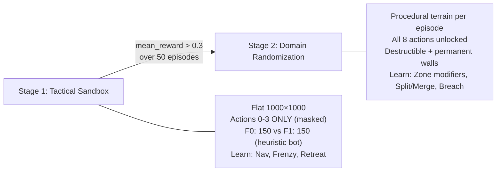

# Phase 3 Training Strategy — Final v8

> **Status:** Phases 1–2 complete. This plan finalizes the training pipeline for Tasks 7–10.
> **Decisions:** MaskablePPO (sb3-contrib), ZMQ Atomic Terrain Injection, Self-Play deferred to Phase 4.

---

## Decision Summary

| Warning | Decision | Rationale |
|---------|----------|-----------|
| **Action Masking** | `MaskablePPO` from `sb3-contrib` | Prevents "Learned Helplessness" — agent won't learn that actions 4-7 are useless on flat terrain |
| **Terrain Injection** | ZMQ Atomic `ResetEnvironment` directive | WS is async → MDP poisoning risk. ZMQ is synchronous: halt → apply terrain → respawn → snapshot → same tick |
| **Self-Play** | Defer to Phase 4. Faction 1 = Static Heuristic Bot | SB3 is single-agent. Heuristic bot provides stable training target |
| **Terrain Interactability** | 3-tier hard_cost encoding (passable / destructible / permanent) | Enables terrain as a tactical resource, not just static obstacles |
| **50×50 Grid** | Justified — General vs Soldier paradigm. Phase 4: foveated attention or GNNs | OGM-scale is correct for macro-strategy. High-res is the Micro-Core's job |

---

## Interactable Terrain Contract

> [!IMPORTANT]
> ### Terrain is now a 3-Tier System
> The old model: passable (100) or wall (u16::MAX). The new model introduces **destructible walls** — terrain that blocks pathfinding but can be broken by entities or zone modifiers.

### Hard Cost Encoding (u16 spectrum)

```
┌─────────────────────────────────────────────────────────────┐
│  Tier 0: PASSABLE          │  100 — 60,000                 │
│  Normal terrain. Zone modifiers allowed. Pathfinding flows. │
├─────────────────────────────────────────────────────────────┤
│  Tier 1: DESTRUCTIBLE WALL │  60,001 — 65,534              │
│  Blocks pathfinding (Dijkstra treats as very high cost).    │
│  CAN be modified by zone modifiers with cost_modifier < 0. │
│  CAN be damaged to Tier 0 by entity collision (over time).  │
│  Moses Effect guard SKIPS this tier (allows modification).  │
├─────────────────────────────────────────────────────────────┤
│  Tier 2: PERMANENT WALL    │  65,535 (u16::MAX)            │
│  Absolute barrier. No pathfinding. No modification.         │
│  Moses Effect guard PROTECTS this tier unconditionally.     │
│  Map boundaries, indestructible structures.                 │
└─────────────────────────────────────────────────────────────┘
```

### Constants (add to `terrain.rs`)

```rust
/// Hard cost thresholds for terrain tiers.
pub const TERRAIN_DESTRUCTIBLE_MIN: u16 = 60_001;
pub const TERRAIN_DESTRUCTIBLE_MAX: u16 = 65_534;
pub const TERRAIN_PERMANENT_WALL: u16 = u16::MAX; // 65_535

impl TerrainGrid {
    /// Returns true if the cell is a destructible wall (Tier 1).
    pub fn is_destructible(&self, cell: IVec2) -> bool {
        let cost = self.get_hard_cost(cell);
        cost >= TERRAIN_DESTRUCTIBLE_MIN && cost <= TERRAIN_DESTRUCTIBLE_MAX
    }
    
    /// Returns true if the cell is a permanent wall (Tier 2).
    pub fn is_permanent_wall(&self, cell: IVec2) -> bool {
        self.get_hard_cost(cell) == TERRAIN_PERMANENT_WALL
    }
    
    /// Returns true if the cell blocks pathfinding (Tier 1 or Tier 2).
    pub fn is_wall(&self, cell: IVec2) -> bool {
        self.get_hard_cost(cell) >= TERRAIN_DESTRUCTIBLE_MIN
    }
    
    /// Damage a destructible wall, reducing its cost toward passable.
    /// Returns true if the wall was destroyed (transitioned to Tier 0).
    /// Permanent walls (u16::MAX) are immune.
    pub fn damage_cell(&mut self, cell: IVec2, damage: u16) -> bool {
        if !self.in_bounds(cell) { return false; }
        let idx = (cell.y as u32 * self.width + cell.x as u32) as usize;
        let cost = self.hard_costs[idx];
        
        // Permanent walls are immune
        if cost == TERRAIN_PERMANENT_WALL { return false; }
        
        // Only destructible walls take damage  
        if cost >= TERRAIN_DESTRUCTIBLE_MIN {
            let new_cost = cost.saturating_sub(damage);
            // If damaged below threshold, collapse to passable
            if new_cost < TERRAIN_DESTRUCTIBLE_MIN {
                self.hard_costs[idx] = 100; // collapse to normal passable
                return true; // wall destroyed
            }
            self.hard_costs[idx] = new_cost;
        }
        false
    }
}
```

### Moses Effect Guard Update (flow_field_update.rs)

```diff
  // PATCH 2: MOSES EFFECT GUARD
- // NEVER modify impassable tiles. A wall is a wall is a wall.
- if current_cost == u16::MAX { continue; }
+ // NEVER modify PERMANENT walls (Tier 2). 
+ // Destructible walls (Tier 1) CAN be modified by zone modifiers.
+ if current_cost == u16::MAX { continue; }  // ← still only protects Tier 2
```

> [!NOTE]
> The Moses Effect guard already only checks `== u16::MAX`, which is exactly Tier 2. **No code change needed** — destructible walls at 60,001-65,534 are naturally allowed through the existing guard. The only additions are the helper methods on `TerrainGrid` and the `damage_cell` mechanic.

### Terrain Generator Update (terrain_generator.py)

```python
# In generate_random_terrain():
TIER0_PASSABLE = 100
TIER1_DESTRUCTIBLE = 62_000   # Mid-range destructible
TIER2_PERMANENT = 65_535

# Walls can now be:
# - Permanent (u16::MAX): map boundaries, chokepoint walls
# - Destructible (60001-65534): interior walls, barricades
wall_type = rng.choice(
    [TIER2_PERMANENT, TIER1_DESTRUCTIBLE], 
    p=[0.6, 0.4]  # 60% permanent, 40% destructible
)
hard[by:min(by+bh, height), bx:min(bx+bw, width)] = wall_type
```

### RL Training Implications

The agent can now learn to **break through walls** using zone modifiers with strong negative cost_modifier. This creates a new tactic vocabulary:

| Tactic | How | Reward Signal |
|--------|-----|---------------|
| **Breach** | `SetZoneModifier` with high negative cost near destructible wall → entities path through | Territory expansion + flanking bonus |
| **Fortify** | `SetZoneModifier` with positive cost near chokepoint → entities avoid it | Survive longer in defensive position |
| **Bypass** | `SplitFaction` + navigate sub-faction around permanent wall | Flanking bonus |

> [!CAUTION]
> **Destructible terrain is Phase 3 scope for the generator and encoding only.** The `damage_cell` mechanic (entities breaking walls by walking into them) is a **Phase 4 entity-terrain interaction system**. For Phase 3, the only way to modify destructible walls is via `SetZoneModifier` (which already works because the Moses guard only blocks Tier 2).

---

## 50×50 Grid Justification: The General vs. Soldier Paradigm

> [!NOTE]
> ### Why 50×50 is Architecturally Correct (Not a Compromise)
> 
> **The General looks at a topographical map, not a 4K satellite feed.**
> 
> The RL agent is the General. The Rust Micro-Core is the Soldier.
> 
> | Layer | Resolution | Role | Real-World Analog |
> |-------|-----------|------|-------------------|
> | Macro Brain (Python) | 50×50 grid | Strategic decisions | OGM / Occupancy Grid Map |
> | Micro Core (Rust) | Continuous f32 space | Physics, collisions, movement | Actuator control |
> 
> This mirrors the real-world autonomous systems pipeline:
> 1. **Edge Perception** (YOLO/V-SLAM) → filters raw sensor noise
> 2. **Downsampling** → projects into 2D Occupancy Grid Map (OGM)
> 3. **Global Planning** → AI strategy layer sees only the OGM costmap
> 
> Our `StateVectorizer` (Rust) and `vectorizer.py` (Python) are exactly the OGM pipeline.

### The Math (CNN Dimensionality)

| Grid | Channels | Input Size | CNN Convergence | Verdict |
|------|----------|-----------|-----------------|---------|
| 50×50 | 5 (4 density + 1 terrain) | 12,500 floats | Hours | ✅ Phase 3 |
| 100×100 | 5 | 50,000 floats | Days | ⚠️ Feasible but slow |
| 500×500 | 5 | 1,250,000 floats | Weeks + spatial overfitting | ❌ Never for macro-strategy |

### Phase 4 Upgrades (Roadmap — NOT in scope)

1. **Foveated Attention (Dual Grid):**
   - Global grid: 50×50 covering entire map (compressed 10km view)
   - Local grid: 50×50 centered on swarm centroid (high-res 200m view)
   - Doubles spatial awareness without quadrupling parameters

2. **Graph Neural Networks (GNNs):**
   - Discard grids entirely
   - Represent swarm + terrain as nodes and edges
   - Natively handles continuous space without discretization
   - Eliminates grid resolution as a design parameter

---

## 2-Stage Curriculum



### Stage 1: Tactical Sandbox

| Parameter | Value |
|-----------|-------|
| Map | 1000×1000, flat (all cells = hard:100, soft:100) |
| Factions | F0 (brain, 150 entities @ 200,500) vs F1 (heuristic bot, 150 @ 800,500) |
| Max steps | 200 (100s sim time at 2Hz) |
| Action mask | `[True, True, True, True, False, False, False, False]` |
| PPO | `MaskablePPO` with `MaskableMultiInputPolicy` from `sb3-contrib` |
| Promotion | `mean_reward > 0.3` over 50 episodes |

**Heuristic Bot (Faction 1):** The existing Rust behavior — faction 1 autonomously navigates toward faction 0 and attacks via `NavigationRuleSet` + `InteractionRuleSet`. Marked as `static` in `FactionBehaviorMode`.

### Stage 2: Domain Randomization

| Parameter | Value |
|-----------|-------|
| Map | Procedurally generated per episode via `terrain_generator.py` |
| Terrain | Wall density 5-20% (60% permanent / 40% destructible), chokepoints 2-5, swamp patches 3-8 |
| Action mask | All 8 unlocked. Runtime mask: Merge/Aggro disabled when no sub-factions exist |
| Spawn | F0 left-center, F1 right-center (BFS-verified connectivity) |
| Promotion | N/A — final stage for Phase 3 |

---

## ZMQ Protocol: `ResetEnvironment` Directive

> [!IMPORTANT]
> ### The Atomic Reset Contract
> When Python sends `ResetEnvironment` as its ZMQ response, Rust MUST:
> 1. **Halt** simulation (no ticks run during terrain rebuild)
> 2. **Apply terrain** from the payload (replace `TerrainGrid`), or reset to flat if `terrain: null`
> 3. **Despawn all entities**
> 4. **Respawn** factions per the spawn config
> 5. **Recalculate flow fields** (dirty all)
> 6. **Return fresh snapshot** on the next ZMQ send — same tick
>
> The MDP sees a clean initial observation with zero latency.

### Python → Rust Response Envelope

The ZMQ response from Python is a **discriminated union** using the `type` field:

```json
// Option A: Normal directive (99% of frames)
{
  "type": "macro_directive",
  "directive": "Hold"
}

// Option B: Environment reset with procedural terrain (Stage 2)
{
  "type": "reset_environment",
  "terrain": {
    "hard_costs": [100, 100, 65535, 62000, ...],
    "soft_costs": [100, 100, 50, ...],
    "width": 50,
    "height": 50,
    "cell_size": 20.0
  },
  "spawns": [
    {"faction_id": 0, "count": 150, "x": 200.0, "y": 500.0, "spread": 80.0},
    {"faction_id": 1, "count": 150, "x": 800.0, "y": 500.0, "spread": 80.0}
  ]
}

// Option C: Flat arena reset (Stage 1) — terrain is null
{
  "type": "reset_environment",
  "terrain": null,
  "spawns": [
    {"faction_id": 0, "count": 150, "x": 200.0, "y": 500.0, "spread": 80.0},
    {"faction_id": 1, "count": 150, "x": 800.0, "y": 500.0, "spread": 80.0}
  ]
}
```

### Rust Types

```rust
/// Discriminated union for ZMQ responses from Python.
#[derive(Serialize, Deserialize, Debug, Clone)]
#[serde(tag = "type")]
pub enum AiResponse {
    #[serde(rename = "macro_directive")]
    Directive {
        #[serde(flatten)]
        directive: MacroDirective,
    },
    
    #[serde(rename = "reset_environment")]
    ResetEnvironment {
        terrain: Option<TerrainPayload>,
        spawns: Vec<SpawnConfig>,
    },
}

#[derive(Serialize, Deserialize, Debug, Clone)]
pub struct TerrainPayload {
    pub hard_costs: Vec<u16>,
    pub soft_costs: Vec<u16>,
    pub width: u32,
    pub height: u32,
    pub cell_size: f32,
}

#[derive(Serialize, Deserialize, Debug, Clone)]
pub struct SpawnConfig {
    pub faction_id: u32,
    pub count: u32,
    pub x: f32,
    pub y: f32,
    pub spread: f32,
}
```

### SwarmEnv Reset Flow (2 recv→send cycles)

```python
def reset(self, seed=None, options=None):
    super().reset(seed=seed)
    self._step_count = 0
    self._active_sub_factions = []
    self._last_aggro_state = True
    self._last_snapshot = None
    
    # Cycle 1: recv initial snapshot → send ResetEnvironment
    raw = self._socket.recv_string()
    
    terrain = None
    if self.curriculum_stage >= 2:
        from src.utils.terrain_generator import generate_random_terrain
        terrain = generate_random_terrain(seed=self.np_random.integers(0, 2**31))
    
    self._socket.send_string(json.dumps({
        "type": "reset_environment",
        "terrain": terrain,
        "spawns": [
            {"faction_id": 0, "count": 150, "x": 200.0, "y": 500.0, "spread": 80.0},
            {"faction_id": 1, "count": 150, "x": 800.0, "y": 500.0, "spread": 80.0},
        ]
    }))
    
    # Cycle 2: recv fresh post-reset snapshot → send Hold
    raw = self._socket.recv_string()
    snapshot = json.loads(raw)
    self._last_snapshot = snapshot
    self._active_sub_factions = snapshot.get("active_sub_factions", [])
    
    self._socket.send_string(json.dumps(
        {"type": "macro_directive", "directive": "Hold"}
    ))
    
    obs = vectorize_snapshot(snapshot, self.brain_faction, self.enemy_faction)
    return obs, {}
```

---

## Action Masking Contract

```python
def action_masks(self) -> np.ndarray:
    """Return boolean mask for valid actions.
    
    Required by MaskablePPO from sb3-contrib.
    
    Stage 1: [True, True, True, True, False, False, False, False]
    Stage 2: All True, with runtime validity checks
    """
    mask = np.ones(8, dtype=bool)
    
    if self.curriculum_stage == 1:
        mask[4:8] = False  # Lock terrain-dependent actions
    else:
        # Runtime masking: can't merge/aggro without sub-factions
        if not self._active_sub_factions:
            mask[6] = False  # MergeFaction
            mask[7] = False  # SetAggroMask
    
    return mask
```

---

## New & Modified Files (Complete)

| File | Action | Task | Purpose |
|------|--------|------|---------|
| `micro-core/src/bridges/zmq_protocol.rs` | MODIFY | T07 | `AiResponse` enum, `TerrainPayload`, `SpawnConfig` |
| `micro-core/src/bridges/zmq_bridge/systems.rs` | MODIFY | T07 | Parse `AiResponse`, handle `ResetEnvironment` atomic reset |
| `micro-core/src/terrain.rs` | MODIFY | T07 | Tier constants, `is_destructible()`, `is_wall()`, `damage_cell()` |
| `micro-core/src/systems/flow_field_update.rs` | MODIFY | T07 | Moses guard comment update (logic unchanged) |
| `macro-brain/requirements.txt` | MODIFY | T08 | Add `sb3-contrib>=2.6.0` |
| `macro-brain/src/env/swarm_env.py` | MODIFY | T08 | `action_masks()`, `curriculum_stage`, `ResetEnvironment` in `reset()` |
| `macro-brain/src/utils/terrain_generator.py` | NEW | T08 | Procedural terrain with 3-tier encoding, BFS connectivity |
| `macro-brain/src/training/curriculum.py` | NEW | T08 | 2-stage callback for SB3 |
| `macro-brain/src/training/train.py` | NEW | T08 | `MaskablePPO` + curriculum wiring |
| `macro-brain/src/training/callbacks.py` | NEW | T08 | TensorBoard + checkpoint callbacks |
| `macro-brain/tests/test_terrain_generator.py` | NEW | T08 | Connectivity, tier distribution, determinism tests |

---

## Updated DAG (v8)

| Phase | Tasks | Changes from v7 |
|-------|-------|-----------------|
| **3** | T07 | + `AiResponse` envelope, `ResetEnvironment` handler, terrain tier constants |
| **4** | T08 | + `MaskablePPO`, `sb3-contrib`, `terrain_generator.py`, `curriculum.py`, `action_masks()` |
| **5** | T09, T10 | T09: flanking bonus uses destructible awareness. T10: + curriculum smoke test |

No phase or dependency changes — only expanded file scope within existing tasks.
