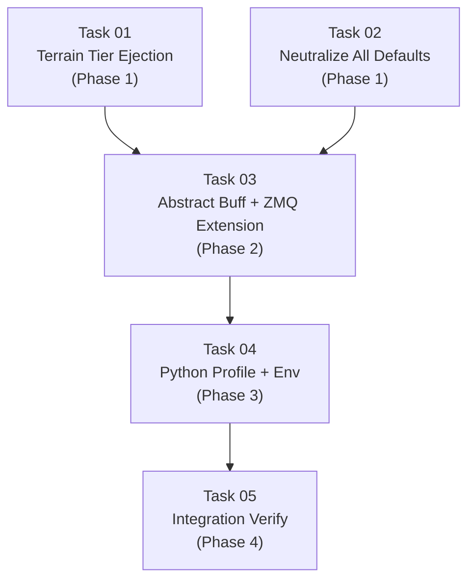

# AGENT ROLE: EXECUTION SPECIALIST

You are an **Execution Specialist** in a multi-agent DAG workflow.
You have been assigned ONE specific task. You implement it with surgical precision.

---

## Your Assignment

| Field   | Value |
|---------|-------|
| Task ID | `task_03_buff_abstraction_zmq_extension` |
| Feature | Decouple Game Mechanics |
| Tier    | standard |

---

## ⛔ MANDATORY PROCESS — ALL TIERS (DO NOT SKIP)

> **These rules apply to EVERY executor, regardless of tier. Violating them
> causes an automatic QA FAIL and project BLOCK.**

### Rule 1: Scope Isolation
- You may ONLY create or modify files listed in `Target_Files` in your Task Brief.
- If a file must be changed but is NOT in `Target_Files`, **STOP and report the gap** — do NOT modify it.
- NEVER edit `task_state.json`, `implementation_plan.md`, or any file outside your scope.

### Rule 2: Changelog (Handoff Documentation)
After ALL code is written and BEFORE calling `./task_tool.sh done`, you MUST:

1. **Create** `tasks_pending/task_03_buff_abstraction_zmq_extension_changelog.md`
2. **Include in the changelog:**
   - **Touched Files:** A bulleted list of every file you created or modified.
   - **Contract Fulfillment:** Brief confirmation of the interfaces/DTOs you implemented.
   - **Deviations/Notes:** Any edge cases you handled or deviations from the brief the QA agent should verify.
3. **Then and only then** run:
   ```bash
   ./task_tool.sh done task_03_buff_abstraction_zmq_extension
   ```

> **⚠️ Calling `./task_tool.sh done` without creating the changelog file is FORBIDDEN.**

### Rule 3: No Placeholders
- Do not use `// TODO`, `/* FIXME */`, or stub implementations.
- Output fully functional, production-ready code.

### Rule 4: Human Intervention Protocol
During execution, a human may intercept your work and propose changes, provide code snippets, or redirect your approach. When this happens:

1. **ADOPT the concept, VERIFY the details.** Humans are exceptional at architectural vision but make detail mistakes (wrong API, typos, outdated syntax). Independently verify all human-provided code against the actual framework version and project contracts.
2. **TRACK every human intervention in the changelog.** Add a dedicated `## Human Interventions` section to your changelog documenting:
   - What the human proposed (1-2 sentence summary)
   - What you adopted vs. what you corrected
   - Any deviations from the original task brief caused by the intervention
3. **DO NOT silently incorporate changes.** The QA agent and Architect must be able to trace exactly what came from the spec vs. what came from a human mid-flight. Untracked changes are invisible to the verification pipeline.

---

## Context Loading (Tier-Dependent)

**If your tier is `basic`:**
- Skip all external file reading. Your Task Brief below IS your complete instruction.
- Implement the code exactly as specified in the Task Brief.
- Follow the MANDATORY PROCESS rules above (changelog + scope), then halt.

**If your tier is `standard` or `advanced`:**
1. Read `.agents/context.md` — Thin index pointing to context sub-files
2. Load ONLY the `context/*` sub-files listed in your `Context_Bindings` below
3. Scan `.agents/knowledge/` — Lessons from previous sessions relevant to your task
4. Read `.agents/workflows/execution-lifecycle.md` — Your 4-step execution loop
5. Read `.agents/rules/execution-boundary.md` — Scope and contract constraints

_No additional context bindings specified._

---

## Task Brief

# Task 03: Abstract Buff System + ZMQ Extension + Reset Handler + Config Cleanup

- **Task_ID:** task_03_buff_abstraction_zmq_extension
- **Execution_Phase:** 2 (sequential — after Task 01 + Task 02)
- **Model_Tier:** advanced
- **Feature:** Decoupling Game Mechanics

## Target_Files
- `micro-core/src/config.rs`
- `micro-core/src/main.rs`
- `micro-core/src/systems/directive_executor.rs`
- `micro-core/src/systems/interaction.rs`
- `micro-core/src/systems/movement.rs`
- `micro-core/src/bridges/zmq_protocol.rs`
- `micro-core/src/bridges/zmq_bridge/systems.rs`
- `micro-core/src/systems/state_vectorizer.rs`

## Dependencies
- Task 01 (terrain.rs — new `TerrainGrid` fields for threshold injection)
- Task 02 (defaults neutralized, wave_spawn_system removed)

## Context_Bindings
- `context/architecture`
- `context/ipc-protocol`
- `skills/rust-code-standards`

## Strict_Instructions

### Goal
1. Replace `FrenzyConfig`/`FactionSpeedBuffs` with a fully abstract stat-index-based buff system
2. Rename `TriggerFrenzy` → `ActivateBuff` with generic stat modifiers
3. Extend ZMQ `ResetEnvironment` with all new injectable parameters
4. Update movement and combat systems to read buff modifiers by configurable stat index
5. Clean up `config.rs` and `main.rs`

> **CRITICAL DESIGN PRINCIPLE:** The engine's buff system must be 100% stat-index-based. It MUST NOT contain the words "speed", "damage", "hp" or any other game-specific stat name in the buff data structures. The `BuffConfig` resource maps stat indices to system behaviors — that mapping is the ONLY place the engine connects "stat X affects movement" and "stat Y affects damage."

---

### Part A: Config Cleanup + Abstract Buff Resources

#### A1. `config.rs` — Remove wave spawn fields (V4)

Remove `wave_spawn_interval`, `wave_spawn_count`, `wave_spawn_faction`, `wave_spawn_stat_defaults` from `SimulationConfig`.

Fix `test_simulation_config_defaults` — remove wave assertions.

#### A2. `config.rs` — Delete FrenzyConfig (V3)

Delete the entire `FrenzyConfig` struct and its `Default` impl.

#### A3. `config.rs` — Delete FactionSpeedBuffs

Delete the entire `FactionSpeedBuffs` struct.

#### A4. `config.rs` — Add BuffConfig (Contract B)

```rust
/// Buff system configuration from game profile.
///
/// Maps abstract stat indices to engine system behaviors.
/// The engine has movement and combat systems — those are engine mechanics.
/// But WHICH stat index drives speed vs damage is game design.
#[derive(Resource, Debug, Clone)]
pub struct BuffConfig {
    /// Cooldown ticks after any buff expires. Default: 0.
    pub cooldown_ticks: u32,
    /// Which stat_index in active buffs controls movement speed multiplier.
    /// None = buffs never affect movement speed.
    pub movement_speed_stat: Option<usize>,
    /// Which stat_index in active buffs controls combat damage multiplier.
    /// None = buffs never affect combat damage.
    pub combat_damage_stat: Option<usize>,
}

impl Default for BuffConfig {
    fn default() -> Self {
        Self {
            cooldown_ticks: 0,
            movement_speed_stat: None,
            combat_damage_stat: None,
        }
    }
}
```

#### A5. `config.rs` — Add FactionBuffs + ActiveBuffGroup + ActiveModifier + ModifierType (Contract C)

```rust
/// Active stat-multiplier buffs per faction — fully abstract.
///
/// Each buff group contains modifiers (stat_index + type + value), a duration,
/// and optional entity-level targeting. The engine doesn't know what
/// stat_index 0 means — the game profile defines that.
#[derive(Resource, Debug, Default)]
pub struct FactionBuffs {
    /// Active buff groups: faction → list of active buff groups.
    pub buffs: std::collections::HashMap<u32, Vec<ActiveBuffGroup>>,
    /// Cooldown: faction → ticks remaining before next buff activation.
    pub cooldowns: std::collections::HashMap<u32, u32>,
}

/// A group of stat modifiers applied together with shared duration and targeting.
#[derive(Debug, Clone)]
pub struct ActiveBuffGroup {
    pub modifiers: Vec<ActiveModifier>,
    pub remaining_ticks: u32,
    /// Entity-level targeting:
    /// - None → no units affected (buff is dormant)
    /// - Some(empty vec) → all units in faction
    /// - Some(vec of ids) → only matching entity IDs
    pub targets: Option<Vec<u32>>,
}

impl ActiveBuffGroup {
    /// Check if this buff group targets a specific entity.
    pub fn targets_entity(&self, entity_id: u32) -> bool {
        match &self.targets {
            None => false,                          // Dormant — no units
            Some(ids) if ids.is_empty() => true,    // All units in faction
            Some(ids) => ids.contains(&entity_id),  // Specific units
        }
    }
}

/// A single stat modifier within a buff group.
#[derive(Debug, Clone)]
pub struct ActiveModifier {
    pub stat_index: usize,
    pub modifier_type: ModifierType,
    pub value: f32,
}

/// How a modifier is applied to a stat.
#[derive(Debug, Clone, PartialEq)]
pub enum ModifierType {
    /// stat_effective = stat_base × value
    Multiplier,
    /// stat_effective = stat_base + value
    FlatAdd,
}
```

Add helper methods on `FactionBuffs` — entity-level targeting aware:
```rust
impl FactionBuffs {
    /// Get the cumulative multiplier for a specific stat, respecting entity targeting.
    /// Returns 1.0 if no active multiplier buff targets this entity.
    pub fn get_multiplier(&self, faction: u32, entity_id: u32, stat_index: usize) -> f32 {
        let Some(groups) = self.buffs.get(&faction) else { return 1.0 };
        let mut product = 1.0f32;
        for group in groups {
            if !group.targets_entity(entity_id) { continue; }
            for m in &group.modifiers {
                if m.stat_index == stat_index && m.modifier_type == ModifierType::Multiplier {
                    product *= m.value;
                }
            }
        }
        product
    }

    /// Get the cumulative flat add for a specific stat, respecting entity targeting.
    pub fn get_flat_add(&self, faction: u32, entity_id: u32, stat_index: usize) -> f32 {
        let Some(groups) = self.buffs.get(&faction) else { return 0.0 };
        let mut sum = 0.0f32;
        for group in groups {
            if !group.targets_entity(entity_id) { continue; }
            for m in &group.modifiers {
                if m.stat_index == stat_index && m.modifier_type == ModifierType::FlatAdd {
                    sum += m.value;
                }
            }
        }
        sum
    }
}
```

#### A6. `config.rs` — Add DensityConfig (Contract D)

```rust
#[derive(Resource, Debug, Clone)]
pub struct DensityConfig {
    pub max_density: f32,
}
impl Default for DensityConfig {
    fn default() -> Self { Self { max_density: 0.0 } }
}
```

#### A7. `config.rs` — Tests

- Update FrenzyConfig tests → BuffConfig tests
- Update FactionSpeedBuffs tests → FactionBuffs tests
- Add tests for `get_multiplier` and `get_flat_add` helpers

---

### Part B: Buff Abstraction in Systems

#### B1. `systems/directive_executor.rs`

1. **Update imports:** Replace `FactionSpeedBuffs` → `FactionBuffs`, remove `FrenzyConfig`
2. **Rename `TriggerFrenzy` → `ActivateBuff`** match arm:

```rust
MacroDirective::ActivateBuff { faction, modifiers, duration_ticks, targets } => {
    // Cooldown check
    if buffs.cooldowns.contains_key(&faction) {
        return;
    }
    let active_mods: Vec<ActiveModifier> = modifiers.iter().map(|m| {
        ActiveModifier {
            stat_index: m.stat_index,
            modifier_type: match m.modifier_type {
                crate::bridges::zmq_protocol::ModifierType::Multiplier => crate::config::ModifierType::Multiplier,
                crate::bridges::zmq_protocol::ModifierType::FlatAdd => crate::config::ModifierType::FlatAdd,
            },
            value: m.value,
        }
    }).collect();
    let group = ActiveBuffGroup {
        modifiers: active_mods,
        remaining_ticks: duration_ticks,
        targets,
    };
    // Append to existing groups (faction may have multiple active buff groups)
    buffs.buffs.entry(faction).or_default().push(group);
},
```

3. **Rename `speed_buff_tick_system` → `buff_tick_system`:**

```rust
pub fn buff_tick_system(
    mut buffs: ResMut<FactionBuffs>,
    buff_config: Res<BuffConfig>,
) {
    let mut expired_factions = Vec::new();

    // Tick down all active buff groups per faction
    for (faction, groups) in buffs.buffs.iter_mut() {
        groups.retain_mut(|group| {
            group.remaining_ticks = group.remaining_ticks.saturating_sub(1);
            group.remaining_ticks > 0
        });
        if groups.is_empty() {
            expired_factions.push(*faction);
        }
    }

    // Remove empty faction entries and start cooldowns
    for faction in expired_factions {
        buffs.buffs.remove(&faction);
        if buff_config.cooldown_ticks > 0 {
            buffs.cooldowns.insert(faction, buff_config.cooldown_ticks);
        }
    }

    // Tick cooldowns
    buffs.cooldowns.retain(|_, ticks| {
        *ticks = ticks.saturating_sub(1);
        *ticks > 0
    });
}
```

4. **Update `MergeFaction`** handler: `speed_buffs.buffs.remove(...)` → `buffs.buffs.remove(...)`
5. **Fix all tests** — update TriggerFrenzy → ActivateBuff, FactionSpeedBuffs → FactionBuffs, etc.

#### B2. `systems/interaction.rs`

1. Replace `FactionSpeedBuffs` → `FactionBuffs`, remove `FrenzyConfig`
2. Add `BuffConfig` as a system parameter
3. Add `EntityId` to the `q_ro` query so we can pass entity_id to `get_multiplier`
4. Replace hardcoded damage multiplier logic with abstract stat-index lookup:

```rust
// Abstract damage multiplier via configurable stat index + entity targeting
let damage_mult = buff_config.combat_damage_stat
    .map(|stat_idx| combat_buffs.get_multiplier(source_faction.0, source_entity_id.id, stat_idx))
    .unwrap_or(1.0);
```

This replaces the entire `if frenzy_config.damage_multiplier_enabled { ... }` block.
**Note:** `q_ro` query must include `&EntityId` to access `.id`.

5. **Fix all tests** — replace FrenzyConfig/FactionSpeedBuffs in `setup_app()`.

#### B3. `systems/movement.rs`

1. Replace `FactionSpeedBuffs` → `FactionBuffs`
2. Add `BuffConfig` as a system parameter
3. Add `EntityId` to the movement query to pass entity_id to `get_multiplier`
4. Replace hardcoded speed multiplier:

**Before:**
```rust
let speed_mult = speed_buffs.buffs.get(&faction.0).map(|(m, _)| *m).unwrap_or(1.0);
```

**After:**
```rust
let speed_mult = buff_config.movement_speed_stat
    .map(|stat_idx| faction_buffs.get_multiplier(faction.0, entity_id.id, stat_idx))
    .unwrap_or(1.0);
```
**Note:** Movement query must include `&EntityId`.

5. **Fix all tests** — add BuffConfig + FactionBuffs to test setup apps.

---

### Part C: ZMQ Protocol Extension

#### C1. `bridges/zmq_protocol.rs`

1. **Add `ModifierType` enum** (serde-compatible):
```rust
#[derive(Serialize, Deserialize, Debug, Clone, PartialEq)]
pub enum ModifierType {
    Multiplier,
    FlatAdd,
}
```

2. **Add `StatModifierPayload`:**
```rust
#[derive(Serialize, Deserialize, Debug, Clone, PartialEq)]
pub struct StatModifierPayload {
    pub stat_index: usize,
    pub modifier_type: ModifierType,
    pub value: f32,
}
```

3. **Rename `TriggerFrenzy` → `ActivateBuff`** in MacroDirective (Contract A):
```rust
ActivateBuff {
    faction: u32,
    modifiers: Vec<StatModifierPayload>,
    duration_ticks: u32,
    #[serde(default)]
    targets: Option<Vec<u32>>,
},
```

4. **Add `MovementConfigPayload`** (Contract E)
5. **Add `TerrainThresholdsPayload`** (Contract H)
6. **Add `RemovalRulePayload`** (Contract H)

7. **Update `AbilityConfigPayload`** (Contract F):
```rust
#[derive(Serialize, Deserialize, Debug, Clone, PartialEq)]
pub struct AbilityConfigPayload {
    pub buff_cooldown_ticks: u32,
    #[serde(default)]
    pub movement_speed_stat: Option<usize>,
    #[serde(default)]
    pub combat_damage_stat: Option<usize>,
}
```

8. **Extend `ResetEnvironment`** (Contract G):
Add `movement_config`, `max_density`, `terrain_thresholds`, `removal_rules` fields (all `#[serde(default)]`).

9. **Fix serde tests** — TriggerFrenzy roundtrip → ActivateBuff with modifiers.

---

### Part D: Reset Handler Update

#### D1. `bridges/zmq_bridge/systems.rs`

1. **Update `ResetRequest`** to include all new fields
2. **Update entity spawning (V6, V7):**
   - Replace `MovementConfig::default()` with injected config from `reset.movement_config`
   - Remove `vec![(0, 100.0)]` fallback (V7) — empty stats = empty StatBlock
3. **Apply new configs in reset handler:**
   - `ability_config` → `BuffConfig` (cooldown + stat mappings)
   - `movement_config` → `MovementConfig` per entity
   - `max_density` → `DensityConfig`
   - `terrain_thresholds` → `TerrainGrid` fields
   - `removal_rules` → `RemovalRuleSet`
4. **Replace `DEFAULT_MAX_DENSITY` import** with `DensityConfig` resource access
5. **Replace `FrenzyConfig`/`FactionSpeedBuffs`** imports with new types

#### D2. `systems/state_vectorizer.rs`

1. **Remove** `pub const DEFAULT_MAX_DENSITY: f32 = 50.0;`
2. All callers pass `max_density` from `DensityConfig` resource.

---

### Part E: Main.rs Cleanup

1. **Remove `wave_spawn_system`** from all system registrations
2. **Update resource registrations:**
   - `.init_resource::<FactionSpeedBuffs>()` → `.init_resource::<FactionBuffs>()`
   - `.init_resource::<FrenzyConfig>()` → `.init_resource::<BuffConfig>()`
   - ADD `.init_resource::<DensityConfig>()`
3. **Update `speed_buff_tick_system` → `buff_tick_system`** in system registrations
4. **Update imports** to match new type names

### Step Final: Verify

```bash
cd micro-core && cargo build
cd micro-core && cargo test
cd micro-core && cargo clippy
```

## Verification_Strategy
  Test_Type: unit + integration
  Test_Stack: Rust (cargo test)
  Acceptance_Criteria:
    - "`cargo build` succeeds"
    - "All tests pass — zero references to FrenzyConfig, FactionSpeedBuffs, TriggerFrenzy, wave_spawn, DEFAULT_MAX_DENSITY, damage_multiplier_enabled"
    - "ActivateBuff carries Vec<StatModifierPayload> not named speed/damage fields"
    - "Movement system reads multiplier via buff_config.movement_speed_stat"
    - "Interaction system reads multiplier via buff_config.combat_damage_stat"
    - "ResetEnvironment includes movement_config, max_density, terrain_thresholds, removal_rules"
    - "`cargo clippy` no new warnings"
  Suggested_Test_Commands:
    - "cd micro-core && cargo test"
    - "cd micro-core && cargo clippy"

---

## Shared Contracts

# Decoupling Hardcoded Game Mechanics from Micro-Core

**Principle:** The Micro-Core is a **pure computation engine**. It processes physics, pathfinding, and combat math based on externally injected rules. It has zero knowledge of "what game this is."

**Who owns game design:**
- **Training mode:** Python Macro-Brain injects the profile via ZMQ `ResetEnvironment`.
- **Demo/Lab mode:** Debug Visualizer acts as the game engine — it sends the profile via WS on Start.

---

## Shared Contracts

These contracts are referenced by multiple tasks. All tasks MUST implement against these exact definitions.

### Contract A: `ActivateBuff` Directive — Fully Abstract

The engine knows nothing about "speed" or "damage." A buff is a list of stat modifiers applied to targeted entities within a faction for a duration.

```rust
// In zmq_protocol.rs — MacroDirective enum
ActivateBuff {
    faction: u32,
    /// Stat modifiers to apply for the duration of the buff.
    modifiers: Vec<StatModifierPayload>,
    duration_ticks: u32,
    /// Entity-level targeting within the faction:
    /// - None → buff registered but no units affected
    /// - Some([]) → all units in the faction get buff
    /// - Some([1, 5, 12]) → only those entity IDs get buff
    #[serde(default)]
    targets: Option<Vec<u32>>,
},

#[derive(Serialize, Deserialize, Debug, Clone, PartialEq)]
pub struct StatModifierPayload {
    /// Which stat index to modify (game profile defines meaning).
    pub stat_index: usize,
    /// How to apply the modifier.
    pub modifier_type: ModifierType,
    /// The modifier value.
    pub value: f32,
}

#[derive(Serialize, Deserialize, Debug, Clone, PartialEq)]
pub enum ModifierType {
    /// stat_effective = stat_base × value
    Multiplier,
    /// stat_effective = stat_base + value
    FlatAdd,
}
```

### Contract B: `BuffConfig` Resource — Stat-to-System Mapping

The engine HAS movement and combat systems — those are engine mechanics. But WHICH stat index drives speed vs damage is game design. `BuffConfig` is the mapping table.

```rust
// In config.rs
#[derive(Resource, Debug, Clone)]
pub struct BuffConfig {
    /// Cooldown ticks after any buff expires. Default: 0.
    pub cooldown_ticks: u32,
    /// Which stat_index in active buffs controls movement speed multiplier.
    /// None = buffs never affect movement speed.
    pub movement_speed_stat: Option<usize>,
    /// Which stat_index in active buffs controls combat damage multiplier.
    /// None = buffs never affect combat damage.
    pub combat_damage_stat: Option<usize>,
}

impl Default for BuffConfig {
    fn default() -> Self {
        Self {
            cooldown_ticks: 0,
            movement_speed_stat: None,
            combat_damage_stat: None,
        }
    }
}
```

### Contract C: `FactionBuffs` Resource — Abstract Active Buffs

```rust
// In config.rs
#[derive(Resource, Debug, Default)]
pub struct FactionBuffs {
    /// Active buff groups: faction → list of active buff groups.
    pub buffs: std::collections::HashMap<u32, Vec<ActiveBuffGroup>>,
    /// Cooldown: faction → ticks remaining before next buff activation.
    pub cooldowns: std::collections::HashMap<u32, u32>,
}

/// A group of stat modifiers applied together with shared duration and targeting.
#[derive(Debug, Clone)]
pub struct ActiveBuffGroup {
    pub modifiers: Vec<ActiveModifier>,
    pub remaining_ticks: u32,
    /// Entity-level targeting:
    /// - None → no units affected (buff is dormant)
    /// - Some(empty vec) → all units in faction
    /// - Some(vec of ids) → only matching entity IDs
    pub targets: Option<Vec<u32>>,
}

#[derive(Debug, Clone)]
pub struct ActiveModifier {
    pub stat_index: usize,
    pub modifier_type: ModifierType,
    pub value: f32,
}

#[derive(Debug, Clone, PartialEq)]
pub enum ModifierType {
    Multiplier,
    FlatAdd,
}
```

Helper methods for systems — entity-level targeting aware:
```rust
impl FactionBuffs {
    /// Get the cumulative multiplier for a specific stat, respecting entity targeting.
    /// `entity_id`: the EntityId.id of the entity being queried.
    /// Returns 1.0 if no active multiplier buff targets this entity.
    pub fn get_multiplier(&self, faction: u32, entity_id: u32, stat_index: usize) -> f32 {
        let Some(groups) = self.buffs.get(&faction) else { return 1.0 };
        let mut product = 1.0f32;
        for group in groups {
            if !group.targets_entity(entity_id) { continue; }
            for m in &group.modifiers {
                if m.stat_index == stat_index && m.modifier_type == ModifierType::Multiplier {
                    product *= m.value;
                }
            }
        }
        product
    }

    /// Get the cumulative flat add for a specific stat, respecting entity targeting.
    pub fn get_flat_add(&self, faction: u32, entity_id: u32, stat_index: usize) -> f32 {
        let Some(groups) = self.buffs.get(&faction) else { return 0.0 };
        let mut sum = 0.0f32;
        for group in groups {
            if !group.targets_entity(entity_id) { continue; }
            for m in &group.modifiers {
                if m.stat_index == stat_index && m.modifier_type == ModifierType::FlatAdd {
                    sum += m.value;
                }
            }
        }
        sum
    }
}

impl ActiveBuffGroup {
    /// Check if this buff group targets a specific entity.
    fn targets_entity(&self, entity_id: u32) -> bool {
        match &self.targets {
            None => false,                          // Dormant — no units
            Some(ids) if ids.is_empty() => true,    // All units in faction
            Some(ids) => ids.contains(&entity_id),  // Specific units
        }
    }
}
```

### Contract D: `DensityConfig` Resource

```rust
#[derive(Resource, Debug, Clone)]
pub struct DensityConfig {
    pub max_density: f32,
}
impl Default for DensityConfig {
    fn default() -> Self { Self { max_density: 0.0 } }
}
```

### Contract E: `MovementConfigPayload` (ZMQ)

```rust
#[derive(Serialize, Deserialize, Debug, Clone, PartialEq)]
pub struct MovementConfigPayload {
    pub max_speed: f32,
    pub steering_factor: f32,
    pub separation_radius: f32,
    pub separation_weight: f32,
    pub flow_weight: f32,
}
```

### Contract F: `AbilityConfigPayload` — Generic

```rust
#[derive(Serialize, Deserialize, Debug, Clone, PartialEq)]
pub struct AbilityConfigPayload {
    pub buff_cooldown_ticks: u32,
    /// Which stat_index controls movement speed multiplier (None = disabled).
    pub movement_speed_stat: Option<usize>,
    /// Which stat_index controls combat damage multiplier (None = disabled).
    pub combat_damage_stat: Option<usize>,
}
```

### Contract G: Extended `ResetEnvironment`

```rust
ResetEnvironment {
    terrain: Option<TerrainPayload>,
    spawns: Vec<SpawnConfig>,
    #[serde(default)]
    combat_rules: Option<Vec<CombatRulePayload>>,
    #[serde(default)]
    ability_config: Option<AbilityConfigPayload>,
    #[serde(default)]
    movement_config: Option<MovementConfigPayload>,
    #[serde(default)]
    max_density: Option<f32>,
    #[serde(default)]
    terrain_thresholds: Option<TerrainThresholdsPayload>,
    #[serde(default)]
    removal_rules: Option<Vec<RemovalRulePayload>>,
},
```

### Contract H: `TerrainThresholdsPayload` + `RemovalRulePayload`

```rust
#[derive(Serialize, Deserialize, Debug, Clone, PartialEq)]
pub struct TerrainThresholdsPayload {
    pub impassable_threshold: u16,
    pub destructible_min: u16,
}

#[derive(Serialize, Deserialize, Debug, Clone, PartialEq)]
pub struct RemovalRulePayload {
    pub stat_index: usize,
    pub threshold: f32,
    /// "LessOrEqual" or "GreaterOrEqual"
    pub condition: String,
}
```

### Contract I: Python Profile Schema

```json
{
  "movement": {
    "max_speed": 60.0,
    "steering_factor": 5.0,
    "separation_radius": 6.0,
    "separation_weight": 1.5,
    "flow_weight": 1.0
  },
  "terrain_thresholds": {
    "impassable_threshold": 65535,
    "destructible_min": 60001
  },
  "abilities": {
    "buff_cooldown_ticks": 180,
    "movement_speed_stat": 1,
    "combat_damage_stat": 2,
    "activate_buff": {
      "modifiers": [
        { "stat_index": 1, "modifier_type": "Multiplier", "value": 1.5 },
        { "stat_index": 2, "modifier_type": "Multiplier", "value": 1.5 }
      ],
      "duration_ticks": 60
    }
  },
  "removal_rules": [
    { "stat_index": 0, "threshold": 0.0, "condition": "LessOrEqual" }
  ],
  "training": {
    "max_density": 50.0,
    ...
  }
}
```

---

## Audit: All Violations & Resolutions

| # | Violation | File | Resolution |
|---|-----------|------|------------|
| V1 | `InteractionRuleSet::default()` hardcodes 2 combat rules | `rules/interaction.rs` | Default → empty `vec![]` |
| V2 | `MovementConfig::default()` hardcodes Boids params | `components/movement_config.rs` | Default → all zeros |
| V3 | `FrenzyConfig` — game-specific ability | `config.rs` | Replace with abstract `BuffConfig` |
| V4 | `SimulationConfig::default()` hardcodes wave spawn | `config.rs` | Remove wave spawn fields |
| V5 | `DEFAULT_MAX_DENSITY = 50.0` hardcoded | `state_vectorizer.rs` | Inject via `DensityConfig` resource |
| V6 | `reset_environment_system` spawns with `MovementConfig::default()` | `zmq_bridge/systems.rs` | Inject from ZMQ payload |
| V7 | Spawn fallback `vec![(0, 100.0)]` if stats empty | `zmq_bridge/systems.rs` | Remove fallback |
| V8 | `wave_spawn_system` is game-mode-specific | `systems/spawning.rs` | Remove entirely |
| V9 | Terrain tier constants hardcoded | `terrain.rs` | Eject to `TerrainGrid` fields |
| V10 | `RemovalRuleSet::default()` hardcodes "HP <= 0" | `rules/removal.rs` | Default → empty, inject via ZMQ |

---

## Execution DAG



| Phase | Task | Model Tier | Parallel? |
|-------|------|------------|-----------|
| 1 | Task 01: Terrain Tier Ejection | `standard` | ✅ parallel with T02 |
| 1 | Task 02: Neutralize All Defaults (V1, V2, V8, V10) | `standard` | ✅ parallel with T01 |
| 2 | Task 03: Abstract Buff + ZMQ Extension + Reset Handler | `advanced` | sequential |
| 3 | Task 04: Python Profile + Env Extension | `standard` | sequential |
| 4 | Task 05: Integration Verify | `standard` | sequential |

## File Ownership Matrix (Zero Collision Guarantee)

| File | T01 | T02 | T03 | T04 | T05 |
|------|-----|-----|-----|-----|-----|
| `terrain.rs` | ✏️ | | | | |
| `rules/interaction.rs` | | ✏️ | | | |
| `rules/removal.rs` | | ✏️ | | | |
| `components/movement_config.rs` | | ✏️ | | | |
| `systems/spawning.rs` | | ✏️ | | | |
| `systems/mod.rs` | | ✏️ | | | |
| `config.rs` | | | ✏️ | | |
| `main.rs` | | | ✏️ | | |
| `systems/directive_executor.rs` | | | ✏️ | | |
| `systems/interaction.rs` | | | ✏️ | | |
| `systems/movement.rs` | | | ✏️ | | |
| `bridges/zmq_protocol.rs` | | | ✏️ | | |
| `bridges/zmq_bridge/systems.rs` | | | ✏️ | | |
| `systems/state_vectorizer.rs` | | | ✏️ | | |
| `macro-brain/src/config/game_profile.py` | | | | ✏️ | |
| `macro-brain/profiles/default_swarm_combat.json` | | | | ✏️ | |
| `macro-brain/src/env/swarm_env.py` | | | | ✏️ | |
| `macro-brain/src/env/spaces.py` | | | | ✏️ | |
| `macro-brain/tests/*.py` | | | | ✏️ | |

## Verification Plan

```bash
# After each Rust task:
cd micro-core && cargo test && cargo clippy

# After Task 04:
cd macro-brain && source venv/bin/activate && python -m pytest tests/ -v

# After Task 05 (integration):
# Zero grep hits for: FrenzyConfig, FactionSpeedBuffs, TriggerFrenzy,
#   wave_spawn, DEFAULT_MAX_DENSITY, TERRAIN_DESTRUCTIBLE_*, damage_multiplier_enabled
```

