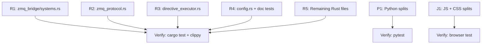

# File Splitting Refactor — All Modules

**Principle:** Every source file stays under 300 lines (excluding tests) with a single responsibility. See `.agents/context/conventions.md → File Organization`.

**Rust-specific threshold:** Files under 400 lines with inline tests are acceptable (Rust convention = tests beside the code). Files 400–600 add a rationale comment. Files >600 **must** split.

**Doc test migration:** During the split, migrate simple `#[cfg(test)]` tests to `///` doc tests for pure functions. See `rust-code-standards` skill → §2.8.

---

## Resolved Decisions

| Question | Decision |
|----------|----------|
| Borderline Rust files (<400) | Keep, Rust convention is tests beside code |
| Rust files 400-600 | Add rationale comment if single concern |
| Rust files >600 | Must split |
| JS approach | Full folder-based grouping |
| CSS | Split by component |
| HTML | Split if meaningful |
| Doc tests | Migrate pure function tests during refactor |

---

## Must-Split Files

### 🔴 Rust (>600 lines — must split)

| # | File | Lines | Split Plan |
|---|------|-------|------------|
| 1 | `zmq_bridge/systems.rs` | **1098** | → reset.rs + snapshot.rs + keep systems.rs |
| 2 | `systems/flow_field_update.rs` | **753** | → safety.rs (patches) + keep core |
| 3 | `systems/ws_command.rs` | **581** | → step_tick.rs + keep ws_command.rs |
| 4 | `bridges/zmq_protocol.rs` | **562** | → directives.rs + payloads.rs + types.rs |
| 5 | `systems/directive_executor.rs` | **507** | → buff_tick.rs + zone_tick.rs + keep executor |
| 6 | `pathfinding/flow_field.rs` | **508** | Add rationale (single algorithm) OR split integration_field.rs |

### 🟡 Rust (400-600 — add rationale comment)

| File | Lines | Action |
|------|-------|--------|
| `systems/movement.rs` | 447 | Add rationale comment (single system + boids) |

### 🔴 Python (>300 lines)

| File | Lines | Split Plan |
|------|-------|------------|
| `training/curriculum.py` | 421 | Move `CurriculumCallback` → `callbacks.py` |
| `env/swarm_env.py` | 419 | Extract `_action_to_directive` → `actions.py`, flanking helpers to `rewards.py` |
| `config/game_profile.py` | 373 | Extract 18 dataclasses → `definitions.py` |

### 🔴 JavaScript (>300 lines)

| File | Lines | Split Plan |
|------|-------|------------|
| `js/draw.js` | 513 | → `js/draw/` folder |
| `js/controls.js` | 398 | → `js/controls/` folder |
| `js/ui-panels.js` | 310 | → `js/panels/` folder |
| `style.css` | 777 | → `css/` folder by component |
| `index.html` | 322 | Extract panel markup → partials or keep (borderline) |

---

## Task Definitions

### Task R1: Split `zmq_bridge/systems.rs` (1098 → 3 files)

**Target_Files:**
- `micro-core/src/bridges/zmq_bridge/mod.rs`
- `micro-core/src/bridges/zmq_bridge/systems.rs`
- `micro-core/src/bridges/zmq_bridge/reset.rs` [NEW]
- `micro-core/src/bridges/zmq_bridge/snapshot.rs` [NEW]

**Split:**
```
bridges/zmq_bridge/
├── mod.rs              // Add re-exports for reset + snapshot
├── systems.rs          // KEEP: ai_trigger_system, ai_poll_system, tests (~350 lines)
├── reset.rs            // NEW: PendingReset, ResetRequest, ResetRules, reset_environment_system + tests
└── snapshot.rs         // NEW: build_state_snapshot + CapturedSnapshot + snapshot tests
```

**Doc test candidates:** None (all Bevy systems).

---

### Task R2: Split `zmq_protocol.rs` (562 → 3 files)

**Target_Files:**
- `micro-core/src/bridges/zmq_protocol.rs` → DELETE
- `micro-core/src/bridges/zmq_protocol/mod.rs` [NEW]
- `micro-core/src/bridges/zmq_protocol/types.rs` [NEW]
- `micro-core/src/bridges/zmq_protocol/directives.rs` [NEW]
- `micro-core/src/bridges/zmq_protocol/payloads.rs` [NEW]

**Split:**
```
bridges/zmq_protocol/
├── mod.rs              // pub use re-exports (all types stay public)
├── types.rs            // EntitySnapshot, SummarySnapshot, WorldSize, StateSnapshot, ZoneModifierSnapshot
├── directives.rs       // MacroAction, MacroDirective, NavigationTarget, AiResponse, ModifierType, StatModifierPayload
└── payloads.rs         // TerrainPayload, CombatRulePayload, StatEffectPayload, MovementConfigPayload, etc.
```

**Doc test candidates:** `NavigationTarget` variants, `MacroDirective` serde examples.

---

### Task R3: Split `directive_executor.rs` (507 → 3 files)

**Target_Files:**
- `micro-core/src/systems/directive_executor.rs` → DELETE
- `micro-core/src/systems/directive_executor/mod.rs` [NEW]
- `micro-core/src/systems/directive_executor/executor.rs` [NEW]
- `micro-core/src/systems/directive_executor/buff_tick.rs` [NEW]
- `micro-core/src/systems/directive_executor/zone_tick.rs` [NEW]

**Split:**
```
systems/directive_executor/
├── mod.rs              // pub use LatestDirective, directive_executor_system, zone_tick_system, buff_tick_system
├── executor.rs         // LatestDirective + directive_executor_system + tests
├── buff_tick.rs        // buff_tick_system + tests
└── zone_tick.rs        // zone_tick_system + tests
```

---

### Task R4: Split `config.rs` (301 → 3 files) + Doc Tests

**Target_Files:**
- `micro-core/src/config.rs` → DELETE
- `micro-core/src/config/mod.rs` [NEW]
- `micro-core/src/config/simulation.rs` [NEW]
- `micro-core/src/config/buff.rs` [NEW]
- `micro-core/src/config/zones.rs` [NEW]

**Split:**
```
config/
├── mod.rs              // pub use re-exports
├── simulation.rs       // SimulationConfig, TickCounter, SimPaused, SimSpeed, SimStepRemaining
├── buff.rs             // BuffConfig, FactionBuffs, ActiveBuffGroup, ActiveModifier, ModifierType, DensityConfig
└── zones.rs            // ActiveZoneModifiers, ZoneModifier, InterventionTracker, AggroMaskRegistry, ActiveSubFactions
```

**Doc test migration:** `FactionBuffs::get_multiplier`, `get_flat_add`, `ActiveBuffGroup::targets_entity`, `AggroMaskRegistry::is_combat_allowed` — move from `#[cfg(test)]` to `/// # Examples`.

---

### Task R5: Remaining Rust — Split or Document

**Target_Files:**
- `micro-core/src/systems/flow_field_update.rs` (753 lines — MUST split)
- `micro-core/src/systems/ws_command.rs` (581 lines — add rationale or split step_tick)
- `micro-core/src/pathfinding/flow_field.rs` (508 lines — add rationale)
- `micro-core/src/systems/movement.rs` (447 lines — add rationale)
- `micro-core/src/terrain.rs` (396 lines — add rationale)

**Actions:**
1. `flow_field_update.rs` → split safety patch guards to `flow_field_safety.rs`
2. `ws_command.rs` → add rationale comment (2 systems, tightly coupled to WS)
3. `flow_field.rs` → add rationale comment (single Dijkstra algorithm)
4. `movement.rs` → add rationale comment (single system + boids physics)
5. `terrain.rs` → add rationale comment (single struct + helpers)
6. Add doc tests to `TerrainGrid::is_wall`, `is_destructible`, `world_to_cell`, `damage_cell`

---

### Task P1: Split Python profile + env

**Target_Files:**
- `macro-brain/src/config/game_profile.py`
- `macro-brain/src/config/definitions.py` [NEW]
- `macro-brain/src/config/__init__.py`
- `macro-brain/src/env/swarm_env.py`
- `macro-brain/src/env/actions.py` [NEW]
- `macro-brain/src/env/__init__.py`
- `macro-brain/src/training/curriculum.py`
- `macro-brain/src/training/callbacks.py`

**Actions:**
1. Extract 18 dataclasses from `game_profile.py` → `definitions.py`
2. Extract `_action_to_directive` from `swarm_env.py` → `actions.py`
3. Move `CurriculumCallback` from `curriculum.py` → `callbacks.py` (already exists, append)
4. Update all imports

---

### Task J1: Split JS + CSS

**Target_Files:**
- `debug-visualizer/js/draw.js` → DELETE
- `debug-visualizer/js/draw/index.js` [NEW]
- `debug-visualizer/js/draw/entities.js` [NEW]
- `debug-visualizer/js/draw/terrain.js` [NEW]
- `debug-visualizer/js/draw/overlays.js` [NEW]
- `debug-visualizer/js/draw/effects.js` [NEW]
- `debug-visualizer/js/draw/fog.js` [NEW]
- `debug-visualizer/js/controls.js` → DELETE
- `debug-visualizer/js/controls/index.js` [NEW]
- `debug-visualizer/js/controls/paint.js` [NEW]
- `debug-visualizer/js/controls/spawn.js` [NEW]
- `debug-visualizer/js/controls/zones.js` [NEW]
- `debug-visualizer/js/controls/split.js` [NEW]
- `debug-visualizer/style.css` → DELETE
- `debug-visualizer/css/layout.css` [NEW]
- `debug-visualizer/css/panels.css` [NEW]
- `debug-visualizer/css/canvas.css` [NEW]
- `debug-visualizer/css/animations.css` [NEW]
- `debug-visualizer/css/variables.css` [NEW]
- `debug-visualizer/index.html` (update imports)

---

## Execution DAG



| Phase | Tasks | Parallel? |
|-------|-------|-----------|
| 1 | R1, R2, R3, R4, P1, J1 | ✅ All parallel (zero file overlap) |
| 2 | R5 | Sequential (depends on R1-R4 for stable imports) |

---

## Verification Plan

```bash
# After each Rust task:
cd micro-core && cargo test && cargo test --doc && cargo clippy

# After Python task:
cd macro-brain && source venv/bin/activate && python -m pytest tests/ -v

# After JS task:
# Open debug-visualizer in browser, verify all panels + canvas render

# Final audit:
find micro-core/src -name "*.rs" -exec sh -c 'lines=$(wc -l < "$1"); [ "$lines" -gt 600 ] && echo "🔴 $lines $1"' _ {} \;
find micro-core/src -name "*.rs" -exec sh -c 'lines=$(wc -l < "$1"); [ "$lines" -gt 400 ] && [ "$lines" -le 600 ] && echo "🟡 $lines $1"' _ {} \;
find macro-brain/src -name "*.py" -exec sh -c 'lines=$(wc -l < "$1"); [ "$lines" -gt 300 ] && echo "🔴 $lines $1"' _ {} \;
find debug-visualizer/js -name "*.js" -exec sh -c 'lines=$(wc -l < "$1"); [ "$lines" -gt 300 ] && echo "🔴 $lines $1"' _ {} \;
```
