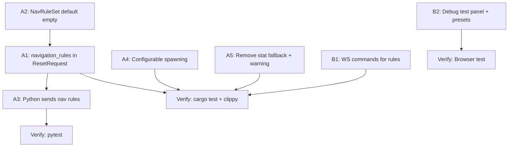

# AGENT ROLE: EXECUTION SPECIALIST

You are an **Execution Specialist** in a multi-agent DAG workflow.
You have been assigned ONE specific task. You implement it with surgical precision.

---

## Your Assignment

| Field   | Value |
|---------|-------|
| Task ID | `task_a4_configurable_spawning` |
| Feature | Contextless Audit + Debug Visualizer Contract |
| Tier    | standard |

---

## ⛔ MANDATORY PROCESS — ALL TIERS (DO NOT SKIP)

> **These rules apply to EVERY executor, regardless of tier. Violating them
> causes an automatic QA FAIL and project BLOCK.**

### Rule 1: Scope Isolation
- You may ONLY create or modify files listed in `Target_Files` in your Task Brief.
- If a file must be changed but is NOT in `Target_Files`, **STOP and report the gap** — do NOT modify it.
- NEVER edit `task_state.json`, `implementation_plan.md`, or any file outside your scope.

### Rule 2: Changelog (Handoff Documentation)
After ALL code is written and BEFORE calling `./task_tool.sh done`, you MUST:

1. **Create** `tasks_pending/task_a4_configurable_spawning_changelog.md`
2. **Include in the changelog:**
   - **Touched Files:** A bulleted list of every file you created or modified.
   - **Contract Fulfillment:** Brief confirmation of the interfaces/DTOs you implemented.
   - **Deviations/Notes:** Any edge cases you handled or deviations from the brief the QA agent should verify.
3. **Then and only then** run:
   ```bash
   ./task_tool.sh done task_a4_configurable_spawning
   ```

> **⚠️ Calling `./task_tool.sh done` without creating the changelog file is FORBIDDEN.**

### Rule 3: No Placeholders
- Do not use `// TODO`, `/* FIXME */`, or stub implementations.
- Output fully functional, production-ready code.

### Rule 4: Human Intervention Protocol
During execution, a human may intercept your work and propose changes, provide code snippets, or redirect your approach. When this happens:

1. **ADOPT the concept, VERIFY the details.** Humans are exceptional at architectural vision but make detail mistakes (wrong API, typos, outdated syntax). Independently verify all human-provided code against the actual framework version and project contracts.
2. **TRACK every human intervention in the changelog.** Add a dedicated `## Human Interventions` section to your changelog documenting:
   - What the human proposed (1-2 sentence summary)
   - What you adopted vs. what you corrected
   - Any deviations from the original task brief caused by the intervention
3. **DO NOT silently incorporate changes.** The QA agent and Architect must be able to trace exactly what came from the spec vs. what came from a human mid-flight. Untracked changes are invisible to the verification pipeline.

---

## Context Loading (Tier-Dependent)

**If your tier is `standard` or `advanced`:**

> **CRITICAL FIRST STEP:** The Planner might omit critical skills or knowledge in your `Context_Bindings`. It is YOUR responsibility to self-heal missing context.
1. Read `.agents/skills/index.md` (Skills Catalog)
2. Read `.agents/knowledge/README.md` (Master Knowledge Index)
   *(If you discover a skill or knowledge domain relevant to your task that isn't in your `Context_Bindings`, **read it immediately** before starting.)*
3. Read `.agents/context.md` — Thin index pointing to context sub-files
4. Load ONLY the `context/*` sub-files listed in your `Context_Bindings` below
5. Scan `.agents/knowledge/` — Lessons from previous sessions relevant to your task
6. Read `.agents/workflows/execution-lifecycle.md` — Your 4-step execution loop
7. Read `.agents/rules/execution-boundary.md` — Scope and contract constraints

_No additional context bindings specified._

---

## Task Brief

# Task A4: Configurable Initial Spawn System

**Task_ID:** task_a4_configurable_spawning
**Execution_Phase:** 1
**Model_Tier:** standard

## Target_Files
- `micro-core/src/config/simulation.rs`
- `micro-core/src/systems/spawning.rs`

## Dependencies
- None

## Context_Bindings
- context/architecture
- context/conventions
- skills/rust-code-standards

## Strict_Instructions

### Step 1: Add fields to `SimulationConfig` in `simulation.rs`

Add two new fields to `SimulationConfig`:

```rust
/// Number of factions to alternate between during initial spawn.
/// Default: 2 (faction 0 and faction 1).
pub initial_faction_count: u32,
/// Default stat values for initially spawned entities.
/// Each tuple is (stat_index, value). Default: [(0, 1.0)].
pub initial_stat_defaults: Vec<(usize, f32)>,
```

Update the `Default` impl to set:
```rust
initial_faction_count: 2,
initial_stat_defaults: vec![(0, 1.0)],
```

Update `test_default_config` to verify the new defaults:
```rust
assert_eq!(config.initial_faction_count, 2, "default faction count should be 2");
assert_eq!(config.initial_stat_defaults, vec![(0, 1.0)], "default stats should be [(0, 1.0)]");
```

### Step 2: Update `initial_spawn_system` in `spawning.rs`

Replace the hardcoded faction alternation and stat defaults:

**BEFORE:**
```rust
let faction = FactionId(if i % 2 == 0 { 0 } else { 1 });
```

**AFTER:**
```rust
let faction = FactionId(i % config.initial_faction_count);
```

**BEFORE:**
```rust
StatBlock::with_defaults(&[(0, 1.0)]),
```

**AFTER:**
```rust
StatBlock::with_defaults(&config.initial_stat_defaults),
```

### Step 3: Add test for configurable faction count

Add a new test in `spawning.rs`:

```rust
#[test]
fn test_initial_spawn_configurable_factions() {
    // Arrange
    let mut app = App::new();
    let mut config = SimulationConfig::default();
    config.world_width = 100.0;
    config.world_height = 100.0;
    config.initial_entity_count = 9;
    config.initial_faction_count = 3; // 3 factions instead of default 2
    app.insert_resource(config);
    app.insert_resource(NextEntityId(1));
    app.add_systems(Startup, initial_spawn_system);

    // Act
    app.update();

    // Assert — check that faction IDs 0, 1, 2 all appear
    let factions: Vec<u32> = app
        .world_mut()
        .query::<&FactionId>()
        .iter(app.world())
        .map(|f| f.0)
        .collect();
    assert!(factions.contains(&0), "Should have faction 0");
    assert!(factions.contains(&1), "Should have faction 1");
    assert!(factions.contains(&2), "Should have faction 2");
    assert_eq!(factions.iter().filter(|&&f| f == 0).count(), 3, "3 entities per faction");
}
```

### Step 4: Verify

```bash
cd micro-core && cargo test spawning && cargo test config && cargo clippy
```

## Verification_Strategy
  Test_Type: unit
  Acceptance_Criteria:
    - "SimulationConfig::default().initial_faction_count == 2"
    - "SimulationConfig::default().initial_stat_defaults == [(0, 1.0)]"
    - "initial_spawn_system uses config.initial_faction_count for faction assignment"
    - "initial_spawn_system uses config.initial_stat_defaults for stat initialization"
    - "cargo test passes with zero failures"
    - "cargo clippy passes with zero warnings"
  Suggested_Test_Commands:
    - "cd micro-core && cargo test spawning"
    - "cd micro-core && cargo test config::simulation"

---

## Shared Contracts

# Contextless Audit + Debug Visualizer Contract

## Background

After the Phase 3 completion and the subsequent decouple/file-splitting refactors, we need to:
1. **Verify** the micro-core and macro-brain modules are truly context-agnostic (no hidden game hardcoding)
2. **Define** a simple contract for the debug visualizer to test the micro-core algorithms standalone

---

## Part A: Contextless Audit Results

### ✅ CLEAN — Fully Context-Agnostic

| Module | Verdict | Why |
|--------|---------|-----|
| `FactionId` | ✅ | Numeric `u32`, no string semantics |
| `StatBlock` | ✅ | Anonymous `[f32; 8]`, core never interprets indices |
| `InteractionRuleSet` | ✅ | Empty default, config-driven |
| `RemovalRuleSet` | ✅ | Empty default, config-driven |
| `FactionBehaviorMode` | ✅ | Generic faction ID set |
| `MacroDirective` (8 variants) | ✅ | Abstract strategic commands |
| `SimulationConfig` | ✅ | Generic world dimensions, tick settings |
| `BuffConfig`, `DensityConfig` | ✅ | Generic multiplier/threshold resources |
| `ActiveZoneModifiers` | ✅ | Generic zone cost modifiers |
| `TerrainGrid` | ✅ | Cost-based pathfinding grid |
| `FactionVisibility` | ✅ | Generic fog-of-war |
| All ZMQ payloads | ✅ | Generic data carriers |
| `WsMessage::SyncDelta` | ✅ | Generic delta sync protocol |
| `ADAPTER_CONFIG` (JS) | ✅ | **Correct adapter pattern** — game semantics in config object |

### 🔴 ISSUES FOUND — Hidden Context in Core

#### Issue 1: `reset.rs:112-120` — Hardcoded navigation rules during reset

```rust
// Re-seed bidirectional chase so both factions approach each other
rules.nav.rules.push(NavigationRule {
    follower_faction: 0,
    target: NavigationTarget::Faction { faction_id: 1 },
});
rules.nav.rules.push(NavigationRule {
    follower_faction: 1,
    target: NavigationTarget::Faction { faction_id: 0 },
});
```

**Problem:** During `ResetEnvironment`, the core hardcodes a bidirectional chase between faction 0 and faction 1. This ASSUMES:
- Exactly 2 factions exist
- They should always chase each other

This is a **game-specific assumption** baked into the reset logic. The navigation rules should come from the Python `ResetRequest` payload.

#### Issue 2: `NavigationRuleSet::default()` — Two-faction assumption

```rust
fn default() -> Self {
    Self {
        rules: vec![
            NavigationRule { follower_faction: 0, target: Faction { faction_id: 1 } },
            NavigationRule { follower_faction: 1, target: Faction { faction_id: 0 } },
        ],
    }
}
```

**Problem:** Default assumes 2 factions chasing each other. Used by `main.rs:96` via `init_resource::<NavigationRuleSet>()`. Other rule sets (`InteractionRuleSet`, `RemovalRuleSet`) correctly default to **empty**. `NavigationRuleSet` should be consistent.

### 🟡 Additional Changes Needed

| Location | Issue | Resolution |
|----------|-------|------------|
| `spawning.rs:37` | Alternates faction 0/1 hardcoded | **A4:** Make configurable via `SimulationConfig` (default 2 factions) |
| `spawning.rs:54` | Stat 0 = 1.0 hardcoded | **A4:** Read from config defaults |
| `reset.rs:131` | Fallback `(0, 100.0)` assumes HP | **A5:** Remove fallback, use `StatBlock::default()` + warning log |
| `reset.rs:100-101` | Terrain defaults 60000/65535 | Acceptable — overridden by `terrain_thresholds` payload |

### 🟡 Doc Comments Only (Not Logic)

Several doc comments reference "swarm", "defender", "Frenzy", "damage" — these are design rationale documentation, not executable logic. They explain the *motivation* behind the abstraction, which is acceptable.

---

## Part A: Proposed Changes — Fix Hidden Context

> [!IMPORTANT]
> Two changes are needed to make the reset flow fully context-agnostic.

### Change A1: Add `navigation_rules` to ResetRequest payload

The Python macro-brain should send navigation rules during `ResetEnvironment`, just like it already sends `combat_rules`, `removal_rules`, etc.

#### [MODIFY] [directives.rs](file:///Users/manifera/Documents/Study/mass-swarm-ai-simulator/micro-core/src/bridges/zmq_protocol/directives.rs)

Add `navigation_rules` field to `AiResponse::ResetEnvironment`:
```rust
#[serde(default)]
navigation_rules: Option<Vec<NavigationRulePayload>>,
```

#### [NEW] NavigationRulePayload in [payloads.rs](file:///Users/manifera/Documents/Study/mass-swarm-ai-simulator/micro-core/src/bridges/zmq_protocol/payloads.rs)

```rust
/// Navigation rule from game profile (replaces NavigationRuleSet::default).
#[derive(Serialize, Deserialize, Debug, Clone, PartialEq)]
pub struct NavigationRulePayload {
    pub follower_faction: u32,
    pub target: NavigationTarget,
}
```

#### [MODIFY] [reset.rs](file:///Users/manifera/Documents/Study/mass-swarm-ai-simulator/micro-core/src/bridges/zmq_bridge/reset.rs)

- Add `navigation_rules: Option<Vec<NavigationRulePayload>>` to `ResetRequest`
- Replace hardcoded nav rules (lines 112-120) with:
```rust
// Apply navigation rules from payload, or default to empty
if let Some(nav_rules) = &reset.navigation_rules {
    for r in nav_rules {
        rules.nav.rules.push(crate::rules::NavigationRule {
            follower_faction: r.follower_faction,
            target: r.target.clone(),
        });
    }
} 
// If no navigation rules provided, leave nav empty — adapter's responsibility
```

### Change A2: Make `NavigationRuleSet::default()` empty

#### [MODIFY] [navigation.rs](file:///Users/manifera/Documents/Study/mass-swarm-ai-simulator/micro-core/src/rules/navigation.rs)

```rust
impl Default for NavigationRuleSet {
    /// Empty ruleset — no navigation unless explicitly configured by game profile.
    fn default() -> Self {
        Self { rules: vec![] }
    }
}
```

Update the test `test_navigation_rule_set_default` to assert empty rules.

### Change A3: Python sends navigation rules during reset

#### [MODIFY] [game_profile.py](file:///Users/manifera/Documents/Study/mass-swarm-ai-simulator/macro-brain/src/config/game_profile.py)

Add `navigation_rules_payload()` method:
```python
def navigation_rules_payload(self) -> list[dict]:
    """Serialize navigation rules for ZMQ ResetEnvironment payload."""
    return [
        {
            "follower_faction": f.id,
            "target": {"type": "Faction", "faction_id": self.bot_factions[0].id}
        }
        for f in self.factions
        if f.role == "brain"
    ] + [
        {
            "follower_faction": f.id,
            "target": {"type": "Faction", "faction_id": self.brain_faction.id}
        }
        for f in self.bot_factions
    ]
```

#### [MODIFY] [swarm_env.py](file:///Users/manifera/Documents/Study/mass-swarm-ai-simulator/macro-brain/src/env/swarm_env.py)

Add `navigation_rules` to the reset payload:
```python
self._socket.send_string(json.dumps({
    "type": "reset_environment",
    ...existing fields...,
    "navigation_rules": self.profile.navigation_rules_payload(),
}))
```

### Change A4: Configurable initial spawn system

#### [MODIFY] [simulation.rs](file:///Users/manifera/Documents/Study/mass-swarm-ai-simulator/micro-core/src/config/simulation.rs)

Add spawn config fields to `SimulationConfig`:
```rust
/// Number of factions to alternate between during initial spawn.
/// Default: 2 (faction 0 and faction 1).
pub initial_faction_count: u32,
/// Default stat values for initially spawned entities.
/// Default: [(0, 1.0)] — stat slot 0 set to 1.0.
pub initial_stat_defaults: Vec<(usize, f32)>,
```

#### [MODIFY] [spawning.rs](file:///Users/manifera/Documents/Study/mass-swarm-ai-simulator/micro-core/src/systems/spawning.rs)

Replace hardcoded faction alternation and stat defaults:
```rust
let faction = FactionId(i % config.initial_faction_count);
// ...
StatBlock::with_defaults(&config.initial_stat_defaults),
```

### Change A5: Remove stat fallback with warning log

#### [MODIFY] [reset.rs](file:///Users/manifera/Documents/Study/mass-swarm-ai-simulator/micro-core/src/bridges/zmq_bridge/reset.rs)

Replace the `(0, 100.0)` fallback with `StatBlock::default()` + warning:
```rust
let stat_defaults: Vec<(usize, f32)> = if spawn.stats.is_empty() {
    println!(
        "[Reset] WARNING: SpawnConfig for faction_{} has empty stats. \
         Entities will spawn with all-zero StatBlock. \
         The adapter (game profile) should provide explicit stat values."
        , spawn.faction_id
    );
    vec![]  // StatBlock::with_defaults(&[]) → all zeros
} else {
    spawn.stats.iter().map(|e| (e.index, e.value)).collect()
};
```

Also update the doc comment in `payloads.rs` to remove the `(HP=100)` reference:
```rust
/// Optional per-spawn stat overrides. Each entry is {index, value}.
/// If absent, defaults to all-zero StatBlock (adapter should provide explicit values).
```

---

## Part B: Debug Visualizer Contract

> [!IMPORTANT]
> The debug visualizer should be able to test micro-core algorithms **without** the Python macro-brain.

### Design Principle

The visualizer already connects via WebSocket and can send commands. The contract below formalizes the **minimum viable test protocol** — what the visualizer sends to exercise core algorithms (spawning, movement, flow fields, interaction) and what it receives back.

### Contract: Debug Visualizer ↔ Micro-Core (WebSocket)

#### B1: Outgoing — Visualizer → Rust (Commands)

Already existing commands that exercise core algorithms:

| Command | Purpose | Tests Algorithm |
|---------|---------|-----------------|
| `spawn_wave` | Spawn entities at position | Fibonacci spiral spawning |
| `pause` / `resume` | Toggle simulation | State machine |
| `set_speed` | Speed multiplier | Tick-based sim |
| `kill_all` | Remove faction entities | Removal system |
| `step` | Single-tick advance | All per-tick systems |
| `paint_terrain` | Modify terrain cells | TerrainGrid + flow field recalc |
| `set_faction_mode` | Toggle static/brain-driven | Behavior mode switching |
| `set_fog_faction` | Show fog for a faction | Visibility system |

**New commands needed for standalone testing:**

| Command | Payload | Purpose | Tests Algorithm |
|---------|---------|---------|-----------------|
| `set_navigation` | `{ follower_faction, target }` | Set/update navigation rules | Flow field pathfinding |
| `set_interaction` | `{ source_faction, target_faction, range, effects }` | Set interaction rules | Interaction + StatBlock drain |
| `set_removal` | `{ stat_index, threshold, condition }` | Set removal rules | Removal system |

#### B2: Incoming — Rust → Visualizer (Broadcast)

Existing `SyncDelta` message with `debug-telemetry` feature enabled:

```json
{
  "type": "SyncDelta",
  "tick": 1234,
  "moved": [
    { "id": 1, "x": 150.3, "y": 200.1, "dx": 0.5, "dy": -0.3, "faction_id": 0, "stats": [0.85, 0, 0, 0, 0, 0, 0, 0] }
  ],
  "removed": [42, 99],
  "telemetry": { "spatial_us": 120, "flow_field_us": 450, ... },
  "visibility": { "faction_id": 0, "grid_width": 50, "explored": [...], "visible": [...] },
  "zone_modifiers": [...],
  "active_sub_factions": [101, 102],
  "aggro_masks": { "masks": { "0_1": true } },
  "ml_brain": { "intervention_active": false, "python_connected": false, "last_directive": null },
  "density_heatmap": { "0": [...], "1": [...] }
}
```

### Proposed Changes — Debug Visualizer

#### [MODIFY] [ws_command.rs](file:///Users/manifera/Documents/Study/mass-swarm-ai-simulator/micro-core/src/systems/ws_command.rs)

Add 3 new command handlers:

1. **`set_navigation`** — Replaces NavigationRuleSet
2. **`set_interaction`** — Replaces InteractionRuleSet  
3. **`set_removal`** — Replaces RemovalRuleSet

These mirror the same config that Python sends via `ResetEnvironment`, but accessible from the browser for standalone testing.

#### [MODIFY] [config.js](file:///Users/manifera/Documents/Study/mass-swarm-ai-simulator/debug-visualizer/js/config.js)

No changes — the existing `ADAPTER_CONFIG` pattern is already the correct adapter layer.

#### [NEW] Debug test panel in the visualizer

An "Algorithm Test" panel in the debug visualizer UI with two sections:

**1. Preset Loader** — A dropdown + "Load" button that loads a complete game scenario from a preset config:
- Pre-fills spawn positions, navigation rules, interaction rules, removal rules
- Example preset: "Swarm vs Defender" (2 factions, bidirectional chase, proximity damage)
- Sends all rules via the new WS commands, then spawns entities
- **Does NOT include terrain** — terrain config stays in the existing Terrain Paint panel, allowing the user to set up terrain conditions independently

**2. Manual Controls** — Individual forms to:
- Set navigation rules (faction A → faction B or waypoint)
- Set interaction rules (source → target, range, stat effect)
- Set removal rules (stat index, threshold, condition)
- Each control sends the corresponding WS command directly

---

## Execution DAG



| Phase | Tasks | Parallel? |
|-------|-------|-----------|
| 1 | A2, A4, A5, B2 | ✅ All parallel (zero file overlap) |
| 2 | A1, B1 | ✅ Parallel (A1=zmq_protocol+reset, B1=ws_command) |
| 3 | A3 | Sequential (depends on A1 for new payload type) |

---

## File Summary

| File | Action | Task |
|------|--------|------|
| `micro-core/src/rules/navigation.rs` | MODIFY | A2 |
| `micro-core/src/config/simulation.rs` | MODIFY | A4 |
| `micro-core/src/systems/spawning.rs` | MODIFY | A4 |
| `micro-core/src/bridges/zmq_protocol/payloads.rs` | MODIFY | A1, A5 |
| `micro-core/src/bridges/zmq_protocol/directives.rs` | MODIFY | A1 |
| `micro-core/src/bridges/zmq_bridge/reset.rs` | MODIFY | A1, A5 |
| `macro-brain/src/config/game_profile.py` | MODIFY | A3 |
| `macro-brain/src/env/swarm_env.py` | MODIFY | A3 |
| `micro-core/src/systems/ws_command.rs` | MODIFY | B1 |
| `debug-visualizer/js/controls/` (new file) | NEW | B2 |
| `debug-visualizer/index.html` | MODIFY | B2 |

---

## Verification Plan

### Automated Tests
```bash
# Rust (after A1, A2, B1):
cd micro-core && cargo test && cargo test --doc && cargo clippy

# Python (after A3):
cd macro-brain && python -m pytest tests/ -v

# Smoke test (end-to-end):
cd micro-core && cargo run --features debug-telemetry -- --smoke-test
```

### Manual Verification
- Open debug visualizer in browser → verify algorithm test panel renders
- Spawn 2 factions → set navigation → observe entities move toward each other
- Set interaction rules → observe stat drain → observe removal

## Resolved Decisions

| Question | Decision |
|----------|----------|
| Q1: `initial_spawn_system` hardcodes 2 factions | **Make configurable** via `SimulationConfig` with default 2 factions (Task A4) |
| Q2: Debug test panel presets | **Yes, add preset button** that loads game config (rules + spawns). Terrain config stays separate in existing Terrain Paint panel |
| Q3: `SpawnConfig.stats` fallback `(0, 100.0)` | **Remove fallback**, use `StatBlock::default()` (all zeros) + **warning log** when stats are empty (Task A5) |

