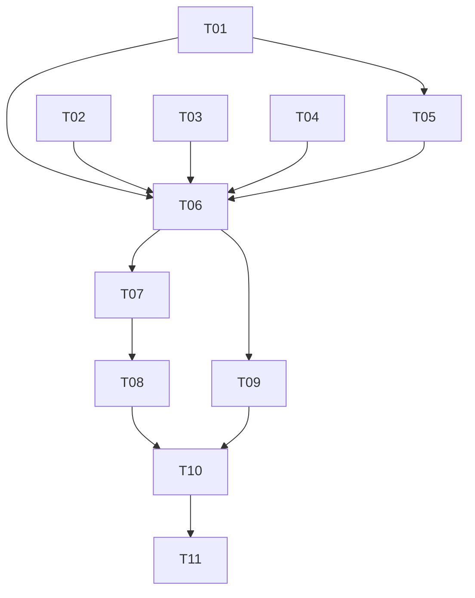

# Training Curriculum: Tactical Decision-Making (v3)

> **Goal:** Teach the model to: scout under fog of war → assess threats → prioritize targets → flank / lure protectors away from HVTs → split swarms for multi-pronged attacks.

## Table of Contents
1. [Model Architecture Decision](#1-model-architecture-decision)
2. [Action Space Design](#2-action-space-design)
3. [Observation Space (with Fog of War)](#3-observation-space-with-fog-of-war)
4. [8-Stage Curriculum](#4-8-stage-curriculum)
5. [Reward Architecture](#5-reward-architecture)
6. [MaskablePPO Learning Mechanics](#6-maskableppo-learning-mechanics)
7. [Implementation DAG](#7-implementation-dag)

---

## 1. Model Architecture Decision

### Recommendation: **MaskablePPO with MultiDiscrete Action Space**

`MaskablePPO` from `sb3-contrib` natively supports `MultiDiscrete`. The action space decomposes into:

```python
action_space = MultiDiscrete([8, 2500])
#                             │   └── flattened spatial coordinate (50×50 grid)
#                             └────── action type
```

- **Component 0:** Action type (8 discrete actions)
- **Component 1:** Flattened grid coordinate — single integer `0..2499`, decoded as `x = val % 50`, `y = val // 50`

> [!CAUTION]
> **Frankenstein Coordinate Fix:** Standard `MultiDiscrete([8, 50, 50])` treats X and Y as statistically independent. If enemies are at `(10, 10)` and `(40, 40)`, the network outputs high probs for `X ∈ {10, 40}` and `Y ∈ {10, 40}` independently — sampling `(10, 40)` or `(40, 10)` 50% of the time (empty space). **Flattening to a single `[8, 2500]` index preserves 2D spatial coherence.** One integer = one unambiguous grid cell.

### Custom Feature Extractor (Required)

> [!IMPORTANT]
> **SB3 cannot automatically route mixed-shape Dict observations** (2D grid images + 1D summary vector). A custom `BaseFeaturesExtractor` is mandatory.

```python
class TacticalExtractor(BaseFeaturesExtractor):
    """CNN for spatial grids + MLP for summary → concatenated embedding."""
    
    def __init__(self, observation_space, features_dim=256):
        super().__init__(observation_space, features_dim)
        # CNN branch: (8, 50, 50) grids → 128-dim embedding
        self.cnn = nn.Sequential(
            nn.Conv2d(8, 32, kernel_size=5, stride=2, padding=2),
            nn.ReLU(),
            nn.Conv2d(32, 64, kernel_size=3, stride=2, padding=1),
            nn.ReLU(),
            nn.Flatten(),
            nn.Linear(64 * 13 * 13, 128),
            nn.ReLU(),
        )
        # MLP branch: 12-dim summary → 64-dim embedding
        self.mlp = nn.Sequential(
            nn.Linear(12, 64),
            nn.ReLU(),
            nn.Linear(64, 64),
            nn.ReLU(),
        )
        # Combined: 128 + 64 = 192 → features_dim
        self.combiner = nn.Sequential(
            nn.Linear(192, features_dim),
            nn.ReLU(),
        )
    
    def forward(self, observations):
        # Stack all 8 grid channels into (B, 8, 50, 50) tensor
        grids = torch.stack([observations[f"ch{i}"] for i in range(8)], dim=1)
        cnn_out = self.cnn(grids)
        mlp_out = self.mlp(observations["summary"])
        return self.combiner(torch.cat([cnn_out, mlp_out], dim=1))
```

### Breaking Change: Fresh Start

> [!CAUTION]
> All previous training artifacts (`stage1_tactical.json`, `default_swarm_combat.json`) will be replaced. The old `TRAINING_STATUS.md` is kept as reference only.

---

## 2. Action Space Design

### Why AttackNearest/AttackFurthest Are Removed

> [!WARNING]
> **Known Bug (Oscillation Death Spiral):** When the model commands AttackFurthest and the swarm travels halfway, the target becomes nearest. If the model re-issues AttackFurthest, the swarm reverses — it oscillates between two groups until death. Absolute coordinate targeting (AttackCoord) eliminates this entirely.

### 8-Action Vocabulary (MultiDiscrete Component 0)

| Idx | Action | Coords? | Directive(s) Generated | Tactical Purpose |
|:---:|--------|:---:|------|------|
| 0 | **Hold** | ❌ | `Hold{brain}` | Stop, hold position |
| 1 | **AttackCoord** | ✅ | `UpdateNav{brain→Waypoint(x,y)}` | Move/attack specific location |
| 2 | **DropPheromone** | ✅ | `SetZoneModifier{brain, x,y, r=100, cost=-50}` | Attract swarm flow field |
| 3 | **DropRepellent** | ✅ | `SetZoneModifier{brain, x,y, r=100, cost=+50}` | Push swarm away |
| 4 | **SplitToCoord** | ✅ | `SplitFaction{brain→sub, 30%, epi=(x,y)}` + `UpdateNav{sub→Waypoint}` | Detach flanking group |
| 5 | **MergeBack** | ❌ | `MergeFaction{sub→brain}` | Recombine split |
| 6 | **Retreat** | ✅ | `Retreat{brain, x, y}` | Tactical withdraw |
| 7 | **Lure** | ✅ | `SplitFaction{brain→lure, 15%, epi=(x,y)}` + `SetAggroMask{lure↔patrol=true, lure↔target=false}` | Detach sacrifice bait |

### Coordinate Decoding

```python
def decode_spatial(flat_index: int, grid_width: int = 50) -> tuple[int, int]:
    """Decode flattened spatial coordinate to (grid_x, grid_y)."""
    grid_x = flat_index % grid_width
    grid_y = flat_index // grid_width
    return grid_x, grid_y

def grid_to_world(grid_x: int, grid_y: int, cell_size: float = 20.0) -> tuple[float, float]:
    """Convert grid cell to world coordinates (cell center)."""
    world_x = grid_x * cell_size + cell_size / 2.0
    world_y = grid_y * cell_size + cell_size / 2.0
    return world_x, world_y
```

### Action Masking Rules

```python
def action_masks(self) -> np.ndarray:
    # Component 0: action type mask (8 bools)
    act_mask = np.ones(8, dtype=bool)
    
    if not self._active_sub_factions:
        act_mask[5] = False  # MergeBack — no sub-factions to merge
    if len(self._active_sub_factions) >= 2:
        act_mask[4] = False  # SplitToCoord — max splits reached
        act_mask[7] = False  # Lure — max splits reached
    
    # Stage-based unlocking
    for i, unlocked in enumerate(self._stage_action_unlock):
        if not unlocked:
            act_mask[i] = False
    
    # Component 1: spatial coordinate mask (2500 bools)
    coord_mask = np.zeros(2500, dtype=bool)
    # Only unmask coordinates within the active map bounds
    for gy in range(self._active_grid_height):
        start = gy * 50  # row start in flattened 50-wide grid
        coord_mask[start : start + self._active_grid_width] = True
    
    return np.concatenate([act_mask, coord_mask])
```

### Action Sinking (Non-Spatial Actions)

When the model chooses Hold(0) or MergeBack(5), it still outputs a spatial coordinate. The `multidiscrete_to_directives` parser **ignores** the coordinate index for non-spatial actions. PPO's Critic will learn that coordinate variance during non-spatial actions has zero reward impact — spatial gradients flatten harmlessly.

---

## 3. Observation Space (with Fog of War)

### Fixed Tensor Shape: Always 50×50

> [!CAUTION]
> **Variable Tensor Crash Fix:** CNNs require fixed input shapes. The observation tensor is ALWAYS `(8, 50, 50)` regardless of the active map size. For smaller maps (e.g., Stage 1 uses a 500×500 world = 25×25 active grid), the active arena occupies the **center** of the 50×50 tensor. The outer padding zone is:
> - **Density channels:** 0.0 (no units)
> - **Terrain channel:** 1.0 (impassable wall) — CNN learns "edge of world = wall"
> - **Fog channels:** 1.0 (explored/visible) — so the model doesn't waste time trying to "scout" the padding

```
┌──────────────────────────── 50×50 tensor ────────────────────────────┐
│                       padding (terrain=wall)                         │
│    ┌───────────────────── 25×25 active ──────────────────────┐       │
│    │                                                         │       │
│    │   Active game arena (density, terrain, fog, etc.)       │       │
│    │                                                         │       │
│    └─────────────────────────────────────────────────────────┘       │
│                       padding (terrain=wall)                         │
└──────────────────────────────────────────────────────────────────────┘
```

**Coordinate masking synergy:** Action masks for component 1 (spatial coord) block all indices that map to padding cells. The model physically cannot command actions into the wall zone.

### 8 Grid Channels + 12-dim Summary

| Channel Key | Content | Notes |
|-------------|---------|-------|
| `ch0` | Brain faction density | "Where are my units?" |
| `ch1` | Enemy faction 1 density (**fog-gated + LKP**) | "Where is enemy A?" |
| `ch2` | Enemy faction 2 density (**fog-gated + LKP**) | "Where is enemy B?" |
| `ch3` | Sub-factions aggregated | "Where are my split groups?" |
| `ch4` | Terrain hard costs (normalized) | 0.0=passable, 1.0=wall. Padding zone = 1.0 |
| `ch5` | Fog explored (**LKP-aware**) | 0=unexplored, 1=explored. Padding = 1.0 |
| `ch6` | Fog currently visible | 0=hidden, 1=visible now. Padding = 1.0 |
| `ch7` | Threat density | Weighted enemy density (count × damage_rate) |

### Last Known Position (LKP) Memory Buffer

> [!IMPORTANT]
> **Fog Goldfish Memory Fix:** Standard PPO is feed-forward (zero temporal memory). If an enemy disappears back into fog, density drops to 0.0 and the model instantly "forgets" it exists.
>
> **Solution:** Externalize memory into the observation tensor. When an enemy is visible, record its density. When it leaves visibility, **decay** the last-known density by `−0.02 per evaluation tick` instead of zeroing instantly. This gives the PPO a "ghost trail" to track.

```python
class LKPBuffer:
    """Last Known Position memory — decays enemy density under fog."""
    
    def __init__(self, grid_h=50, grid_w=50, decay_rate=0.02, num_enemy_channels=2):
        self.decay_rate = decay_rate
        self.memory = [np.zeros((grid_h, grid_w), dtype=np.float32)
                       for _ in range(num_enemy_channels)]
    
    def update(self, channel_idx: int, live_density: np.ndarray, 
               visible_mask: np.ndarray):
        """Update memory for one enemy channel.
        
        - Where visible: overwrite with live density (ground truth)
        - Where NOT visible: decay stored density toward 0
        """
        mem = self.memory[channel_idx]
        # Visible cells: ground truth
        mem[visible_mask == 1] = live_density[visible_mask == 1]
        # Hidden cells: decay
        hidden = visible_mask == 0
        mem[hidden] = np.maximum(0.0, mem[hidden] - self.decay_rate)
        self.memory[channel_idx] = mem
    
    def get(self, channel_idx: int) -> np.ndarray:
        return self.memory[channel_idx]
    
    def reset(self):
        for mem in self.memory:
            mem.fill(0.0)
```

**Integration in vectorizer:** After receiving the raw density map and fog grids from Rust, the vectorizer passes each enemy channel through `LKPBuffer.update()` before writing to the observation dict.

### Enhanced Summary Vector (12 dims)

```python
summary = np.array([
    own_count / max_entities,         # 0: brain unit count
    total_enemy_count / max_entities,  # 1: total enemy count
    own_avg_hp / 100.0,               # 2: brain avg HP
    enemy_avg_hp / 100.0,             # 3: enemy avg HP
    sub_faction_count / 5.0,          # 4: active sub-factions
    active_zones_count / 10.0,        # 5: active zone modifiers
    trap_count / max_entities,         # 6: patrol/trap count
    target_count / max_entities,       # 7: target/HVT count
    fog_explored_pct,                  # 8: % map explored (0.0-1.0)
    float(has_sub_faction),            # 9: binary flag
    float(debuff_applied),             # 10: binary flag
    step_count / max_steps,            # 11: episode progress (time pressure)
], dtype=np.float32)
```

---

## 4. 8-Stage Curriculum

Each stage adds ONE new tactic. All stages use a **fixed 50×50 observation tensor** with center-padded active arenas.

### Stage Overview

```
Stage 1: Target Selection        → "Read density, aim at correct target"
Stage 2: Scouting                → "Navigate fog, find enemies, remember positions"
Stage 3: Coordinate Navigation   → "Navigate around walls via gap"
Stage 4: Pheromone Control       → "Shape flow fields to route swarm"
Stage 5: Flanking                → "Split and pincer from two angles"
Stage 6: Lure Tactics            → "Bait protectors away, strike HVT"
Stage 7: Protected Target        → "Fog + lure + flank vs guarded HVT"
Stage 8: Full Tactical           → "Random scenarios, deploy any tactic"
```

---

### Stage 1: Target Selection

| Property | Value |
|----------|-------|
| **World size** | 500×500 → active grid 25×25 (centered in 50×50 tensor, padding=wall) |
| **Fog of war** | OFF |
| **Factions** | Brain(50) • Trap(50) • Target(20) |
| **Actions** | Hold(0), AttackCoord(1) |
| **Bot behavior** | Both HoldPosition (stationary) |
| **Coord masking** | 0..24 in each axis (625 of 2500 cells active) |

**Lesson:** Read density grid → identify smaller blob at 20 units → output its grid cell coordinate to attack.

**Sub-stages:**
- 1a: Target at closer position, Trap farther → target is obvious (near + small)
- 1b: Target at farther position, Trap closer → must look past the big group
- 1c: Randomized positions → must read density, not just distance

**Graduation:** 80% WR, 200 episodes, 50 consecutive above threshold

---

### Stage 2: Scouting (Fog of War)

| Property | Value |
|----------|-------|
| **World size** | 800×800 → active grid 40×40 (centered in 50×50, pad=wall) |
| **Fog of war** | ON — brain starts with ~100px vision radius (5 cells) |
| **Factions** | Brain(50) • Target(25) |
| **Actions** | Hold(0), AttackCoord(1) |
| **Bot behavior** | Target = HoldPosition (hidden in fog) |
| **Coord masking** | 0..39 in each axis (1600 of 2500 cells active) |

**Lesson:** Map is foggy. Brain can't see Target. Must explore systematically to find it, then navigate to destroy it.

**Key LKP mechanic:** Once the brain scouts near the target, enemy density appears on `ch1`. If the brain moves away, density **decays slowly** (LKP buffer), giving the model a ghost trail to follow back.

**Map generation:** No terrain. Just fog. Target at random edge quadrant.

**Graduation:** 80% WR, avg episode length < 250 steps

> [!TIP]
> Exploration shaping: `+0.005 × new_cells_explored` per step. Decays to 0 once 80% map explored. Prevents aimless wandering.

---

### Stage 3: Coordinate Navigation (Walls)

| Property | Value |
|----------|-------|
| **World size** | 600×600 → active grid 30×30 (centered) |
| **Fog of war** | OFF |
| **Factions** | Brain(50) • Target(20) |
| **Actions** | Hold(0), AttackCoord(1) |
| **Bot behavior** | Target = HoldPosition (behind wall) |

**Lesson:** Walking into a wall wastes time. Find the gap, route through it.

**Map:** Horizontal wall across center with a 3-cell gap at random position.

**Graduation:** 80% WR, avg episode length < 200 steps

---

### Stage 4: Pheromone Flow Control

| Property | Value |
|----------|-------|
| **World size** | 600×600 → active grid 30×30 (centered) |
| **Fog of war** | OFF |
| **Factions** | Brain(50) • Target(30) |
| **Actions** | +DropPheromone(2), +DropRepellent(3) |
| **Bot behavior** | Target = HoldPosition (end of L-corridor) |

**Lesson:** Pheromone attracts flow → route swarm around the L-bend faster than pure pathfinding.

**Map:** L-shaped corridor. Brain at one end, Target at the other.

**Graduation:** 80% WR, avg episode length < 150 steps

---

### Stage 5: Flanking

| Property | Value |
|----------|-------|
| **World size** | 800×800 → active grid 40×40 (centered) |
| **Fog of war** | OFF |
| **Factions** | Brain(60) • Defender(40) |
| **Actions** | +SplitToCoord(4), +MergeBack(5) |
| **Bot behavior** | Defender = HoldPosition (center) |

**Lesson:** Split 30% of swarm → flank from two angles → reduced casualties.

**Flanking geometry:** Angle between main→enemy and sub→enemy vectors. Angle > 60° = flanking. Bonus scales up to 180° (full pincer).

**Graduation:** 80% WR, flanking_score > 0.3, avg survivors > 25

---

### Stage 6: Lure Tactics

| Property | Value |
|----------|-------|
| **World size** | 1000×1000 → active grid 50×50 (full tensor, no padding) |
| **Fog of war** | OFF |
| **Factions** | Brain(50) • Patrol(40) • Target(15) |
| **Actions** | +Retreat(6), +Lure(7) — **ALL 8 ACTIONS** |
| **Bot behavior** | Patrol = Charge towards nearest (chases lure); Target = HoldPosition |

**Lesson:** Lure group baits Patrol away → main body strikes Target.

**Lure survivability (all tunable — research iteration):**
- ✅ Patrol movement speed debuffed (−30%) — brain needs reaction time
- ✅ Lure group = 15–20% of swarm (tunable)
- ✅ Patrol has 2-second aggro delay (30 ticks) before chasing lure
- ✅ All values in profile JSON — no code changes to iterate

**Graduation:** 80% WR, lure_success_rate > 0.4 (target killed while patrol >200 units away)

---

### Stage 7: Protected Target (Combined)

| Property | Value |
|----------|-------|
| **World size** | 1000×1000 → full 50×50 tensor |
| **Fog of war** | ON |
| **Factions** | Brain(60) • Guard(50) • HVT(10) |
| **All 8 actions** |
| **Bot behavior** | Guard = Patrol (circles HVT); HVT = HoldPosition |

**Lesson:** Full tactical chain: Scout fog → find Guard+HVT → lure Guard away → strike HVT → merge → clean up.

**LKP critical here:** Guard patrols in/out of visibility. LKP decay keeps the guard's "ghost" on the grid so the model can plan around it.

**Map:** Procedural walls. HVT in semi-enclosed area.

**Graduation:** 75% WR, avg episode length < 300

---

### Stage 8: Full Tactical Randomization

| Property | Value |
|----------|-------|
| **World/Grid** | Random from pool of previous stage configs |
| **Fog of war** | Random (50% chance) |
| **Factions** | Random config from pool |
| **All 8 actions** |
| **Bot behavior** | Mixed (random from strategy pool per episode) |

**Scenario pool:** Stages 1, 2, 5, 6, 7 layouts randomly selected each episode.

**Graduation:** 80% WR over 500 episodes

---

### Curriculum Summary

| Stage | World | Active Grid | Pad? | Fog? | Actions | Factions | Lesson | WR |
|:---:|:---:|:---:|:---:|:---:|:---:|---|---|:---:|
| 1 | 500² | 25² | ✅ | ❌ | 0-1 | Brain/Trap/Target | Target selection | 80% |
| 2 | 800² | 40² | ✅ | ✅ | 0-1 | Brain/Target | Scouting + LKP | 80% |
| 3 | 600² | 30² | ✅ | ❌ | 0-1 | Brain/Target | Wall navigation | 80% |
| 4 | 600² | 30² | ✅ | ❌ | 0-3 | Brain/Target | Pheromone flow | 80% |
| 5 | 800² | 40² | ✅ | ❌ | 0-5 | Brain/Defender | Flanking | 80% |
| 6 | 1000² | 50² | ❌ | ❌ | 0-7 | Brain/Patrol/Target | Lure | 80% |
| 7 | 1000² | 50² | ❌ | ✅ | 0-7 | Brain/Guard/HVT | Combined | 75% |
| 8 | Random | Random | varies | varies | 0-7 | Random | Generalize | 80% |

> [!IMPORTANT]
> **Fixed tensor shape across all stages:** Observation is always `(8, 50, 50)`. Action space is always `MultiDiscrete([8, 2500])`. Only the coordinate mask and arena padding change between stages — the neural network architecture never changes. This enables **curriculum transfer**: CNN filters learned in Stage 1 ("density blob → coordinate") transfer directly to Stage 5+ when new actions unlock.

---

## 5. Reward Architecture

### Components

| # | Component | Formula | Scale | Stages |
|---|-----------|---------|:---:|:---:|
| 1 | Time penalty | `−0.01` / step | constant | All |
| 2 | Kill trading | `+0.05` per kill, `−0.03` per death | constant | All |
| 3 | Win terminal | `+10.0` | constant | All |
| 4 | Loss terminal | `−10.0` | constant | All |
| 5 | Survival bonus | `+5.0 × (survivors/starting)` on win | constant | All |
| 6 | Approach reward | `+0.02 × distance_closed` to nearest enemy | shaped | All |
| 7 | Exploration reward | `+0.005 × new_cells_explored` (decay at 80%) | shaped | 2, 7–8 |
| 8 | Threat priority | `+2.0` when smaller/weaker group killed first | sparse | 1+ |
| 9 | Flanking geometry | `+0.1 × angle_score` (main↔sub angle) | shaped | 5+ |
| 10 | Lure success | `+3.0` when HVT killed while patrol >200u away | sparse | 6+ |
| 11 | Debuff bonus | `+2.0` when debuff triggered | sparse | 6+ |
| 12 | Timeout penalty | `loss_terminal (−10.0)` on timeout | constant | All |

### Gradient: **Tactical Win (+18..+22) ≫ Brute Force Win (+8..+12) > Loss (−11..−13) ≈ Timeout (−11..−15)**

---

## 6. MaskablePPO Learning Mechanics

Reference notes for debugging training stalls. Executors implementing the pipeline must understand these:

### Surgical Pruning (Logit Masking)
When the Actor outputs raw logits, the action mask applies `−∞` to locked actions **before** softmax. Locked actions get exactly 0.0% probability. In Stage 1, the model wastes zero gradient updates exploring DropPheromone(2) or Lure(7) — they're physically unreachable.

### Action Sinking (Harmless Coordinate Noise)
The model outputs `[action_type, spatial_coord]` every step. When action is Hold(0) or MergeBack(5), the spatial coordinate is **discarded** by `multidiscrete_to_directives`. PPO's Critic learns that coordinate variance during non-spatial actions has zero reward impact. The spatial gradients naturally flatten — no explicit handling needed.

### Curriculum Transfer Synergy
Because the observation tensor is strictly `(8, 50, 50)` via padding, the CNN filters learned in early stages transfer directly:
- Stage 1: learns "density blob at grid cell → output that cell index" (spatial aim)
- Stage 5: when SplitToCoord unlocks, the model already knows HOW to aim — it just learns WHEN to split instead of attack
- Stage 7: fog channels were zero-filled in earlier stages (fog=off → all explored/visible = 1.0) so the CNN has already learned to attend to them without crashes; now they carry real signal

---

## 7. Implementation DAG

### Phase 1: Foundation (Parallel — no file collisions)

| Task | Files | Tier | Description |
|------|-------|:---:|-------------|
| **T01** | `macro-brain/src/env/spaces.py` | standard | Action space → `MultiDiscrete([8, 2500])`. Observation → Dict of 8×(50,50) grids + 12-dim summary. Add padding/masking helpers. |
| **T02** | `macro-brain/src/env/rewards.py`, `macro-brain/src/config/definitions.py` | standard | New reward components (exploration, flanking, lure, threat priority). Extend `RewardWeights` dataclass. |
| **T03** | `macro-brain/src/utils/vectorizer.py`, `macro-brain/src/utils/lkp_buffer.py` **[NEW]** | standard | LKP memory buffer. Fog-gated enemy density with decay. Center-padding for variable maps. 8-channel output + 12-dim summary. |
| **T04** | `micro-core/src/bridges/zmq_protocol/types.rs`, `micro-core/src/bridges/zmq_bridge/systems.rs` | standard | Add `fog_explored: Vec<u8>`, `fog_visible: Vec<u8>` to ZMQ state snapshot for brain faction's visibility grids. |

### Phase 2: Core Logic (Depends on Phase 1)

| Task | Files | Tier | Description |
|------|-------|:---:|-------------|
| **T05** | `macro-brain/src/env/actions.py` | standard | `multidiscrete_to_directives([action_type, flat_coord])` — decode flat coord to (gx,gy), then to world coords. Ignore coords for non-spatial actions. |
| **T06** | `macro-brain/src/env/swarm_env.py` | advanced | Full env refactor: MultiDiscrete, LKP integration, center-padding, stage-aware masking, patrol debuff, lure tracking. |
| **T07** | `macro-brain/src/training/curriculum.py` | standard | 8-stage spawn generators. Map size configs. Wall/L-corridor/procedural terrain. Fog toggle. Padding offset calculation. |

### Phase 3: Training Pipeline (Depends on Phase 2)

| Task | Files | Tier | Description |
|------|-------|:---:|-------------|
| **T08** | `macro-brain/src/training/callbacks.py` | standard | 8-action logging. Fog/lure/flanking/LKP metrics. Per-stage graduation with coord masking. |
| **T09** | `macro-brain/src/models/feature_extractor.py` **[NEW]**, `macro-brain/src/training/train.py` | standard | Custom `TacticalExtractor` (CNN+MLP). Model creation with `policy_kwargs={"features_extractor_class": TacticalExtractor}`. |
| **T10** | `macro-brain/profiles/tactical_curriculum.json` | basic | New GameProfile: all 8 stages, reward weights, bot behaviors, map sizes, fog toggles, lure tuning params. |

### Phase 4: Integration (Sequential)

| Task | Files | Tier | Description |
|------|-------|:---:|-------------|
| **T11** | Multiple | advanced | Integration tests: smoke all stages, verify LKP decay, padding correctness, coord masking, reward gradients, CNN shape compatibility. |

### Dependency Graph



---

## Verification Plan

### Automated Tests
- **Unit:** LKP buffer decay, center-padding, coordinate decode/encode, action masking at each stage, reward component arithmetic
- **Shape tests:** Verify observation dict shapes are always `(8, 50, 50)` + `(12,)` across all stage configs
- **CNN forward pass:** Feed random obs through `TacticalExtractor` → confirm output shape matches `features_dim`
- **Smoke:** `./train.sh --profile profiles/tactical_curriculum.json --timesteps 0`

### Integration (1000 timesteps each)
- Stages 1–3: Verify rewards in expected ranges, no NaN, no ZMQ desync
- Stage 2: Confirm LKP ghost density appears after target leaves fog
- Stage 5: Confirm flanking_score metric logged correctly
- Stage 6: Confirm patrol speed debuff active, lure aggro mask set

### Manual
- TensorBoard: reward curves, action distributions, exploration %, lure rate
- Debug Visualizer: watch scouting, flanking, lure patterns emerge
