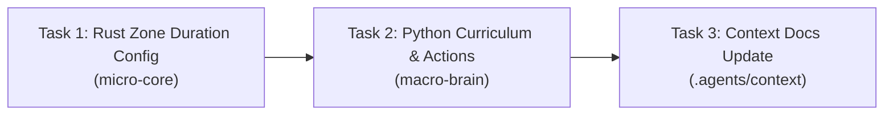

# Curriculum Stage 2 & 3 Adjustment

Based on the [strategy_brief.md](file:///Users/manifera/Documents/GitHub/mass-swarm-ai-simulator/strategy_brief.md) diagnosis, three root-cause issues prevent the RL model from learning Pheromone and Repellent abilities in Stages 2 and 3. This plan addresses all three with minimal, targeted changes.

## Problem Summary

| Issue | Root Cause | Impact |
|-------|-----------|--------|
| **Zone Duration Too Short** | `ticks_remaining: 120` hardcoded in Rust executor | Zones expire before the next RL step evaluates (150 ticks/step). Abilities are mathematically useless. |
| **Stage 3 Terrain Exploit** | `hard_cost = 300` on danger zones | Flow field auto-routes around traps. Agent wins without ever using DropRepellent. |
| **Repellent Cost Too Weak** | `cost_modifier = +50` in `actions.py` | Even if Stage 3 terrain is fixed (cost 100), +50 only raises to 150 — not high enough to meaningfully repel when the direct path is much shorter. Should be +200 per [conventions.md](file:///Users/manifera/Documents/GitHub/mass-swarm-ai-simulator/.agents/context/conventions.md#L160) and [ipc-protocol.md](file:///Users/manifera/Documents/GitHub/mass-swarm-ai-simulator/.agents/context/ipc-protocol.md#L151). |
| **Navigation Persistence** | Zone modifier replaces AttackCoord | When Brain casts Pheromone/Repellent, it stops moving because the zone directive replaces the navigation directive. |

---

## User Review Required

> [!IMPORTANT]
> **Zone duration value**: The strategy brief recommends 1500 ticks (10 RL steps). This is transmitted from Python → Rust via the existing `SetZoneModifier` directive, which currently has no `ticks_remaining` field — it's hardcoded at 120 in Rust. We need to either:
> - **(A)** Add a `zone_modifier_duration_ticks` field to `AbilityConfigPayload` (configurable per-reset, all zones share the same duration) — **Recommended**
> - **(B)** Add a `ticks_remaining` field to the `SetZoneModifier` directive itself (per-zone configurable)
>
> I recommend **Option A** because the zone duration is a game-level parameter (like buff cooldown), not a per-cast decision. This keeps the directive slim and the config cohesive.

> [!WARNING]
> **Navigation persistence** adds a `_last_nav_directive` cache to `SwarmEnv`. This means casting Pheromone/Repellent will automatically replay the last AttackCoord directive alongside the zone modifier. If the agent has never issued AttackCoord (e.g., first step is DropPheromone), no replay occurs — an `Idle` is sent. This is the correct behavior (can't replay what doesn't exist).

---

## Proposed Changes

### Rust Micro-Core — Zone Duration Config

#### [MODIFY] [payloads.rs](file:///Users/manifera/Documents/GitHub/mass-swarm-ai-simulator/micro-core/src/bridges/zmq_protocol/payloads.rs)

Add `zone_modifier_duration_ticks` to `AbilityConfigPayload`:

```rust
#[derive(Serialize, Deserialize, Debug, Clone, PartialEq)]
pub struct AbilityConfigPayload {
    pub buff_cooldown_ticks: u32,
    #[serde(default)]
    pub movement_speed_stat: Option<usize>,
    #[serde(default)]
    pub combat_damage_stat: Option<usize>,
    /// Duration in ticks for SetZoneModifier effects.
    /// Default: 120 (~2 seconds at 60 TPS).
    #[serde(default = "default_zone_duration")]
    pub zone_modifier_duration_ticks: u32,
}

fn default_zone_duration() -> u32 { 120 }
```

---

#### [MODIFY] [buff.rs](file:///Users/manifera/Documents/GitHub/mass-swarm-ai-simulator/micro-core/src/config/buff.rs)

Add `zone_modifier_duration_ticks` to `BuffConfig` resource:

```rust
#[derive(Resource, Debug, Clone, Default)]
pub struct BuffConfig {
    pub cooldown_ticks: u32,
    pub movement_speed_stat: Option<usize>,
    pub combat_damage_stat: Option<usize>,
    /// Duration for SetZoneModifier effects. Default: 120.
    pub zone_modifier_duration_ticks: u32,
}
```

Default implementation should set `zone_modifier_duration_ticks: 120` to preserve backward compatibility.

---

#### [MODIFY] [reset.rs](file:///Users/manifera/Documents/GitHub/mass-swarm-ai-simulator/micro-core/src/bridges/zmq_bridge/reset.rs)

Wire `zone_modifier_duration_ticks` from the payload into `BuffConfig`:

```rust
// In reset_environment_system, after existing ability_config block:
if let Some(cfg) = &reset.ability_config {
    buff_config.cooldown_ticks = cfg.buff_cooldown_ticks;
    buff_config.movement_speed_stat = cfg.movement_speed_stat;
    buff_config.combat_damage_stat = cfg.combat_damage_stat;
    buff_config.zone_modifier_duration_ticks = cfg.zone_modifier_duration_ticks;
}
```

---

#### [MODIFY] [executor.rs](file:///Users/manifera/Documents/GitHub/mass-swarm-ai-simulator/micro-core/src/systems/directive_executor/executor.rs)

Replace hardcoded `120` with the config value. Add `Res<BuffConfig>` to system params:

```rust
pub fn directive_executor_system(
    // ... existing params ...
    buff_config: Res<BuffConfig>,  // ADD THIS
) {
    // ... in SetZoneModifier match arm:
    MacroDirective::SetZoneModifier { .. } => {
        zones.zones.push(ZoneModifier {
            target_faction,
            x, y, radius, cost_modifier,
            ticks_remaining: buff_config.zone_modifier_duration_ticks,
            //              ^^^^^^^^^^^^^^^^^^^^^^^^^^^^^^^^^^^^^^^^
            //              was: 120
        });
    }
}
```

---

### Python Macro-Brain — Terrain, Actions, Navigation

#### [MODIFY] [curriculum.py](file:///Users/manifera/Documents/GitHub/mass-swarm-ai-simulator/macro-brain/src/training/curriculum.py)

Fix `_terrain_open_with_danger_zones` to set danger zones to `hard_cost = 100` (normal ground):

```python
def _terrain_open_with_danger_zones(config: StageMapConfig, seed: int) -> dict:
    """Stage 3: Open field — danger zones are NORMAL COST terrain.

    The direct path goes straight through trap spawn positions at cost 100.
    The flow field will route directly through them by default.
    The agent MUST cast DropRepellent (+200 cost) on these zones to
    push the flow field around the traps.

    Danger centers are marked with soft_cost = 40 (visual mud markers)
    so the observation space can detect them, but they don't affect pathfinding.
    """
    w, h = config.active_grid_w, config.active_grid_h
    hard_costs = [100] * (w * h)
    soft_costs = [100] * (w * h)

    danger_centers = [
        (12, 9),   # (250/20, 180/20)
        (10, 17),  # (200/20, 350/20)
        (19, 14),  # (380/20, 280/20)
    ]
    danger_radius = 3

    for cx, cy in danger_centers:
        for dy in range(-danger_radius, danger_radius + 1):
            for dx in range(-danger_radius, danger_radius + 1):
                gx, gy = cx + dx, cy + dy
                if 0 <= gx < w and 0 <= gy < h:
                    if dx * dx + dy * dy <= danger_radius * danger_radius:
                        # hard_cost stays 100 (normal) — pathfinder goes THROUGH
                        # soft_cost = 40 (visual marker, slight speed reduction)
                        soft_costs[gy * w + gx] = 40

    return {
        "hard_costs": hard_costs,
        "soft_costs": soft_costs,
        "width": w,
        "height": h,
        "cell_size": config.cell_size,
    }
```

---

#### [MODIFY] [actions.py](file:///Users/manifera/Documents/GitHub/mass-swarm-ai-simulator/macro-brain/src/env/actions.py)

**Fix 1:** Repellent cost modifier `+50` → `+200`:

```python
elif action_type == ACTION_DROP_REPELLENT:
    directives.append(build_set_zone_modifier_directive(
        brain_faction, world_x, world_y,
        radius=100.0, cost_modifier=200.0,  # was 50.0
    ))
```

**Fix 2:** Add navigation persistence — cache and replay last navigation directive when casting zone modifiers:

```python
def multidiscrete_to_directives(
    action, brain_faction, active_sub_factions,
    cell_size=20.0, pad_offset_x=0.0, pad_offset_y=0.0,
    split_percentage=0.30, scout_percentage=0.10,
    last_nav_directive=None,  # NEW: cached last nav for replay
) -> tuple[list[dict], dict | None]:
    """Map MultiDiscrete action to directive list.

    Returns:
        Tuple of (directives, updated_last_nav_directive).
        The caller caches the second element for the next step.
    """
    # ... existing decode logic ...
    
    updated_nav = last_nav_directive  # default: no change

    if action_type == ACTION_ATTACK_COORD:
        nav = build_update_nav_directive(brain_faction, target_waypoint=(world_x, world_y))
        directives.append(nav)
        updated_nav = nav  # cache this
    
    elif action_type in (ACTION_DROP_PHEROMONE, ACTION_DROP_REPELLENT):
        # Zone modifier + replay last navigation
        cost = -50.0 if action_type == ACTION_DROP_PHEROMONE else 200.0
        directives.append(build_set_zone_modifier_directive(
            brain_faction, world_x, world_y,
            radius=100.0, cost_modifier=cost,
        ))
        if last_nav_directive is not None:
            directives.append(last_nav_directive)
    
    # ... rest of handlers (also cache nav for Retreat) ...
    
    return directives, updated_nav
```

---

#### [MODIFY] [swarm_env.py](file:///Users/manifera/Documents/GitHub/mass-swarm-ai-simulator/macro-brain/src/env/swarm_env.py)

Wire the navigation cache:

```python
# In __init__:
self._last_nav_directive: dict | None = None

# In reset():
self._last_nav_directive = None

# In step():
brain_directive, self._last_nav_directive = multidiscrete_to_directives(
    action, ...,
    last_nav_directive=self._last_nav_directive,
)
```

---

#### [MODIFY] [game_profile.py](file:///Users/manifera/Documents/GitHub/mass-swarm-ai-simulator/macro-brain/src/config/game_profile.py)

Add `zone_modifier_duration_ticks` to `ability_config_payload()`:

```python
def ability_config_payload(self) -> dict:
    return {
        "buff_cooldown_ticks": self.abilities.buff_cooldown_ticks,
        "movement_speed_stat": self.abilities.movement_speed_stat,
        "combat_damage_stat": self.abilities.combat_damage_stat,
        "zone_modifier_duration_ticks": self.abilities.zone_modifier_duration_ticks,
    }
```

---

#### [MODIFY] [definitions.py](file:///Users/manifera/Documents/GitHub/mass-swarm-ai-simulator/macro-brain/src/config/definitions.py)

Add `zone_modifier_duration_ticks` to `AbilitiesDef`:

```python
@dataclass(frozen=True)
class AbilitiesDef:
    buff_cooldown_ticks: int
    movement_speed_stat: int
    combat_damage_stat: int
    activate_buff: ActivateBuffDef
    zone_modifier_duration_ticks: int = 1500  # default: ~10 RL steps
```

---

#### [MODIFY] [tactical_curriculum.json](file:///Users/manifera/Documents/GitHub/mass-swarm-ai-simulator/macro-brain/profiles/tactical_curriculum.json)

Add `zone_modifier_duration_ticks` to the abilities section:

```json
"abilities": {
    "buff_cooldown_ticks": 180,
    "movement_speed_stat": 1,
    "combat_damage_stat": 2,
    "zone_modifier_duration_ticks": 1500,
    "activate_buff": { ... }
}
```

---

### Context Documentation Updates

#### [MODIFY] [engine-mechanics.md](file:///Users/manifera/Documents/GitHub/mass-swarm-ai-simulator/.agents/context/engine-mechanics.md)

Update Section 6 (Pheromone & Repellent) to reflect configurable duration and remove "hardcoded" language.

#### [MODIFY] [ipc-protocol.md](file:///Users/manifera/Documents/GitHub/mass-swarm-ai-simulator/.agents/context/ipc-protocol.md)

Update Zone Modifier Details (line 152) to reflect the new configurable duration.

#### [MODIFY] [training-curriculum.md](file:///Users/manifera/Documents/GitHub/mass-swarm-ai-simulator/.agents/context/training-curriculum.md)

Update Stage 3 description to reflect `hard_cost = 100` (not 300).

---

## DAG Execution Phases



### Phase 1 (Sequential — Rust first)
| Task | Tier | Target Files |
|------|------|-------------|
| Task 1: Zone Duration Config | `standard` | `payloads.rs`, `buff.rs`, `reset.rs`, `executor.rs` |

### Phase 2 (After Phase 1)
| Task | Tier | Target Files |
|------|------|-------------|
| Task 2: Python Curriculum & Actions | `standard` | `curriculum.py`, `actions.py`, `swarm_env.py`, `game_profile.py`, `definitions.py`, `tactical_curriculum.json` |

### Phase 3 (After Phase 2)
| Task | Tier | Target Files |
|------|------|-------------|
| Task 3: Context Docs | `basic` | `engine-mechanics.md`, `ipc-protocol.md`, `training-curriculum.md` |

---

## File Summary

| File | Change Type | Description |
|------|-----------|-------------|
| `micro-core/src/bridges/zmq_protocol/payloads.rs` | Modify | Add `zone_modifier_duration_ticks` to `AbilityConfigPayload` |
| `micro-core/src/config/buff.rs` | Modify | Add `zone_modifier_duration_ticks` to `BuffConfig` |
| `micro-core/src/bridges/zmq_bridge/reset.rs` | Modify | Wire new field from payload to `BuffConfig` |
| `micro-core/src/systems/directive_executor/executor.rs` | Modify | Read duration from `BuffConfig` instead of hardcoded `120` |
| `macro-brain/src/training/curriculum.py` | Modify | Fix Stage 3 terrain: `hard_cost` 300 → 100, mark with `soft_cost` 40 |
| `macro-brain/src/env/actions.py` | Modify | Fix Repellent cost +50 → +200; add nav persistence for zone actions |
| `macro-brain/src/env/swarm_env.py` | Modify | Cache `_last_nav_directive` for action persistence |
| `macro-brain/src/config/game_profile.py` | Modify | Pass `zone_modifier_duration_ticks` in ability payload |
| `macro-brain/src/config/definitions.py` | Modify | Add `zone_modifier_duration_ticks` field to `AbilitiesDef` |
| `macro-brain/profiles/tactical_curriculum.json` | Modify | Add `zone_modifier_duration_ticks: 1500` |
| `.agents/context/engine-mechanics.md` | Modify | Update zone modifier docs |
| `.agents/context/ipc-protocol.md` | Modify | Update zone duration docs |
| `.agents/context/training-curriculum.md` | Modify | Update Stage 3 description |

---

## Verification Plan

### Automated Tests

```bash
# Rust: existing tests + verify new config field
cd micro-core && cargo test

# Python: curriculum, actions, and integration tests
cd macro-brain && .venv/bin/python -m pytest tests/ -v
```

### Manual Verification

1. **Zone Duration**: Start training, observe that zone modifiers persist across multiple RL steps (visible in debug visualizer as sustained cost overlays).
2. **Stage 3 Fix**: Run a Stage 3 episode in debug visualizer — confirm the flow field routes the swarm THROUGH trap positions by default (since hard_cost is 100). Then manually test DropRepellent to verify it creates an avoidance zone.
3. **Repellent Strength**: Verify +200 cost modifier creates a strong avoidance zone in the flow field (effective cost = 300 vs surrounding 100).
4. **Navigation Persistence**: Cast DropPheromone during an AttackCoord movement — verify the swarm continues moving toward the target coordinate while the zone modifier is active.

---

## Open Questions

None — the strategy brief is comprehensive and all design decisions are clear. The only decision point (Option A vs B for zone duration config) is documented in the "User Review Required" section above.
