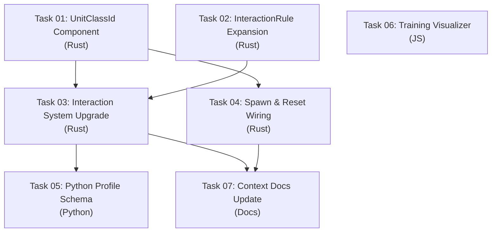

# AGENT ROLE: EXECUTION SPECIALIST

You are an **Execution Specialist** in a multi-agent DAG workflow.
You have been assigned ONE specific task. You implement it with surgical precision.

---

## Your Assignment

| Field   | Value |
|---------|-------|
| Task ID | `task_03_interaction_system_upgrade` |
| Feature | Heterogeneous Swarm Mechanics & Training Visualizer |
| Tier    | standard |

---

## ⛔ MANDATORY PROCESS — ALL TIERS (DO NOT SKIP)

> **These rules apply to EVERY executor, regardless of tier. Violating them
> causes an automatic QA FAIL and project BLOCK.**

### Rule 1: Scope Isolation
- You may ONLY create or modify files listed in `Target_Files` in your Task Brief.
- If a file must be changed but is NOT in `Target_Files`, **STOP and report the gap** — do NOT modify it.
- NEVER edit `task_state.json`, `implementation_plan.md`, or any file outside your scope.

### Rule 2: Changelog (Handoff Documentation)
After ALL code is written and BEFORE calling `./task_tool.sh done`, you MUST:

1. **Create** `tasks_pending/task_03_interaction_system_upgrade_changelog.md`
2. **Include in the changelog:**
   - **Touched Files:** A bulleted list of every file you created or modified.
   - **Contract Fulfillment:** Brief confirmation of the interfaces/DTOs you implemented.
   - **Deviations/Notes:** Any edge cases you handled or deviations from the brief the QA agent should verify.
3. **Then and only then** run:
   ```bash
   ./task_tool.sh done task_03_interaction_system_upgrade
   ```

> **⚠️ Calling `./task_tool.sh done` without creating the changelog file is FORBIDDEN.**

### Rule 3: No Placeholders
- Do not use `// TODO`, `/* FIXME */`, or stub implementations.
- Output fully functional, production-ready code.

### Rule 4: Human Intervention Protocol
During execution, a human may intercept your work and propose changes, provide code snippets, or redirect your approach. When this happens:

1. **ADOPT the concept, VERIFY the details.** Humans are exceptional at architectural vision but make detail mistakes (wrong API, typos, outdated syntax). Independently verify all human-provided code against the actual framework version and project contracts.
2. **TRACK every human intervention in the changelog.** Add a dedicated `## Human Interventions` section to your changelog documenting:
   - What the human proposed (1-2 sentence summary)
   - What you adopted vs. what you corrected
   - Any deviations from the original task brief caused by the intervention
3. **DO NOT silently incorporate changes.** The QA agent and Architect must be able to trace exactly what came from the spec vs. what came from a human mid-flight. Untracked changes are invisible to the verification pipeline.

---

## Context Loading (Tier-Dependent)

**If your tier is `standard` or `advanced`:**

> **CRITICAL FIRST STEP:** The Planner might omit critical skills or knowledge in your `Context_Bindings`. It is YOUR responsibility to self-heal missing context.
1. Read `.agents/skills/index.md` (Skills Catalog)
2. Read `.agents/knowledge/README.md` (Master Knowledge Index)
   *(If you discover a skill or knowledge domain relevant to your task that isn't in your `Context_Bindings`, **read it immediately** before starting.)*
3. Read `.agents/context.md` — Thin index pointing to context sub-files
4. Load ONLY the `context/*` sub-files listed in your `Context_Bindings` below
5. Scan `.agents/knowledge/` — Lessons from previous sessions relevant to your task
6. Read `.agents/workflows/execution-lifecycle.md` — Your 4-step execution loop
7. Read `.agents/rules/execution-boundary.md` — Scope and contract constraints

_No additional context bindings specified._

---

## Task Brief

# Task 03: Interaction System Upgrade

**Task_ID:** `task_03_interaction_system_upgrade`
**Feature:** Heterogeneous Swarm Mechanics
**Execution_Phase:** 2 (Sequential — after T01 and T02)
**Model_Tier:** `advanced`

## Target_Files
- `micro-core/src/systems/interaction.rs` [MODIFY]

## Dependencies
- T01: `UnitClassId` component exists in `crate::components::UnitClassId`
- T02: Expanded `InteractionRule` (with `source_class`, `target_class`, `range_stat_index`, `mitigation`, `cooldown_ticks`), `MitigationRule`, `MitigationMode`, `CooldownTracker`

## Context_Bindings
- `context/engine-mechanics`
- `context/conventions`
- `skills/rust-code-standards`
- `implementation_plan_feature_1.md` (Task 03 section)

## Contract Reference
See `implementation_plan_feature_1.md` → Task 03 for detailed architectural notes.

## Strict_Instructions

### Overview

Upgrade `interaction_system` in `micro-core/src/systems/interaction.rs` to support:
1. **Unit class filtering** (source_class / target_class)
2. **Dynamic range from StatBlock** (range_stat_index)
3. **Stat-driven mitigation** (PercentReduction / FlatReduction)
4. **Per-entity cooldowns** (cooldown_ticks via CooldownTracker)

### 1. Expand Query to Include UnitClassId

Change the read-only query from:
```rust
q_ro: Query<(Entity, &Position, &FactionId, &EntityId)>,
```
to:
```rust
q_ro: Query<(Entity, &Position, &FactionId, &EntityId, &UnitClassId)>,
```

Add import: `use crate::components::UnitClassId;`

### 2. Add CooldownTracker to System Parameters

Add parameter: `mut cooldowns: ResMut<crate::config::CooldownTracker>`

At the **start** of the system (before the entity loop), call `cooldowns.tick()` to decrement all active cooldowns.

### 3. Enumerate Rules with Index

Change:
```rust
for rule in &rules.rules {
```
to:
```rust
for (rule_idx, rule) in rules.rules.iter().enumerate() {
```

### 4. Add Unit Class Filtering (after faction check)

After the `source_faction` check and aggro mask check, add:

```rust
// Unit class filtering — skip if source class doesn't match
if let Some(required_class) = rule.source_class {
    if source_class.0 != required_class {
        continue;
    }
}
```

Where `source_class` is destructured from the expanded `q_ro` tuple: `(source_entity, source_pos, source_faction, source_id, source_class)`.

### 5. Implement Dynamic Range

BEFORE the `grid.query_radius()` call, compute effective range:

```rust
let effective_range = if let Some(stat_idx) = rule.range_stat_index {
    // Read source entity's stat for dynamic range
    // q_rw.get() returns a read-only reference (no mutable borrow)
    q_rw.get(source_entity)
        .ok()
        .and_then(|sb| sb.0.get(stat_idx).copied())
        .unwrap_or(rule.range)
} else {
    rule.range
};
```

Then use `effective_range` in: `grid.query_radius(center, effective_range)`

> **CRITICAL NOTE:** `q_rw.get(entity)` is a READ (shared borrow), not a WRITE. Only `q_rw.get_mut(entity)` takes a mutable borrow. Reading from `Query<&mut StatBlock>` is safe as long as you don't hold the borrow while calling `get_mut()` on the same query.

### 6. Add Target Class Filtering (inside neighbor loop)

After the neighbor faction check, add:

```rust
if let Some(required_class) = rule.target_class {
    if let Ok((_, _, _, _, neighbor_class)) = q_ro.get(neighbor_entity) {
        if neighbor_class.0 != required_class {
            continue;
        }
    }
}
```

Note: the `q_ro.get(neighbor_entity)` already happens — reuse the existing lookup result. Restructure:

```rust
if let Ok((_, _, neighbor_faction, _, neighbor_class)) = q_ro.get(neighbor_entity) {
    if neighbor_faction.0 != rule.target_faction {
        continue;
    }
    if let Some(required_class) = rule.target_class {
        if neighbor_class.0 != required_class {
            continue;
        }
    }
    // ... proceed to effects
}
```

### 7. Implement Cooldown Check

Before applying effects to a neighbor, check cooldown:

```rust
if let Some(cd_ticks) = rule.cooldown_ticks {
    if !cooldowns.can_fire(source_id.id, rule_idx) {
        continue; // Skip this rule for this source entity
    }
}
```

IMPORTANT: The cooldown check should be OUTSIDE the neighbor loop (before it), since cooldowns are per-entity-per-rule, not per-neighbor. If the entity is on cooldown, skip ALL neighbors for this rule.

After processing all neighbors for this rule (at least one hit), start the cooldown:

```rust
// After neighbor loop, if at least one effect was applied:
if let Some(cd_ticks) = rule.cooldown_ticks {
    if applied_any_effect {
        cooldowns.start_cooldown(source_id.id, rule_idx, cd_ticks);
    }
}
```

Use a boolean `applied_any_effect` flag inside the neighbor loop.

### 8. Implement Stat-Driven Mitigation

Inside the effect application block, compute the mitigated delta:

```rust
for effect in &rule.effects {
    if effect.stat_index < stat_block.0.len() {
        // Compute mitigated delta
        let base_delta = effect.delta_per_second * tick_delta * damage_mult;
        let final_delta = if let Some(ref mit) = rule.mitigation {
            // Read mitigation stat from target BEFORE get_mut
            let mit_value = q_rw.get(neighbor_entity)
                .ok()
                .and_then(|sb| sb.0.get(mit.stat_index).copied())
                .unwrap_or(0.0);
            match mit.mode {
                crate::rules::MitigationMode::PercentReduction => {
                    base_delta * (1.0 - mit_value.clamp(0.0, 1.0))
                }
                crate::rules::MitigationMode::FlatReduction => {
                    let abs_reduced = (base_delta.abs() - mit_value).max(0.0);
                    abs_reduced * base_delta.signum()
                }
            }
        } else {
            base_delta
        };

        if let Ok(mut stat_block) = q_rw.get_mut(neighbor_entity) {
            stat_block.0[effect.stat_index] += final_delta;
            applied_any_effect = true;
        }
    }
}
```

**IMPORTANT BORROW PATTERN:** Read mitigation stat via `q_rw.get()` (shared borrow, released), THEN write via `q_rw.get_mut()`. Don't hold both simultaneously.

### 9. Update ALL Existing Tests

All existing tests spawn entities WITHOUT `UnitClassId`. You MUST add `UnitClassId::default()` to every entity spawn in the test module. Also add `CooldownTracker` resource:

```rust
fn setup_app() -> App {
    let mut app = App::new();
    // ... existing resources ...
    app.init_resource::<crate::config::CooldownTracker>();  // NEW
    app.add_systems(Update, interaction_system);
    app
}
```

And in spawns:
```rust
app.world_mut().spawn((
    EntityId { id: 1 },
    Position { x: 0.0, y: 0.0 },
    FactionId(0),
    StatBlock::with_defaults(&[(0, 100.0)]),
    UnitClassId::default(),  // NEW
))
```

### 10. Add New Tests

Add these tests (use `setup_app()` helper):

- **`test_class_filtering_source`** — Rule with `source_class: Some(1)`. Spawn source as class 0, target as class 0. Verify NO damage. Then spawn source as class 1. Verify damage applied.

- **`test_class_filtering_target`** — Rule with `target_class: Some(2)`. Spawn target as class 0. Verify NO damage. Spawn target as class 2. Verify damage.

- **`test_dynamic_range`** — Rule with `range_stat_index: Some(3)`, `range: 10.0`. Spawn source with `stat[3] = 50.0`. Place target at distance 30 (out of fixed range 10, but in dynamic range 50). Verify damage applied.

- **`test_mitigation_percent`** — Rule with mitigation `PercentReduction` on `stat_index: 4`. Target has `stat[4] = 0.5`. Verify damage reduced by 50%.

- **`test_mitigation_flat`** — Rule with mitigation `FlatReduction` on `stat_index: 4`. Target has `stat[4] = 5.0`. Base damage = 10.0/sec. Verify effective damage = 5.0/sec.

- **`test_cooldown_prevents_rapid_fire`** — Rule with `cooldown_ticks: Some(60)`. Verify: frame 1 = damage applied, frames 2-60 = no damage, frame 61 = damage applied again.

- **`test_backward_compat_no_new_fields`** — Rule with all new fields as `None`. Verify identical behavior to existing tests (no class filter, no dynamic range, no mitigation, no cooldown).

## Anti-Patterns
- ❌ Do NOT use `unsafe` for query conflicts — use Bevy's disjoint query + careful borrow scoping
- ❌ Do NOT allocate Vec/HashMap inside the hot loop — O(1) HashMap lookups only
- ❌ Do NOT break the O(N×R×K) performance — cooldown is O(1) HashMap lookup
- ❌ Do NOT modify any other files — this task only touches `interaction.rs`

## Verification_Strategy

```yaml
Test_Type: unit + integration
Test_Stack: cargo test (Rust)
Acceptance_Criteria:
  - "All 4 existing interaction tests pass unchanged"
  - "Class filtering correctly skips non-matching entities"
  - "Dynamic range reads from StatBlock correctly"
  - "Mitigation reduces damage correctly for both PercentReduction and FlatReduction"
  - "Cooldown prevents rapid-fire and expires correctly"
  - "Backward compat: rules with no new fields behave identically to before"
  - "cargo test (full suite) passes — no regressions"
Suggested_Test_Commands:
  - "cd micro-core && cargo test systems::interaction -- --nocapture"
  - "cd micro-core && cargo test"
```

---

## Shared Contracts

# Heterogeneous Swarm Mechanics & Training Visualizer Upgrade

## Goal

Upgrade the Rust Micro-Core from **homogeneous faction-based entities** to **heterogeneous unit-class-based entities** while preserving full context-agnosticism. Simultaneously upgrade the Debug Visualizer's Training Mode with real-time metrics overlay.

**Scope (per user direction):**
- ✅ **Rust Core:** UnitClassId component, expanded InteractionRule (dynamic range, stat-driven mitigation, cooldowns), sub-faction auto-micro control
- ✅ **Debug Visualizer:** Training Mode analytics overlay (episode counters, win rates, reward charts)
- ❌ **Deferred:** Playground Mode (manual control, profile loader, ONNX web inference)

---

## Resolved Design Decisions

> [!NOTE]
> **StatBlock size: `[f32; 8]` — CONFIRMED.** 8 slots sufficient for current needs (HP, Speed, Damage, Armor, Shield, Energy + 2 reserved). Expanding later is trivial: change `const MAX_STATS` in `stat_block.rs` and update the profile contract. No architectural change required — all systems use `MAX_STATS` or dynamic indexing.

> [!NOTE]
> **CooldownTracker as Resource — CONFIRMED.** Embedding cooldowns in a `CooldownTracker` resource (keyed by `(entity_id, rule_index)`) avoids adding a new ECS component and the query complexity that comes with it. Complex mechanics like "melee damage reflection" are handled naturally via **class-filtered InteractionRules** — the game designer creates a separate rule where the reflector class is the source and melee class is the target. The Rust core is oblivious to the semantic meaning; it just runs the math. If *proportional* reflection is needed later, a new `StatEffect` variant can be added incrementally.

> [!NOTE]
> **Training Visualizer: CSV polling with tail-read optimization — CONFIRMED.** At >3000 TPS, the CSV grows fast. The overlay uses HTTP `Range` header to fetch only the **last 4KB** of the file (≈80 recent episodes), avoiding full-file downloads. Previously parsed episode counts are cached client-side. Polling interval: 5 seconds. This keeps network cost constant regardless of training duration.

---

## Design Principles

1. **Context-agnostic invariant preserved.** The Rust core never knows what "Sniper" or "Tank" means. `UnitClassId(u32)` is just an integer. All semantics come from `GameProfile` JSON.
2. **Backward compatible.** Existing `tactical_curriculum.json` (no `UnitClassId`, no `unit_registry`) continues to work. `UnitClassId` defaults to `0` when absent. All new `InteractionRule` fields use `serde(default)`.
3. **No observation space changes.** The RL model continues to see ECP density maps. UnitClassId details are aggregated into stat-weighted density — the model sees "threat brightness," not unit types.
4. **No Python changes in this cycle** (except minor profile schema additions). The training pipeline is untouched. Python profile generators can optionally include `unit_class_id` in spawn configs.

---

## Shared Contracts

### Contract C1: `UnitClassId` Component

```rust
// micro-core/src/components/unit_class.rs
#[derive(Component, Debug, Clone, Copy, PartialEq, Eq, Hash, Serialize, Deserialize, Default)]
pub struct UnitClassId(pub u32);
```

- Default `0` = "generic" (backward compat)
- Attached to all entities during spawn
- Used by `InteractionRule` for class-specific matching

### Contract C2: Expanded `InteractionRule`

```rust
// micro-core/src/rules/interaction.rs
#[derive(Debug, Clone, Serialize, Deserialize, PartialEq)]
pub struct InteractionRule {
    pub source_faction: u32,
    pub target_faction: u32,
    
    // --- Existing ---
    pub range: f32,                      // Fixed range (backward compat)
    pub effects: Vec<StatEffect>,
    
    // --- NEW: Unit class filtering (optional, default = match all) ---
    #[serde(default)]
    pub source_class: Option<u32>,       // None = any class
    #[serde(default)]
    pub target_class: Option<u32>,       // None = any class
    
    // --- NEW: Dynamic range from stat (optional, overrides fixed `range`) ---
    #[serde(default)]
    pub range_stat_index: Option<usize>, // If set, range = source.StatBlock[idx]
    
    // --- NEW: Stat-driven mitigation (optional) ---
    #[serde(default)]
    pub mitigation: Option<MitigationRule>,
    
    // --- NEW: Cooldown (optional) ---
    #[serde(default)]
    pub cooldown_ticks: Option<u32>,     // If set, entity can only fire every N ticks
}

#[derive(Debug, Clone, Serialize, Deserialize, PartialEq)]
pub struct MitigationRule {
    /// Stat index on the TARGET providing mitigation value
    pub stat_index: usize,
    /// How mitigation is applied  
    pub mode: MitigationMode,
}

#[derive(Debug, Clone, Serialize, Deserialize, PartialEq)]
pub enum MitigationMode {
    /// damage = base_damage * (1.0 - mitigation_value)  (clamped 0..1)
    PercentReduction,
    /// damage = base_damage - flat_value  (clamped to 0)
    FlatReduction,
}
```

### Contract C3: `CooldownTracker` Resource

```rust
// micro-core/src/config/cooldown.rs
#[derive(Resource, Debug, Default)]
pub struct CooldownTracker {
    /// (entity_id, rule_index) → ticks remaining
    pub cooldowns: HashMap<(u32, usize), u32>,
}
```

### Contract C4: Expanded `SpawnConfig` (ZMQ Payload)

```rust
// micro-core/src/bridges/zmq_protocol/payloads.rs — SpawnConfig
pub struct SpawnConfig {
    // ... existing fields ...
    
    /// Optional unit class ID. Default: 0 (generic).
    #[serde(default)]
    pub unit_class_id: u32,
}
```

### Contract C5: Expanded `CombatRulePayload` (ZMQ Payload)

```rust
// micro-core/src/bridges/zmq_protocol/payloads.rs
pub struct CombatRulePayload {
    // ... existing fields ...
    
    #[serde(default)]
    pub source_class: Option<u32>,
    #[serde(default)]
    pub target_class: Option<u32>,
    #[serde(default)]
    pub range_stat_index: Option<usize>,
    #[serde(default)]
    pub mitigation: Option<MitigationPayload>,
    #[serde(default)]
    pub cooldown_ticks: Option<u32>,
}

pub struct MitigationPayload {
    pub stat_index: usize,
    pub mode: String,  // "PercentReduction" or "FlatReduction"
}
```

---

## DAG Execution Phases



### Phase 1 (Parallel — No Dependencies)

| Task | Domain | Description | Model Tier |
|------|--------|-------------|-----------|
| T01 | Rust | `UnitClassId` component + barrel export | `basic` |
| T02 | Rust | Expand `InteractionRule`, add `MitigationRule`, `CooldownTracker` | `standard` |
| T06 | JS | Training Visualizer metrics overlay | `standard` |

### Phase 2 (Depends on Phase 1)

| Task | Domain | Description | Model Tier | Depends On |
|------|--------|-------------|-----------|-----------|
| T03 | Rust | Upgrade `interaction_system` for class filtering, dynamic range, mitigation, cooldowns | `advanced` | T01, T02 |
| T04 | Rust | Wire `UnitClassId` into spawn, reset, and ZMQ payloads | `standard` | T01 |

### Phase 3 (Depends on Phase 2)

| Task | Domain | Description | Model Tier | Depends On |
|------|--------|-------------|-----------|-----------|
| T05 | Python | Update profile definitions + parser for `unit_registry` and expanded combat rules | `standard` | T03 |
| T07 | Docs | Update `engine-mechanics.md`, `ipc-protocol.md`, `conventions.md` | `basic` | T03, T04 |

---

## File Ownership Table

| File | Task | Action |
|------|------|--------|
| `micro-core/src/components/unit_class.rs` | T01 | **NEW** |
| `micro-core/src/components/mod.rs` | T01 | MODIFY (add export) |
| `micro-core/src/rules/interaction.rs` | T02 | MODIFY (expand structs) |
| `micro-core/src/config/cooldown.rs` | T02 | **NEW** |
| `micro-core/src/config/mod.rs` | T02 | MODIFY (add export) |
| `micro-core/src/systems/interaction.rs` | T03 | MODIFY (upgrade system) |
| `micro-core/src/bridges/zmq_protocol/payloads.rs` | T04 | MODIFY (expand SpawnConfig, CombatRulePayload) |
| `micro-core/src/bridges/zmq_bridge/reset.rs` | T04 | MODIFY (wire UnitClassId into spawn + rules) |
| `micro-core/src/systems/state_vectorizer.rs` | T04 | MODIFY (include UnitClassId in ECP if needed) |
| `macro-brain/src/config/definitions.py` | T05 | MODIFY (add UnitClassConfig, expand CombatRuleConfig) |
| `macro-brain/src/config/parser.py` | T05 | MODIFY (parse unit_registry) |
| `macro-brain/src/config/game_profile.py` | T05 | MODIFY (emit spawn with unit_class_id) |
| `debug-visualizer/js/training-overlay.js` | T06 | **NEW** |
| `debug-visualizer/index.html` | T06 | MODIFY (add overlay panel) |
| `debug-visualizer/css/training-overlay.css` | T06 | **NEW** |
| `.agents/context/engine-mechanics.md` | T07 | MODIFY |
| `.agents/context/ipc-protocol.md` | T07 | MODIFY |

---

## Feature Details

- [Feature 1: UnitClassId & Interaction Overhaul (Rust Core)](./implementation_plan_feature_1.md)
- [Feature 2: Training Visualizer Metrics Overlay](./implementation_plan_feature_2.md)

---

## Verification Plan

### Automated Tests

| Task | Test Type | Command |
|------|-----------|---------|
| T01 | Unit | `cd micro-core && cargo test components::unit_class` |
| T02 | Unit | `cd micro-core && cargo test rules::interaction` |
| T03 | Unit + Integration | `cd micro-core && cargo test systems::interaction` |
| T04 | Unit | `cd micro-core && cargo test bridges::zmq_protocol` |
| T05 | Unit | `cd macro-brain && .venv/bin/python -m pytest tests/test_profile*.py -v` |
| T06 | Manual | Browser: open visualizer, verify overlay renders |
| T07 | N/A | Human review |

### Smoke Test

```bash
cd micro-core && cargo test          # All 181+ Rust tests pass
cd micro-core && cargo run -- --smoke-test  # 300-tick smoke test
cd macro-brain && .venv/bin/python -m pytest tests/ -v  # All 51+ Python tests pass
```

### Backward Compatibility

- Existing `tactical_curriculum.json` (no UnitClassId, no unit_registry) must load and run identically to current behavior
- All existing combat rules with no `source_class`/`target_class`/`mitigation`/`cooldown_ticks` must match current behavior exactly (flat DPS, fixed range)


---
<!-- Source: implementation_plan_feature_1.md -->

# Feature 1: UnitClassId & Interaction Overhaul (Rust Core + Python Profile)

> Detail file for Tasks T01–T05 and T07.

---

## Task 01: UnitClassId Component

**Task_ID:** `task_01_unit_class_component`
**Execution_Phase:** 1 (Parallel)
**Model_Tier:** `basic`
**Target_Files:**
- `micro-core/src/components/unit_class.rs` [NEW]
- `micro-core/src/components/mod.rs` [MODIFY]

**Context_Bindings:**
- `skills/rust-code-standards`

**Dependencies:** None

### Strict Instructions

1. **Create `micro-core/src/components/unit_class.rs`:**
   ```rust
   //! # UnitClassId Component
   //!
   //! Context-agnostic unit class identifier.
   //! The Micro-Core never knows what class 0 or class 1 means.
   //! The game profile defines the mapping (e.g., class 0 = "Infantry", class 1 = "Sniper").
   
   use bevy::prelude::*;
   use serde::{Deserialize, Serialize};
   
   /// Context-agnostic unit class identifier. Default: 0 (generic).
   ///
   /// Used by `InteractionRule` to apply class-specific combat rules.
   /// When `UnitClassId` is absent or 0, all rules with `source_class: None`
   /// and `target_class: None` apply (backward compatible).
   #[derive(Component, Debug, Clone, Copy, PartialEq, Eq, Hash, Serialize, Deserialize)]
   pub struct UnitClassId(pub u32);
   
   impl Default for UnitClassId {
       fn default() -> Self { Self(0) }
   }
   
   impl std::fmt::Display for UnitClassId {
       fn fmt(&self, f: &mut std::fmt::Formatter<'_>) -> std::fmt::Result {
           write!(f, "class_{}", self.0)
       }
   }
   ```

2. **Add tests** following AAA pattern (default, display, serde roundtrip).

3. **Modify `micro-core/src/components/mod.rs`:**
   - Add `pub mod unit_class;`
   - Add `pub use unit_class::UnitClassId;`

### Verification_Strategy

```yaml
Test_Type: unit
Test_Stack: cargo test (Rust)
Acceptance_Criteria:
  - "UnitClassId::default() returns UnitClassId(0)"
  - "UnitClassId(5).to_string() returns 'class_5'"
  - "Serde roundtrip preserves value"
Suggested_Test_Commands:
  - "cd micro-core && cargo test components::unit_class"
```

---

## Task 02: InteractionRule Expansion + CooldownTracker

**Task_ID:** `task_02_interaction_rule_expansion`
**Execution_Phase:** 1 (Parallel)
**Model_Tier:** `standard`
**Target_Files:**
- `micro-core/src/rules/interaction.rs` [MODIFY]
- `micro-core/src/config/cooldown.rs` [NEW]
- `micro-core/src/config/mod.rs` [MODIFY]

**Context_Bindings:**
- `context/engine-mechanics`
- `skills/rust-code-standards`

**Dependencies:** None

### Strict Instructions

1. **Expand `micro-core/src/rules/interaction.rs`:**
   
   Add these new types and fields to `InteractionRule`:
   
   ```rust
   /// Stat-driven damage mitigation applied to the TARGET entity.
   #[derive(Debug, Clone, Serialize, Deserialize, PartialEq)]
   pub struct MitigationRule {
       /// Stat index on the TARGET providing mitigation value.
       pub stat_index: usize,
       /// How mitigation is applied.
       pub mode: MitigationMode,
   }
   
   #[derive(Debug, Clone, Serialize, Deserialize, PartialEq)]
   pub enum MitigationMode {
       /// damage = base_damage * (1.0 - target_stat.clamp(0.0, 1.0))
       PercentReduction,
       /// damage = (base_damage - target_stat).max(0.0)
       FlatReduction,
   }
   ```

   Add to `InteractionRule`:
   ```rust
   #[serde(default)]
   pub source_class: Option<u32>,
   #[serde(default)]
   pub target_class: Option<u32>,
   #[serde(default)]
   pub range_stat_index: Option<usize>,
   #[serde(default)]
   pub mitigation: Option<MitigationRule>,
   #[serde(default)]
   pub cooldown_ticks: Option<u32>,
   ```

   **CRITICAL: Preserve existing field order** (`source_faction`, `target_faction`, `range`, `effects`) for backward compatibility. New fields must have `#[serde(default)]`.

2. **Update existing tests** to include the new fields (set to `None`/default) to ensure they compile.

3. **Create `micro-core/src/config/cooldown.rs`:**
   ```rust
   //! # Cooldown Tracker
   //!
   //! Per-entity, per-rule cooldown tracking for interaction rules with cooldown_ticks.
   
   use bevy::prelude::*;
   use std::collections::HashMap;
   
   /// Tracks interaction cooldowns per entity per rule.
   ///
   /// Key: (entity_id: u32, rule_index: usize)
   /// Value: ticks remaining before this entity can fire this rule again.
   #[derive(Resource, Debug, Default)]
   pub struct CooldownTracker {
       pub cooldowns: HashMap<(u32, usize), u32>,
   }
   
   impl CooldownTracker {
       /// Decrement all active cooldowns by 1 tick. Remove expired entries.
       pub fn tick(&mut self) {
           self.cooldowns.retain(|_, ticks| {
               *ticks = ticks.saturating_sub(1);
               *ticks > 0
           });
       }
       
       /// Check if an entity can fire a specific rule (not on cooldown).
       pub fn can_fire(&self, entity_id: u32, rule_index: usize) -> bool {
           !self.cooldowns.contains_key(&(entity_id, rule_index))
       }
       
       /// Start cooldown for an entity-rule pair.
       pub fn start_cooldown(&mut self, entity_id: u32, rule_index: usize, ticks: u32) {
           if ticks > 0 {
               self.cooldowns.insert((entity_id, rule_index), ticks);
           }
       }
       
       /// Remove all cooldowns for a specific entity (called on entity despawn).
       pub fn remove_entity(&mut self, entity_id: u32) {
           self.cooldowns.retain(|&(eid, _), _| eid != entity_id);
       }
   }
   ```

4. **Modify `micro-core/src/config/mod.rs`:**
   - Add `pub mod cooldown;`
   - Add `pub use cooldown::CooldownTracker;`

### Anti-Patterns

- ❌ Do NOT make `MitigationMode` use strings — use proper Rust enum with serde.
- ❌ Do NOT add `UnitClassId` to this task — that's T01's responsibility.

### Verification_Strategy

```yaml
Test_Type: unit
Test_Stack: cargo test (Rust)
Acceptance_Criteria:
  - "InteractionRule with all new fields set to None deserializes identically to legacy format"
  - "MitigationRule serde roundtrip works for both PercentReduction and FlatReduction"
  - "CooldownTracker.tick() decrements and removes expired"
  - "CooldownTracker.can_fire() returns true when not on cooldown"
  - "CooldownTracker.start_cooldown() prevents firing for N ticks"
  - "CooldownTracker.remove_entity() clears entity-specific cooldowns"
Suggested_Test_Commands:
  - "cd micro-core && cargo test rules::interaction"
  - "cd micro-core && cargo test config::cooldown"
```

---

## Task 03: Interaction System Upgrade

**Task_ID:** `task_03_interaction_system_upgrade`
**Execution_Phase:** 2 (Sequential)
**Model_Tier:** `advanced`
**Target_Files:**
- `micro-core/src/systems/interaction.rs` [MODIFY]

**Context_Bindings:**
- `context/engine-mechanics`
- `context/conventions`
- `skills/rust-code-standards`

**Dependencies:** T01 (UnitClassId component), T02 (expanded InteractionRule, CooldownTracker)

### Strict Instructions

The `interaction_system` must be upgraded to handle:

1. **Unit class filtering:**
   ```rust
   // After faction check, before computing damage:
   if let Some(src_class) = rule.source_class {
       // Need to query source entity's UnitClassId
       // If source doesn't match, skip
   }
   if let Some(tgt_class) = rule.target_class {
       // Need to query neighbor's UnitClassId
       // If target doesn't match, skip
   }
   ```
   
   **CRITICAL:** The `q_ro` query must be expanded to include `&UnitClassId`:
   ```rust
   q_ro: Query<(Entity, &Position, &FactionId, &EntityId, &UnitClassId)>,
   ```

2. **Dynamic range from stat:**
   ```rust
   let effective_range = if let Some(stat_idx) = rule.range_stat_index {
       // Read from source entity's StatBlock
       if let Ok(source_stats) = q_rw.get(source_entity) {
           source_stats.0.get(stat_idx).copied().unwrap_or(rule.range)
       } else {
           rule.range
       }
   } else {
       rule.range
   };
   ```
   
   **PROBLEM:** `q_rw` is `Query<&mut StatBlock>` — reading from it while iterating would cause borrow issues. **Solution:** Add a third query `q_stats_ro: Query<&StatBlock>` that is read-only for stat lookups. The `q_rw` query is ONLY used for target mutation.
   
   **REVISED query architecture:**
   ```rust
   q_ro: Query<(Entity, &Position, &FactionId, &EntityId, &UnitClassId)>,
   q_stats_ro: Query<&StatBlock>,      // NEW: read-only for source stat lookup
   mut q_rw: Query<&mut StatBlock>,     // write-only for target mutation
   ```
   
   Wait — this won't work. Bevy doesn't allow two queries on the same component (`&StatBlock` and `&mut StatBlock`). 
   
   **ACTUAL SOLUTION:** We read the source stat BEFORE running the inner loop. Use `q_rw.get(source_entity)` OUTSIDE the neighbor loop to read source stats, then release the borrow before entering the neighbor loop.
   
   ```rust
   // Before neighbor loop:
   let source_stat_range = rule.range_stat_index.and_then(|idx| {
       q_rw.get(source_entity).ok().and_then(|sb| sb.0.get(idx).copied())
   });
   let effective_range = source_stat_range.unwrap_or(rule.range);
   
   // Then use effective_range in grid.query_radius()
   ```
   
   This works because `q_rw.get()` (immutable view of `&mut StatBlock`) doesn't hold a mutable borrow — only `get_mut()` does.

3. **Stat-driven mitigation:**
   ```rust
   // Inside the neighbor effect application loop:
   if let Some(ref mit) = rule.mitigation {
       if let Ok(target_stats) = q_rw.get(neighbor_entity) {
           let mit_value = target_stats.0.get(mit.stat_index).copied().unwrap_or(0.0);
           // Apply mitigation to delta
       }
   }
   ```
   
   But again we can't mix `get()` and `get_mut()` on the same entity. 
   
   **SOLUTION:** Read mitigation stat from `q_rw.get()` (read-only borrow) first, compute the mitigated delta, then call `q_rw.get_mut()` to write:
   
   ```rust
   let mitigated_delta = if let Some(ref mit) = rule.mitigation {
       let mit_value = q_rw.get(neighbor_entity)
           .ok()
           .and_then(|sb| sb.0.get(mit.stat_index).copied())
           .unwrap_or(0.0);
       match mit.mode {
           MitigationMode::PercentReduction => {
               effect.delta_per_second * (1.0 - mit_value.clamp(0.0, 1.0))
           }
           MitigationMode::FlatReduction => {
               (effect.delta_per_second.abs() - mit_value).max(0.0) * effect.delta_per_second.signum()
           }
       }
   } else {
       effect.delta_per_second
   };
   ```

4. **Cooldown handling:**
   - Add `mut cooldowns: ResMut<CooldownTracker>` to system params
   - At start of system: `cooldowns.tick()` to decrement all cooldowns
   - Before applying effects: check `cooldowns.can_fire(source_id.id, rule_index)`
   - After applying effects: `cooldowns.start_cooldown(source_id.id, rule_index, cd_ticks)`
   - Need to enumerate rules: change `for rule in &rules.rules` to `for (rule_idx, rule) in rules.rules.iter().enumerate()`

5. **Update existing tests** to spawn entities with `UnitClassId::default()`.

6. **Add new tests:**
   - `test_class_filtering_source` — rule with `source_class: Some(1)` only fires from class 1 units
   - `test_class_filtering_target` — rule with `target_class: Some(2)` only hits class 2 units
   - `test_dynamic_range` — rule with `range_stat_index: Some(3)` uses stat[3] as range
   - `test_mitigation_percent` — target with stat[4]=0.5 reduces damage by 50%
   - `test_mitigation_flat` — target with stat[4]=10.0 reduces damage by 10 flat
   - `test_cooldown` — entity fires once, then blocked for N ticks, then fires again

### Anti-Patterns

- ❌ Do NOT use `unsafe` for query conflicts. Use Bevy's disjoint query pattern.
- ❌ Do NOT allocate inside the hot loop (HashMap, Vec). Pre-compute outside.
- ❌ Do NOT break the O(N×R×K) performance. Cooldown lookup is O(1) HashMap.

### Verification_Strategy

```yaml
Test_Type: unit + integration
Test_Stack: cargo test (Rust)
Acceptance_Criteria:
  - "All existing interaction tests pass unchanged"
  - "Class filtering correctly skips non-matching entities"
  - "Dynamic range reads from StatBlock correctly"
  - "Mitigation reduces damage correctly for both modes"
  - "Cooldown prevents rapid-fire and expires correctly"
  - "Backward compat: rules with no new fields behave identically"
Suggested_Test_Commands:
  - "cd micro-core && cargo test systems::interaction -- --nocapture"
```

---

## Task 04: Spawn & Reset Wiring

**Task_ID:** `task_04_spawn_reset_wiring`
**Execution_Phase:** 2 (Parallel with T03)
**Model_Tier:** `standard`
**Target_Files:**
- `micro-core/src/bridges/zmq_protocol/payloads.rs` [MODIFY]
- `micro-core/src/bridges/zmq_bridge/reset.rs` [MODIFY]

**Context_Bindings:**
- `context/ipc-protocol`
- `skills/rust-code-standards`

**Dependencies:** T01 (UnitClassId component)

### Strict Instructions

1. **Expand `SpawnConfig` in `payloads.rs`:**
   ```rust
   pub struct SpawnConfig {
       // ... existing fields ...
       
       /// Optional unit class ID for spawned entities. Default: 0 (generic).
       #[serde(default)]
       pub unit_class_id: u32,
   }
   ```

2. **Expand `CombatRulePayload` in `payloads.rs`:**
   ```rust
   pub struct CombatRulePayload {
       // ... existing fields ...
       
       #[serde(default)]
       pub source_class: Option<u32>,
       #[serde(default)]
       pub target_class: Option<u32>,
       #[serde(default)]
       pub range_stat_index: Option<usize>,
       #[serde(default)]
       pub mitigation: Option<MitigationPayload>,
       #[serde(default)]
       pub cooldown_ticks: Option<u32>,
   }
   
   #[derive(Serialize, Deserialize, Debug, Clone, PartialEq)]
   pub struct MitigationPayload {
       pub stat_index: usize,
       pub mode: String,  // "PercentReduction" or "FlatReduction"
   }
   ```

3. **Modify `reset_environment_system` in `reset.rs`:**
   - In the spawn loop, attach `UnitClassId(spawn.unit_class_id)` to each spawned entity
   - In the combat rules application (step 5), map the new CombatRulePayload fields to InteractionRule:
     ```rust
     rules.interaction.rules.push(crate::rules::InteractionRule {
         source_faction: r.source_faction,
         target_faction: r.target_faction,
         range: r.range,
         effects: /* ... existing ... */,
         source_class: r.source_class,
         target_class: r.target_class,
         range_stat_index: r.range_stat_index,
         mitigation: r.mitigation.as_ref().map(|m| crate::rules::MitigationRule {
             stat_index: m.stat_index,
             mode: match m.mode.as_str() {
                 "FlatReduction" => crate::rules::MitigationMode::FlatReduction,
                 _ => crate::rules::MitigationMode::PercentReduction,
             },
         }),
         cooldown_ticks: r.cooldown_ticks,
     });
     ```
   - Reset `CooldownTracker` on environment reset: add `mut cooldowns: ResMut<CooldownTracker>` and `cooldowns.cooldowns.clear()`

4. **Update existing tests** in payloads.rs to include new default fields.

### Anti-Patterns

- ❌ `UnitClassId` import must come from `crate::components::UnitClassId` (T01 dependency)
- ❌ Do NOT modify the `SplitFaction` logic — sub-factions inherit their parent's `UnitClassId` automatically (entity already has it)

### Verification_Strategy

```yaml
Test_Type: unit
Test_Stack: cargo test (Rust)
Acceptance_Criteria:
  - "SpawnConfig without unit_class_id deserializes with default 0"
  - "SpawnConfig with unit_class_id=3 spawns entities with UnitClassId(3)"
  - "CombatRulePayload with no new fields deserializes identically (backward compat)"
  - "CombatRulePayload with mitigation maps correctly to InteractionRule"
  - "Environment reset clears CooldownTracker"
Suggested_Test_Commands:
  - "cd micro-core && cargo test bridges::zmq_protocol"
  - "cd micro-core && cargo test bridges::zmq_bridge"
```

---

## Task 05: Python Profile Schema Update

**Task_ID:** `task_05_python_profile_schema`
**Execution_Phase:** 3 (Sequential)
**Model_Tier:** `standard`
**Target_Files:**
- `macro-brain/src/config/definitions.py` [MODIFY]
- `macro-brain/src/config/parser.py` [MODIFY]
- `macro-brain/src/config/game_profile.py` [MODIFY]

**Context_Bindings:**
- `context/ipc-protocol`
- `context/conventions`

**Dependencies:** T03 (interaction system is live, so profile must match)

### Strict Instructions

1. **Add to `definitions.py`:**
   ```python
   @dataclass(frozen=True)
   class UnitClassConfig:
       """Single unit class definition from game profile."""
       class_id: int
       name: str  # For human readability only — engine ignores this
       stats: FactionStats  # Default stats for this class
       default_count: int = 0
   
   @dataclass(frozen=True)
   class MitigationConfig:
       stat_index: int
       mode: str  # "PercentReduction" or "FlatReduction"
   ```
   
   Expand `CombatRuleConfig`:
   ```python
   @dataclass(frozen=True)
   class CombatRuleConfig:
       source_faction: int
       target_faction: int
       range: float
       effects: list[StatEffectConfig]
       source_class: int | None = None
       target_class: int | None = None
       range_stat_index: int | None = None
       mitigation: MitigationConfig | None = None
       cooldown_ticks: int | None = None
   ```

2. **Update `parser.py`** to parse `unit_registry` from profile JSON (optional field). If absent, no unit classes defined (backward compat).

3. **Update `game_profile.py`** to:
   - Include `unit_class_id` in spawn payloads when unit classes are defined
   - Include new combat rule fields in the ZMQ reset payload

4. **Do NOT modify `tactical_curriculum.json`** — this profile has no unit classes and must continue to work as-is.

### Verification_Strategy

```yaml
Test_Type: unit
Test_Stack: pytest (Python)
Acceptance_Criteria:
  - "Existing tactical_curriculum.json loads without errors"
  - "Profile with unit_registry section parses correctly"
  - "CombatRuleConfig with mitigation serializes to correct ZMQ format"
  - "Spawn payload includes unit_class_id when unit_registry is defined"
Suggested_Test_Commands:
  - "cd macro-brain && .venv/bin/python -m pytest tests/test_profile*.py -v"
```

---

## Task 07: Context Documentation Update

**Task_ID:** `task_07_context_docs_update`
**Execution_Phase:** 3 (Sequential)
**Model_Tier:** `basic`
**Target_Files:**
- `.agents/context/engine-mechanics.md` [MODIFY]
- `.agents/context/ipc-protocol.md` [MODIFY]

**Context_Bindings:** None (docs task)

**Dependencies:** T03 (interaction system), T04 (spawn/reset)

### Strict Instructions

1. **Update `engine-mechanics.md`:**
   - Add new Section 1b: "Unit Classes" documenting `UnitClassId(u32)`, default behavior, and how interaction rules use it
   - Update Section 2 (Combat System) to document: dynamic range, mitigation modes, cooldown behavior
   - Add combat math example for heterogeneous units (Sniper vs Tank)

2. **Update `ipc-protocol.md`:**
   - Add `unit_class_id` to spawn config documentation
   - Add new combat rule fields (source_class, target_class, range_stat_index, mitigation, cooldown_ticks) to interaction rules documentation
   - Add `MitigationPayload` format

### Verification_Strategy

```yaml
Test_Type: manual_steps
Acceptance_Criteria:
  - "engine-mechanics.md documents UnitClassId, dynamic range, mitigation, cooldowns"
  - "ipc-protocol.md documents expanded spawn and combat rule payloads"
  - "No stale references to old-format-only rules"
```


---
<!-- Source: implementation_plan_feature_2.md -->

# Feature 2: Training Visualizer Metrics Overlay

> Detail file for Task T06.

---

## Task 06: Training Visualizer Metrics Overlay

**Task_ID:** `task_06_training_visualizer`
**Execution_Phase:** 1 (Parallel — no Rust dependencies)
**Model_Tier:** `standard`
**Target_Files:**
- `debug-visualizer/js/training-overlay.js` [NEW]
- `debug-visualizer/css/training-overlay.css` [NEW]
- `debug-visualizer/index.html` [MODIFY]

**Context_Bindings:**
- `context/conventions`

**Dependencies:** None (uses existing HTTP server + CSV files)

### Background

The Rust Micro-Core already serves static files from `debug-visualizer/` via its HTTP server. The Python training pipeline writes `episode_log.csv` to a `run_latest/` symlink directory. The visualizer can poll this CSV via HTTP to display training metrics without any Rust or Python changes.

**Data source:** `run_latest/episode_log.csv` with columns:
```
episode,stage,steps,win,reward,brain_survivors,enemy_survivors,win_rate_rolling
```

### Strict Instructions

1. **Create `debug-visualizer/js/training-overlay.js`:**

   This module provides a floating overlay panel that:
   - Polls `run_latest/episode_log.csv` every 5 seconds via `fetch()`
   - Parses the CSV into an array of episode records
   - Renders these real-time metrics:
     - **Episode counter** (total episodes completed)
     - **Current stage** (from last CSV row)
     - **Rolling win rate** (from `win_rate_rolling` column, displayed as percentage bar)
     - **Last 20 episode rewards** (simple sparkline using canvas mini-chart)
     - **Stage history** (compact list of stage transitions with timestamps)
   - Gracefully handles network errors (CSV not found = training not running)
   - Toggle-able via a keyboard shortcut (`T` key) or button

   **Architecture (with tail-read optimization for high-TPS training):**

   > [!IMPORTANT]
   > At >3000 TPS, the CSV grows to thousands of lines per minute. The overlay
   > MUST use a tail-read strategy: fetch only the **last 4KB** via HTTP `Range`
   > header, cache the total episode count, and only parse new lines.

   ```javascript
   // training-overlay.js
   
   const POLL_INTERVAL_MS = 5000;
   const CSV_URL = '/run_latest/episode_log.csv';
   const TAIL_BYTES = 4096;  // Only fetch last 4KB (~80 episodes)
   
   let overlayVisible = false;
   let pollTimer = null;
   let cachedEpisodeCount = 0;  // Track total without re-parsing full file
   
   export function initTrainingOverlay() {
       createOverlayDOM();
       startPolling();
       document.addEventListener('keydown', (e) => {
           if (e.key === 't' || e.key === 'T') toggleOverlay();
       });
   }
   
   function createOverlayDOM() {
       // Create floating panel with id="training-overlay"
       // Position: bottom-right corner, semi-transparent dark background
       // Contains: #training-episodes, #training-stage, #training-winrate,
       //           #training-sparkline (canvas), #training-status
   }
   
   async function fetchAndUpdate() {
       try {
           // Tail-read: only fetch last 4KB to avoid downloading entire CSV
           const resp = await fetch(CSV_URL, {
               headers: { 'Range': `bytes=-${TAIL_BYTES}` }
           });
           if (!resp.ok && resp.status !== 206) {
               showStatus('No active training run');
               return;
           }
           const text = await resp.text();
           const isPartial = resp.status === 206;
           const records = parseCSVTail(text, isPartial);
           updateMetrics(records);
       } catch (e) {
           showStatus('Training data unavailable');
       }
   }
   
   function parseCSVTail(text, isPartial) {
       // If partial (206), the first line is likely truncated — skip it
       // Parse remaining lines into episode records
       // Use Content-Range header to estimate total episode count
       // Return array of { episode, stage, steps, win, reward, winRate }
   }
   
   function updateMetrics(records) {
       // Update DOM elements with latest data
       // Draw sparkline on #training-sparkline canvas (last 20 records)
   }
   ```

2. **Create `debug-visualizer/css/training-overlay.css`:**
   ```css
   #training-overlay {
       position: fixed;
       bottom: 20px;
       right: 20px;
       width: 320px;
       background: rgba(15, 15, 25, 0.92);
       border: 1px solid rgba(100, 180, 255, 0.3);
       border-radius: 12px;
       padding: 16px;
       color: #e0e8f0;
       font-family: 'JetBrains Mono', 'Menlo', monospace;
       font-size: 13px;
       z-index: 1000;
       backdrop-filter: blur(8px);
       box-shadow: 0 8px 32px rgba(0, 0, 0, 0.4);
       transition: opacity 0.3s ease, transform 0.3s ease;
   }
   
   #training-overlay.hidden {
       opacity: 0;
       transform: translateY(20px);
       pointer-events: none;
   }
   
   /* Win rate bar, sparkline styles, etc. */
   ```

3. **Modify `debug-visualizer/index.html`:**
   - Add CSS link: `<link rel="stylesheet" href="css/training-overlay.css">`
   - Add script import at bottom: `<script type="module" src="js/training-overlay.js"></script>`
   - OR if not using modules, add `<script>` tag and call `initTrainingOverlay()` after page load

   **IMPORTANT:** Check the existing index.html structure first. It may or may not use ES modules. Match the existing pattern.

### Anti-Patterns

- ❌ Do NOT add WebSocket channels to Rust for training data — use HTTP polling
- ❌ Do NOT parse the CSV line-by-line on every poll — cache and only parse new lines
- ❌ Do NOT block the main render loop — all fetch operations are async
- ❌ Do NOT use external charting libraries — keep the visualizer dependency-free (vanilla JS)

### Verification_Strategy

```yaml
Test_Type: manual_steps
Test_Stack: browser (vanilla JS)
Acceptance_Criteria:
  - "Overlay panel appears when pressing 'T' key"
  - "Panel shows 'No active training run' when no CSV is available"
  - "When run_latest/episode_log.csv exists, panel shows episode count, stage, and win rate"
  - "Sparkline canvas renders last 20 episode rewards"
  - "Panel auto-updates every 5 seconds without page refresh"
  - "Overlay does not interfere with existing canvas rendering or controls"
Manual_Steps:
  - "Start the micro-core: cd micro-core && cargo run"
  - "Open http://localhost:8080 in browser"
  - "Press 'T' to toggle overlay"
  - "Verify 'No active training run' message"
  - "Start training: cd macro-brain && ./train.sh tactical_curriculum"
  - "Wait 10 seconds, verify overlay shows live episode data"
```

