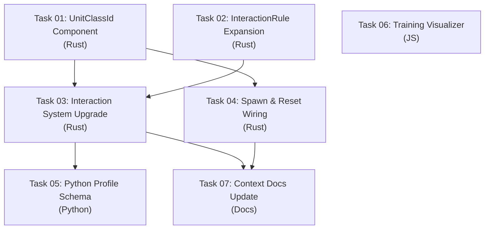

# Heterogeneous Swarm Mechanics & Training Visualizer Upgrade

## Goal

Upgrade the Rust Micro-Core from **homogeneous faction-based entities** to **heterogeneous unit-class-based entities** while preserving full context-agnosticism. Simultaneously upgrade the Debug Visualizer's Training Mode with real-time metrics overlay.

**Scope (per user direction):**
- ✅ **Rust Core:** UnitClassId component, expanded InteractionRule (dynamic range, stat-driven mitigation, cooldowns), sub-faction auto-micro control
- ✅ **Debug Visualizer:** Training Mode analytics overlay (episode counters, win rates, reward charts)
- ❌ **Deferred:** Playground Mode (manual control, profile loader, ONNX web inference)

---

## Resolved Design Decisions

> [!NOTE]
> **StatBlock size: `[f32; 8]` — CONFIRMED.** 8 slots sufficient for current needs (HP, Speed, Damage, Armor, Shield, Energy + 2 reserved). Expanding later is trivial: change `const MAX_STATS` in `stat_block.rs` and update the profile contract. No architectural change required — all systems use `MAX_STATS` or dynamic indexing.

> [!NOTE]
> **CooldownTracker as Resource — CONFIRMED.** Embedding cooldowns in a `CooldownTracker` resource (keyed by `(entity_id, rule_index)`) avoids adding a new ECS component and the query complexity that comes with it. Complex mechanics like "melee damage reflection" are handled naturally via **class-filtered InteractionRules** — the game designer creates a separate rule where the reflector class is the source and melee class is the target. The Rust core is oblivious to the semantic meaning; it just runs the math. If *proportional* reflection is needed later, a new `StatEffect` variant can be added incrementally.

> [!NOTE]
> **Training Visualizer: CSV polling with tail-read optimization — CONFIRMED.** At >3000 TPS, the CSV grows fast. The overlay uses HTTP `Range` header to fetch only the **last 4KB** of the file (≈80 recent episodes), avoiding full-file downloads. Previously parsed episode counts are cached client-side. Polling interval: 5 seconds. This keeps network cost constant regardless of training duration.

---

## Design Principles

1. **Context-agnostic invariant preserved.** The Rust core never knows what "Sniper" or "Tank" means. `UnitClassId(u32)` is just an integer. All semantics come from `GameProfile` JSON.
2. **Backward compatible.** Existing `tactical_curriculum.json` (no `UnitClassId`, no `unit_registry`) continues to work. `UnitClassId` defaults to `0` when absent. All new `InteractionRule` fields use `serde(default)`.
3. **No observation space changes.** The RL model continues to see ECP density maps. UnitClassId details are aggregated into stat-weighted density — the model sees "threat brightness," not unit types.
4. **No Python changes in this cycle** (except minor profile schema additions). The training pipeline is untouched. Python profile generators can optionally include `unit_class_id` in spawn configs.

---

## Shared Contracts

### Contract C1: `UnitClassId` Component

```rust
// micro-core/src/components/unit_class.rs
#[derive(Component, Debug, Clone, Copy, PartialEq, Eq, Hash, Serialize, Deserialize, Default)]
pub struct UnitClassId(pub u32);
```

- Default `0` = "generic" (backward compat)
- Attached to all entities during spawn
- Used by `InteractionRule` for class-specific matching

### Contract C2: Expanded `InteractionRule`

```rust
// micro-core/src/rules/interaction.rs
#[derive(Debug, Clone, Serialize, Deserialize, PartialEq)]
pub struct InteractionRule {
    pub source_faction: u32,
    pub target_faction: u32,
    
    // --- Existing ---
    pub range: f32,                      // Fixed range (backward compat)
    pub effects: Vec<StatEffect>,
    
    // --- NEW: Unit class filtering (optional, default = match all) ---
    #[serde(default)]
    pub source_class: Option<u32>,       // None = any class
    #[serde(default)]
    pub target_class: Option<u32>,       // None = any class
    
    // --- NEW: Dynamic range from stat (optional, overrides fixed `range`) ---
    #[serde(default)]
    pub range_stat_index: Option<usize>, // If set, range = source.StatBlock[idx]
    
    // --- NEW: Stat-driven mitigation (optional) ---
    #[serde(default)]
    pub mitigation: Option<MitigationRule>,
    
    // --- NEW: Cooldown (optional) ---
    #[serde(default)]
    pub cooldown_ticks: Option<u32>,     // If set, entity can only fire every N ticks
}

#[derive(Debug, Clone, Serialize, Deserialize, PartialEq)]
pub struct MitigationRule {
    /// Stat index on the TARGET providing mitigation value
    pub stat_index: usize,
    /// How mitigation is applied  
    pub mode: MitigationMode,
}

#[derive(Debug, Clone, Serialize, Deserialize, PartialEq)]
pub enum MitigationMode {
    /// damage = base_damage * (1.0 - mitigation_value)  (clamped 0..1)
    PercentReduction,
    /// damage = base_damage - flat_value  (clamped to 0)
    FlatReduction,
}
```

### Contract C3: `CooldownTracker` Resource

```rust
// micro-core/src/config/cooldown.rs
#[derive(Resource, Debug, Default)]
pub struct CooldownTracker {
    /// (entity_id, rule_index) → ticks remaining
    pub cooldowns: HashMap<(u32, usize), u32>,
}
```

### Contract C4: Expanded `SpawnConfig` (ZMQ Payload)

```rust
// micro-core/src/bridges/zmq_protocol/payloads.rs — SpawnConfig
pub struct SpawnConfig {
    // ... existing fields ...
    
    /// Optional unit class ID. Default: 0 (generic).
    #[serde(default)]
    pub unit_class_id: u32,
}
```

### Contract C5: Expanded `CombatRulePayload` (ZMQ Payload)

```rust
// micro-core/src/bridges/zmq_protocol/payloads.rs
pub struct CombatRulePayload {
    // ... existing fields ...
    
    #[serde(default)]
    pub source_class: Option<u32>,
    #[serde(default)]
    pub target_class: Option<u32>,
    #[serde(default)]
    pub range_stat_index: Option<usize>,
    #[serde(default)]
    pub mitigation: Option<MitigationPayload>,
    #[serde(default)]
    pub cooldown_ticks: Option<u32>,
}

pub struct MitigationPayload {
    pub stat_index: usize,
    pub mode: String,  // "PercentReduction" or "FlatReduction"
}
```

---

## DAG Execution Phases



### Phase 1 (Parallel — No Dependencies)

| Task | Domain | Description | Model Tier |
|------|--------|-------------|-----------|
| T01 | Rust | `UnitClassId` component + barrel export | `basic` |
| T02 | Rust | Expand `InteractionRule`, add `MitigationRule`, `CooldownTracker` | `standard` |
| T06 | JS | Training Visualizer metrics overlay | `standard` |

### Phase 2 (Depends on Phase 1)

| Task | Domain | Description | Model Tier | Depends On |
|------|--------|-------------|-----------|-----------|
| T03 | Rust | Upgrade `interaction_system` for class filtering, dynamic range, mitigation, cooldowns | `advanced` | T01, T02 |
| T04 | Rust | Wire `UnitClassId` into spawn, reset, and ZMQ payloads | `standard` | T01 |

### Phase 3 (Depends on Phase 2)

| Task | Domain | Description | Model Tier | Depends On |
|------|--------|-------------|-----------|-----------|
| T05 | Python | Update profile definitions + parser for `unit_registry` and expanded combat rules | `standard` | T03 |
| T07 | Docs | Update `engine-mechanics.md`, `ipc-protocol.md`, `conventions.md` | `basic` | T03, T04 |

---

## File Ownership Table

| File | Task | Action |
|------|------|--------|
| `micro-core/src/components/unit_class.rs` | T01 | **NEW** |
| `micro-core/src/components/mod.rs` | T01 | MODIFY (add export) |
| `micro-core/src/rules/interaction.rs` | T02 | MODIFY (expand structs) |
| `micro-core/src/config/cooldown.rs` | T02 | **NEW** |
| `micro-core/src/config/mod.rs` | T02 | MODIFY (add export) |
| `micro-core/src/systems/interaction.rs` | T03 | MODIFY (upgrade system) |
| `micro-core/src/bridges/zmq_protocol/payloads.rs` | T04 | MODIFY (expand SpawnConfig, CombatRulePayload) |
| `micro-core/src/bridges/zmq_bridge/reset.rs` | T04 | MODIFY (wire UnitClassId into spawn + rules) |
| `micro-core/src/systems/state_vectorizer.rs` | T04 | MODIFY (include UnitClassId in ECP if needed) |
| `macro-brain/src/config/definitions.py` | T05 | MODIFY (add UnitClassConfig, expand CombatRuleConfig) |
| `macro-brain/src/config/parser.py` | T05 | MODIFY (parse unit_registry) |
| `macro-brain/src/config/game_profile.py` | T05 | MODIFY (emit spawn with unit_class_id) |
| `debug-visualizer/js/training-overlay.js` | T06 | **NEW** |
| `debug-visualizer/index.html` | T06 | MODIFY (add overlay panel) |
| `debug-visualizer/css/training-overlay.css` | T06 | **NEW** |
| `.agents/context/engine-mechanics.md` | T07 | MODIFY |
| `.agents/context/ipc-protocol.md` | T07 | MODIFY |

---

## Feature Details

- [Feature 1: UnitClassId & Interaction Overhaul (Rust Core)](./implementation_plan_feature_1.md)
- [Feature 2: Training Visualizer Metrics Overlay](./implementation_plan_feature_2.md)

---

## Verification Plan

### Automated Tests

| Task | Test Type | Command |
|------|-----------|---------|
| T01 | Unit | `cd micro-core && cargo test components::unit_class` |
| T02 | Unit | `cd micro-core && cargo test rules::interaction` |
| T03 | Unit + Integration | `cd micro-core && cargo test systems::interaction` |
| T04 | Unit | `cd micro-core && cargo test bridges::zmq_protocol` |
| T05 | Unit | `cd macro-brain && .venv/bin/python -m pytest tests/test_profile*.py -v` |
| T06 | Manual | Browser: open visualizer, verify overlay renders |
| T07 | N/A | Human review |

### Smoke Test

```bash
cd micro-core && cargo test          # All 181+ Rust tests pass
cd micro-core && cargo run -- --smoke-test  # 300-tick smoke test
cd macro-brain && .venv/bin/python -m pytest tests/ -v  # All 51+ Python tests pass
```

### Backward Compatibility

- Existing `tactical_curriculum.json` (no UnitClassId, no unit_registry) must load and run identically to current behavior
- All existing combat rules with no `source_class`/`target_class`/`mitigation`/`cooldown_ticks` must match current behavior exactly (flat DPS, fixed range)
