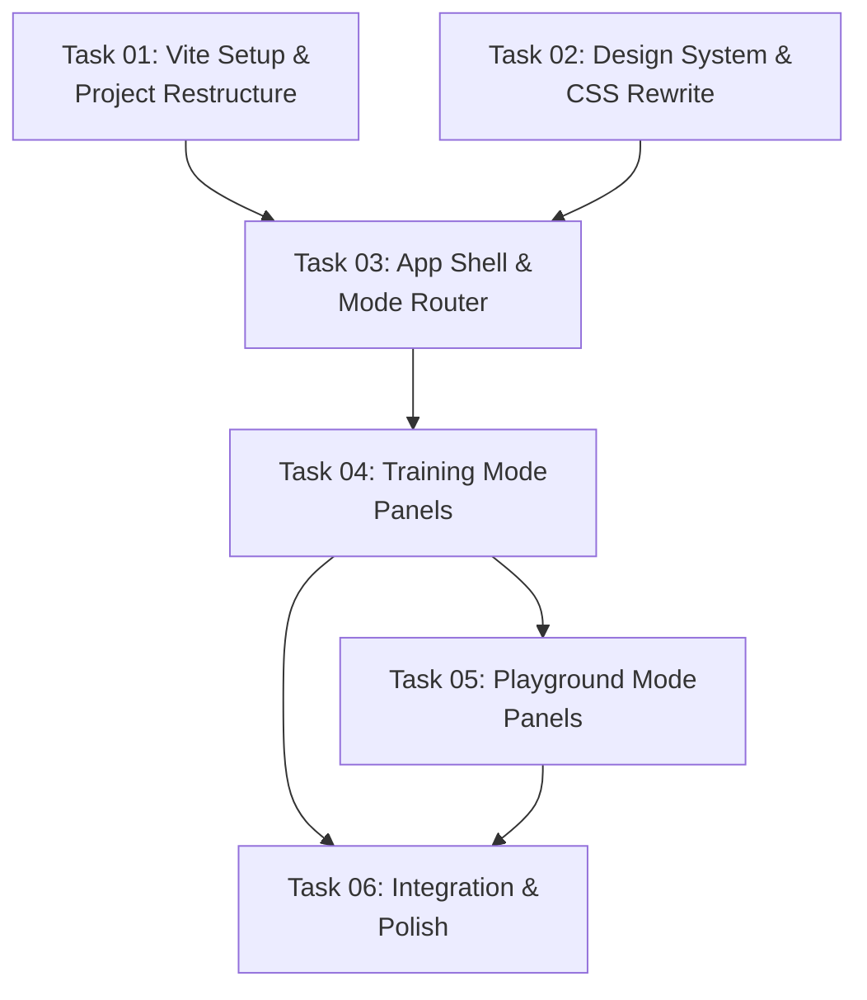

# AGENT ROLE: EXECUTION SPECIALIST

You are an **Execution Specialist** in a multi-agent DAG workflow.
You have been assigned ONE specific task. You implement it with surgical precision.

---

## Your Assignment

| Field   | Value |
|---------|-------|
| Task ID | `task_04_training_panels` |
| Feature | Debug Visualizer UI Refactor — Dual-Mode Application |
| Tier    | advanced |

---

## ⛔ MANDATORY PROCESS — ALL TIERS (DO NOT SKIP)

> **These rules apply to EVERY executor, regardless of tier. Violating them
> causes an automatic QA FAIL and project BLOCK.**

### Rule 1: Scope Isolation
- You may ONLY create or modify files listed in `Target_Files` in your Task Brief.
- If a file must be changed but is NOT in `Target_Files`, **STOP and report the gap** — do NOT modify it.
- NEVER edit `task_state.json`, `implementation_plan.md`, or any file outside your scope.

### Rule 2: Changelog (Handoff Documentation)
After ALL code is written and BEFORE calling `./task_tool.sh done`, you MUST:

1. **Create** `tasks_pending/task_04_training_panels_changelog.md`
2. **Include in the changelog:**
   - **Touched Files:** A bulleted list of every file you created or modified.
   - **Contract Fulfillment:** Brief confirmation of the interfaces/DTOs you implemented.
   - **Deviations/Notes:** Any edge cases you handled or deviations from the brief the QA agent should verify.
3. **Then and only then** run:
   ```bash
   ./task_tool.sh done task_04_training_panels
   ```

> **⚠️ Calling `./task_tool.sh done` without creating the changelog file is FORBIDDEN.**

### Rule 3: No Placeholders
- Do not use `// TODO`, `/* FIXME */`, or stub implementations.
- Output fully functional, production-ready code.

### Rule 4: Human Intervention Protocol
During execution, a human may intercept your work and propose changes, provide code snippets, or redirect your approach. When this happens:

1. **ADOPT the concept, VERIFY the details.** Humans are exceptional at architectural vision but make detail mistakes (wrong API, typos, outdated syntax). Independently verify all human-provided code against the actual framework version and project contracts.
2. **TRACK every human intervention in the changelog.** Add a dedicated `## Human Interventions` section to your changelog documenting:
   - What the human proposed (1-2 sentence summary)
   - What you adopted vs. what you corrected
   - Any deviations from the original task brief caused by the intervention
3. **DO NOT silently incorporate changes.** The QA agent and Architect must be able to trace exactly what came from the spec vs. what came from a human mid-flight. Untracked changes are invisible to the verification pipeline.

### Rule 5: Live System Safety
The training pipeline (`macro-brain` → ZMQ → `micro-core`) may be running during your execution.

- **Rust tasks:** DO NOT run `cargo build` or `cargo test` — use `cargo check` only. Full testing is QA's job in a controlled window. See `execution-lifecycle.md` Step 1b.
- **Python tasks:** ONLY ADD new optional code. Never modify existing signatures or remove symbols. All new fields must have defaults.
- **Profile files:** DO NOT modify any `.json` profile in `macro-brain/profiles/`.


## Context Loading (Tier-Dependent)

**If your tier is `standard` or `advanced`:**

> **CRITICAL FIRST STEP:** The Planner might omit critical skills or knowledge in your `Context_Bindings`. It is YOUR responsibility to self-heal missing context.
1. Read `.agents/skills/index.md` (Skills Catalog)
2. Read `.agents/knowledge/README.md` (Master Knowledge Index)
   *(If you discover a skill or knowledge domain relevant to your task that isn't in your `Context_Bindings`, **read it immediately** before starting.)*
3. Read `.agents/context.md` — Thin index pointing to context sub-files
4. Load ONLY the `context/*` sub-files listed in your `Context_Bindings` below
5. Scan `.agents/knowledge/` — Lessons from previous sessions relevant to your task
6. Read `.agents/workflows/execution-lifecycle.md` — Your 4-step execution loop
7. Read `.agents/rules/execution-boundary.md` — Scope and contract constraints

_No additional context bindings specified._

---

## Task Brief

# Task 04: Training Mode Panels

## Task_ID
task_04_training_panels

## Execution_Phase
Phase 3 (Depends on T03)

## Model_Tier
`advanced`

## Target_Files
- `debug-visualizer/src/panels/index.js` — **REWRITE** (replace legacy code with panel registry + backward-compat re-exports)
- `debug-visualizer/src/panels/shared/telemetry.js` — **NEW**
- `debug-visualizer/src/panels/shared/inspector.js` — **NEW**
- `debug-visualizer/src/panels/shared/viewport.js` — **NEW**
- `debug-visualizer/src/panels/shared/legend.js` — **NEW**
- `debug-visualizer/src/panels/training/dashboard.js` — **NEW**
- `debug-visualizer/src/panels/training/ml-brain.js` — **NEW**
- `debug-visualizer/src/panels/training/perf.js` — **NEW**

## Dependencies
T03 (app shell exists, accordion component exists, sparkline component exists)

## Context_Bindings
- `context/conventions` (JS naming)
- `context/ipc-protocol` (WS message types for ML brain data)
- `skills/frontend-ux-ui` (design aesthetic — stat cards, dashboard layout)

## Strict_Instructions
See `implementation_plan_feature_2.md` → Task 04 for exhaustive instructions.

Key deliverables:
1. Panel Registry (`panels/index.js`) with `registerPanel()`, `addPanels()`, `renderAllPanels()`, `updatePanels()`.
2. Shared panels: Telemetry (TPS/tick sparklines), Inspector, Viewport layers, Legend.
3. Training panels: Dashboard (replaces training-overlay.js — CSV polling, win rate, reward chart), ML Brain status, Perf bars.

**IMPORTANT:** T05 will call `addPanels()` to register playground panels into this same registry. Export this function.

---

### ⚠️ CRITICAL: Legacy Code Reality (Post-T03 Adjustment)

**`panels/index.js` is NOT a blank file.** After T01 moved `js/` → `src/`, the old monolithic panel code now lives at `src/panels/index.js`. It contains legacy functions that `websocket.js` and `controls/init.js` actively import. **You MUST preserve backward-compatible exports** or the app will crash.

**Current legacy exports from `panels/index.js` that are actively imported:**

| Export | Imported By | What It Does |
|--------|------------|--------------|
| `Sparkline` (class) | (internal) | Canvas sparkline — references `#graph-tps`, `#graph-entities` via hidden HTML stubs |
| `sparklines` (object) | (internal) | Instances of Sparkline |
| `updatePerfBars(telemetry)` | `websocket.js` | Updates perf bar DOM from SyncDelta telemetry |
| `updateInspectorPanel()` | `controls/init.js` | Updates entity inspector DOM |
| `deselectEntity()` | `controls/init.js` | Clears entity selection |
| `startTelemetryLoop()` | (unused in current main.js) | 1-second interval updating TPS/entity counts |
| `updateAggroGrid()` | `websocket.js` (via re-export from `faction-panel.js`) | Updates aggro mask grid |
| `updateLegend()` | `websocket.js` (via re-export from `faction-panel.js`) | Updates faction legend |
| `initFactionToggles()` | `websocket.js` (via re-export from `faction-panel.js`) | Builds faction UI on WS connect |
| `updateMlBrainPanel()` | `websocket.js` (via re-export from `ml-panel.js`) | Updates ML brain status |

**Legacy source files also present:**
- `panels/faction-panel.js` — `updateAggroGrid()`, `updateLegend()`, `initFactionToggles()`
- `panels/ml-panel.js` — `updateMlBrainPanel()`, training status polling
- `panels/zone-panel.js` — empty placeholder

### Strategy: Rewrite + Backward-Compat Re-exports

1. **Rewrite `panels/index.js`** to be the proper panel registry (as described in the implementation plan).
2. **Move legacy function implementations INTO the new panel modules** where they belong:
   - `updatePerfBars()` → `panels/training/perf.js`
   - `updateInspectorPanel()` / `deselectEntity()` → `panels/shared/inspector.js`
   - `updateAggroGrid()` → `panels/shared/legend.js` or a new shared aggro panel 
   - `updateLegend()` / `initFactionToggles()` → `panels/shared/legend.js`
   - `updateMlBrainPanel()` → `panels/training/ml-brain.js`
   - `startTelemetryLoop()` → `panels/shared/telemetry.js`
   - `Sparkline` class → replaced by `components/sparkline.js` (already created by T03)
3. **Re-export all legacy function names from `panels/index.js`** so `websocket.js` and `controls/init.js` can continue importing them unchanged. Example:
   ```javascript
   // ─── Panel Registry ──────────────────────────────────────────
   // ... (new registry code) ...

   // ─── Backward-compat re-exports (consumed by websocket.js, controls/init.js) ───
   // These will be cleaned up in T06 when websocket.js is updated.
   export { updatePerfBars } from './training/perf.js';
   export { updateInspectorPanel, deselectEntity } from './shared/inspector.js';
   export { updateAggroGrid, updateLegend, initFactionToggles } from './shared/legend.js';
   export { updateMlBrainPanel } from './training/ml-brain.js';
   ```
4. **DO NOT delete `panels/faction-panel.js` or `panels/ml-panel.js`** — T06 will clean them up. But their logic should be absorbed into the new modules.

### Panel Rendering Notes
- Each panel module should create its own DOM elements in `render(body)`. Do NOT reference DOM IDs that are hardcoded in index.html — they don't exist.
- The telemetry panel should create sparkline canvases dynamically and use the `drawSparkline()` function from `components/sparkline.js` (created by T03).
- The inspector panel should create its DOM structure in `render()`, then `update()` populates it from `state.selectedEntityId`.

## Verification_Strategy
```yaml
Test_Type: manual_steps
Test_Stack: Browser
Acceptance_Criteria:
  - "In Training Mode: Dashboard, ML Brain, Telemetry, Perf, Viewport, Legend panels visible"
  - "Dashboard shows episode count, win rate, reward chart (mock or real data)"
  - "Shared panels (Telemetry, Viewport) visible in both modes"
  - "Inspector auto-expands when entity selected"
  - "Accordion expand/collapse works smoothly"
  - "No console errors from websocket.js importing legacy functions"
  - "WS connect still triggers initFactionToggles() without crash"
Manual_Steps:
  - "Switch to Training mode → verify all training panels appear"
  - "Click entity on canvas → verify inspector expands"
  - "Collapse/expand panels → verify smooth animation"
  - "Check browser console — no import/reference errors from panels/index.js"
```

## Live_System_Impact
`safe`

---

## Shared Contracts

# Debug Visualizer UI Refactor — Dual-Mode Application

## Goal

Refactor the debug visualizer from a single monolithic sidebar into a **dual-mode application** with a modern UI, tabbed navigation, and mode-specific panel layouts. The existing functional code (WebSocket, canvas rendering, state management) is preserved and rewired into the new shell.

**This plan addresses Section 2A of `module_improvement_strategy_brief.md`.**

---

## Problem Statement

The current visualizer crams **12+ panel sections** into a single scrollable sidebar. All tools (spawn, terrain painting, algorithm test, zone modifiers, faction splitter, aggro masks, viewport layers, training overlay) are visible simultaneously regardless of whether the user is monitoring ML training or debugging sandbox scenarios. This creates:

1. **Cognitive overload** — ML researchers don't need spawn/terrain tools; QA testers don't need training metrics.
2. **Wasted vertical space** — Users scroll past 10 irrelevant sections to find the one they need.
3. **No visual hierarchy** — Everything has the same visual weight.
4. **The training overlay (T key)** is disconnected from the sidebar and occupies a small floating panel.

---

## Design Decisions

> [!NOTE]
> **Build Tool: Vite — CHOSEN.** The project convention previously said "zero build step," but the strategy brief recommends Vite and the user has confirmed frameworks are acceptable for demo-quality UX. We adopt **Vite with vanilla JS** — this preserves the raw-canvas performance philosophy while adding HMR for dev velocity and proper ES module bundling. The `debug-visualizer/` directory gets a `package.json` + `vite.config.js`. Production build outputs static files (just minified). A framework (React/Vue) is NOT needed here because the rendering is canvas-based — the sidebar is the only DOM-heavy area, and vanilla JS with a panel registry pattern handles it cleanly.

> [!NOTE]
> **Routing: Hash-based tab switching — CHOSEN.** Instead of separate HTML files (`index.html` / `playground.html`), we use a **single SPA with hash routing** (`#training` / `#playground`). This avoids duplicating the canvas, WebSocket connection, and state module across two pages. Tab switching shows/hides panel groups and reconfigures the sidebar. The canvas and WS connection are shared.

> [!NOTE]
> **UI Paradigm: Collapsible Panel Groups — CHOSEN.** Instead of 12 flat sections, panels are organized into **categorized accordion groups** with expand/collapse. Each mode shows only its relevant groups. Panels that exist in both modes (Telemetry, Entity Inspector, Viewport Layers) are shared components.

> [!IMPORTANT]
> **Design Language: "Tactical Command Center" — CHOSEN.** Following the `frontend-ux-ui` skill, the design must be **bold, distinctive, and demo-worthy** — not generic dark-mode glassmorphism. The aesthetic direction is **tactical military HUD meets mission control dashboard:**
> - **Typography:** [Geist](https://vercel.com/font) (display/UI) + Geist Mono (data values). NOT Inter, NOT Roboto, NOT system fonts.
> - **Color:** Deep void black (`#050608`) base with electric cyan (`#06d6a0`) as the dominant accent. Sharp monocolor accents, NOT purple/blue gradients. Faction colors remain red/green but get neon-glow treatment.
> - **Surfaces:** Layered translucent panels with subtle noise texture overlay. Border glow on active/focused panels — NO plain solid borders.
> - **Motion:** Staggered panel entrance on mode switch (cascade from top). Tab indicator slides with spring easing. Status pulses with radar-sweep animation. Data values animate on update (count-up).
> - **Atmosphere:** Subtle scan-line overlay on the sidebar. Grid-line pattern on panel backgrounds. The app should feel like you're commanding a swarm from a war room.
> - **Spatial:** Generous negative space between panel groups. Overlapping status badges that break the sidebar boundary.

> [!NOTE]
> **Skill Binding: `skills/frontend-ux-ui`** is bound to **all UI tasks (T02, T03, T04, T05, T06)**. Executors MUST read and follow the skill guidelines when implementing any visual component.

---

## Architecture Overview

```
debug-visualizer/
├── package.json              # NEW — Vite + dev dependencies
├── vite.config.js            # NEW — Vite config (vanilla JS, no framework)
├── index.html                # REWRITE — Clean shell with mode tabs
├── src/                      # NEW — Source directory (Vite convention)
│   ├── main.js               # REWRITE — App entry, router, mode switching
│   ├── config.js             # MOVE from js/ — constants & adapter config
│   ├── state.js              # MOVE from js/ — shared mutable state
│   ├── websocket.js          # MOVE from js/ — WS connection (unchanged logic)
│   ├── router.js             # NEW — Hash-based mode router
│   ├── styles/               # RENAME from css/ — design system
│   │   ├── variables.css     # REWRITE — Enhanced design tokens
│   │   ├── reset.css         # NEW — Normalize + base styles
│   │   ├── layout.css        # REWRITE — App shell, tabs, sidebar chrome
│   │   ├── panels.css        # REWRITE — Accordion panels, glassmorphism
│   │   ├── controls.css      # KEEP — Form controls (minor tweaks)
│   │   ├── canvas.css        # KEEP — Canvas styling
│   │   ├── animations.css    # REWRITE — Mode transitions, panel animations
│   │   └── training.css      # NEW — Training mode specific styles
│   ├── components/           # NEW — Reusable UI components
│   │   ├── tabs.js           # NEW — Tab bar component
│   │   ├── accordion.js      # NEW — Collapsible panel group
│   │   ├── sparkline.js      # NEW — Reusable sparkline chart
│   │   └── toast.js          # EXTRACT from websocket.js
│   ├── draw/                 # MOVE from js/draw/ — Canvas rendering (unchanged)
│   │   ├── index.js
│   │   ├── terrain.js
│   │   ├── entities.js
│   │   ├── overlays.js
│   │   ├── fog.js
│   │   └── effects.js
│   ├── panels/               # REWRITE from js/panels/ — Mode-aware panels
│   │   ├── index.js          # Panel registry + mode filtering
│   │   ├── shared/           # NEW — Panels visible in both modes
│   │   │   ├── telemetry.js  # Telemetry (TPS, Tick, Entities)
│   │   │   ├── inspector.js  # Entity Inspector
│   │   │   ├── viewport.js   # Viewport Layers toggles
│   │   │   └── legend.js     # Faction Legend
│   │   ├── training/         # NEW — Training-only panels
│   │   │   ├── dashboard.js  # Episode counter, stage, win rate, reward chart
│   │   │   ├── ml-brain.js   # ML Brain status + directive log
│   │   │   └── perf.js       # System Performance bars
│   │   └── playground/       # NEW — Playground-only panels
│   │       ├── sim-controls.js    # Play/Pause/Step
│   │       ├── spawn.js           # Spawn Tools
│   │       ├── terrain.js         # Terrain Editor
│   │       ├── zones.js           # Zone Modifiers
│   │       ├── splitter.js        # Faction Splitter
│   │       ├── aggro.js           # Aggro Masks
│   │       ├── behavior.js        # Faction Behavior toggles
│   │       └── algorithm-test.js  # Algorithm Test presets + manual controls
│   └── controls/             # MOVE from js/controls/ — Event handlers
│       ├── index.js
│       ├── init.js           # REWRITE — Mode-aware control initialization
│       ├── paint.js          # KEEP
│       ├── spawn.js          # KEEP
│       ├── zones.js          # KEEP
│       ├── split.js          # KEEP
│       └── algorithm-test.js # KEEP
```

---

## Mode Configuration

### Training Mode (`#training`)
**Audience:** ML researchers monitoring active training runs.

| Panel Group | Panels | Behavior |
|-------------|--------|----------|
| **Dashboard** | Training Dashboard (episodes, stage, win rate, reward chart, loss streak) | Auto-expanded, always visible |
| **ML Brain** | Python status, last directive, intervention mode | Auto-expanded |
| **Telemetry** | TPS, Tick, Entity counts, sparklines | Auto-expanded |
| **Performance** | System perf bars (spatial, flow field, interaction, etc.) | Collapsed by default |
| **Viewport** | Layer toggles (grid, heatmap, fog, arena bounds) | Collapsed by default |
| **Inspector** | Entity Inspector (click entity to see details) | Hidden until entity selected |
| **Legend** | Faction colors | Collapsed by default |

**Hidden in Training Mode:** Spawn Tools, Terrain Editor, Zone Modifiers, Faction Splitter, Aggro Masks, Faction Behavior, Algorithm Test, Sim Controls (Play/Pause/Step).

### Playground Mode (`#playground`)
**Audience:** QA testers, game designers, product owners, and developers debugging scenarios.

| Panel Group | Panels | Behavior |
|-------------|--------|----------|
| **Game Setup** | Two-path launcher: Quick Presets OR Custom Game wizard (3-step) | Auto-expanded, always visible |
| **Controls** | Play/Pause/Step | Auto-expanded |
| **Spawn** | Faction selector, amount, spread, spawn mode | Collapsed by default |
| **Terrain** | Paint mode, brush selector, save/load scenario | Collapsed by default |
| **Zones** | Zone modifier placement (attract/repel) | Collapsed by default |
| **Tactics** | Faction Splitter, Aggro Masks | Collapsed by default |
| **Telemetry** | TPS, Tick, Entity counts | Auto-expanded |
| **Viewport** | Layer toggles | Collapsed by default |
| **Inspector** | Entity Inspector | Hidden until entity selected |
| **Legend** | Faction colors | Collapsed by default |

**Hidden in Playground Mode:** Training Dashboard, ML Brain status panel.

**Game Setup Panel — "Max 3 Steps" Rule:**

The Game Setup panel presents **two paths** side-by-side:

1. **Quick Presets** — One-click scenario loading (existing algorithm test presets: Chase, Pincer, etc.). Click a preset card → entities spawn, rules applied, ready to observe.

2. **Custom Game** — A 3-step wizard for non-technical users:
   - **Step 1: Factions** — Pick 2–4 factions from visual cards (name, color, unit count slider). Drag-to-reorder priority. Default: 2 factions, 200 units each.
   - **Step 2: Rules** — Simple toggle grid: "Who attacks whom?" (checkboxes), damage slider (Low/Med/High), range slider (Close/Mid/Far). No raw numbers or form fields.
   - **Step 3: Launch** — Map size selector (Small/Medium/Large), one-click "Start Simulation" button. Optional: save as custom preset.

This replaces the old Algorithm Test section's role as the primary entry point. The old manual controls (raw nav/interaction/removal rule forms) move to an **Advanced** toggle inside the panel for power users.

---

## Shared Contracts

### Contract C1: Mode Router API

```javascript
// src/router.js
export const MODES = { TRAINING: 'training', PLAYGROUND: 'playground' };

/** Returns current mode from URL hash. Default: PLAYGROUND */
export function getCurrentMode() { ... }

/** Switch mode, updates hash, fires 'modechange' custom event on window */
export function setMode(mode) { ... }

/** Subscribe to mode changes: callback(newMode, oldMode) */
export function onModeChange(callback) { ... }
```

### Contract C2: Accordion Panel API

```javascript
// src/components/accordion.js

/**
 * Creates a collapsible panel group.
 * @param {Object} opts
 * @param {string} opts.id - Unique panel ID
 * @param {string} opts.title - Panel header text
 * @param {string} [opts.icon] - Emoji or icon prefix
 * @param {boolean} [opts.expanded=false] - Initial state
 * @param {string[]} [opts.modes] - Which modes this panel appears in ('training', 'playground', or both)
 * @returns {HTMLElement} - The panel DOM element
 */
export function createAccordion(opts) { ... }

/** Expand/collapse a panel by ID */
export function togglePanel(id) { ... }

/** Show/hide panels based on current mode */
export function applyModeFilter(mode) { ... }
```

### Contract C3: Panel Registry

```javascript
// src/panels/index.js

/**
 * Each panel module exports:
 * - id: string (unique)
 * - title: string
 * - icon: string
 * - modes: string[] ('training' | 'playground')
 * - defaultExpanded: boolean
 * - render(container: HTMLElement): void — populates the panel body
 * - update(): void — called per frame or per WS message to refresh data
 */
```

### Contract C4: Training Dashboard Data (enhanced from existing training-overlay.js)

```javascript
// src/panels/training/dashboard.js
// Replaces training-overlay.js. No longer a floating overlay.
// Integrated as a first-class sidebar panel in Training Mode.
// Same CSV polling logic, enhanced rendering:
// - Larger reward chart (full sidebar width)
// - Win/Loss streak indicator
// - Stage progress bar with graduation threshold marker (80%)
// - Episode rate (episodes/minute calculated from timestamps)
```

---

## DAG Execution Phases



### Phase 1 (Parallel — No Dependencies)

| Task | Domain | Description | Model Tier | Live_System_Impact |
|------|--------|-------------|------------|-------------------|
| T01 | Infra/JS | Vite project setup, move files to `src/`, verify dev server works | `standard` | `safe` |
| T02 | CSS | Full design system rewrite: variables, layout, panels, animations — following `frontend-ux-ui` skill aesthetic | `advanced` | `safe` |

### Phase 2 (Depends on Phase 1)

| Task | Domain | Description | Model Tier | Depends On | Live_System_Impact |
|------|--------|-------------|------------|-----------|-------------------|
| T03 | JS | App shell rewrite: `index.html`, `main.js`, `router.js`, tab component, accordion component, toast component, sparkline component | `advanced` | T01, T02 | `safe` |

### Phase 3 (Sequential — T05 depends on T04 for panel registry)

| Task | Domain | Description | Model Tier | Depends On | Live_System_Impact |
|------|--------|-------------|------------|-----------|-------------------|
| T04 | JS | Training Mode panels: Dashboard, ML Brain, Perf + shared Telemetry, Inspector, Viewport, Legend. **REWRITE** legacy `panels/index.js` into proper registry with backward-compat re-exports. | `advanced` | T03 | `safe` |
| T05 | JS | Playground Mode panels: Game Setup wizard (Quick Presets + 3-step Custom Game), Sim Controls, Spawn, Terrain, Zones, Splitter, Aggro, Behavior. Self-contained event binding. | `advanced` | T03, **T04** | `safe` |

### Phase 4 (Integration — Sequential)

| Task | Domain | Description | Model Tier | Depends On | Live_System_Impact |
|------|--------|-------------|------------|-----------|-------------------|
| T06 | JS/CSS | Wire all panels into app shell, mode transitions, final polish, cross-mode state persistence, verify all existing functionality works | `advanced` | T04, T05 | `safe` |

---

## File Ownership Table

| File | Task | Action |
|------|------|--------|
| `debug-visualizer/package.json` | T01 | **NEW** |
| `debug-visualizer/vite.config.js` | T01 | **NEW** |
| `debug-visualizer/.gitignore` | T01 | **NEW** |
| `debug-visualizer/src/config.js` | T01 | MOVE from `js/config.js` |
| `debug-visualizer/src/state.js` | T01 | MOVE from `js/state.js` |
| `debug-visualizer/src/websocket.js` | T01 | MOVE from `js/websocket.js` |
| `debug-visualizer/src/draw/*` | T01 | MOVE from `js/draw/*` |
| `debug-visualizer/src/controls/*` | T01 | MOVE from `js/controls/*` |
| `debug-visualizer/src/styles/variables.css` | T02 | **REWRITE** |
| `debug-visualizer/src/styles/reset.css` | T02 | **NEW** |
| `debug-visualizer/src/styles/layout.css` | T02 | **REWRITE** |
| `debug-visualizer/src/styles/panels.css` | T02 | **REWRITE** |
| `debug-visualizer/src/styles/controls.css` | T02 | MOVE + minor tweaks |
| `debug-visualizer/src/styles/canvas.css` | T02 | MOVE |
| `debug-visualizer/src/styles/animations.css` | T02 | **REWRITE** |
| `debug-visualizer/src/styles/training.css` | T02 | **NEW** |
| `debug-visualizer/index.html` | T03 | **REWRITE** |
| `debug-visualizer/src/main.js` | T03 | **REWRITE** |
| `debug-visualizer/src/router.js` | T03 | **NEW** |
| `debug-visualizer/src/components/tabs.js` | T03 | **NEW** |
| `debug-visualizer/src/components/accordion.js` | T03 | **NEW** |
| `debug-visualizer/src/components/sparkline.js` | T03 | **NEW** |
| `debug-visualizer/src/components/toast.js` | T03 | **NEW** |
| `debug-visualizer/src/panels/index.js` | T04 | **REWRITE** (legacy → registry + backward-compat re-exports) |
| `debug-visualizer/src/panels/shared/telemetry.js` | T04 | **NEW** |
| `debug-visualizer/src/panels/shared/inspector.js` | T04 | **NEW** |
| `debug-visualizer/src/panels/shared/viewport.js` | T04 | **NEW** |
| `debug-visualizer/src/panels/shared/legend.js` | T04 | **NEW** |
| `debug-visualizer/src/panels/training/dashboard.js` | T04 | **NEW** |
| `debug-visualizer/src/panels/training/ml-brain.js` | T04 | **NEW** |
| `debug-visualizer/src/panels/training/perf.js` | T04 | **NEW** |
| `debug-visualizer/src/panels/playground/game-setup.js` | T05 | **NEW** |
| `debug-visualizer/src/panels/playground/sim-controls.js` | T05 | **NEW** |
| `debug-visualizer/src/panels/playground/spawn.js` | T05 | **NEW** |
| `debug-visualizer/src/panels/playground/terrain.js` | T05 | **NEW** |
| `debug-visualizer/src/panels/playground/zones.js` | T05 | **NEW** |
| `debug-visualizer/src/panels/playground/splitter.js` | T05 | **NEW** |
| `debug-visualizer/src/panels/playground/aggro.js` | T05 | **NEW** |
| `debug-visualizer/src/panels/playground/behavior.js` | T05 | **NEW** |
| `debug-visualizer/src/controls/init.js` | T06 | **REWRITE** — Mode-aware, canvas-only |
| `debug-visualizer/src/main.js` | T06 | MODIFY — Remove T03 workarounds, final wiring |
| `debug-visualizer/src/websocket.js` | T06 | MODIFY — Update imports from legacy to new panel modules |
| `debug-visualizer/index.html` | T06 | MODIFY — Remove hidden legacy stubs |

---

## Feature Details

- [Feature 1: Vite Migration & Design System](./implementation_plan_feature_1.md)
- [Feature 2: App Shell, Panels & Integration](./implementation_plan_feature_2.md)

---

## Verification Plan

### Manual Testing (Primary — UI-focused feature)

| Step | Expected Result |
|------|-----------------|
| `cd debug-visualizer && npm run dev` | Vite dev server starts, page loads at `http://localhost:5173` |
| Page loads with `#training` hash | Training Mode active: Dashboard, ML Brain, Telemetry, Perf panels visible. No spawn/terrain tools. |
| Click "Playground" tab | Smooth transition to Playground Mode. Spawn, Terrain, Zone tools appear. Dashboard/ML Brain hidden. |
| Click "Training" tab | Back to Training Mode. All training panels restored. |
| Connect to running micro-core (WS) | Entities render on canvas, telemetry updates, TPS counter ticks |
| In Playground: toggle Spawn Mode → click canvas | Entities spawn correctly (existing spawn logic preserved) |
| In Playground: toggle Paint Mode → draw terrain | Terrain painted correctly |
| In Training: verify CSV polling | Dashboard shows episode count, win rate, reward sparkline (if training active) |
| Panel accordion: click collapsed panel header | Panel expands with smooth animation |
| Browser resize | Responsive layout adapts, canvas fills remaining space |
| Double-click canvas | View resets to center (existing behavior) |
| Press T key | No effect (training overlay removed — replaced by Training Mode dashboard) |

### Automated Smoke Test

```bash
cd debug-visualizer && npm run build  # Vite production build succeeds
cd micro-core && cargo run -- --smoke-test  # Rust core still serves WS on :8080
```

### Backward Compatibility

- All existing WS message handling (`SyncDelta`, `FlowFieldSync`, `scenario_data`) works unchanged
- All existing canvas rendering (entities, terrain, fog, zones, overlays) works unchanged
- All existing controls (pan, zoom, spawn, paint, split, algorithm test) work unchanged
- URL without hash defaults to Playground Mode (preserves current behavior for existing users)

---

## Key Risk: File Collision on `index.js` (Panels)

T04 and T05 both write to `src/panels/index.js`. To avoid collision:
- **T04 creates** the file with the panel registry pattern and all shared + training panels registered.
- **T05 appends** playground panels to the existing registry using an `addPanels()` function exported by T04.
- **T06** does the final merge verification.

This is explicitly documented in each task's `Target_Files` and `Strict_Instructions`.

> [!WARNING]
> **Post-T03 Reality:** After T01 moved `js/` → `src/`, the legacy `panels/index.js` survived and contains monolithic panel functions (not the planned registry). T04 must **REWRITE** this file (not create from scratch) while preserving backward-compat re-exports for `websocket.js`. All panel event handlers must be self-contained inside `render()` because `controls/init.js` references dead DOM IDs. T06 cleans up all T03 workarounds (hidden stubs, try/catch, globals).


---
<!-- Source: implementation_plan_feature_1.md -->

# Feature 1: Vite Migration & Design System (Tasks 01–02)

## Task 01: Vite Setup & Project Restructure

### Overview
Migrate the debug visualizer from a zero-build-step static HTML app to a Vite-powered vanilla JS project. This is a structural refactor only — no logic changes. All existing code moves from `js/` and `css/` into `src/` with updated import paths.

### Model Tier: `standard`

### Target Files
- `debug-visualizer/package.json` — **NEW**
- `debug-visualizer/vite.config.js` — **NEW**
- `debug-visualizer/.gitignore` — **NEW**
- `debug-visualizer/src/config.js` — MOVE from `js/config.js`
- `debug-visualizer/src/state.js` — MOVE from `js/state.js`
- `debug-visualizer/src/websocket.js` — MOVE from `js/websocket.js`
- `debug-visualizer/src/draw/index.js` — MOVE from `js/draw/index.js`
- `debug-visualizer/src/draw/terrain.js` — MOVE from `js/draw/terrain.js`
- `debug-visualizer/src/draw/entities.js` — MOVE from `js/draw/entities.js`
- `debug-visualizer/src/draw/overlays.js` — MOVE from `js/draw/overlays.js`
- `debug-visualizer/src/draw/fog.js` — MOVE from `js/draw/fog.js`
- `debug-visualizer/src/draw/effects.js` — MOVE from `js/draw/effects.js`
- `debug-visualizer/src/controls/index.js` — MOVE from `js/controls/index.js`
- `debug-visualizer/src/controls/init.js` — MOVE from `js/controls/init.js`
- `debug-visualizer/src/controls/paint.js` — MOVE from `js/controls/paint.js`
- `debug-visualizer/src/controls/spawn.js` — MOVE from `js/controls/spawn.js`
- `debug-visualizer/src/controls/zones.js` — MOVE from `js/controls/zones.js`
- `debug-visualizer/src/controls/split.js` — MOVE from `js/controls/split.js`
- `debug-visualizer/src/controls/algorithm-test.js` — MOVE from `js/controls/algorithm-test.js`
- `debug-visualizer/src/main.js` — MOVE from `js/main.js` (temporary scaffold)

### Dependencies
None.

### Context_Bindings
- `context/conventions` (JS file naming, module patterns)
- `context/architecture` (debug-visualizer folder structure)

### Strict Instructions

1. **Create `package.json`:**
   ```json
   {
     "name": "debug-visualizer",
     "version": "0.2.0",
     "private": true,
     "type": "module",
     "scripts": {
       "dev": "vite",
       "build": "vite build",
       "preview": "vite preview"
     },
     "devDependencies": {
       "vite": "^6.0.0"
     }
   }
   ```

2. **Create `vite.config.js`:**
   ```javascript
   import { defineConfig } from 'vite';

   export default defineConfig({
     root: '.',
     publicDir: 'public',
     server: {
       port: 5173,
       open: true,
       proxy: {
         '/logs': {
           target: 'http://localhost:8080',
           changeOrigin: true,
         }
       }
     },
     build: {
       outDir: 'dist',
       emptyOutDir: true,
     }
   });
   ```
   
   > **Note:** The `/logs` proxy forwards training CSV requests to the Rust HTTP server (port 8080) during dev. In production, both are served from the same origin.

3. **Create `.gitignore`:**
   ```
   node_modules/
   dist/
   ```

4. **Create `src/` directory** and move all JS files:
   - `js/config.js` → `src/config.js`
   - `js/state.js` → `src/state.js`
   - `js/websocket.js` → `src/websocket.js`
   - `js/main.js` → `src/main.js`
   - `js/draw/*` → `src/draw/*`
   - `js/controls/*` → `src/controls/*`

5. **Update all import paths** in moved files. Relative imports remain the same since directory structure is preserved. The key change is that `index.html` now points to `src/main.js` instead of `js/main.js`:
   ```html
   <script type="module" src="/src/main.js"></script>
   ```

6. **Move CSS files** to `src/styles/`:
   - `css/variables.css` → `src/styles/variables.css`
   - `css/layout.css` → `src/styles/layout.css`
   - `css/panels.css` → `src/styles/panels.css`
   - `css/controls.css` → `src/styles/controls.css`
   - `css/canvas.css` → `src/styles/canvas.css`
   - `css/animations.css` → `src/styles/animations.css`
   - `css/training-overlay.css` → `src/styles/training.css`

7. **Update `index.html`** CSS link paths from `css/` to `src/styles/` (Vite resolves these).

8. **Create `public/` directory** and move the `logs` symlink there (if it exists).

9. **Remove the old `js/training-overlay.js`** — its functionality will be rebuilt as `src/panels/training/dashboard.js` in T04.

10. **Verify:** Run `npm install && npm run dev`. The app should load in the browser with the existing UI fully functional (just served by Vite now). All canvas rendering, WS connection, controls should work identically.

### Anti-Patterns
- Do NOT install React, Vue, or any framework.
- Do NOT rename any exported functions or state variables — downstream code depends on exact names.
- Do NOT change any logic. This is purely a structural move.

### Verification_Strategy
```yaml
Test_Type: manual_steps
Test_Stack: Browser + Vite dev server
Acceptance_Criteria:
  - "npm run dev starts Vite dev server without errors"
  - "Browser opens and shows the existing visualizer UI"
  - "WebSocket connects to micro-core (green dot)"
  - "npm run build produces dist/ directory"
Manual_Steps:
  - "cd debug-visualizer && npm install && npm run dev"
  - "Verify canvas renders, sidebar appears, WS connects"
  - "npm run build — verify no build errors"
```

### Live_System_Impact: `safe`

---

## Task 02: Design System & CSS Rewrite

### Overview
Rewrite the CSS design system with a **bold "Tactical Command Center" aesthetic** following the `frontend-ux-ui` skill. This is NOT a generic dark theme — it must feel like commanding a swarm from a military war room. Distinctive typography, atmospheric textures, and intentional motion design.

### Model Tier: `advanced`

### Target Files
- `debug-visualizer/src/styles/variables.css` — **REWRITE**
- `debug-visualizer/src/styles/reset.css` — **NEW**
- `debug-visualizer/src/styles/layout.css` — **REWRITE**
- `debug-visualizer/src/styles/panels.css` — **REWRITE**
- `debug-visualizer/src/styles/controls.css` — MOVE + restyle from `css/controls.css`
- `debug-visualizer/src/styles/canvas.css` — MOVE (no changes)
- `debug-visualizer/src/styles/animations.css` — **REWRITE**
- `debug-visualizer/src/styles/training.css` — **NEW** (replaces `training-overlay.css`)

### Dependencies
None (parallel with T01, but needs T01's file structure).

### Context_Bindings
- `context/conventions` (CSS variables naming)
- `skills/frontend-ux-ui` (design aesthetic guidelines — MUST READ)

### Strict Instructions

> **Aesthetic Direction: Tactical Command Center**
> Think: military tactical display, mission control dashboard, radar screen. NOT: generic SaaS dark mode, glassmorphism template, Stripe clone. The user will be demonstrating this to stakeholders — it must be **unforgettable**.

1. **Rewrite `variables.css`** — Tactical design tokens:

   **Typography:** Use [Geist](https://vercel.com/font) (variable weight) for UI text and Geist Mono for data values. Import via Google Fonts or Fontsource. These are distinctive, high-quality fonts that signal "built by engineers" without being generic.

   ```css
   @import url('https://fonts.googleapis.com/css2?family=Geist:wght@300;400;500;600;700&family=Geist+Mono:wght@400;500;600&display=swap');
   /* NOTE: If Geist is not on Google Fonts at execution time, use 
      @fontsource/geist via npm, or fall back to 'DM Sans' + 'IBM Plex Mono' 
      as alternatives with similar character. NEVER fall back to Inter/Roboto. */

   :root {
     /* ── Void (Base Surface) ── */
     --bg-void: #050608;
     --bg-surface: rgba(8, 12, 18, 0.92);
     --bg-surface-raised: rgba(14, 20, 30, 0.94);
     --bg-surface-overlay: rgba(20, 28, 42, 0.96);
     --bg-input: rgba(6, 10, 16, 0.85);
     
     /* ── Tactical Accent: Electric Cyan ── */
     --accent-primary: #06d6a0;
     --accent-primary-dim: rgba(6, 214, 160, 0.15);
     --accent-primary-glow: rgba(6, 214, 160, 0.35);
     --accent-secondary: #118ab2;
     --accent-secondary-dim: rgba(17, 138, 178, 0.15);
     --accent-warning: #ffd166;
     --accent-warning-dim: rgba(255, 209, 102, 0.15);
     --accent-danger: #ef476f;
     --accent-danger-dim: rgba(239, 71, 111, 0.15);
     
     /* ── Entity/Faction Colors (neon treatment) ── */
     --color-swarm: #ef476f;
     --color-swarm-glow: rgba(239, 71, 111, 0.4);
     --color-defender: #06d6a0;
     --color-defender-glow: rgba(6, 214, 160, 0.4);
     
     /* ── Text Hierarchy ── */
     --text-primary: #e8ecf0;
     --text-secondary: #7a8ba3;
     --text-tertiary: #3d4f63;
     --text-accent: var(--accent-primary);
     --text-data: var(--accent-primary);  /* For numeric data readouts */
     
     /* ── Borders (subtle glow, not flat lines) ── */
     --border-subtle: rgba(6, 214, 160, 0.06);
     --border-default: rgba(6, 214, 160, 0.12);
     --border-emphasis: rgba(6, 214, 160, 0.22);
     --border-active: rgba(6, 214, 160, 0.40);
     
     /* ── Status ── */
     --status-connected: #06d6a0;
     --status-disconnected: #ef476f;
     --status-reconnecting: #ffd166;
     
     /* ── Typography ── */
     --font-display: 'Geist', 'DM Sans', system-ui, sans-serif;
     --font-body: 'Geist', 'DM Sans', system-ui, sans-serif;
     --font-mono: 'Geist Mono', 'IBM Plex Mono', 'Courier New', monospace;
     --font-size-2xs: 0.625rem;   /* 10px — micro labels */
     --font-size-xs: 0.6875rem;   /* 11px */
     --font-size-sm: 0.75rem;     /* 12px */
     --font-size-base: 0.8125rem; /* 13px — slightly tighter than typical */
     --font-size-lg: 1rem;        /* 16px */
     --font-size-xl: 1.25rem;     /* 20px */
     --font-size-2xl: 1.5rem;     /* 24px — dashboard numbers */
     --font-size-hero: 2rem;      /* 32px — big stat readouts */
     
     /* ── Spacing (compact for command center density) ── */
     --space-2xs: 2px;
     --space-xs: 4px;
     --space-sm: 6px;
     --space-md: 10px;
     --space-lg: 14px;
     --space-xl: 18px;
     --space-2xl: 24px;
     --space-3xl: 32px;
     
     /* ── Sizing ── */
     --sidebar-width: 380px;
     --tab-height: 44px;
     --radius-sm: 4px;
     --radius-md: 8px;
     --radius-lg: 12px;
     --radius-full: 9999px;
     
     /* ── Shadows (colored glows, not generic box-shadow) ── */
     --shadow-inset: inset 0 1px 0 rgba(255, 255, 255, 0.03);
     --shadow-sm: 0 2px 8px rgba(0, 0, 0, 0.5);
     --shadow-md: 0 4px 20px rgba(0, 0, 0, 0.6);
     --shadow-lg: 0 8px 40px rgba(0, 0, 0, 0.7);
     --shadow-glow: 0 0 20px var(--accent-primary-glow);
     --shadow-glow-danger: 0 0 20px var(--accent-danger-dim);
     
     /* ── Atmospheric Effects ── */
     --noise-opacity: 0.03;
     --scanline-opacity: 0.015;
     --grid-line-opacity: 0.04;
     
     /* ── Transitions ── */
     --ease-out-expo: cubic-bezier(0.16, 1, 0.3, 1);
     --ease-spring: cubic-bezier(0.34, 1.56, 0.64, 1);
     --transition-fast: 120ms var(--ease-out-expo);
     --transition-base: 220ms var(--ease-out-expo);
     --transition-slow: 400ms var(--ease-out-expo);
     --transition-spring: 500ms var(--ease-spring);
   }
   ```

2. **Create `reset.css`** — Base styles with atmospheric body treatment:
   ```css
   *, *::before, *::after { box-sizing: border-box; margin: 0; padding: 0; }
   
   body {
     font-family: var(--font-body);
     font-size: var(--font-size-base);
     font-weight: 400;
     letter-spacing: 0.01em;
     background-color: var(--bg-void);
     color: var(--text-primary);
     overflow: hidden;
     height: 100vh;
     width: 100vw;
     -webkit-font-smoothing: antialiased;
     -moz-osx-font-smoothing: grayscale;
   }
   
   /* Noise texture overlay — creates atmospheric depth */
   body::before {
     content: '';
     position: fixed;
     inset: 0;
     background-image: url("data:image/svg+xml,..."); /* inline SVG noise */
     opacity: var(--noise-opacity);
     pointer-events: none;
     z-index: 9999;
   }
   ```
   
   > NOTE: The inline SVG noise pattern should be a `<filter>` with `feTurbulence`. The executor should generate this procedurally or use a CSS `background-image` with a tiny repeating noise PNG.

3. **Rewrite `layout.css`** — Tactical app shell:

   Key classes to define:
   - `.app-container` — Flex row (canvas + sidebar)
   - `.canvas-area` — Flex-grow, position relative, subtle vignette on edges
   - `.sidebar` — Fixed width, flex column. Background: `--bg-surface` with subtle vertical scanlines (`repeating-linear-gradient` at 2px intervals, `--scanline-opacity`). Left border: 1px `--border-emphasis` with `--shadow-glow` outward.
   - `.sidebar-header` — App title with tracking/uppercase treatment. Title uses `--font-display` at weight 700. The accent word uses `--text-accent` color. Subtle bottom border with gradient fade.
   - `.tab-bar` — Horizontal container with `--bg-surface-raised` background. No visible borders between tabs — differentiation through opacity and the sliding indicator.
   - `.tab-btn` — Uppercase, `--font-size-xs`, letter-spacing `0.15em`, `--text-tertiary` when inactive, `--text-primary` when active. NO background changes on hover — only text color transition.
   - `.tab-indicator` — Absolute-positioned bottom bar (2px height), `--accent-primary` color with `--shadow-glow`, slides with `--transition-spring`.
   - `.panel-scroll` — Scrollable area with custom scrollbar (thin, accent-colored thumb). Subtle grid-line background pattern.
   - `.connection-badge` — Positioned top-left of canvas. Minimal: just a dot + text. The dot pulses with `--status-connected` glow. Feels like a radar ping.
   - `.canvas-hint` — `--text-tertiary`, uppercase, tiny font, centered bottom of canvas. Fades on first interaction.

4. **Rewrite `panels.css`** — Tactical accordion panels:

   Key classes:
   - `.panel-group` — Margin-bottom for negative space between groups. No visible outer border — separation through spacing, not lines.
   - `.panel-header` — Flex row, `--font-size-xs`, uppercase, `letter-spacing: 0.12em`, `--text-secondary`. Chevron icon rotates on expand. On hover: `--text-primary` with subtle left-border glow (`border-left: 2px solid var(--accent-primary-dim)`).
   - `.panel-header[data-expanded="true"]` — `--text-accent` color, left border full `--accent-primary`.
   - `.panel-body.collapsed` — `max-height: 0; opacity: 0; overflow: hidden; padding: 0`
   - `.panel-body.expanded` — `max-height: 600px; opacity: 1; padding: var(--space-lg)`. Transition all simultaneously.
   - `.stat-card` — Dark inset card (`--bg-surface-raised`, `--shadow-inset`). Border: 1px `--border-subtle`. On active/live data: border transitions to `--border-emphasis` with faint glow.
   - `.stat-grid` — 2-column CSS grid with `--space-sm` gap. Compact layout.
   - `.stat-label` — `--font-size-2xs`, uppercase, `--text-tertiary`, letter-spacing `0.1em`
   - `.stat-value` — `--font-mono`, `--font-size-lg`, `--text-data` (accent colored). Data readouts should feel like tactical instruments, not plain text.
   - `.stat-value.hero` — `--font-size-hero`, for dashboard headline numbers.

5. **Rewrite `animations.css`** — Tactical motion design:
   
   Key animations:
   - `@keyframes panelCascadeIn` — Panels enter staggered: slide from `translateY(8px)` + `opacity: 0`. Each `.panel-group` gets `animation-delay: calc(var(--cascade-index, 0) * 60ms)`. JS sets `--cascade-index` via inline style.
   - `@keyframes radarPulse` — Status dot: scale 1→1.4→1 + opacity 1→0.6→1. Duration 2s, infinite.
   - `@keyframes dataFlash` — When a `.stat-value` updates: brief text-shadow glow flash (`0 0 8px var(--accent-primary-glow)`), 300ms.
   - `@keyframes shimmer` — Loading skeleton: horizontal gradient sweep.
   - `@keyframes scanline` — Slow vertical sweep of a thin bright line across the sidebar (30s cycle, very subtle).
   - `.mode-enter` — Applied to panel groups during mode switch. Triggers `panelCascadeIn`.
   - `.toast` — Slide-in from right, accent-colored left border, auto-dismiss.

6. **Create `training.css`** — Training-mode dashboard styles:
   
   Key classes:
   - `.training-dashboard` — Full-width panel with extra visual treatment. Background: subtle radial gradient from center.
   - `.metric-hero` — Large number readout (episode count) using `.stat-value.hero`.
   - `.win-rate-bar` — Full-width progress bar. Fill: gradient `--accent-danger` (0%) → `--accent-warning` (50%) → `--accent-primary` (100%). 80% graduation marker as thin white vertical line.
   - `.stage-badge` — Pill-shaped badge. Background: `--accent-primary-dim`, text: `--accent-primary`.
   - `.reward-chart` — Full sidebar width sparkline container with vertical grid lines.
   - `.streak-badge.win` — `--accent-primary-dim` background, green text
   - `.streak-badge.loss` — `--accent-danger-dim` background, red text

7. **Migrate `controls.css`** — Move to `src/styles/controls.css`. Restyle ALL controls:
   - Buttons: Sharp `--radius-sm` corners. Primary: `--accent-primary` background with `--shadow-glow` on hover. Active mode buttons: left border accent.
   - Inputs: `--bg-input` dark fields with `--border-subtle`. Focus ring: `--accent-primary` 1px + glow.
   - Sliders: Custom thumb in `--accent-primary`, narrow track in `--border-default`.
   - Toggles/Checkboxes: Custom-styled to match tactical theme.

### Anti-Patterns
- **NEVER** use Inter, Roboto, Arial, or system fonts as the primary face.
- **NEVER** use the overused purple-to-blue gradient pattern.
- Do NOT hard-code any colors outside `variables.css`.
- Do NOT use `!important`.
- Do NOT apply `backdrop-filter` to canvas elements.
- Do NOT make it look like a generic admin dashboard template.

### Verification_Strategy
```yaml
Test_Type: manual_steps
Test_Stack: Browser visual inspection
Acceptance_Criteria:
  - "All CSS files load without console errors"
  - "Typography is clearly NOT Inter/Roboto — Geist or fallback renders"
  - "Electric cyan accent (#06d6a0) visible on borders, active states, data values"
  - "Sidebar has atmospheric depth (noise texture, not flat solid)"
  - "Panel accordion transitions are smooth, staggered"
  - "The design feels like a tactical command center, NOT a generic SaaS dashboard"
Manual_Steps:
  - "Load page after T01 + T02 merged"
  - "Verify font rendering (Geist or DM Sans, NOT Inter)"
  - "Verify accent color (#06d6a0) on active elements"
  - "Verify noise texture overlay is visible but subtle"
  - "Check stat values use mono font in accent color"
```

### Live_System_Impact: `safe`


---
<!-- Source: implementation_plan_feature_2.md -->

# Feature 2: App Shell, Panels & Integration (Tasks 03–06)

## Task 03: App Shell & Mode Router

### Overview
Build the core application shell: rewrite `index.html` with the new layout structure (tab bar + scrollable panel area), implement the hash-based mode router, and create reusable UI components (tabs, accordion, sparkline, toast).

### Model Tier: `advanced`

### Target Files
- `debug-visualizer/index.html` — **REWRITE**
- `debug-visualizer/src/main.js` — **REWRITE**
- `debug-visualizer/src/router.js` — **NEW**
- `debug-visualizer/src/components/tabs.js` — **NEW**
- `debug-visualizer/src/components/accordion.js` — **NEW**
- `debug-visualizer/src/components/sparkline.js` — **NEW**
- `debug-visualizer/src/components/toast.js` — **NEW**

### Dependencies
T01 (file structure exists), T02 (CSS classes exist)

### Context_Bindings
- `context/conventions` (JS naming, DOM IDs)
- `context/architecture` (data flow: WS → state → draw)
- `skills/frontend-ux-ui` (design aesthetic — MUST READ)

### Strict Instructions

1. **Rewrite `index.html`:**

   The new shell is minimal. All panel content is injected via JS. Structure:

   ```html
   <!DOCTYPE html>
   <html lang="en">
   <head>
       <meta charset="UTF-8">
       <meta name="viewport" content="width=device-width, initial-scale=1.0">
       <title>SwarmControl — Debug Visualizer</title>
       <meta name="description" content="Real-time debug visualizer for the Mass-Swarm AI Simulator">
       <link rel="preconnect" href="https://fonts.googleapis.com">
       <link rel="preconnect" href="https://fonts.gstatic.com" crossorigin>
       <link href="https://fonts.googleapis.com/css2?family=DM+Sans:wght@400;500;600;700&family=IBM+Plex+Mono:wght@400;500;600&display=swap" rel="stylesheet">
       <!-- Geist preferred via @fontsource in CSS; DM Sans + IBM Plex Mono as HTML fallback -->
   </head>
   <body>
       <div class="app-container" id="app">
           <!-- Canvas Area -->
           <main class="canvas-area" id="canvas-area">
               <canvas id="canvas-bg"></canvas>
               <canvas id="canvas-entities"></canvas>
               <div class="connection-badge" id="connection-badge">
                   <div class="status-dot" id="status-dot"></div>
                   <span id="status-text">Connecting…</span>
               </div>
               <div class="canvas-hint" id="canvas-hint">
                   Pan: drag · Zoom: scroll · Double-click: reset view
               </div>
           </main>

           <!-- Sidebar -->
           <aside class="sidebar" id="sidebar">
               <header class="sidebar-header">
                   <div>
                       <h1>Swarm<span class="accent">Control</span></h1>
                       <span class="version-badge">v0.2.0</span>
                   </div>
               </header>
               <nav class="tab-bar" id="tab-bar">
                   <!-- Tabs injected by tabs.js -->
               </nav>
               <div class="panel-scroll" id="panel-scroll">
                   <!-- Panels injected by panel registry -->
               </div>
           </aside>
       </div>

       <script type="module" src="/src/main.js"></script>
   </body>
   </html>
   ```

   **Key changes from current:**
   - All CSS is imported via JS (`import './styles/variables.css'` etc.) — Vite handles injection.
   - No inline panel HTML — all panels are JS-rendered.
   - No modal HTML — modals created dynamically in JS.
   - Tab bar added between sidebar header and panel area.
   - Canvas IDs preserved (`canvas-bg`, `canvas-entities`).

2. **Create `src/router.js`:**

   ```javascript
   // ─── Hash-Based Mode Router ─────────────────────────────────
   
   export const MODES = Object.freeze({
     TRAINING: 'training',
     PLAYGROUND: 'playground',
   });
   
   const DEFAULT_MODE = MODES.PLAYGROUND;
   let currentMode = null;
   const listeners = [];
   
   export function getCurrentMode() {
     return currentMode;
   }
   
   export function setMode(mode) {
     if (!Object.values(MODES).includes(mode)) return;
     if (mode === currentMode) return;
     const oldMode = currentMode;
     currentMode = mode;
     window.location.hash = mode;
     listeners.forEach(cb => cb(mode, oldMode));
   }
   
   export function onModeChange(callback) {
     listeners.push(callback);
   }
   
   export function initRouter() {
     const hash = window.location.hash.slice(1);
     currentMode = Object.values(MODES).includes(hash) ? hash : DEFAULT_MODE;
     window.addEventListener('hashchange', () => {
       const newHash = window.location.hash.slice(1);
       if (Object.values(MODES).includes(newHash) && newHash !== currentMode) {
         setMode(newHash);
       }
     });
   }
   ```

3. **Create `src/components/tabs.js`:**

   ```javascript
   // ─── Tab Bar Component ───────────────────────────────────────
   import { MODES, getCurrentMode, setMode } from '../router.js';
   
   const TAB_CONFIG = [
     { mode: MODES.TRAINING, label: '📊 Training', icon: '📊' },
     { mode: MODES.PLAYGROUND, label: '🎮 Playground', icon: '🎮' },
   ];
   
   export function renderTabs(container) {
     container.innerHTML = '';
     TAB_CONFIG.forEach(tab => {
       const btn = document.createElement('button');
       btn.className = 'tab-btn';
       btn.dataset.mode = tab.mode;
       btn.textContent = tab.label;
       btn.id = `tab-${tab.mode}`;
       if (getCurrentMode() === tab.mode) btn.classList.add('active');
       btn.onclick = () => setMode(tab.mode);
       container.appendChild(btn);
     });
     // Animated underline indicator
     const indicator = document.createElement('div');
     indicator.className = 'tab-indicator';
     indicator.id = 'tab-indicator';
     container.appendChild(indicator);
     updateIndicator();
   }
   
   export function updateTabs() {
     const mode = getCurrentMode();
     document.querySelectorAll('.tab-btn').forEach(btn => {
       btn.classList.toggle('active', btn.dataset.mode === mode);
     });
     updateIndicator();
   }
   
   function updateIndicator() {
     const active = document.querySelector('.tab-btn.active');
     const indicator = document.getElementById('tab-indicator');
     if (active && indicator) {
       indicator.style.left = `${active.offsetLeft}px`;
       indicator.style.width = `${active.offsetWidth}px`;
     }
   }
   ```

4. **Create `src/components/accordion.js`:**

   ```javascript
   // ─── Accordion Panel Component ────────────────────────────────
   
   /**
    * @param {Object} opts
    * @param {string} opts.id
    * @param {string} opts.title
    * @param {string} [opts.icon='']
    * @param {boolean} [opts.expanded=false]
    * @returns {{ element: HTMLElement, body: HTMLElement, setExpanded: (v: boolean) => void }}
    */
   export function createAccordion(opts) {
     const group = document.createElement('section');
     group.className = 'panel-group';
     group.id = `panel-${opts.id}`;
     group.dataset.panelId = opts.id;
   
     const header = document.createElement('div');
     header.className = 'panel-header';
     header.innerHTML = `
       <span class="panel-title">${opts.icon ? opts.icon + ' ' : ''}${opts.title}</span>
       <span class="panel-chevron">▸</span>
     `;
   
     const body = document.createElement('div');
     body.className = 'panel-body';
   
     const setExpanded = (expanded) => {
       if (expanded) {
         body.classList.add('expanded');
         body.classList.remove('collapsed');
         header.querySelector('.panel-chevron').textContent = '▾';
       } else {
         body.classList.remove('expanded');
         body.classList.add('collapsed');
         header.querySelector('.panel-chevron').textContent = '▸';
       }
     };
   
     header.onclick = () => {
       const isExpanded = body.classList.contains('expanded');
       setExpanded(!isExpanded);
     };
   
     setExpanded(opts.expanded ?? false);
   
     group.appendChild(header);
     group.appendChild(body);
   
     return { element: group, body, setExpanded };
   }
   
   /**
    * Show/hide panel groups based on mode.
    * @param {HTMLElement} container - The panel scroll container 
    * @param {string} mode - Current mode ('training' | 'playground')
    */
   export function applyModeFilter(container, mode) {
     container.querySelectorAll('.panel-group').forEach(panel => {
       const modes = (panel.dataset.modes || '').split(',');
       const visible = modes.includes(mode) || modes.includes('both');
       panel.style.display = visible ? '' : 'none';
       // Add entrance animation
       if (visible) {
         panel.classList.add('mode-enter');
         requestAnimationFrame(() => {
           requestAnimationFrame(() => panel.classList.remove('mode-enter'));
         });
       }
     });
   }
   ```

5. **Create `src/components/sparkline.js`:**

   ```javascript
   // ─── Reusable Sparkline Chart ──────────────────────────────────
   
   /**
    * Draw a sparkline on a canvas element.
    * @param {HTMLCanvasElement} canvas
    * @param {number[]} values
    * @param {Object} [opts]
    * @param {string} [opts.strokeColor='#60a5fa']
    * @param {string} [opts.fillColor='rgba(96, 165, 250, 0.15)']
    * @param {number} [opts.lineWidth=2]
    * @param {boolean} [opts.showZeroLine=true]
    */
   export function drawSparkline(canvas, values, opts = {}) {
     if (!values || values.length === 0) return;
     const ctx = canvas.getContext('2d');
     const { width, height } = canvas;
    const strokeColor = opts.strokeColor || '#06d6a0';
     const fillColor = opts.fillColor || 'rgba(6, 214, 160, 0.15)';
     const lineWidth = opts.lineWidth || 2;
     const showZeroLine = opts.showZeroLine ?? true;
     
     ctx.clearRect(0, 0, width, height);
     
     const padding = 2;
     const drawW = width - padding * 2;
     const drawH = height - padding * 2;
     
     const maxVal = Math.max(...values, 0.001);
     const minVal = Math.min(...values, 0);
     const range = maxVal - minVal || 1;
     const step = drawW / Math.max(values.length - 1, 1);
     
     // Line
     ctx.beginPath();
     values.forEach((v, i) => {
       const x = padding + i * step;
       const y = padding + drawH - ((v - minVal) / range) * drawH;
       i === 0 ? ctx.moveTo(x, y) : ctx.lineTo(x, y);
     });
     ctx.strokeStyle = strokeColor;
     ctx.lineWidth = lineWidth;
     ctx.lineJoin = 'round';
     ctx.stroke();
     
     // Fill
     ctx.lineTo(padding + (values.length - 1) * step, padding + drawH);
     ctx.lineTo(padding, padding + drawH);
     ctx.closePath();
     ctx.fillStyle = fillColor;
     ctx.fill();
     
     // Zero line
     if (showZeroLine && minVal < 0 && maxVal > 0) {
       const zeroY = padding + drawH - ((0 - minVal) / range) * drawH;
       ctx.beginPath();
       ctx.moveTo(padding, zeroY);
       ctx.lineTo(padding + drawW, zeroY);
       ctx.strokeStyle = 'rgba(255, 255, 255, 0.15)';
       ctx.lineWidth = 1;
       ctx.setLineDash([4, 4]);
       ctx.stroke();
       ctx.setLineDash([]);
     }
   }
   ```

6. **Create `src/components/toast.js`:**

   Extract toast from `websocket.js`:

   ```javascript
   // ─── Toast Notification ────────────────────────────────────────
   
   export function showToast(message, type = 'info') {
     const toast = document.createElement('div');
     toast.className = `toast toast-${type}`;
     toast.textContent = message;
     document.body.appendChild(toast);
     requestAnimationFrame(() => toast.classList.add('show'));
     setTimeout(() => {
       toast.classList.remove('show');
       setTimeout(() => toast.remove(), 300);
     }, 2000);
   }
   ```

   Update `websocket.js` to import `showToast` from this module instead of defining it locally.

7. **Rewrite `src/main.js`:**

   The new entry point:
   - Imports all CSS files (Vite injects them)
   - Initializes the router
   - Renders tabs
   - Initializes canvases and WS connection
   - On mode change: calls `applyModeFilter()` to show/hide panels, updates tabs
   - Starts render loop (preserved from existing `main.js`)
   
   **Critical:** The render loop, canvas init, WS connection, and state reading are preserved EXACTLY from the existing `main.js`. Only the sidebar panel rendering changes.

### Anti-Patterns
- Do NOT put panel content HTML in `index.html`. All panels are JS-rendered.
- Do NOT break the canvas rendering loop or WebSocket connection during mode switches.
- Do NOT use `innerHTML` for user-provided content (XSS risk). Use `textContent` or `createElement`.

### Verification_Strategy
```yaml
Test_Type: manual_steps
Test_Stack: Browser + Vite dev server
Acceptance_Criteria:
  - "Tab bar renders with Training and Playground tabs"
  - "Clicking tabs switches URL hash and fires modechange event"
  - "Panel scroll area is empty but renders (panels come in T04/T05)"
  - "Canvas renders entities correctly"
  - "WS connects and status badge updates"
  - "Toast notifications still work"
Manual_Steps:
  - "npm run dev → verify tab bar appears below SwarmControl header"
  - "Click Training tab → hash changes to #training"
  - "Click Playground tab → hash changes to #playground"
  - "Verify canvas still renders, WS connects"
```

### Live_System_Impact: `safe`

---

## Task 04: Training Mode Panels

### Overview
Implement all panels that appear in Training Mode: Dashboard (enhanced from old training-overlay), ML Brain status, System Performance bars, and the shared panels (Telemetry, Inspector, Viewport Layers, Legend).

### Model Tier: `standard`

### Target Files
- `debug-visualizer/src/panels/index.js` — **NEW** (panel registry)
- `debug-visualizer/src/panels/shared/telemetry.js` — **NEW**
- `debug-visualizer/src/panels/shared/inspector.js` — **NEW**
- `debug-visualizer/src/panels/shared/viewport.js` — **NEW**
- `debug-visualizer/src/panels/shared/legend.js` — **NEW**
- `debug-visualizer/src/panels/training/dashboard.js` — **NEW**
- `debug-visualizer/src/panels/training/ml-brain.js` — **NEW**
- `debug-visualizer/src/panels/training/perf.js` — **NEW**

### Dependencies
T03 (app shell exists, accordion component exists, sparkline component exists)

### Context_Bindings
- `context/conventions` (JS naming)
- `context/ipc-protocol` (WS message types for ML brain data)
- `skills/frontend-ux-ui` (design aesthetic — stat cards, dashboard layout)

### Strict Instructions

1. **Create `src/panels/index.js` — Panel Registry:**

   ```javascript
   // ─── Panel Registry ──────────────────────────────────────────
   import { createAccordion, applyModeFilter } from '../components/accordion.js';
   import { getCurrentMode, onModeChange } from '../router.js';
   
   const panels = [];
   
   /**
    * Register a panel module.
    * @param {Object} panel
    * @param {string} panel.id
    * @param {string} panel.title
    * @param {string} [panel.icon]
    * @param {string[]} panel.modes - ['training'] | ['playground'] | ['training', 'playground']
    * @param {boolean} [panel.defaultExpanded=false]
    * @param {function} panel.render - (bodyElement: HTMLElement) => void
    * @param {function} [panel.update] - Called per frame or per WS update
    */
   export function registerPanel(panel) {
     panels.push(panel);
   }
   
   export function addPanels(newPanels) {
     newPanels.forEach(p => panels.push(p));
   }
   
   /** Build all panels into the sidebar scroll container. */
   export function renderAllPanels(container) {
     container.innerHTML = '';
     for (const panel of panels) {
       const { element, body, setExpanded } = createAccordion({
         id: panel.id,
         title: panel.title,
         icon: panel.icon || '',
         expanded: panel.defaultExpanded ?? false,
       });
       element.dataset.modes = panel.modes.join(',');
       panel.render(body);
       panel._accordionRef = { element, body, setExpanded };
       container.appendChild(element);
     }
     applyModeFilter(container, getCurrentMode());
   }
   
   /** Called when mode changes — show/hide panels. */
   export function onModeSwitch(container, newMode) {
     applyModeFilter(container, newMode);
   }
   
   /** Bulk update call — delegates to each panel's update(). */
   export function updatePanels() {
     const mode = getCurrentMode();
     for (const panel of panels) {
       if (panel.update && panel.modes.includes(mode)) {
         panel.update();
       }
     }
   }
   ```

2. **Create shared panels** (`src/panels/shared/`):

   Each panel follows the registry contract. Example for `telemetry.js`:
   - **id:** `'telemetry'`
   - **title:** `'Telemetry'`
   - **icon:** `'📡'`
   - **modes:** `['training', 'playground']`
   - **defaultExpanded:** `true`
   - **render:** Creates stat cards for TPS (with sparkline), Tick, Total Entities (with sparkline), Swarm count, Defender count. Uses existing DOM IDs (`stat-tps`, `stat-tick`, etc.) for continuity with existing update logic.
   - **update:** Reads from `state.js` and updates values.

   `inspector.js`:
   - **modes:** `['training', 'playground']`
   - **defaultExpanded:** `false`
   - Initially hidden. When `state.selectedEntityId` is set, auto-expands and populates entity data.

   `viewport.js`:
   - All layer toggle checkboxes (grid, spatial grid, flow field, velocity, density heatmap, zone modifiers, override markers, fog toggles, arena bounds).
   - Wires checkbox `onchange` handlers to state setters (preserved from existing `init.js`).

   `legend.js`:
   - Dynamic faction legend. Reads from `ADAPTER_CONFIG.factions` and `state.activeSubFactions`.

3. **Create training panels** (`src/panels/training/`):

   `dashboard.js` — **Replaces `training-overlay.js`:**
   - **modes:** `['training']`
   - **defaultExpanded:** `true`
   - **render:** Creates:
     - Episode count (large number)
     - Stage indicator with progress bar toward 80% graduation
     - Rolling win rate bar (gradient: red → yellow → green)
     - Win/Loss streak badge
     - Episode rate counter (episodes/minute)
     - Full-width reward sparkline chart (last 50 episodes)
   - **update:** Polls CSV on 5-second interval (same logic as old `training-overlay.js`). Updates all metrics.
   - **Key difference from old overlay:** This is a full sidebar panel, not a floating popup. Much more visual real estate. No T key toggle needed.

   `ml-brain.js`:
   - **modes:** `['training']`
   - **defaultExpanded:** `true`
   - Python status, intervention mode, last directive.
   - Reads from `state.mlBrainStatus` (set by WS handler).

   `perf.js`:
   - **modes:** `['training']`
   - **defaultExpanded:** `false`
   - System performance bars (spatial, flow field, interaction, removal, movement, WS sync).
   - Reads from `PerfTelemetry` WS messages (existing logic from `panels/index.js`).

### Anti-Patterns
- Do NOT duplicate logic from `websocket.js`. The WS handler still sets state; panels read from state.
- Do NOT create a competing render loop. Use the existing `requestAnimationFrame` loop in `main.js` to call `updatePanels()`.

### Verification_Strategy
```yaml
Test_Type: manual_steps
Test_Stack: Browser
Acceptance_Criteria:
  - "In Training Mode: Dashboard, ML Brain, Telemetry, Perf, Viewport, Legend panels visible"
  - "Dashboard shows episode count, win rate, reward chart (mock or real data)"
  - "Shared panels (Telemetry, Viewport) visible in both modes"
  - "Inspector auto-expands when entity selected"
  - "Accordion expand/collapse works smoothly"
Manual_Steps:
  - "Switch to Training mode → verify all training panels appear"
  - "Click entity on canvas → verify inspector expands"
  - "Collapse/expand panels → verify smooth animation"
```

### Live_System_Impact: `safe`

---

## Task 05: Playground Mode Panels

### Overview
Implement all panels that appear in Playground Mode. The headline feature is the **Game Setup** panel — a two-path launcher (Quick Presets + Custom Game wizard) that follows the **max-3-step rule** for non-technical users. Also: Simulation Controls, Spawn Tools, Terrain Editor, Zone Modifiers, Faction Splitter, Aggro Masks, and Faction Behavior.

### Model Tier: `advanced`

### Target Files
- `debug-visualizer/src/panels/index.js` — MODIFY (add playground panels via `addPanels()`)
- `debug-visualizer/src/panels/playground/game-setup.js` — **NEW** (wizard panel)
- `debug-visualizer/src/panels/playground/sim-controls.js` — **NEW**
- `debug-visualizer/src/panels/playground/spawn.js` — **NEW**
- `debug-visualizer/src/panels/playground/terrain.js` — **NEW**
- `debug-visualizer/src/panels/playground/zones.js` — **NEW**
- `debug-visualizer/src/panels/playground/splitter.js` — **NEW**
- `debug-visualizer/src/panels/playground/aggro.js` — **NEW**
- `debug-visualizer/src/panels/playground/behavior.js` — **NEW**

### Dependencies
T03 (app shell, accordion component)

### Context_Bindings
- `context/conventions` (JS naming, DOM IDs)
- `context/engine-mechanics` (zone modifiers, terrain, aggro masks, interaction rules)
- `context/ipc-protocol` (WS command payloads for spawn, rules, terrain)
- `skills/frontend-ux-ui` (design aesthetic — wizard UX, visual cards, control panels)

### Strict Instructions

1. **Each panel module** follows the registry contract from T04. Each file exports a single panel object.

2. **`game-setup.js`** — **Game Setup Panel (MOST IMPORTANT):**

   > **UX Principle: Max 3 Steps.** Users are lazy. Things must be straightforward and easy. No walls of text, no code-like forms, no raw JSON. Everything is visual.

   The panel renders **two paths** via toggle tabs at the top:

   **Path A: Quick Presets**
   - Grid of clickable **preset cards** (visual, not a dropdown).
   - Each card shows: preset name, faction count icon, brief one-line description.
   - Clicking a card immediately triggers: `applyPreset(key)` (reuses existing preset logic from `controls/algorithm-test.js`), then auto-scrolls to canvas.
   - Presets are loaded from the same `PRESETS` map in the existing `algorithm-test.js` control module.
   - Visual treatment: cards have subtle border glow on hover, selected card stays highlighted.

   **Path B: Custom Game (3-Step Wizard)**
   
   Three horizontal step indicators at the top (1 — 2 — 3), with active step highlighted.

   **Step 1: "Choose Factions"**
   - Visual faction cards in a 2-column grid.
   - Each card: color swatch (click to cycle through palette), name input (editable inline), unit count slider (50–1000, default 200).
   - Start with 2 faction cards. "+" button adds more (max 4). "×" removes.
   - "Next →" button advances to Step 2.

   **Step 2: "Set Combat Rules"**
   - **Header:** "Who fights whom?"
   - Visual grid of faction pairs: checkbox matrix (Faction A vs Faction B). Default: all checked (everyone attacks everyone).
   - **Damage:** 3-option segmented control: `Light` | `Normal` | `Heavy` (maps to stat delta values: -0.5, -1.0, -2.0).
   - **Range:** 3-option segmented control: `Close` | `Mid` | `Far` (maps to range values: 15, 30, 60).
   - **No raw numbers visible.** The semantic labels hide the implementation details.
   - "← Back" and "Next →" buttons.

   **Step 3: "Launch"**
   - **Map Size:** 3 visual cards: `Small (400×400)` | `Medium (600×600)` | `Large (1000×1000)`.
   - **Quick Summary:** Visual recap of factions + rules configured in Steps 1-2.
   - **"🚀 Start Simulation"** button (large, accent-colored, dominant).
   - **Optional:** "Save as Preset" text link below the launch button.
   - Clicking "Start Simulation" sends the following WS commands in sequence:
     1. `kill_all` — Clear existing entities
     2. `spawn` × N — One per faction with configured counts
     3. `set_interaction_rules` — Based on Step 2 configuration
     4. `set_removal_rules` — HP ≤ 0 removal for all factions
     5. `set_nav_rules` — Default chase behavior per faction pair
   
   **Advanced Toggle (collapsed by default):**
   - Below the wizard, a small "⚙ Advanced Controls" disclosure that reveals the old manual rule forms (nav rules, interaction rules, removal rules) for power users.
   - This preserves all existing functionality from `controls/algorithm-test.js` without cluttering the primary UX.

3. **`sim-controls.js`** — Play/Pause/Step:
   - Renders Play/Pause button + Step button + tick count input.
   - Wires `sendCommand("toggle_sim")`, `sendCommand("step", { count })`.
   - Preserves existing `isPaused` state toggle logic.

4. **`spawn.js`** — Spawn Tools:
   - Renders Spawn Mode toggle button, faction selector (with add/delete faction buttons), amount slider+input, spread slider+input.
   - Preserves existing spawn click handler logic from `controls/spawn.js`.
   - Includes the Add Faction modal (rendered dynamically, not in HTML).

5. **`terrain.js`** — Terrain Editor:
   - Paint Mode toggle, brush selector (Wall/Mud/Pushable/Clear), Save/Load/Clear terrain buttons.
   - Preserves file input logic for scenario load.

6. **`zones.js`** — Zone Modifiers:
   - Place Zone toggle, attract/repel type selector, faction dropdown, radius/intensity/duration inputs.
   - Ghost zone preview on canvas (existing logic in `entities.js` remains).

7. **`splitter.js`** — Faction Splitter:
   - Split Mode toggle, source faction selector, split percentage slider.
   - Active sub-faction list (populated from state).

8. **`aggro.js`** — Aggro Masks:
   - Renders the aggro mask grid (faction pair checkboxes).
   - Reads from `state.aggroMasks` and sends `set_aggro_mask` commands.

9. **`behavior.js`** — Faction Behavior:
   - Faction behavior mode toggles (populated dynamically from connected factions).

10. **Register all playground panels** by calling `addPanels()` from `panels/index.js` at module init time. **Game Setup must be the FIRST panel registered** (appears at top of sidebar). Import order determines render order.

### Anti-Patterns
- Do NOT modify `controls/init.js` yet — that's T06's job.
- Do NOT duplicate command-sending logic. Import `sendCommand` from `websocket.js`.
- Each panel renders its OWN DOM elements with unique IDs (no ID collisions with training panels).
- Do NOT show raw numeric values in the Custom Game wizard. Use semantic labels (Light/Normal/Heavy, Close/Mid/Far, Small/Medium/Large).
- Do NOT require users to type JSON or code-like syntax anywhere in the wizard.

### Verification_Strategy
```yaml
Test_Type: manual_steps
Test_Stack: Browser
Acceptance_Criteria:
  - "In Playground Mode: Game Setup is first panel, auto-expanded"
  - "Quick Presets: clicking a preset card spawns entities and applies rules"
  - "Custom Game: 3-step wizard navigates forward/backward correctly"
  - "Custom Game Step 1: can add/remove factions, adjust counts"
  - "Custom Game Step 2: combat grid shows, damage/range selectors work"
  - "Custom Game Step 3: Start Simulation sends correct WS commands"
  - "Advanced toggle reveals manual rule forms"
  - "Training-only panels (Dashboard, ML Brain) NOT visible"
  - "All other playground panels render correctly"
Manual_Steps:
  - "Switch to Playground mode → verify Game Setup at top"
  - "Click a Quick Preset card → entities appear on canvas"
  - "Walk through Custom Game wizard: 2 factions, Normal damage, Medium map → Launch"
  - "Expand Advanced toggle → verify manual rule forms appear"
  - "Expand Spawn panel → verify faction selector, sliders render"
```

### Live_System_Impact: `safe`

---

## Task 06: Integration & Polish

### Overview
Wire all panels into the app shell, connect control event handlers to the mode-aware panel system, implement mode transition animations, ensure cross-mode state persistence, and verify all existing functionality works end-to-end.

### Model Tier: `advanced`

### Target Files
- `debug-visualizer/src/controls/init.js` — **REWRITE** (mode-aware control initialization)
- `debug-visualizer/src/main.js` — MODIFY (final wiring)
- `debug-visualizer/src/websocket.js` — MODIFY (import toast from components, update panel callbacks)

### Dependencies
T04 (training panels exist), T05 (playground panels exist)

### Context_Bindings
- `context/conventions`
- `context/architecture`
- `skills/frontend-ux-ui` (design aesthetic — final polish, transitions, atmospheric effects)

### Strict Instructions

1. **Rewrite `src/controls/init.js`:**
   
   The current `initControls()` binds directly to DOM elements by ID. Since panels are now JS-rendered and may not exist in DOM until their mode is active, the control binding strategy changes:
   
   - **Canvas event handlers** (mousedown, mousemove, mouseup, wheel, dblclick) remain global — they don't depend on panels.
   - **Panel-specific handlers** (spawn button, paint button, etc.) are bound INSIDE each panel's `render()` function. They are NOT in `initControls()` anymore.
   - `initControls()` now only handles canvas events and keyboard shortcuts.
   
   Key changes:
   - Remove all `document.getElementById('spawn-mode-btn')`, etc. from `initControls()`.
   - Keep canvas drag/zoom/click logic.
   - Keep the `clearModes()` function, but it must be null-safe (panels may not be in DOM).

2. **Update `src/main.js`** — Final wiring:
   
   ```javascript
   // Import order matters — CSS first, then modules
   import './styles/reset.css';
   import './styles/variables.css';
   import './styles/layout.css';
   import './styles/panels.css';
   import './styles/controls.css';
   import './styles/canvas.css';
   import './styles/animations.css';
   import './styles/training.css';
   
   import { initRouter, onModeChange, getCurrentMode } from './router.js';
   import { renderTabs, updateTabs } from './components/tabs.js';
   import { renderAllPanels, onModeSwitch, updatePanels } from './panels/index.js';
   // Import panel registrations (side-effect imports)
   import './panels/shared/telemetry.js';
   import './panels/shared/inspector.js';
   import './panels/shared/viewport.js';
   import './panels/shared/legend.js';
   import './panels/training/dashboard.js';
   import './panels/training/ml-brain.js';
   import './panels/training/perf.js';
   import './panels/playground/game-setup.js';
   import './panels/playground/sim-controls.js';
   import './panels/playground/spawn.js';
   import './panels/playground/terrain.js';
   import './panels/playground/zones.js';
   import './panels/playground/splitter.js';
   import './panels/playground/aggro.js';
   import './panels/playground/behavior.js';
   
   import * as S from './state.js';
   import { initCanvases, resizeCanvas, drawEntities, drawFog, drawBackground, drawArenaBounds } from './draw/index.js';
   import { connectWebSocket } from './websocket.js';
   import { initControls } from './controls/init.js';
   
   // ── Initialize ────────────────────────────────────────────
   initRouter();
   
   const bgCanvas = document.getElementById('canvas-bg');
   const canvasEntities = document.getElementById('canvas-entities');
   initCanvases(bgCanvas, canvasEntities);
   
   renderTabs(document.getElementById('tab-bar'));
   renderAllPanels(document.getElementById('panel-scroll'));
   
   onModeChange((newMode, oldMode) => {
     updateTabs();
     onModeSwitch(document.getElementById('panel-scroll'), newMode);
   });
   
   window.addEventListener('resize', resizeCanvas);
   initControls();
   
   // ── Render Loop ───────────────────────────────────────────
   function renderFrame() {
     const ctx = canvasEntities.getContext('2d');
     ctx.clearRect(0, 0, canvasEntities.width, canvasEntities.height);
     drawEntities();
     if (S.showFog) drawFog();
     drawArenaBounds(ctx);
     updatePanels(); // NEW: per-frame panel updates
     requestAnimationFrame(renderFrame);
   }
   
   resizeCanvas();
   connectWebSocket();
   requestAnimationFrame(renderFrame);
   ```

3. **Update `src/websocket.js`:**
   - Import `showToast` from `./components/toast.js` instead of defining it inline.
   - Remove the inline `showToast` function.
   - Ensure `sendCommand` is still exported (used by panel modules).

4. **Cross-mode state persistence:**
   - When switching from Playground → Training, `state.spawnMode`, `state.paintMode` etc. are cleared (call `clearModes()`).
   - When switching from Training → Playground, the canvas state (zoom, pan, entities, WS connection) is preserved.
   - The WS connection is NEVER disconnected during mode switches.

5. **Clean up old files:**
   - Delete `js/` directory (replaced by `src/`)
   - Delete `css/` directory (replaced by `src/styles/`)
   - Delete `js/training-overlay.js` (replaced by `src/panels/training/dashboard.js`)
   - Keep `README.md`, `docs/`, `logs/` symlink, `index.html`

6. **Final verification checklist:**
   - [ ] `npm run dev` starts without errors
   - [ ] Training Mode shows correct panel set
   - [ ] Playground Mode shows correct panel set
   - [ ] Tab switching is instant (< 100ms)
   - [ ] Canvas renders 10K entities at 60fps (unchanged)
   - [ ] WS connects and receives SyncDelta messages
   - [ ] Spawn Mode works (click to place entities)
   - [ ] Paint Mode works (drag to paint terrain)
   - [ ] Zone placement works
   - [ ] Split Mode works
   - [ ] Algorithm Test presets load
   - [ ] Training Dashboard polls CSV and shows metrics
   - [ ] ML Brain panel updates from WS brain messages
   - [ ] Perf bars update from WS telemetry
   - [ ] Entity Inspector populates on click
   - [ ] Fog layer toggles work
   - [ ] `npm run build` produces clean dist/

### Anti-Patterns
- Do NOT refactor canvas rendering code. It is preserved as-is.
- Do NOT change the WebSocket message protocol. The Rust core is untouched.
- Do NOT break the render loop by adding blocking operations.

### Verification_Strategy
```yaml
Test_Type: manual_steps + e2e
Test_Stack: Browser + running micro-core
Acceptance_Criteria:
  - "All 12 verification checklist items pass"
  - "No console errors"
  - "npm run build succeeds"
  - "Production build (dist/) serves correctly"
Suggested_Test_Commands:
  - "cd debug-visualizer && npm run dev"
  - "cd micro-core && cargo run -- --smoke-test"
Manual_Steps:
  - "Full walkthrough of both modes"
  - "Switch between modes 10 times rapidly — no crashes"
  - "Connect to running micro-core, verify entities render"
  - "In Playground: spawn 500 entities, paint terrain, place zone"
  - "Switch to Training, verify training data, switch back, verify playground state persisted"
```

### Live_System_Impact: `safe`

