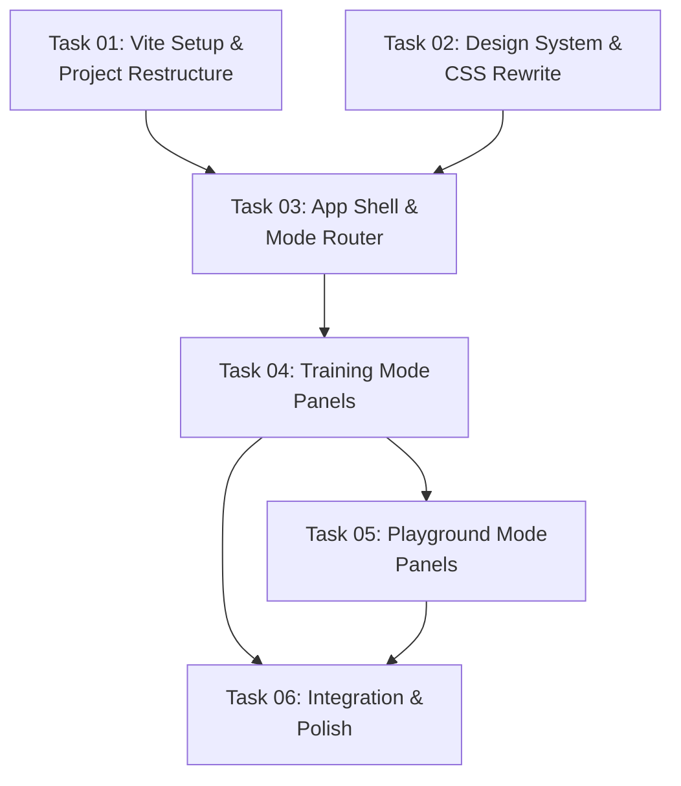

# Debug Visualizer UI Refactor — Dual-Mode Application

## Goal

Refactor the debug visualizer from a single monolithic sidebar into a **dual-mode application** with a modern UI, tabbed navigation, and mode-specific panel layouts. The existing functional code (WebSocket, canvas rendering, state management) is preserved and rewired into the new shell.

**This plan addresses Section 2A of `module_improvement_strategy_brief.md`.**

---

## Problem Statement

The current visualizer crams **12+ panel sections** into a single scrollable sidebar. All tools (spawn, terrain painting, algorithm test, zone modifiers, faction splitter, aggro masks, viewport layers, training overlay) are visible simultaneously regardless of whether the user is monitoring ML training or debugging sandbox scenarios. This creates:

1. **Cognitive overload** — ML researchers don't need spawn/terrain tools; QA testers don't need training metrics.
2. **Wasted vertical space** — Users scroll past 10 irrelevant sections to find the one they need.
3. **No visual hierarchy** — Everything has the same visual weight.
4. **The training overlay (T key)** is disconnected from the sidebar and occupies a small floating panel.

---

## Design Decisions

> [!NOTE]
> **Build Tool: Vite — CHOSEN.** The project convention previously said "zero build step," but the strategy brief recommends Vite and the user has confirmed frameworks are acceptable for demo-quality UX. We adopt **Vite with vanilla JS** — this preserves the raw-canvas performance philosophy while adding HMR for dev velocity and proper ES module bundling. The `debug-visualizer/` directory gets a `package.json` + `vite.config.js`. Production build outputs static files (just minified). A framework (React/Vue) is NOT needed here because the rendering is canvas-based — the sidebar is the only DOM-heavy area, and vanilla JS with a panel registry pattern handles it cleanly.

> [!NOTE]
> **Routing: Hash-based tab switching — CHOSEN.** Instead of separate HTML files (`index.html` / `playground.html`), we use a **single SPA with hash routing** (`#training` / `#playground`). This avoids duplicating the canvas, WebSocket connection, and state module across two pages. Tab switching shows/hides panel groups and reconfigures the sidebar. The canvas and WS connection are shared.

> [!NOTE]
> **UI Paradigm: Collapsible Panel Groups — CHOSEN.** Instead of 12 flat sections, panels are organized into **categorized accordion groups** with expand/collapse. Each mode shows only its relevant groups. Panels that exist in both modes (Telemetry, Entity Inspector, Viewport Layers) are shared components.

> [!IMPORTANT]
> **Design Language: "Tactical Command Center" — CHOSEN.** Following the `frontend-ux-ui` skill, the design must be **bold, distinctive, and demo-worthy** — not generic dark-mode glassmorphism. The aesthetic direction is **tactical military HUD meets mission control dashboard:**
> - **Typography:** [Geist](https://vercel.com/font) (display/UI) + Geist Mono (data values). NOT Inter, NOT Roboto, NOT system fonts.
> - **Color:** Deep void black (`#050608`) base with electric cyan (`#06d6a0`) as the dominant accent. Sharp monocolor accents, NOT purple/blue gradients. Faction colors remain red/green but get neon-glow treatment.
> - **Surfaces:** Layered translucent panels with subtle noise texture overlay. Border glow on active/focused panels — NO plain solid borders.
> - **Motion:** Staggered panel entrance on mode switch (cascade from top). Tab indicator slides with spring easing. Status pulses with radar-sweep animation. Data values animate on update (count-up).
> - **Atmosphere:** Subtle scan-line overlay on the sidebar. Grid-line pattern on panel backgrounds. The app should feel like you're commanding a swarm from a war room.
> - **Spatial:** Generous negative space between panel groups. Overlapping status badges that break the sidebar boundary.

> [!NOTE]
> **Skill Binding: `skills/frontend-ux-ui`** is bound to **all UI tasks (T02, T03, T04, T05, T06)**. Executors MUST read and follow the skill guidelines when implementing any visual component.

---

## Architecture Overview

```
debug-visualizer/
├── package.json              # NEW — Vite + dev dependencies
├── vite.config.js            # NEW — Vite config (vanilla JS, no framework)
├── index.html                # REWRITE — Clean shell with mode tabs
├── src/                      # NEW — Source directory (Vite convention)
│   ├── main.js               # REWRITE — App entry, router, mode switching
│   ├── config.js             # MOVE from js/ — constants & adapter config
│   ├── state.js              # MOVE from js/ — shared mutable state
│   ├── websocket.js          # MOVE from js/ — WS connection (unchanged logic)
│   ├── router.js             # NEW — Hash-based mode router
│   ├── styles/               # RENAME from css/ — design system
│   │   ├── variables.css     # REWRITE — Enhanced design tokens
│   │   ├── reset.css         # NEW — Normalize + base styles
│   │   ├── layout.css        # REWRITE — App shell, tabs, sidebar chrome
│   │   ├── panels.css        # REWRITE — Accordion panels, glassmorphism
│   │   ├── controls.css      # KEEP — Form controls (minor tweaks)
│   │   ├── canvas.css        # KEEP — Canvas styling
│   │   ├── animations.css    # REWRITE — Mode transitions, panel animations
│   │   └── training.css      # NEW — Training mode specific styles
│   ├── components/           # NEW — Reusable UI components
│   │   ├── tabs.js           # NEW — Tab bar component
│   │   ├── accordion.js      # NEW — Collapsible panel group
│   │   ├── sparkline.js      # NEW — Reusable sparkline chart
│   │   └── toast.js          # EXTRACT from websocket.js
│   ├── draw/                 # MOVE from js/draw/ — Canvas rendering (unchanged)
│   │   ├── index.js
│   │   ├── terrain.js
│   │   ├── entities.js
│   │   ├── overlays.js
│   │   ├── fog.js
│   │   └── effects.js
│   ├── panels/               # REWRITE from js/panels/ — Mode-aware panels
│   │   ├── index.js          # Panel registry + mode filtering
│   │   ├── shared/           # NEW — Panels visible in both modes
│   │   │   ├── telemetry.js  # Telemetry (TPS, Tick, Entities)
│   │   │   ├── inspector.js  # Entity Inspector
│   │   │   ├── viewport.js   # Viewport Layers toggles
│   │   │   └── legend.js     # Faction Legend
│   │   ├── training/         # NEW — Training-only panels
│   │   │   ├── dashboard.js  # Episode counter, stage, win rate, reward chart
│   │   │   ├── ml-brain.js   # ML Brain status + directive log
│   │   │   └── perf.js       # System Performance bars
│   │   └── playground/       # NEW — Playground-only panels
│   │       ├── sim-controls.js    # Play/Pause/Step
│   │       ├── spawn.js           # Spawn Tools
│   │       ├── terrain.js         # Terrain Editor
│   │       ├── zones.js           # Zone Modifiers
│   │       ├── splitter.js        # Faction Splitter
│   │       ├── aggro.js           # Aggro Masks
│   │       ├── behavior.js        # Faction Behavior toggles
│   │       └── algorithm-test.js  # Algorithm Test presets + manual controls
│   └── controls/             # MOVE from js/controls/ — Event handlers
│       ├── index.js
│       ├── init.js           # REWRITE — Mode-aware control initialization
│       ├── paint.js          # KEEP
│       ├── spawn.js          # KEEP
│       ├── zones.js          # KEEP
│       ├── split.js          # KEEP
│       └── algorithm-test.js # KEEP
```

---

## Mode Configuration

### Training Mode (`#training`)
**Audience:** ML researchers monitoring active training runs.

| Panel Group | Panels | Behavior |
|-------------|--------|----------|
| **Dashboard** | Training Dashboard (episodes, stage, win rate, reward chart, loss streak) | Auto-expanded, always visible |
| **ML Brain** | Python status, last directive, intervention mode | Auto-expanded |
| **Telemetry** | TPS, Tick, Entity counts, sparklines | Auto-expanded |
| **Performance** | System perf bars (spatial, flow field, interaction, etc.) | Collapsed by default |
| **Viewport** | Layer toggles (grid, heatmap, fog, arena bounds) | Collapsed by default |
| **Inspector** | Entity Inspector (click entity to see details) | Hidden until entity selected |
| **Legend** | Faction colors | Collapsed by default |

**Hidden in Training Mode:** Spawn Tools, Terrain Editor, Zone Modifiers, Faction Splitter, Aggro Masks, Faction Behavior, Algorithm Test, Sim Controls (Play/Pause/Step).

### Playground Mode (`#playground`)
**Audience:** QA testers, game designers, product owners, and developers debugging scenarios.

| Panel Group | Panels | Behavior |
|-------------|--------|----------|
| **Game Setup** | Two-path launcher: Quick Presets OR Custom Game wizard (3-step) | Auto-expanded, always visible |
| **Controls** | Play/Pause/Step | Auto-expanded |
| **Spawn** | Faction selector, amount, spread, spawn mode | Collapsed by default |
| **Terrain** | Paint mode, brush selector, save/load scenario | Collapsed by default |
| **Zones** | Zone modifier placement (attract/repel) | Collapsed by default |
| **Tactics** | Faction Splitter, Aggro Masks | Collapsed by default |
| **Telemetry** | TPS, Tick, Entity counts | Auto-expanded |
| **Viewport** | Layer toggles | Collapsed by default |
| **Inspector** | Entity Inspector | Hidden until entity selected |
| **Legend** | Faction colors | Collapsed by default |

**Hidden in Playground Mode:** Training Dashboard, ML Brain status panel.

**Game Setup Panel — "Max 3 Steps" Rule:**

The Game Setup panel presents **two paths** side-by-side:

1. **Quick Presets** — One-click scenario loading (existing algorithm test presets: Chase, Pincer, etc.). Click a preset card → entities spawn, rules applied, ready to observe.

2. **Custom Game** — A 3-step wizard for non-technical users:
   - **Step 1: Factions** — Pick 2–4 factions from visual cards (name, color, unit count slider). Drag-to-reorder priority. Default: 2 factions, 200 units each.
   - **Step 2: Rules** — Simple toggle grid: "Who attacks whom?" (checkboxes), damage slider (Low/Med/High), range slider (Close/Mid/Far). No raw numbers or form fields.
   - **Step 3: Launch** — Map size selector (Small/Medium/Large), one-click "Start Simulation" button. Optional: save as custom preset.

This replaces the old Algorithm Test section's role as the primary entry point. The old manual controls (raw nav/interaction/removal rule forms) move to an **Advanced** toggle inside the panel for power users.

---

## Shared Contracts

### Contract C1: Mode Router API

```javascript
// src/router.js
export const MODES = { TRAINING: 'training', PLAYGROUND: 'playground' };

/** Returns current mode from URL hash. Default: PLAYGROUND */
export function getCurrentMode() { ... }

/** Switch mode, updates hash, fires 'modechange' custom event on window */
export function setMode(mode) { ... }

/** Subscribe to mode changes: callback(newMode, oldMode) */
export function onModeChange(callback) { ... }
```

### Contract C2: Accordion Panel API

```javascript
// src/components/accordion.js

/**
 * Creates a collapsible panel group.
 * @param {Object} opts
 * @param {string} opts.id - Unique panel ID
 * @param {string} opts.title - Panel header text
 * @param {string} [opts.icon] - Emoji or icon prefix
 * @param {boolean} [opts.expanded=false] - Initial state
 * @param {string[]} [opts.modes] - Which modes this panel appears in ('training', 'playground', or both)
 * @returns {HTMLElement} - The panel DOM element
 */
export function createAccordion(opts) { ... }

/** Expand/collapse a panel by ID */
export function togglePanel(id) { ... }

/** Show/hide panels based on current mode */
export function applyModeFilter(mode) { ... }
```

### Contract C3: Panel Registry

```javascript
// src/panels/index.js

/**
 * Each panel module exports:
 * - id: string (unique)
 * - title: string
 * - icon: string
 * - modes: string[] ('training' | 'playground')
 * - defaultExpanded: boolean
 * - render(container: HTMLElement): void — populates the panel body
 * - update(): void — called per frame or per WS message to refresh data
 */
```

### Contract C4: Training Dashboard Data (enhanced from existing training-overlay.js)

```javascript
// src/panels/training/dashboard.js
// Replaces training-overlay.js. No longer a floating overlay.
// Integrated as a first-class sidebar panel in Training Mode.
// Same CSV polling logic, enhanced rendering:
// - Larger reward chart (full sidebar width)
// - Win/Loss streak indicator
// - Stage progress bar with graduation threshold marker (80%)
// - Episode rate (episodes/minute calculated from timestamps)
```

---

## DAG Execution Phases



### Phase 1 (Parallel — No Dependencies)

| Task | Domain | Description | Model Tier | Live_System_Impact |
|------|--------|-------------|------------|-------------------|
| T01 | Infra/JS | Vite project setup, move files to `src/`, verify dev server works | `standard` | `safe` |
| T02 | CSS | Full design system rewrite: variables, layout, panels, animations — following `frontend-ux-ui` skill aesthetic | `advanced` | `safe` |

### Phase 2 (Depends on Phase 1)

| Task | Domain | Description | Model Tier | Depends On | Live_System_Impact |
|------|--------|-------------|------------|-----------|-------------------|
| T03 | JS | App shell rewrite: `index.html`, `main.js`, `router.js`, tab component, accordion component, toast component, sparkline component | `advanced` | T01, T02 | `safe` |

### Phase 3 (Sequential — T05 depends on T04 for panel registry)

| Task | Domain | Description | Model Tier | Depends On | Live_System_Impact |
|------|--------|-------------|------------|-----------|-------------------|
| T04 | JS | Training Mode panels: Dashboard, ML Brain, Perf + shared Telemetry, Inspector, Viewport, Legend. **REWRITE** legacy `panels/index.js` into proper registry with backward-compat re-exports. | `advanced` | T03 | `safe` |
| T05 | JS | Playground Mode panels: Game Setup wizard (Quick Presets + 3-step Custom Game), Sim Controls, Spawn, Terrain, Zones, Splitter, Aggro, Behavior. Self-contained event binding. | `advanced` | T03, **T04** | `safe` |

### Phase 4 (Integration — Sequential)

| Task | Domain | Description | Model Tier | Depends On | Live_System_Impact |
|------|--------|-------------|------------|-----------|-------------------|
| T06 | JS/CSS | Wire all panels into app shell, mode transitions, final polish, cross-mode state persistence, verify all existing functionality works | `advanced` | T04, T05 | `safe` |

---

## File Ownership Table

| File | Task | Action |
|------|------|--------|
| `debug-visualizer/package.json` | T01 | **NEW** |
| `debug-visualizer/vite.config.js` | T01 | **NEW** |
| `debug-visualizer/.gitignore` | T01 | **NEW** |
| `debug-visualizer/src/config.js` | T01 | MOVE from `js/config.js` |
| `debug-visualizer/src/state.js` | T01 | MOVE from `js/state.js` |
| `debug-visualizer/src/websocket.js` | T01 | MOVE from `js/websocket.js` |
| `debug-visualizer/src/draw/*` | T01 | MOVE from `js/draw/*` |
| `debug-visualizer/src/controls/*` | T01 | MOVE from `js/controls/*` |
| `debug-visualizer/src/styles/variables.css` | T02 | **REWRITE** |
| `debug-visualizer/src/styles/reset.css` | T02 | **NEW** |
| `debug-visualizer/src/styles/layout.css` | T02 | **REWRITE** |
| `debug-visualizer/src/styles/panels.css` | T02 | **REWRITE** |
| `debug-visualizer/src/styles/controls.css` | T02 | MOVE + minor tweaks |
| `debug-visualizer/src/styles/canvas.css` | T02 | MOVE |
| `debug-visualizer/src/styles/animations.css` | T02 | **REWRITE** |
| `debug-visualizer/src/styles/training.css` | T02 | **NEW** |
| `debug-visualizer/index.html` | T03 | **REWRITE** |
| `debug-visualizer/src/main.js` | T03 | **REWRITE** |
| `debug-visualizer/src/router.js` | T03 | **NEW** |
| `debug-visualizer/src/components/tabs.js` | T03 | **NEW** |
| `debug-visualizer/src/components/accordion.js` | T03 | **NEW** |
| `debug-visualizer/src/components/sparkline.js` | T03 | **NEW** |
| `debug-visualizer/src/components/toast.js` | T03 | **NEW** |
| `debug-visualizer/src/panels/index.js` | T04 | **REWRITE** (legacy → registry + backward-compat re-exports) |
| `debug-visualizer/src/panels/shared/telemetry.js` | T04 | **NEW** |
| `debug-visualizer/src/panels/shared/inspector.js` | T04 | **NEW** |
| `debug-visualizer/src/panels/shared/viewport.js` | T04 | **NEW** |
| `debug-visualizer/src/panels/shared/legend.js` | T04 | **NEW** |
| `debug-visualizer/src/panels/training/dashboard.js` | T04 | **NEW** |
| `debug-visualizer/src/panels/training/ml-brain.js` | T04 | **NEW** |
| `debug-visualizer/src/panels/training/perf.js` | T04 | **NEW** |
| `debug-visualizer/src/panels/playground/game-setup.js` | T05 | **NEW** |
| `debug-visualizer/src/panels/playground/sim-controls.js` | T05 | **NEW** |
| `debug-visualizer/src/panels/playground/spawn.js` | T05 | **NEW** |
| `debug-visualizer/src/panels/playground/terrain.js` | T05 | **NEW** |
| `debug-visualizer/src/panels/playground/zones.js` | T05 | **NEW** |
| `debug-visualizer/src/panels/playground/splitter.js` | T05 | **NEW** |
| `debug-visualizer/src/panels/playground/aggro.js` | T05 | **NEW** |
| `debug-visualizer/src/panels/playground/behavior.js` | T05 | **NEW** |
| `debug-visualizer/src/controls/init.js` | T06 | **REWRITE** — Mode-aware, canvas-only |
| `debug-visualizer/src/main.js` | T06 | MODIFY — Remove T03 workarounds, final wiring |
| `debug-visualizer/src/websocket.js` | T06 | MODIFY — Update imports from legacy to new panel modules |
| `debug-visualizer/index.html` | T06 | MODIFY — Remove hidden legacy stubs |

---

## Feature Details

- [Feature 1: Vite Migration & Design System](./implementation_plan_feature_1.md)
- [Feature 2: App Shell, Panels & Integration](./implementation_plan_feature_2.md)

---

## Verification Plan

### Manual Testing (Primary — UI-focused feature)

| Step | Expected Result |
|------|-----------------|
| `cd debug-visualizer && npm run dev` | Vite dev server starts, page loads at `http://localhost:5173` |
| Page loads with `#training` hash | Training Mode active: Dashboard, ML Brain, Telemetry, Perf panels visible. No spawn/terrain tools. |
| Click "Playground" tab | Smooth transition to Playground Mode. Spawn, Terrain, Zone tools appear. Dashboard/ML Brain hidden. |
| Click "Training" tab | Back to Training Mode. All training panels restored. |
| Connect to running micro-core (WS) | Entities render on canvas, telemetry updates, TPS counter ticks |
| In Playground: toggle Spawn Mode → click canvas | Entities spawn correctly (existing spawn logic preserved) |
| In Playground: toggle Paint Mode → draw terrain | Terrain painted correctly |
| In Training: verify CSV polling | Dashboard shows episode count, win rate, reward sparkline (if training active) |
| Panel accordion: click collapsed panel header | Panel expands with smooth animation |
| Browser resize | Responsive layout adapts, canvas fills remaining space |
| Double-click canvas | View resets to center (existing behavior) |
| Press T key | No effect (training overlay removed — replaced by Training Mode dashboard) |

### Automated Smoke Test

```bash
cd debug-visualizer && npm run build  # Vite production build succeeds
cd micro-core && cargo run -- --smoke-test  # Rust core still serves WS on :8080
```

### Backward Compatibility

- All existing WS message handling (`SyncDelta`, `FlowFieldSync`, `scenario_data`) works unchanged
- All existing canvas rendering (entities, terrain, fog, zones, overlays) works unchanged
- All existing controls (pan, zoom, spawn, paint, split, algorithm test) work unchanged
- URL without hash defaults to Playground Mode (preserves current behavior for existing users)

---

## Key Risk: File Collision on `index.js` (Panels)

T04 and T05 both write to `src/panels/index.js`. To avoid collision:
- **T04 creates** the file with the panel registry pattern and all shared + training panels registered.
- **T05 appends** playground panels to the existing registry using an `addPanels()` function exported by T04.
- **T06** does the final merge verification.

This is explicitly documented in each task's `Target_Files` and `Strict_Instructions`.

> [!WARNING]
> **Post-T03 Reality:** After T01 moved `js/` → `src/`, the legacy `panels/index.js` survived and contains monolithic panel functions (not the planned registry). T04 must **REWRITE** this file (not create from scratch) while preserving backward-compat re-exports for `websocket.js`. All panel event handlers must be self-contained inside `render()` because `controls/init.js` references dead DOM IDs. T06 cleans up all T03 workarounds (hidden stubs, try/catch, globals).
