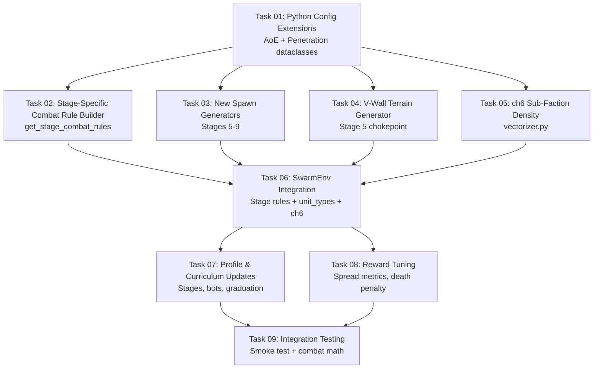

# Curriculum v5.0: Physics-Enforced Tactical Training

## Goal

Redesign stages 5–9 of the training curriculum to exploit the new AoE, Penetration, and heterogeneous unit engine features. Stages 0–4 are unchanged. The new stages teach flanking (AoE cone), spread formation (AoE circle), combined arms (heterogeneous intro), and screening (kinetic penetration) through **physics** — not reward engineering.

**Curriculum expands from 9 stages (0–8) to 10 stages (0–9)** to properly scaffold the heterogeneous unit introduction.

## Design Principles (from Strategy Brief)

1. **One skill per stage** — never overload
2. **Physics, not rewards** — engine mechanics make the correct strategy numerically superior
3. **Brute-force impossible** — "ball up and rush" must fail (verified via combat math)
4. **No Rust changes** — all engine features (AoE, Penetration, UnitTypeRegistry) already exist
5. **Stage-specific combat rules** — constructed in Python and sent via the reset payload
6. **Consistent map size for later stages** — Stages 5–9 all use 1000×1000 for model stability

> [!IMPORTANT]
> **Critical Gap:** The Python `CombatRuleConfig` dataclass and `_build_combat_rule()` method currently have **no** `aoe` or `penetration` fields. These must be added before Stages 5–8 can send the new interaction rules to Rust. This is the foundational Task 01.

---

## Revised 10-Stage Curriculum (v5.0)

| Stage | Name | New Action | Fog | Key Mechanic | Map |
|:---:|------|-----------|:---:|-------------|:---:|
| 0 | 1v1 Navigation | Hold, AttackCoord | OFF | Find and kill | 400² |
| 1 | Target Selection | — | OFF | Pick correct target | 500² |
| 2 | Pheromone Path | DropPheromone | OFF | Redirect pathfinding | 600² |
| 3 | Repellent Field | DropRepellent | OFF | Create avoidance zones | 600² |
| 4 | Fog Scouting | Scout | **ON** | Find hidden targets | 800² |
| 5 | **Forced Flanking** | SplitToCoord, MergeBack | ON | **AoE cone → pincer attack** | **1000²** |
| 6 | **Spread Formation** | Retreat | ON | **AoE circle → spread units** | 1000² |
| 7 | **Combined Arms Intro** | — | ON | **Learn heterogeneous unit types** | 1000² |
| 8 | **Screening** | — | ON | **Kinetic penetration → body-block** | 1000² |
| 9 | **Randomized Graduation** | — | ON | Random scenario from pool | 1000² |

> [!IMPORTANT]
> **Why 10 stages?** The user correctly identified that jumping from homogeneous units (Stage 6) straight into "heterogeneous + screening" (old Stage 7) violates the one-skill-per-stage rule. The model would encounter TWO new concepts simultaneously:
> 1. "I have different unit types with different speeds/HP"  
> 2. "I must put tanks in front to absorb kinetic rays"
> 
> This causes continuous failure → policy collapse → coin-flipper. **Stage 7 (Combined Arms Intro)** isolates concept #1 so the model can acclimate to heterogeneous armies before facing the screening challenge.

---

## ch6 Activation: Allied Sub-Faction Density

> [!IMPORTANT]
> **New scope addition** (per user feedback): Activate ch6 as **allied sub-faction density** — a spatial map showing where the brain's split groups are located. This gives the model awareness of its own force distribution, critical for:
> - **Stage 5+**: Seeing where the flanking sub-group is
> - **Stage 6+**: Recognizing clumped vs spread formations  
> - **Stage 7+**: Distinguishing where different unit classes are positioned
> - **Retreat decisions**: The model can retreat TOWARD bright spots on ch6 (allied concentrations) for mutual support

**Implementation**: In `vectorize_snapshot()`, populate ch6 with density from active sub-factions (faction IDs in `active_sub_faction_ids`). When no sub-factions exist, ch6 = 0.0 (backward compatible).

---

## Architecture: Stage-Specific Combat Rules

The current system sends `self.profile.combat_rules_payload()` at reset — a fixed set of 4 basic melee rules. The new design adds a **stage-specific override layer**:

```python
# In SwarmEnv.reset():
base_rules = self.profile.combat_rules_payload()          # Basic melee (all stages)
stage_rules = get_stage_combat_rules(effective_stage)      # NEW: AoE/penetration rules
all_rules = base_rules + stage_rules                       # Merged list
payload["combat_rules"] = all_rules
```

This is **additive** — basic melee rules always apply. Stages 5+ add extra AoE/penetration rules on top.

### Shared Contracts

#### AoE Combat Rule Payload (Python → Rust JSON)

```json
{
  "source_faction": 1,
  "target_faction": 0,
  "range": 80.0,
  "effects": [{"stat_index": 0, "delta_per_second": -15.0}],
  "aoe": {
    "shape": {
      "type": "ConvexPolygon",
      "vertices": [[5.0, 0.0], [80.0, 46.0], [80.0, -46.0]],
      "rotation_mode": "TargetAligned"
    },
    "falloff": "Linear"
  }
}
```

#### Penetration Combat Rule Payload (Python → Rust JSON)

```json
{
  "source_faction": 1,
  "target_faction": 0,
  "range": 200.0,
  "effects": [{"stat_index": 0, "delta_per_second": -30.0}],
  "cooldown_ticks": 60,
  "penetration": {
    "ray_width": 3.0,
    "energy_model": {"Kinetic": {"base_energy": 200.0}},
    "absorption_stat_index": 4,
    "absorption_ignores_mitigation": true
  }
}
```

#### Unit Type Definitions Payload (Python → Rust JSON)

```json
{
  "unit_types": [
    {
      "class_id": 0,
      "stats": [{"index": 0, "value": 80.0}],
      "engagement_range": 0.0
    },
    {
      "class_id": 1,
      "stats": [{"index": 0, "value": 300.0}, {"index": 4, "value": 0.8}],
      "engagement_range": 0.0,
      "movement": {"max_speed": 40.0}
    }
  ]
}
```

---

## DAG Execution Phases



### Phase 1 (Parallel — No Dependencies)
| Task | Domain | Files | Tier | Impact |
|------|--------|-------|------|--------|
| Task 01 | Config | `definitions.py`, `parser.py`, `game_profile.py` | standard | additive |
| Task 03 | Training | `curriculum.py` | standard | additive |
| Task 04 | Training | `terrain_generator.py` | basic | additive |

### Phase 2 (Depends on Task 01)
| Task | Domain | Files | Tier | Impact |
|------|--------|-------|------|--------|
| Task 02 | Training | `stage_combat_rules.py` [NEW] | standard | additive |
| Task 05 | Observation | `vectorizer.py` | standard | additive |

### Phase 3 (Depends on Tasks 02, 03, 04, 05)
| Task | Domain | Files | Tier | Impact |
|------|--------|-------|------|--------|
| Task 06 | RL Env | `swarm_env.py` | advanced | destructive |

### Phase 4 (Depends on Task 06)
| Task | Domain | Files | Tier | Impact |
|------|--------|-------|------|--------|
| Task 07 | Config | `tactical_curriculum.json`, `callbacks.py`, `stages.md` | standard | destructive |
| Task 08 | Rewards | `rewards.py` | standard | additive |

### Phase 5 (Depends on Tasks 07, 08)
| Task | Domain | Files | Tier | Impact |
|------|--------|-------|------|--------|
| Task 09 | QA | Tests + smoke test | advanced | safe |

---

## File Summary

| File | Task | Action | Notes |
|------|------|--------|-------|
| `macro-brain/src/config/definitions.py` | T01 | MODIFY | Add `AoeConfigDef`, `PenetrationConfigDef` dataclasses |
| `macro-brain/src/config/parser.py` | T01 | MODIFY | Parse `aoe` and `penetration` from combat rule JSON |
| `macro-brain/src/config/game_profile.py` | T01 | MODIFY | Include `aoe`/`penetration` in `_build_combat_rule()` |
| `macro-brain/src/training/stage_combat_rules.py` | T02 | NEW | Stage-specific combat rule factory |
| `macro-brain/src/training/curriculum.py` | T03 | MODIFY | New spawn generators for Stages 5–9 |
| `macro-brain/src/utils/terrain_generator.py` | T04 | MODIFY | Add `generate_stage5_terrain()` (V-wall) |
| `macro-brain/src/utils/vectorizer.py` | T05 | MODIFY | Populate ch6 with sub-faction density |
| `macro-brain/src/env/swarm_env.py` | T06 | MODIFY | Integrate stage combat rules + unit_types + ch6 |
| `macro-brain/profiles/tactical_curriculum.json` | T07 | MODIFY | 10-stage curriculum, bot behaviors |
| `macro-brain/src/training/callbacks.py` | T07 | MODIFY | Updated action unlock schedule, max_substage=9 |
| `.agents/context/training/stages.md` | T07 | MODIFY | Updated documentation for 10 stages |
| `macro-brain/src/env/rewards.py` | T08 | MODIFY | Spread metric, Stage 6 death penalty |
| `macro-brain/tests/test_stage_combat_rules.py` | T09 | NEW | Unit tests for combat rule construction |
| `macro-brain/tests/test_curriculum_v5.py` | T09 | NEW | Integration tests for Stages 5–8 spawns + terrain |

---

## Feature Details

- [Feature 1: Python Config Extensions (Task 01)](./implementation_plan_feature_1.md)
- [Feature 2: Stage-Specific Combat Rules (Task 02)](./implementation_plan_feature_2.md)
- [Feature 3: Spawn Generators & Terrain (Tasks 03-04)](./implementation_plan_feature_3.md)
- [Feature 4: ch6 Sub-Faction Density (Task 05)](./implementation_plan_feature_5.md)
- [Feature 5: Environment Integration & Tuning (Tasks 06-08)](./implementation_plan_feature_4.md)

---

## Verification Plan

### Automated Tests

1. **Unit tests** — `cd macro-brain && .venv/bin/python -m pytest tests/test_stage_combat_rules.py -v`
   - AoE rule construction produces valid Rust-compatible JSON
   - Penetration rule construction produces valid Rust-compatible JSON  
   - Unit type definitions serialized correctly

2. **Spawn tests** — `cd macro-brain && .venv/bin/python -m pytest tests/test_curriculum_v5.py -v`
   - Stage 5 spawns: 60 brain units, 30 enemy with AoE rules
   - Stage 6 spawns: 60 brain units, 40 enemy with AoE Circle
   - Stage 7 spawns: heterogeneous brain (Infantry + Tank), standard enemy
   - Stage 8 spawns: heterogeneous brain, turrets + HVT
   - Stage 9 pool includes Stages 1–8

3. **ch6 activation** — Verify vectorizer populates ch6 when sub-factions exist

4. **Rust smoke test** — `cd micro-core && cargo run -- --smoke-test`
   - Verify 300-tick run with new rule types doesn't crash

5. **Existing tests** — `cd micro-core && cargo test` (181 tests) + `cd macro-brain && .venv/bin/python -m pytest tests/ -v` (51+ tests)
   - All existing tests must continue passing

### Manual Verification

1. Start training with `./train.sh` at Stage 5
2. Verify in debug visualizer that AoE cone damage is visible
3. Confirm brain wipes on frontal charge (validates combat math)
4. Confirm brain survives when flanking from 2 angles
5. Verify ch6 shows sub-faction density in debug visualizer heatmap
