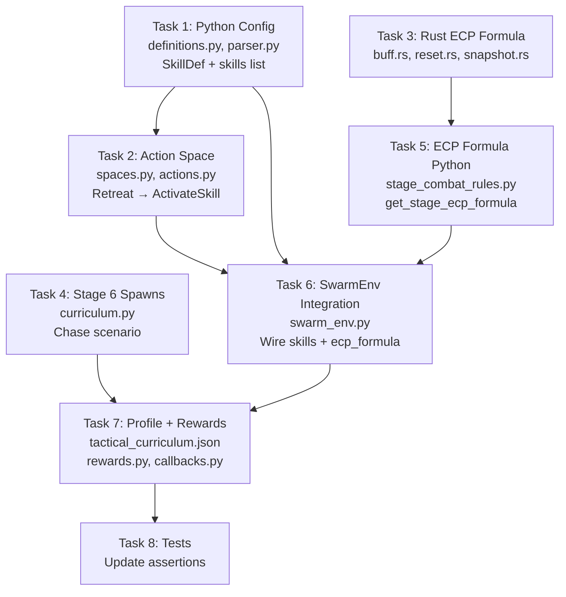

# Fix: Retreat → ActivateSkill + ECP Formula + Stage 6 Redesign

## Problem Statement

Three issues discovered during training:

1. **Retreat ≡ AttackCoord** — Action slot 6 is a duplicate waypoint navigation. Zero behavioral difference at the engine level ([executor.rs:L111-132](file:///Users/manifera/Documents/GitHub/mass-swarm-ai-simulator/micro-core/src/systems/directive_executor/executor.rs#L111-L132)).
2. **ECP = HP only** — ch2/ch3 compute only `stat[0]`, not true threat. The `EcpFormulaPayload` is plumbed but never consumed.
3. **Stage 6 has no purpose** — Flat map + AoE circle but no new skill to teach. Retreat was the new action, but it's identical to AttackCoord.

---

## Proposed Changes

### Feature 1: Retreat → ActivateSkill (Multi-Buff)

Replace action slot 6 with **ActivateSkill** — uses the spatial coordinate as a **skill index** to select which buff to activate from the profile's skill list.

**Action space mapping:**
```
Component 0 = 6 (ActivateSkill)
Component 1 = skill_index (mod num_available_skills)
```

The Rust `ActivateBuff` directive is already fully functional — cooldowns, modifiers, entity targeting all work. **Zero Rust changes needed.**

#### Profile Skill List Design

```json
"skills": [
  {
    "index": 0,
    "name": "SpeedBoost",
    "modifiers": [
      { "stat_index": 1, "modifier_type": "Multiplier", "value": 1.5 }
    ],
    "duration_ticks": 300,
    "cooldown_ticks": 600
  },
  {
    "index": 1,
    "name": "Debuff",
    "modifiers": [
      { "stat_index": 0, "modifier_type": "Multiplier", "value": 0.25 },
      { "stat_index": 2, "modifier_type": "Multiplier", "value": 0.25 }
    ],
    "duration_ticks": 9999,
    "cooldown_ticks": 180
  }
]
```

> [!IMPORTANT]
> Skill 0 = **SpeedBoost** (stat[1] × 1.5 for 5 seconds, 10s cooldown). Used in Stage 6 to outrun pursuit.
> Skill 1 = **Debuff** (existing ActivateBuff — HP × 0.25 + DMG × 0.25). Used in Stage 1 for target debuff.

#### File Changes

##### [MODIFY] [definitions.py](file:///Users/manifera/Documents/GitHub/mass-swarm-ai-simulator/macro-brain/src/config/definitions.py)
- Add `SkillDef` dataclass: `index`, `name`, `modifiers: list[StatModifierDef]`, `duration_ticks`, `cooldown_ticks`
- Modify `AbilitiesDef` to add `skills: list[SkillDef]` field (keep `activate_buff` for backward compat)

##### [MODIFY] [parser.py](file:///Users/manifera/Documents/GitHub/mass-swarm-ai-simulator/macro-brain/src/config/parser.py)
- Parse `skills` list from profile JSON abilities section

##### [MODIFY] [spaces.py](file:///Users/manifera/Documents/GitHub/mass-swarm-ai-simulator/macro-brain/src/env/spaces.py)
- Rename `ACTION_RETREAT = 6` → `ACTION_ACTIVATE_SKILL = 6`
- Update `ACTION_NAMES[6]` to `"ActivateSkill"`
- Remove `ACTION_ACTIVATE_SKILL` from `SPATIAL_ACTIONS` set (coordinate = skill index, not world position)
- Update docstring to v5.0 channel layout

##### [MODIFY] [actions.py](file:///Users/manifera/Documents/GitHub/mass-swarm-ai-simulator/macro-brain/src/env/actions.py)
- Replace `ACTION_RETREAT` import with `ACTION_ACTIVATE_SKILL`
- Add `skills: list[SkillDef] | None = None` parameter to `multidiscrete_to_directives`
- Replace `ACTION_RETREAT` branch:
  ```python
  elif action_type == ACTION_ACTIVATE_SKILL:
      if skills:
          skill_idx = flat_coord % len(skills)
          skill = skills[skill_idx]
          directives.append(build_activate_buff_directive(
              brain_faction,
              ActivateBuffDef(
                  modifiers=skill.modifiers,
                  duration_ticks=skill.duration_ticks
              )
          ))
      else:
          directives.append(build_hold_directive(brain_faction))
  ```
- Remove `build_retreat_directive` function (dead code)

##### [MODIFY] [swarm_env.py](file:///Users/manifera/Documents/GitHub/mass-swarm-ai-simulator/macro-brain/src/env/swarm_env.py)
- Pass `skills=self.profile.abilities.skills` to `multidiscrete_to_directives`

##### [MODIFY] [tactical_curriculum.json](file:///Users/manifera/Documents/GitHub/mass-swarm-ai-simulator/macro-brain/profiles/tactical_curriculum.json)
- Rename action 6 from `"Retreat"` to `"ActivateSkill"`
- Add `"skills"` list to abilities section (SpeedBoost + Debuff)

---

### Feature 2: Multi-Stat ECP Formula

Wire the already-plumbed `EcpFormulaPayload` to the Rust snapshot builder.

#### Rust Changes

##### [MODIFY] [buff.rs](file:///Users/manifera/Documents/GitHub/mass-swarm-ai-simulator/micro-core/src/config/buff.rs) (DensityConfig)
- Add: `pub ecp_formula: Option<Vec<usize>>`
- Default: `None` (fallback to `ecp_stat_index`)

##### [MODIFY] [reset.rs](file:///Users/manifera/Documents/GitHub/mass-swarm-ai-simulator/micro-core/src/bridges/zmq_bridge/reset.rs)
- After line 292, consume the formula:
  ```rust
  if let Some(ref formula) = reset.ecp_formula {
      configs.density_config.ecp_formula = Some(formula.stat_indices.clone());
  }
  ```

##### [MODIFY] [snapshot.rs](file:///Users/manifera/Documents/GitHub/mass-swarm-ai-simulator/micro-core/src/bridges/zmq_bridge/snapshot.rs)
- Replace lines 86-88 (single-stat ECP) with multi-stat product:
  ```rust
  let primary_stat = if let Some(ref formula) = density_config.ecp_formula {
      formula.iter()
          .map(|&idx| stat_block.0.get(idx).copied().unwrap_or(1.0))
          .product::<f32>()
  } else {
      density_config.ecp_stat_index
          .and_then(|idx| stat_block.0.get(idx).copied())
          .unwrap_or(0.0)
  };
  ```

#### Python Changes

##### [MODIFY] [stage_combat_rules.py](file:///Users/manifera/Documents/GitHub/mass-swarm-ai-simulator/macro-brain/src/training/stage_combat_rules.py)
- Add `get_stage_ecp_formula(stage: int) -> dict | None`:
  - Stages 0-4: `None` (use default `ecp_stat_index = 0`, HP only)
  - Stage 5+: `{"stat_indices": [0]}` (HP only initially, expandable)

##### [MODIFY] [swarm_env.py](file:///Users/manifera/Documents/GitHub/mass-swarm-ai-simulator/macro-brain/src/env/swarm_env.py)
- Import `get_stage_ecp_formula` from `stage_combat_rules`
- Add to reset payload: `"ecp_formula": get_stage_ecp_formula(effective_stage)`

---

### Feature 3: Stage 6 Redesign — Speed Buff Chase to Reinforcement

**Old:** AoE circle in open field (spread formation, no useful new action)
**New:** Speed-buff pursuit scenario. Brain must activate SpeedBoost to outrun a faster enemy and reach allied reinforcements.

#### Scenario Layout (1000×1000)
```
Brain (50 units)         Enemy (40 units, Charge)       Reinforcements (20 allies)
x=100, y=500             x=350, y=500                   x=800, y=500
speed=55                 speed=60                        HoldPosition
                         Charges brain
```

**Key mechanics:**
- Brain base speed: **55** (via per-spawn movement override)  
- Enemy speed: **60** (default profile speed) → enemy is **faster** than brain
- SpeedBoost skill: stat[1] × 1.5 → effective speed = **82.5** → brain outpaces enemy
- Reinforcement allies (faction 2): 20 × 100 HP, HoldPosition at x=800
- **ch6** shows ally density at reinforcement point → model sees WHERE to run
- Win condition: eliminate all enemies (with reinforcement help, brain wins; alone, brain loses)

**Learning sequence:**
1. Brain sees enemy approaching (ch1 enemy density)
2. Brain sees allies far right (ch6 sub-faction / ally density)
3. Brain activates SpeedBoost → outruns pursuit
4. Brain reaches reinforcement → combined force outnumbers enemy → win

**Combat math:**
```
Without SpeedBoost:
  Enemy (speed 60) catches brain (speed 55) in ~6 seconds
  40 vs 50 at close range: brain takes ~1200 DPS, dies in ~4s
  → BRAIN LOSES

With SpeedBoost:
  Brain (speed 82.5) outruns enemy (speed 60) → reaches allies in ~13s
  Combined: 70 (50+20) vs 40 at reinforcement point
  → BRAIN WINS with ~45 survivors
```

#### File Changes

##### [MODIFY] [curriculum.py](file:///Users/manifera/Documents/GitHub/mass-swarm-ai-simulator/macro-brain/src/training/curriculum.py) — `_spawns_stage6`
- Rewrite spawn generator:
  - Brain: 50 × 100 HP at (100, 500), `movement: {max_speed: 55}` 
  - Enemy: 40 × 100 HP at (350, 500), Charge behavior
  - Reinforcement (faction 2): 20 × 100 HP at (800, 500), HoldPosition

##### [MODIFY] [curriculum.py](file:///Users/manifera/Documents/GitHub/mass-swarm-ai-simulator/macro-brain/src/training/curriculum.py) — `generate_terrain_for_stage`
- Stage 6: flat terrain (already correct)

##### [MODIFY] [stage_combat_rules.py](file:///Users/manifera/Documents/GitHub/mass-swarm-ai-simulator/macro-brain/src/training/stage_combat_rules.py)
- Stage 6: no special combat rules (standard melee only)
- Remove old AoE circle rules for Stage 6

##### [MODIFY] [tactical_curriculum.json](file:///Users/manifera/Documents/GitHub/mass-swarm-ai-simulator/macro-brain/profiles/tactical_curriculum.json)
- Stage 6 description: `"Speed Chase: activate speed buff to outrun pursuit and reach reinforcements"`
- Stage 6 bot behaviors: faction 1 = Charge, faction 2 = HoldPosition

##### [MODIFY] [rewards.py](file:///Users/manifera/Documents/GitHub/mass-swarm-ai-simulator/macro-brain/src/env/rewards.py)
- Re-enable death penalty for Stage 6 (no longer AoE spread — deaths are avoidable by running)

> [!WARNING]
> The reinforcement faction (faction 2) in Stage 6 is **allied** but the current profile defines it as a "bot faction" (enemy). We need a mechanism so the reinforcements fight the enemy, not the brain. Options:
> 1. **Aggro mask**: At reset, inject `SetAggroMask(brain=0, reinforcement=2, allow_combat=false)` and `SetAggroMask(reinforcement=2, enemy=1, allow_combat=true)`.
> 2. **Combat rule filtering**: Don't include `0→2` / `2→0` combat rules for Stage 6.
> 
> Option 2 is cleaner — `get_stage_combat_rules` already constructs per-stage rules, so we just omit brain↔reinforcement rules and add reinforcement↔enemy rules.

---

## Observation Channel Audit (Full)

| Channel | Status | Notes |
|:---:|:---:|---|
| ch0 (friendly count) | ✅ | Brain + sub-factions merged |
| ch1 (enemy count) | ✅ | All enemies merged + LKP under fog |
| ch2 (friendly ECP) | ⚠️ → ✅ | Fixed by Feature 2 (multi-stat formula) |
| ch3 (enemy ECP) | ⚠️ → ✅ | Fixed by Feature 2 |
| ch4 (terrain) | ✅ | Proper normalization |
| ch5 (fog) | ✅ | 3-level merge |
| ch6 (ally density) | ✅ | Shows reinforcement positions for Stage 6 |
| ch7 (objective ping) | ✅ | Stage 4 intel ping |

---

## Execution DAG



**Phase 1 (parallel):** T1 (Python config), T3 (Rust ECP), T4 (Stage 6 spawns)
**Phase 2 (parallel):** T2 (action space, depends T1), T5 (ECP Python, depends T3)
**Phase 3:** T6 (SwarmEnv integration, depends T1+T2+T5)
**Phase 4:** T7 (Profile + Rewards, depends T4+T6)
**Phase 5:** T8 (Tests, depends T7)

## Verification Plan

### Automated Tests
- `pytest tests/ -v` — all 214 tests pass
- `cargo test` — all Rust tests pass
- New test: `ActivateSkill` creates `ActivateBuff` directive with correct skill modifiers
- New test: ECP formula computes product of multiple stats

### Manual Verification
1. Stage 1: verify ActivateSkill fires debuff on target (existing debuff mechanic still works)
2. Stage 6: verify brain with SpeedBoost outruns enemy and reaches reinforcements
3. Check Rust log output for `[Reset] Applied N combat rules` to confirm reinforcement combat rules
