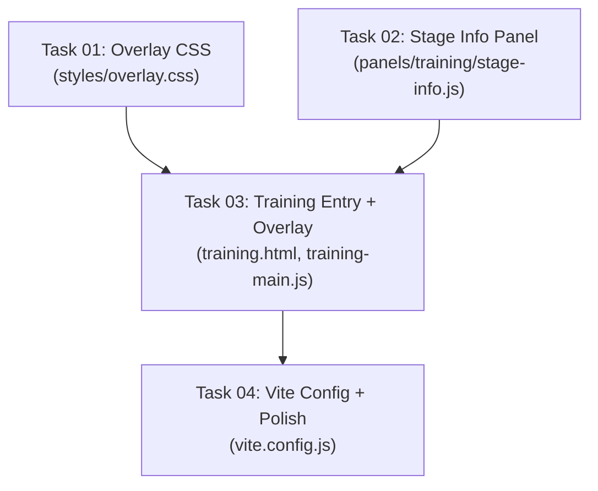

# Implementation Plan: Training Page — Fullscreen Map + Overlay Dashboard Redesign

## Goal

Convert the Training page from a sidebar-based layout to a **fullscreen map with floating glassmorphic overlay dashboard**. Create a separate `training.html` Vite entry point so Training and Playground can run independently in separate browser tabs. The overlay dashboard shows stage goals, training metrics, ML brain status, and telemetry as floating cards with a minimize/expand toggle.

## Background

The Strategist analyzed the current architecture (`strategy_brief.md`) and produced a detailed `research_digest.md` with codebase facts. Key findings:

- The current single-page `index.html` uses a **380px fixed sidebar** that is cramped for training data
- `websocket.js` tightly couples to panel update functions via direct imports — the training page must keep this import graph intact
- Canvas rendering, state, and controls are already modular and can be imported independently
- Training status HTTP polling to `/logs/run_latest/training_status.json` works via symlink (not proxy)

## Resolved Design Decisions

| Question | Decision |
|----------|----------|
| Dashboard position | Bottom-left (stage/metrics) + bottom-right (telemetry/perf) |
| Stage info detail | Compact summary in card → "Details" button opens **modal** with full rules/curriculum |
| Stage change toast | Yes — brief animation on top bar when stage index changes |
| Canvas hint | **Hidden by default** — only visible in minimized overlay state |
| Mobile support | Simplified bottom sheet: training stage status compact strip + layer toggles only |

---

## Architecture

```
debug-visualizer/
├── index.html              ← UNCHANGED (playground page)
├── training.html           ← NEW (fullscreen map + overlay DOM)
├── vite.config.js          ← MODIFY (multi-page input)
└── src/
    ├── main.js             ← UNCHANGED (playground entry)
    ├── training-main.js    ← NEW (training entry — overlay system + mobile sheet)
    ├── styles/
    │   └── overlay.css     ← NEW (glassmorphic cards, modal, minimize, mobile sheet)
    ├── panels/
    │   └── training/
    │       ├── stage-info.js  ← NEW (compact stage card + detail modal)
    │       └── [existing]     ← UNCHANGED (dashboard.js, ml-brain.js, perf.js)
    └── [everything else]   ← UNCHANGED
```

### Desktop Layout (Expanded)

```
┌─────────────────────────────────────────────────────────┐
│ FULLSCREEN MAP (canvas fills viewport)                  │
│                                                         │
│  ┌─ Top Bar (fixed) ──────────────────────────────────┐ │
│  │ [●] CONNECTED │ SwarmControl │ Stage 1 │ [—]  [👁] │ │
│  └────────────────────────────────────────────────────┘ │
│                                                         │
│                    [map content]                         │
│                                                         │
│  ┌── Bottom Left ──────┐     ┌── Bottom Right ────────┐ │
│  │ ┌── STAGE INFO ───┐ │     │ ┌── TELEMETRY ──────┐  │ │
│  │ │ Target Selection │ │     │ │ TPS: 2400         │  │ │
│  │ │ 80%WR / 50 eps  │ │     │ │ Tick: 45000       │  │ │
│  │ │ [Details ▸]     │ │     │ │ Entities: 65      │  │ │
│  │ └────────────────-┘ │     │ └────────────────────┘  │ │
│  │ ┌── TRAINING ─────┐ │     │ ┌── PERFORMANCE ────┐  │ │
│  │ │ ⬡ Ep: 659       │ │     │ │ Move: ██████░░░░  │  │ │
│  │ │ WR 50% ■■■□□    │ │     │ │ Combat: █████░░░  │  │ │
│  │ │ ▁▂▃▅▆▅▃▂ reward │ │     │ │ WS: ██░░░░░░░░   │  │ │
│  │ └────────────────-┘ │     │ └────────────────────┘  │ │
│  │ ┌── ML BRAIN ─────┐ │     └────────────────────────┘ │
│  │ │ Python: 🟢      │ │                                │
│  │ │ Dir: AttackCoord │ │                                │
│  │ └────────────────-┘ │                                │
│  └─────────────────────┘                                │
└─────────────────────────────────────────────────────────┘
```

### Desktop Layout (Minimized)

```
┌─────────────────────────────────────────────────────────┐
│ FULLSCREEN MAP                                          │
│                                                         │
│  ┌─ Top Bar ──────────────────────────────────────────┐ │
│  │ [●] CONNECTED │ SwarmControl │ Stage 1 │ [□]  [👁] │ │
│  └────────────────────────────────────────────────────┘ │
│                                                         │
│                    [map content]                         │
│                                                         │
│  ┌─ Minimized Strip ─────────────────────────────────┐  │
│  │ STAGE 1 │ EP 659 │ WR 50% ■■■□□ │ 🟢 Connected   │  │
│  └───────────────────────────────────────────────────┘  │
│  Pan: drag · Zoom: scroll · Double-click: reset view    │
└─────────────────────────────────────────────────────────┘
```

### Stage Detail Modal (opened from Stage Info card)

```
┌─ Stage Details ─────────────────────────────────── [×] ─┐
│                                                         │
│  Stage 1: Target Selection                              │
│  "Read ECP density to pick correct target"              │
│                                                         │
│  ── Graduation ──                                       │
│  Win Rate: 80%   Min Episodes: 50                       │
│                                                         │
│  ── Combat Rules ──                                     │
│  ┌──────────┬──────────┬───────┬────────────────────┐   │
│  │ Source   │ Target   │ Range │ Effects            │   │
│  ├──────────┼──────────┼───────┼────────────────────┤   │
│  │ Brain    │ Target   │ 25    │ HP -25/s           │   │
│  │ Target   │ Brain    │ 25    │ HP -10/s           │   │
│  │ Brain    │ Trap     │ 25    │ HP -25/s           │   │
│  │ Trap     │ Brain    │ 25    │ HP -50/s           │   │
│  └──────────┴──────────┴───────┴────────────────────┘   │
│                                                         │
│  ── Unlocked Actions ──                                 │
│  [Hold] [AttackCoord]                                   │
│                                                         │
│  ── Factions ──                                         │
│  F0: Brain (50×100HP) · F1: Trap (50×200HP)             │
│  F2: Target (50×24HP)                                   │
└─────────────────────────────────────────────────────────┘
```

### Mobile Layout (< 768px)

```
┌───────────────────────────┐
│  FULLSCREEN MAP           │
│                           │
│    [map content]          │
│                           │
│                           │
│                           │
├───── Bottom Sheet ────────┤
│ ╌╌╌╌╌╌ (handle) ╌╌╌╌╌╌╌ │  ← peek bar (collapsed)
│ STAGE 1 │ EP 659 │ 50%WR │
└───────────────────────────┘

  ↕ swipe up ↕

┌───────────────────────────┐
│  FULLSCREEN MAP           │
│                           │
├───── Bottom Sheet ────────┤
│ ╌╌╌╌╌╌ (handle) ╌╌╌╌╌╌╌ │  ← expanded
│ ┌── Training Status ────┐ │
│ │ Stage 1: Target Sel.  │ │
│ │ Ep: 659  WR: 50%     │ │
│ │ ■■■■■□□□□□ (80% goal) │ │
│ │ Streak: 0  🟢 Conn   │ │
│ └───────────────────────┘ │
│ ┌── Viewport Layers ────┐ │
│ │ ☑ Grid  ☑ Bounds      │ │
│ │ ☐ Velocity  ☐ Flow    │ │
│ │ ☐ Ch0  ☐ Ch1  ...     │ │
│ │ ☑ Zones  ☑ Fog        │ │
│ └───────────────────────┘ │
└───────────────────────────┘
```

---

## Module Import Strategy

The training page reuses **100% of shared modules** (state, websocket, draw, controls, config) without modification. The key difference:

- `main.js` → imports ALL panels (Training + Playground + Shared) + sidebar + tabs + router
- `training-main.js` → imports ONLY Training + select Shared panels + overlay system (no sidebar, no tabs, no router, no playground panels)

**WebSocket tight coupling is preserved**: `websocket.js` imports `updatePerfBars`, `updateMlBrainPanel`, `updateAggroGrid`, `updateLegend`, `initFactionToggles`. Since the training page imports these same panel modules, the import graph remains valid.

---

## Shared Contracts

### Overlay Card Position Assignments

| Panel ID | Card Group | Priority (top→bottom) |
|----------|------------|----------------------|
| `stage-info` | bottom-left | 1 |
| `dashboard` | bottom-left | 2 |
| `ml-brain` | bottom-left | 3 |
| `telemetry` | bottom-right | 1 |
| `perf` | bottom-right | 2 |

### Overlay CSS Class Contract

```css
.overlay-card           /* Glassmorphic floating card */
.overlay-card__header   /* Card title bar with icon + title */
.overlay-card__body     /* Card content area */
.overlay-top-bar        /* Full-width fixed top bar */
.overlay-group--left    /* Bottom-left card column */
.overlay-group--right   /* Bottom-right card column */

/* State classes on #overlay-root */
.overlay--minimized     /* Hides card groups, shows mini-strip */
.overlay--expanded      /* Full cards visible (default) */

.overlay-mini-strip     /* Compact bottom strip (minimized state) */
.overlay-stage-toast    /* Stage graduation animation element */

/* Modal */
.stage-modal            /* Full-screen backdrop */
.stage-modal__dialog    /* Centered content box */
.stage-modal--open      /* Visible state */

/* Mobile training sheet */
.training-sheet         /* Mobile bottom sheet container */
.training-sheet__peek   /* Collapsed peek bar content */
.training-sheet__body   /* Expanded content (status + layers) */
```

### Stage Info Data Contract

```js
// Data from tactical_curriculum.json, stored at module level
{
  training: { curriculum: [
    { stage: 0, description: "...", graduation: { win_rate: 0.85, min_episodes: 30 } }
  ]},
  combat: { rules: [ { source_faction, target_faction, range, effects: [...] } ] },
  actions: [ { index: 0, name: "Hold", unlock_stage: 0 } ],
  factions: [ { id: 0, name: "Brain", role: "brain" } ]
}
```

---

## DAG Execution Phases



### Phase 1 — Foundation (Parallel)

| Task | Domain | Files | Tier | Live Impact |
|------|--------|-------|------|-------------|
| Task 01: Overlay CSS | CSS | `src/styles/overlay.css` | `advanced` | `safe` |
| Task 02: Stage Info Panel + Modal | JS | `src/panels/training/stage-info.js` | `standard` | `safe` |

### Phase 2 — Assembly (Sequential after Phase 1)

| Task | Domain | Files | Tier | Live Impact |
|------|--------|-------|------|-------------|
| Task 03: Training Entry + Overlay + Mobile | HTML + JS | `training.html`, `src/training-main.js` | `advanced` | `safe` |

### Phase 3 — Integration (Sequential after Phase 2)

| Task | Domain | Files | Tier | Live Impact |
|------|--------|-------|------|-------------|
| Task 04: Vite Config + Integration | Config | `vite.config.js` | `standard` | `safe` |

---

## Proposed Changes

---

### Task 01: Overlay Design System

**Task_ID:** `task_01_overlay_css`
**Execution_Phase:** 1
**Model_Tier:** `advanced`
**Target_Files:** `debug-visualizer/src/styles/overlay.css`
**Dependencies:** None
**Context_Bindings:** `skills/frontend-ux-ui`, `strategy_brief.md`, `research_digest.md`
**Live_System_Impact:** `safe`

#### [NEW] [overlay.css](file:///Users/manifera/Documents/GitHub/mass-swarm-ai-simulator/debug-visualizer/src/styles/overlay.css)

Complete CSS design system for the glassmorphic overlay dashboard. Design direction: **tactical command center** — dark glass panels with accent glow, precision typography, military-grade HUD aesthetic. Must use existing CSS variables from `variables.css` (`--accent-primary`, `--bg-surface`, `--font-display`, etc.).

**Required class definitions:**

1. **`.overlay-card`** — Core glassmorphic card:
   - `backdrop-filter: blur(12px) saturate(1.4)`
   - `background: rgba(8, 12, 18, 0.75)`
   - `border: 1px solid rgba(6, 214, 160, 0.12)` (accent at 12% opacity)
   - `border-radius: 12px`
   - `box-shadow: 0 8px 32px rgba(0,0,0,0.4)`
   - Max width constraint per group (~320px left, ~280px right)

2. **`.overlay-top-bar`** — Fixed top, full width, height 48px:
   - Flex row: connection badge, title "SwarmControl", stage badge, divider, minimize button, layers toggle button
   - Same glassmorphic background as cards
   - `position: fixed; top: 0; left: 0; right: 0; z-index: 1000`

3. **`.overlay-group--left` / `.overlay-group--right`** — Fixed bottom positioning:
   - `position: fixed; bottom: 24px; z-index: 999`
   - Left group: `left: 24px`, right group: `right: 24px`
   - Flex column with `gap: 12px`
   - Slide-in animation: `transform: translateY(20px) → translateY(0)` with staggered `animation-delay`

4. **`.overlay--minimized` state** — Applied to `#overlay-root`:
   - Hides `.overlay-group--left` and `.overlay-group--right` with `opacity: 0; pointer-events: none; transform: translateY(20px)`
   - Shows `.overlay-mini-strip` (normally hidden)
   - Shows `.canvas-hint` (normally hidden on training page)
   - Transition: `0.3s ease-out`

5. **`.overlay-mini-strip`** — Compact horizontal bar at bottom:
   - `position: fixed; bottom: 24px; left: 24px; right: 24px`
   - Single flex row: stage badge, episode count, win rate mini-bar, connection dot, expand button
   - Same glassmorphic styling, height ~44px
   - Hidden by default (`.overlay--expanded .overlay-mini-strip { display: none }`)

6. **`.overlay-stage-toast`** — Stage graduation animation:
   - Centered notification that appears briefly when stage changes
   - Slide-down + fade-in, hold 3s, fade-out
   - Keyframe: `@keyframes stageToast { 0% { opacity:0; transform:translateY(-20px) } 10% { opacity:1; transform:translateY(0) } 80% { opacity:1 } 100% { opacity:0 } }`
   - Uses `--accent-primary` glow + large stage number

7. **`.stage-modal`** — Full-viewport modal overlay:
   - `position: fixed; inset: 0; z-index: 2000`
   - Backdrop: `background: rgba(0, 0, 0, 0.6); backdrop-filter: blur(4px)`
   - Hidden by default, visible with `.stage-modal--open`
   - `.stage-modal__dialog`: centered box, max-width 600px, max-height 80vh, overflow-y auto
   - Same glassmorphic card styling but elevated (stronger shadow, slightly brighter border)
   - Close button top-right, `×` icon
   - Sections for: description, graduation criteria, combat rules table, unlocked actions, factions
   - Table styling: compact, monospace data cells, alternating row subtle highlight

8. **`.training-sheet`** — Mobile bottom sheet for training page:
   - Only appears at `@media (max-width: 768px)`
   - Replaces the full sidebar approach with a minimal sheet
   - Peek state: shows `.training-sheet__peek` (compact training status line — same content as mini-strip)
   - Expanded state: shows `.training-sheet__body` (training status card + viewport layer toggles)
   - Swipe gesture area via `.training-sheet__handle`
   - Height: peek ~64px, expanded ~60vh
   - Same glassmorphic background

9. **Responsive rules:**
   - `@media (max-width: 768px)`: Hide `.overlay-group--left`, `.overlay-group--right`, `.overlay-mini-strip`. Show `.training-sheet`.
   - `@media (min-width: 769px)`: Hide `.training-sheet`.

10. **Canvas hint visibility:**
    - `.canvas-hint` is hidden by default on training page (via `.training-page .canvas-hint { opacity: 0 }`)
    - Visible only when `.overlay--minimized` is active: `.overlay--minimized ~ .canvas-area .canvas-hint, .overlay--minimized .canvas-hint { opacity: 0.8 }`

**CSS import strategy:** Since `training-main.js` (Task 03) will `import './styles/overlay.css'` directly, Vite handles the bundling — no orphaned CSS risk.

**Verification_Strategy:**
```
Test_Type: manual_steps
Acceptance_Criteria:
  - "overlay.css defines all classes listed in the CSS contract"
  - "Classes use existing CSS variables from variables.css where available"
  - "Modal has backdrop + dialog + close button styles"
  - "Mobile sheet has peek + expanded states with swipe handle"
  - "Minimized state shows canvas hint, expanded state hides it"
Manual_Steps:
  - "Import overlay.css into a test HTML file and verify rendered styles"
```

---

### Task 02: Stage Info Panel + Detail Modal

**Task_ID:** `task_02_stage_info`
**Execution_Phase:** 1
**Model_Tier:** `standard`
**Target_Files:** `debug-visualizer/src/panels/training/stage-info.js`
**Dependencies:** None
**Context_Bindings:** `context/project`, `research_digest.md`
**Live_System_Impact:** `safe`

#### [NEW] [stage-info.js](file:///Users/manifera/Documents/GitHub/mass-swarm-ai-simulator/debug-visualizer/src/panels/training/stage-info.js)

New panel module that displays a **compact stage summary card** with a "Details" button that opens a **modal dialog** with full curriculum data. Also handles the **stage-change toast animation**.

**Exports:**

1. **`default` panel object** — conforming to panel interface:
   ```js
   {
     id: 'stage-info',
     title: 'Stage Info',
     icon: '🎯',
     modes: ['training'],
     defaultExpanded: true,
     render(body) { ... },
     update() { ... },
   }
   ```

2. **`loadCurriculum()`** — async function, called once at boot:
   - `fetch('/logs/run_latest/tactical_curriculum.json')` with fallback to fetch error silently
   - Parses JSON, stores at module-level `let curriculum = null`
   - Extracts `training.curriculum[]`, `combat.rules[]`, `actions[]`, `factions[]`

3. **`getCurrentStageFromDOM()`** — reads stage from dashboard panel's DOM:
   - `document.getElementById('dash-stage')?.textContent?.match(/\d+/)?.[0]`
   - Returns parsed integer or `0`
   - Pragmatic coupling until Task 03 wires proper state

**Render — Compact Card (in `render(body)`):**
```
┌─ 🎯 Stage Info ──────────────┐
│ Stage 1: Target Selection     │
│ Goal: 80% WR · Min 50 eps    │
│ Actions: [Hold] [AttackCoord] │
│ [Details ▸]                   │
└───────────────────────────────┘
```

- Stage name from `curriculum.training.curriculum[N].description`
- Graduation one-liner: `win_rate × 100`% WR · Min `min_episodes` eps
- Unlocked actions: `actions.filter(a => a.unlock_stage <= N)` rendered as inline badges
- "Details ▸" button — `onclick` opens the modal

**Modal — Full Stage Details:**

When "Details ▸" is clicked, creates/shows a modal dialog element (appended to `document.body`):

- **Close** via `×` button, clicking backdrop, or pressing `Escape`
- **Sections:**
  1. **Header:** Stage number + name (large)
  2. **Description:** Full text from curriculum
  3. **Graduation Criteria:** Win rate threshold (with visual bar), min episodes
  4. **Combat Rules Table:** All rules from `combat.rules[]` — columns: Source, Target, Range, Effects
     - Source/Target resolved to faction names via `factions[]`
     - Effects formatted as: `HP -25/s`, `DMG ×0.25`, etc.
  5. **Unlocked Actions:** Badge list
  6. **Factions:** List with stats summary
- Modal HTML uses classes from `overlay.css` (`.stage-modal`, `.stage-modal__dialog`, etc.)

**Stage Change Toast:**

The `update()` method compares current stage to previous. When a change is detected:
1. Create a toast element with class `.overlay-stage-toast`
2. Content: "⬆ STAGE {N}" + stage description
3. Append to `document.body`, auto-remove after 4s via `animationend` listener
4. Only fires once per stage transition (tracked via `let lastRenderedStage`)

**Anti-hallucination guide (for `standard` tier):**
- Import `drawSparkline` from `'../../components/sparkline.js'` (for potential future use, NOT required for this task)
- DOM IDs for the compact card: `stage-info-name`, `stage-info-goal`, `stage-info-actions`, `stage-info-details-btn`
- Modal ID: `stage-detail-modal`
- Toast class: `overlay-stage-toast` (styled in overlay.css by Task 01)
- Curriculum fetch path: `/logs/run_latest/tactical_curriculum.json`
- Do NOT start any HTTP polling — this panel reads stage number from existing DOM

**Verification_Strategy:**
```
Test_Type: manual_steps
Acceptance_Criteria:
  - "Panel renders compact stage info with name, goal, and action badges"
  - "Details button opens modal with full combat rules table"
  - "Modal closes on X, backdrop click, and Escape key"
  - "Stage change fires toast animation element"
  - "No errors if curriculum JSON is unavailable (graceful fallback)"
Manual_Steps:
  - "Load training page, verify compact card renders"
  - "Click Details, verify modal opens with rules table"
  - "Close modal via all 3 methods"
```

---

### Task 03: Training Entry Point + Overlay Renderer + Mobile Sheet

**Task_ID:** `task_03_training_entry`
**Execution_Phase:** 2
**Model_Tier:** `advanced`
**Target_Files:** `debug-visualizer/training.html`, `debug-visualizer/src/training-main.js`
**Dependencies:** Task 01 (overlay.css), Task 02 (stage-info.js)
**Context_Bindings:** `skills/frontend-ux-ui`, `strategy_brief.md`, `research_digest.md`
**Live_System_Impact:** `safe`

#### [NEW] [training.html](file:///Users/manifera/Documents/GitHub/mass-swarm-ai-simulator/debug-visualizer/training.html)

New HTML entry point with fullscreen canvas and overlay DOM structure.

**Requirements:**
- Same `<head>` as `index.html` (charset, viewport, title "SwarmControl — Training", fonts)
- `<body class="training-page">` — class used by overlay.css for training-specific rules
- **Canvas area** — fullscreen, no `.app-container` flex wrapper, no sidebar:
  ```html
  <main class="canvas-area" id="canvas-area" style="width:100vw;height:100vh;">
    <canvas id="canvas-bg"></canvas>
    <canvas id="canvas-entities"></canvas>
    <div class="canvas-hint" id="canvas-hint">Pan: drag · Zoom: scroll · Double-click: reset</div>
  </main>
  ```
- **Overlay root** — positioned over canvas:
  ```html
  <div id="overlay-root" class="overlay--expanded">
    <div class="overlay-top-bar" id="overlay-top-bar">
      <!-- Connection badge, title, stage badge, minimize btn, layers btn -->
    </div>
    <div class="overlay-group--left" id="overlay-left">
      <!-- Cards injected by training-main.js -->
    </div>
    <div class="overlay-group--right" id="overlay-right">
      <!-- Cards injected by training-main.js -->
    </div>
    <div class="overlay-mini-strip" id="overlay-mini-strip">
      <!-- Compact: stage badge, ep, wr bar, connection, expand btn -->
    </div>
  </div>
  ```
- **Mobile training sheet** — only visible on mobile:
  ```html
  <div class="training-sheet" id="training-sheet">
    <div class="training-sheet__handle"><div class="handle-pill"></div></div>
    <div class="training-sheet__peek" id="training-sheet-peek">
      <!-- Compact status line -->
    </div>
    <div class="training-sheet__body" id="training-sheet-body">
      <!-- Training status + layer toggles -->
    </div>
  </div>
  ```
- **Connection badge** — use same IDs (`connection-badge`, `status-dot`, `status-text`) so `websocket.js` querySelector works. Place inside top bar.
- **NO sidebar, NO `.app-container`, NO tab-bar, NO panel-scroll, NO bottom-sheet-handle** — this is a clean break from the sidebar layout.
- `<script type="module" src="/src/training-main.js">`

#### [NEW] [training-main.js](file:///Users/manifera/Documents/GitHub/mass-swarm-ai-simulator/debug-visualizer/src/training-main.js)

Training-specific entry point. ~250 lines.

**Imports:**
```js
// CSS
import './styles/reset.css';
import './styles/variables.css';
import './styles/canvas.css';
import './styles/panels.css';     // for stat-grid, stat-card classes used by panels
import './styles/controls.css';   // for toggle-control used by viewport
import './styles/training.css';   // for training-dashboard, stage-badge, win-rate classes
import './styles/overlay.css';    // NEW overlay system

// Shared modules
import * as S from './state.js';
import { connectWebSocket } from './websocket.js';
import { initCanvases, resizeCanvas, drawEntities, drawFog, drawBackground, drawArenaBounds } from './draw/index.js';
import { initControls } from './controls/init.js';

// Training panels (import for side-effects + direct references)
import dashboardPanel from './panels/training/dashboard.js';
import mlBrainPanel, { updateMlBrainPanel } from './panels/training/ml-brain.js';
import perfPanel, { updatePerfBars } from './panels/training/perf.js';
import stageInfoPanel, { loadCurriculum } from './panels/training/stage-info.js';

// Shared panels used on training page
import telemetryPanel, { startTelemetryLoop } from './panels/shared/telemetry.js';
import viewportPanel from './panels/shared/viewport.js';
import { initFactionToggles } from './panels/shared/legend.js';
```

> **Note:** `layout.css` is NOT imported — it defines the sidebar/bottom-sheet layout which is not used here. Overlay.css defines the training page's own layout.

**Boot sequence:**
1. `initCanvases(bgCanvas, entitiesCanvas)` — fullscreen
2. `loadCurriculum()` — fetch curriculum JSON
3. `renderOverlay()` — build overlay cards into DOM groups
4. `initOverlayToggle()` — minimize/expand button, localStorage persistence
5. `initLayersPanel()` — render viewport layer toggles (desktop: as a dropdown from top-bar layers button; mobile: in sheet body)
6. `initMobileSheet()` — mobile bottom sheet with swipe gestures
7. `initControls()` — canvas pan/zoom/click
8. `connectWebSocket()`
9. `resizeCanvas()`
10. `requestAnimationFrame(renderFrame)`

**`renderOverlay()` function:**
- Panel position map: `{ 'stage-info': 'left', 'dashboard': 'left', 'ml-brain': 'left', 'telemetry': 'right', 'perf': 'right' }`
- For each panel, create an `.overlay-card` element with header + body
- Call `panel.render(cardBody)` to populate
- Append to `#overlay-left` or `#overlay-right` based on position map

**`initOverlayToggle()` function:**
- Reads `localStorage.getItem('overlay-minimized')`
- Toggles `.overlay--minimized` / `.overlay--expanded` on `#overlay-root`
- Minimize button in top bar: `[—]` icon → toggles state
- Also toggles `.canvas-hint` visibility (hint visible only in minimized state)

**`initLayersPanel()` function:**
- Creates a dropdown panel triggered by the `[👁]` layers button in the top bar
- Dropdown contains the viewport panel's toggle checkboxes (re-renders `viewportPanel.render()` into a dropdown body)
- Dropdown anchored to top-right, glassmorphic styling, click-outside to close

**`initMobileSheet()` function:**
- Detects mobile via `window.matchMedia('(max-width: 768px)')`
- Peek bar: renders compact training status (stage badge + episode + win rate)
- Expanded body: renders training status summary + viewport layer toggles
- Swipe gesture: touch start/end on handle to toggle expanded class
- Updates peek bar content via a `updateMobileSheet()` called per-frame

**`renderFrame()` function:**
```js
function renderFrame() {
  const ctx = canvasEntities.getContext('2d');
  ctx.clearRect(0, 0, canvasEntities.width, canvasEntities.height);
  drawEntities();
  if (S.showFog) drawFog();
  drawArenaBounds(ctx);
  // Update overlay panels per-frame
  updateOverlayPanels();
  requestAnimationFrame(renderFrame);
}
```

**`updateOverlayPanels()` function:**
- Calls `update()` on each registered panel if it has one
- Updates mini-strip values (stage, episode, win rate, connection status)
- Updates mobile sheet peek bar values

**`updateMiniStrip()` function:**
- Reads from dashboard DOM elements or state for: stage, episode, win rate, connection status
- Updates `#overlay-mini-strip` inner content

**Verification_Strategy:**
```
Test_Type: manual_steps
Acceptance_Criteria:
  - "training.html loads with fullscreen canvas and overlay cards"
  - "No sidebar, no tabs, no router — training-only UI"
  - "Overlay panels render and update with live data"
  - "Minimize/expand toggle works and persists across page reload"
  - "Canvas hint visible only in minimized state"
  - "Stage change toast appears when stage transitions"
  - "Layers dropdown opens from top-bar button with all toggles"
  - "Mobile sheet shows peek bar with status, expands to show status + toggles"
  - "Playground page (index.html) is completely unaffected"
Manual_Steps:
  - "Open http://localhost:5173/training.html — verify fullscreen map"
  - "Verify overlay cards show training data when Rust core is running"
  - "Click minimize — cards collapse, mini-strip appears, canvas hint shows"
  - "Click expand — cards slide back in, hint hides"
  - "Click layers icon — dropdown with viewport toggles appears"
  - "Use Chrome DevTools responsive mode (375px width) — verify mobile sheet"
  - "Open http://localhost:5173/ — verify playground sidebar intact"
```

---

### Task 04: Vite Config + Integration Polish

**Task_ID:** `task_04_vite_integration`
**Execution_Phase:** 3
**Model_Tier:** `standard`
**Target_Files:** `debug-visualizer/vite.config.js`
**Dependencies:** Task 03 (training.html exists)
**Context_Bindings:** `context/project`
**Live_System_Impact:** `safe`

#### [MODIFY] [vite.config.js](file:///Users/manifera/Documents/GitHub/mass-swarm-ai-simulator/debug-visualizer/vite.config.js)

Update Vite config for multi-page build:

```js
import { defineConfig } from 'vite';
import { resolve } from 'path';

export default defineConfig({
  root: '.',
  publicDir: 'public',
  server: {
    port: 5173,
    open: '/training.html',  // Default to training page during dev
  },
  build: {
    outDir: 'dist',
    emptyOutDir: true,
    rollupOptions: {
      input: {
        playground: resolve(__dirname, 'index.html'),
        training: resolve(__dirname, 'training.html'),
      },
    },
  },
});
```

**Anti-hallucination guide:**
- Import `resolve` from `'path'` (Node.js built-in, no install needed)
- `__dirname` is available in Vite config files (ESM context with Vite's Node handling)
- Keep existing `publicDir: 'public'` — the `/logs` symlink lives there
- Remove the old comment about `/logs` proxy — it was already correctly using symlink

**Verification_Strategy:**
```
Test_Type: unit
Test_Stack: Vite 6.x build
Acceptance_Criteria:
  - "npx vite build produces dist/ with both index.html and training.html"
  - "npm run dev serves both pages on localhost:5173"
  - "Training page assets are correctly bundled (CSS, JS)"
Suggested_Test_Commands:
  - "cd debug-visualizer && npx vite build"
  - "cd debug-visualizer && npx vite --port 5173"
```

---

## File Ownership Summary

| File | Task | Action | Lines (est.) |
|------|------|--------|-------------|
| `src/styles/overlay.css` | 01 | NEW | ~280 |
| `src/panels/training/stage-info.js` | 02 | NEW | ~220 |
| `training.html` | 03 | NEW | ~70 |
| `src/training-main.js` | 03 | NEW | ~260 |
| `vite.config.js` | 04 | MODIFY | ~17 |

**Zero collisions.** No two tasks touch the same file. No existing files are modified except `vite.config.js` in the final sequential task.

---

## Step 0: Feature Ledger Update

Two recent archives are not yet logged in `context/project/features.md`:

1. **Redesign Tactical Curriculum** — `.agents/history/20260413_140000_redesign_tactical_curriculum/`
2. **Tactical Speed Chase Refactor** — `.agents/history/20260413_142129_tactical_speed_chase_refactor/`

These will be logged upon plan approval, before task dispatch.

---

## Verification Plan

### Automated Tests

```bash
cd debug-visualizer && npx vite build
# Expect: dist/ contains index.html, training.html, and bundled assets
```

### Manual Verification (Browser)

| # | Test | Expected |
|---|------|----------|
| 1 | Open `training.html` | Canvas fullscreen, no sidebar |
| 2 | Connection badge | Green dot when Rust core running |
| 3 | Overlay cards (expanded) | 5 cards in bottom-left/right groups |
| 4 | Stage Info card | Shows stage name, goal summary, action badges |
| 5 | "Details ▸" button | Opens modal with full combat rules table |
| 6 | Modal close | ×, backdrop click, Escape all work |
| 7 | Minimize toggle | Cards hide, mini-strip appears, canvas hint shows |
| 8 | Expand toggle | Cards slide in, mini-strip hides, hint hides |
| 9 | Persistence | Refresh → minimize state preserved (localStorage) |
| 10 | Stage change | Toast animation "⬆ STAGE N" appears briefly |
| 11 | Layers button `[👁]` | Dropdown with viewport layer toggles |
| 12 | Mobile (375px) | Sheet peek bar with status, swipe to expand shows layers |
| 13 | Playground intact | `index.html` — sidebar, tabs, all panels unchanged |

### Live System Impact

**All tasks are `safe`** — they only add new files to the debug-visualizer (frontend-only). No Rust core or Python training module changes. Training can continue running uninterrupted.
