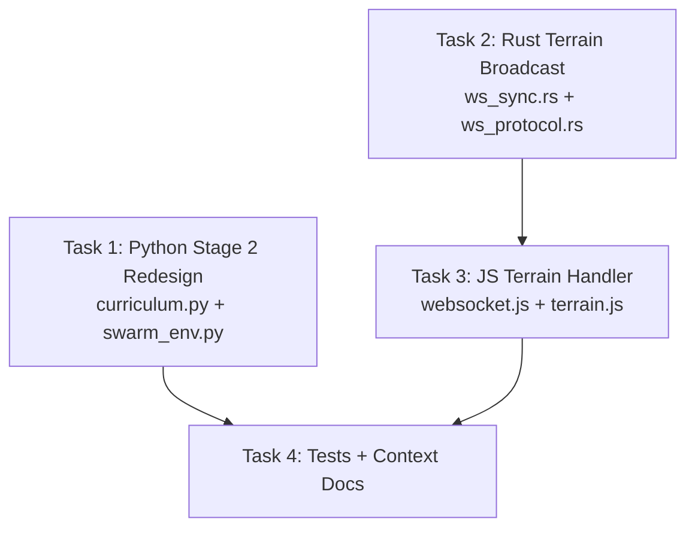

# Stage 2 Pheromone Redesign + Terrain Visualizer Fix

## Problem Statement

### Stage 2 — Structurally Broken
The current Stage 2 is trivially solvable without pheromone:
1. `AttackCoord` directly toward target at `(520, 460)` always wins — the flow field routes through the gap automatically
2. Zero reward signal for pheromone usage — PPO will never learn an action with no measurable advantage
3. Pheromone is a liability — it replays last nav directive, wasting ticks early in exploration
4. Positions are deterministic — model memorizes geometry

### Terrain Visualizer — Data Never Reaches Browser
The debug visualizer's Ch4 "Terrain Cost" toggle is always disabled during training because:
1. Python sends terrain to Rust via ZMQ `reset_environment` payload
2. Rust stores terrain in `TerrainGrid` resource — used by flow field pathfinder
3. **Rust WS `SyncDelta` never broadcasts terrain data to the browser**
4. `S.terrainLocal` stays at its default all-100s values → `hasData()` returns false → toggle disabled

---

## User Review Required

> [!IMPORTANT]
> **Stage 2 Ranger/Tank Kill-Order Mechanic:** The fortress contains two enemy types:
> - **Rangers** (target faction, 20×60HP) — squishy but deal ranged damage (range 150, -12 DPS) at brain from inside fortress
> - **Tanks** (trap faction, 40×200HP) — beefy melee units blocking Path A (range 25, -25 DPS)
> - **Kill-order enforcement**: Brain fighting the trap first takes COMBINED fire from both trap melee (-25/s) + ranger ranged (-12/s) = overwhelmed → loss
> - **Correct play**: Pheromone on Path B (mud) → sneak into fortress → kill squishy rangers first → then pivot to fight melee tanks alone → win
> - No debuff mechanic needed — the asymmetry IS the mechanic
> - Both groups must die → win condition is ALL enemies dead

> [!IMPORTANT]
> **Terrain Broadcast Frequency:** We'll broadcast terrain only on reset (when terrain changes). This is a one-time payload per episode via a new `TerrainSync` WS message type, NOT embedded in every `SyncDelta`. This keeps the ~2KB terrain payload out of the 10Hz delta stream.

---

## Proposed Changes

### Feature 1: Stage 2 Pheromone Redesign — "Ranger Fortress"

The new layout creates a **kill-order puzzle** enforced by combat math, not artificial debuffs:

```
  ┌──────────────── 600×600 World ────────────────┐
  │                                                │
  │  Brain (50×100HP)                              │
  │  spawns left edge                              │
  │  (80, Y_rand)                                  │
  │                                                │
  │        ╔═════════════════╗                      │
  │        ║                 ║                      │
  │    ┌───╢   RANGERS       ╟───┐                  │
  │    │   ║  20×60HP        ║   │                  │
  │    │   ║  range 150      ║   │                  │
  │    │   ╚═════════════════╝   │                  │
  │    │         (fortress)       │                  │
  │    │                          │                  │
  │    │  Path A (clean,short)    │  Path B (mud)   │
  │    │   [TANKS 40×200HP]       │  [soft_cost=40] │
  │    │   melee, HoldPosition    │  safe but slow  │
  │    │                          │                  │
  │    └──────────────────────────┘                  │
  │                                                │
  └────────────────────────────────────────────────┘
```

**The Kill-Order Puzzle:**

| Scenario | What Happens | Outcome |
|----------|-------------|---------|
| Brain charges Path A (trap) | Takes melee (-25/s) from 40 tanks + ranged (-12/s) from 20 rangers = **-37 DPS combined** | ❌ Brain overwhelmed, loses |
| Brain uses pheromone → Path B (mud) | Bypasses tanks, enters fortress, kills 20×60HP squishy rangers first | ✅ Rangers dead → only tanks remain → brain can fight 40 tanks alone → wins |
| Brain ignores both | Time penalty accumulates → timeout → loss | ❌ Timeout |

**Combat Math Verification:**
- **Wrong order (fight tanks first):** Brain 50×100HP (5000 total HP) vs 40 tanks at 25 DPS + 20 rangers at 12 DPS from range. Combined effective DPS is devastating — brain dies before killing 40×200HP tanks.
- **Correct order (kill rangers via mud):** Brain enters mud (slow) → 20 rangers at -12/s chip damage → but rangers are only 60HP each → brain kills them fast (loses ~10-15 units). Then pivot to 40 tanks at -25/s melee only → ~35 brain units vs 40×200HP tanks → achievable win with 2:1 HP advantage per unit (35×100=3500 vs 40×200=8000, but 35 units focusing fire).
- **Target win rate ~80%** achievable when model learns pheromone routing.

**Layout Generation (randomized per episode):**

| Property | Value |
|----------|-------|
| Map | 600×600 (30×30 grid, cell_size=20) |
| Brain | 50 × 100HP, spawns at `(80, Y_rand 200-400)` |
| Rangers (target) | 20 × 60HP, inside fortress, HoldPosition, **range 150 combat rule** |
| Tanks (trap) | 40 × 200HP, HoldPosition **inside** Path A, **melee range 25** |
| Fortress | Rectangular wall enclosure with **exactly 2 openings** |
| Path A | One opening — shortest, clean (hard_cost=100) — **tanks block it** |
| Path B | Other opening — longer entry, **mud** (soft_cost=40) — safe |
| Path swap | Randomized each episode: path A/B positions swap (top/bottom) via seed |

**Stage-Specific Combat Rules (NEW via `stage_combat_rules.py`):**
```python
# Rangers deal ranged damage to brain from inside fortress
{
    "source_faction": target_fid,  # ranger faction
    "target_faction": 0,           # brain
    "range": 150.0,                 # long-range fire support
    "effects": [{"stat_index": 0, "delta_per_second": -12.0}]
}
```
This uses the existing per-stage combat rules infrastructure (`get_stage_combat_rules`) — no Rust changes needed for combat.

**Why this forces pheromone:**
1. **AttackCoord alone fails** — flow field takes shortest path (Path A) → into tank melee + ranger crossfire → brain overwhelmed
2. **DropPheromone on Path B** reduces mud's effective cost below Path A → flow field reroutes through mud → brain enters fortress from behind → kills squishy rangers first
3. **Kill-order is enforced by math** — rangers amplify tank DPS from range; removing rangers removes the crossfire
4. **Randomized orientation** — fortress wall openings rotate, preventing geometry memorization
5. **Both groups must die** — standard win condition (all enemies dead)

**Debuff mechanic for Stage 2:**
- **Removed** — no `_check_debuff_condition` for Stage 2
- No enrage, no trap charge. Tanks stay on HoldPosition.
- The asymmetry between ranged rangers and melee tanks IS the mechanic.

---

### Feature 2: Terrain Broadcast via WS

#### New WS Protocol Message

```rust
// In bridges/ws_protocol.rs
#[derive(Serialize)]
pub struct TerrainSync {
    pub width: u32,
    pub height: u32,
    pub cell_size: f32,
    pub hard_costs: Vec<u16>,
    pub soft_costs: Vec<u16>,
}
```

#### Broadcast Trigger

A new `TerrainChanged` flag resource in Rust:
- Set to `true` during `ws_command_system` when it processes `ResetEnvironment` and writes the `TerrainGrid`
- Read by `ws_sync_system` — when true, include `TerrainSync` in next `SyncDelta`, then clear the flag
- This ensures terrain is broadcast exactly once after each reset

#### JS Handler

```javascript
// In websocket.js handleSyncDelta()
if (msg.terrain_sync) {
    const t = msg.terrain_sync;
    for (let i = 0; i < t.hard_costs.length; i++) {
        S.terrainLocal[i * 2] = t.hard_costs[i];
        S.terrainLocal[i * 2 + 1] = t.soft_costs[i];
    }
    drawBackground();  // Force terrain redraw
}
```
```

---

## DAG Execution Phases



| Phase | Tasks | Parallel? |
|-------|-------|-----------|
| **Phase 1** | T1 (Python + combat rules), T2 (Rust) | ✅ Yes — zero file overlap |
| **Phase 2** | T3 (JS terrain handler) | Sequential — depends on T2 WS protocol |
| **Phase 3** | T4 (Tests + docs update) | Sequential — depends on T1 and T3 |

---

## File Summary

| Task | File | Action | Domain |
|------|------|--------|--------|
| T1 | `macro-brain/src/training/curriculum.py` | MODIFY | Python |
| T1 | `macro-brain/src/training/stage_combat_rules.py` | MODIFY | Python |
| T1 | `macro-brain/src/env/swarm_env.py` | MODIFY | Python |
| T1 | `macro-brain/profiles/tactical_curriculum.json` | MODIFY | Config |
| T2 | `micro-core/src/systems/ws_sync.rs` | MODIFY | Rust |
| T2 | `micro-core/src/bridges/ws_protocol.rs` | MODIFY | Rust |
| T2 | `micro-core/src/systems/ws_command.rs` | MODIFY | Rust |
| T2 | `micro-core/src/config.rs` | MODIFY | Rust |
| T3 | `debug-visualizer/src/websocket.js` | MODIFY | JS |
| T4 | `macro-brain/tests/test_curriculum.py` | MODIFY | Python |
| T4 | `.agents/context/training/stages.md` | MODIFY | Docs |

---

## Task Details

### Task 1: Python Stage 2 Redesign (Phase 1)

**Model_Tier:** `standard`
**Live_System_Impact:** `destructive` — changes Stage 2 terrain and spawns

#### Target_Files
- `macro-brain/src/training/curriculum.py`
- `macro-brain/src/training/stage_combat_rules.py`
- `macro-brain/src/env/swarm_env.py`
- `macro-brain/profiles/tactical_curriculum.json`

#### Changes

**`curriculum.py` — `_spawns_stage2()`:**
- Rangers (target): 20×60HP inside fortress at `(~420, 300)` with slight Y randomization, HoldPosition
- Tanks (trap): 40×200HP at Path A opening, HoldPosition
- Brain: 50×100HP spawns left at `(80, Y_rand 200-400)`
- Randomize which opening (top/bottom) is Path A vs Path B

**`curriculum.py` — `_terrain_two_path()` → `_terrain_fortress()`:**
Replace the current two-path terrain with a fortress layout:
1. Build rectangular wall enclosure (hard_cost=65535) around target area
2. Cut exactly 2 openings in the wall
3. Path A opening: clean ground (hard_cost=100) — place tank group here
4. Path B opening: mud corridor (soft_cost=40) — safe but slow
5. Randomize which side gets A vs B using seed

**`stage_combat_rules.py` — `get_stage_combat_rules()`:**
- Add Stage 2 branch returning extended-range combat rule for ranger faction:
  ```python
  if stage == 2:
      return [{
          "source_faction": enemy_faction,  # ranger/target faction
          "target_faction": brain_faction,
          "range": 150.0,
          "effects": [{"stat_index": 0, "delta_per_second": -12.0}]
      }]
  ```
- NOTE: `enemy_faction` param receives the trap faction from `swarm_env.py`. We need to also pass `target_faction` for Stage 2 since rangers are the TARGET, not the trap. Update the function signature to accept an optional `target_faction` param.
- The base profile melee rules (range 25) still apply to BOTH factions. This ADDS the long-range rule for rangers only.

**`swarm_env.py` — `_check_debuff_condition()`:**
- Skip debuff logic entirely for `curriculum_stage == 2`
- No `_apply_trap_debuff()` call for Stage 2
- Brain must kill both groups to win (standard termination: all enemies dead)

**`swarm_env.py` — `get_stage_combat_rules()` call:**
- Pass `target_faction=self._target_faction` to `get_stage_combat_rules()` so Stage 2 can generate the ranger's extended-range combat rule for the correct faction ID

**`tactical_curriculum.json`:**
- Update stage 2 description: `"Pheromone Fortress: target walled in, two entries — short path has trap, mud path is safe. Use DropPheromone to route through mud. Kill both groups."`

#### Verification_Strategy
```
Test_Type: unit
Acceptance_Criteria:
  - "_terrain_fortress generates walls (65535) forming an enclosure"
  - "_terrain_fortress has exactly 2 openings in the wall"
  - "One opening has mud (soft_cost=40), the other is clean"
  - "_spawns_stage2 places tanks inside Path A opening"
  - "_spawns_stage2 places rangers inside fortress walls"
  - "All spawn coordinates within 600×600 world bounds"
  - "Different seeds produce different path orientations"
  - "get_stage_combat_rules(2) returns extended-range rule (range=150) for target faction"
Suggested_Test_Commands:
  - "cd macro-brain && .venv/bin/python -m pytest tests/test_curriculum.py -v -k stage_2"
  - "cd macro-brain && .venv/bin/python -m pytest tests/ -v -k stage_combat"
```

---

### Task 2: Rust Terrain Broadcast (Phase 1)

**Model_Tier:** `standard`
**Live_System_Impact:** `additive` — adds new optional WS field, no existing behavior changes

#### Target_Files
- `micro-core/src/systems/ws_sync.rs`
- `micro-core/src/bridges/ws_protocol.rs`
- `micro-core/src/systems/ws_command.rs`
- `micro-core/src/config.rs`

#### Changes

**`config.rs`:**
- Add `TerrainChanged` resource: `pub struct TerrainChanged(pub bool);`
- Default to `false`

**`ws_protocol.rs`:**
- Add `TerrainSync` struct to `WsMessage::SyncDelta` as optional field (behind `debug-telemetry` feature)

**`ws_command.rs`:**
- After processing `ResetEnvironment` and writing `TerrainGrid`, set `TerrainChanged(true)`

**`ws_sync.rs`:**
- Add `TerrainGrid` and `TerrainChanged` to `WsSyncTelemetry` SystemParam
- When `terrain_changed.0 == true`: serialize the `TerrainGrid` into `TerrainSync`, include in `SyncDelta`, set flag to `false`

#### Verification_Strategy
```
Test_Type: unit
Acceptance_Criteria:
  - "TerrainChanged flag is set after ResetEnvironment"
  - "SyncDelta includes terrain_sync when TerrainChanged is true"
  - "TerrainChanged resets to false after broadcast"
  - "Existing tests continue to pass"
Suggested_Test_Commands:
  - "cd micro-core && cargo test"
```

---

### Task 3: JS Terrain Handler (Phase 2)

**Model_Tier:** `basic`
**Live_System_Impact:** `safe` — visualizer only

#### Target_Files
- `debug-visualizer/src/websocket.js`

#### Changes

In `handleSyncDelta(msg)`:
- Add handler for `msg.terrain_sync`
- Populate `S.terrainLocal` from the terrain data:
  ```javascript
  if (msg.terrain_sync) {
      const t = msg.terrain_sync;
      const len = Math.min(t.hard_costs.length, GRID_W * GRID_H);
      for (let i = 0; i < len; i++) {
          S.terrainLocal[i * 2] = t.hard_costs[i];
          S.terrainLocal[i * 2 + 1] = t.soft_costs ? t.soft_costs[i] : 100;
      }
      drawBackground();
  }
  ```

This is the ONLY change needed because:
- `drawTerrain()` in `terrain.js` already reads `S.terrainLocal` and draws walls/mud
- `drawTerrainCostOverlay()` in `entities.js` already reads `S.terrainLocal` for Ch4
- The `hasData()` check in `training-main.js` already returns true when any value ≠ 100
- The toggle enable/disable is already dynamic via `_updateChannelAvailability()`

#### Verification_Strategy
```
Test_Type: manual_steps
Acceptance_Criteria:
  - "When training runs Stage 2+, terrain walls appear on the background canvas"
  - "Ch4 Terrain Cost toggle becomes enabled (not grayed out)"
  - "Toggling Ch4 ON shows terrain overlay on entity canvas"
Manual_Steps:
  - "Start training, wait for Stage 2"
  - "Observe background canvas shows wall blocks"
  - "Click Ch4 toggle — should enable, overlay appears"
```

---

### Task 4: Tests + Context Docs (Phase 3)

**Model_Tier:** `basic`
**Live_System_Impact:** `safe`

#### Target_Files
- `macro-brain/tests/test_curriculum.py`
- `.agents/context/training/stages.md`

#### Changes

**`test_curriculum.py`:**
- Update `test_get_spawns_for_stage_2()` for new fortress layout
- Update `test_generate_terrain_stage_2_two_path()` → `test_generate_terrain_stage_2_fortress()`
- Add test: fortress has walled enclosure with exactly 2 openings
- Add test: one opening has mud, trap spawns near the other
- Add test: different seeds vary path orientation

**`stages.md`:**
- Rewrite Stage 2 section with new fortress design
- Update trap/target positions, win condition, and pheromone rationale

---

## Verification Plan

### Automated Tests
```bash
# Python curriculum tests
cd macro-brain && .venv/bin/python -m pytest tests/test_curriculum.py -v -k stage_2

# Rust unit tests (terrain broadcast)
cd micro-core && cargo test

# Full Python test suite (no regressions)
cd macro-brain && .venv/bin/python -m pytest tests/ -v
```

### Manual Verification
1. Start training at Stage 2
2. Confirm fortress terrain appears on background canvas (walls visible)
3. Confirm Ch4 toggle is enabled and shows terrain overlay
4. Observe brain behavior — does it attempt to path through trap (fail case) or find mud path?
5. Confirm both trap and target must be killed to win (no debuff skip)
