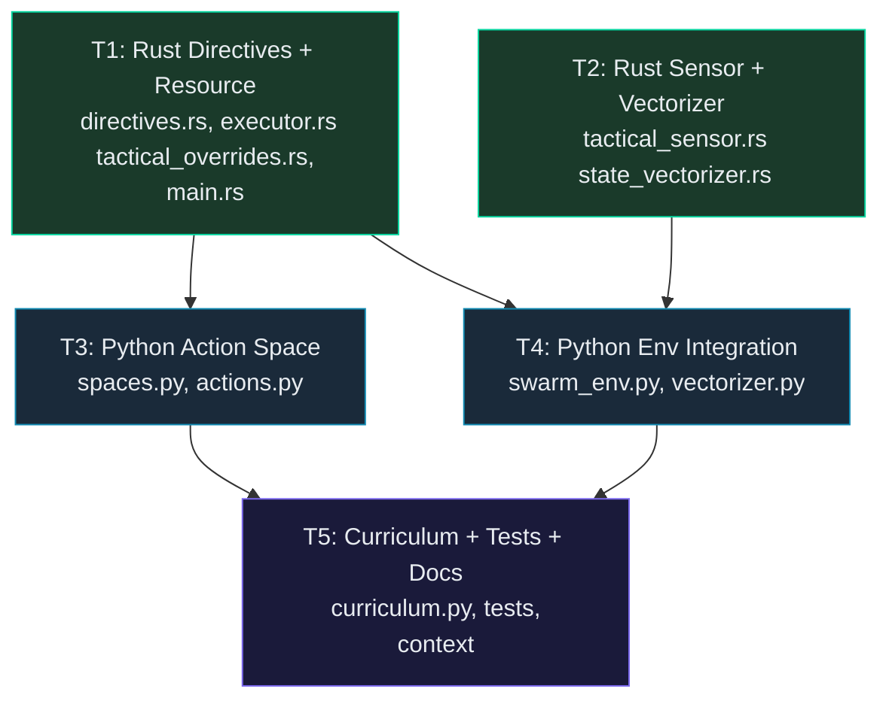

# Phase B: Action Space v3 — MultiDiscrete([8, 2500, 4])

## Problem Statement

The brain needs a 3rd modifier dimension to express class-aware splits, zone modifier polarity, and runtime tactical behavior (kite/passive). The current `MultiDiscrete([8, 2500])` lacks this expressiveness.

> [!IMPORTANT]
> **Full retrain required after Phase B.** All checkpoints are invalidated by the action space shape change.
>
> **Strategy Brief:** [strategy_brief.md](file:///Users/manifera/Documents/GitHub/mass-swarm-ai-simulator/strategy_brief.md)
> **Research Digest:** [research_digest.md](file:///Users/manifera/Documents/GitHub/mass-swarm-ai-simulator/research_digest.md)

---

## Phase A Context (Already Done)

Phase A hotfixes are complete and verified:
- ✅ Waypoint flow field fix (movement.rs)
- ✅ Retreat action replacing dead ActivateSkill
- ✅ Scout aggro mask differentiation
- ✅ Stage 2 tanks 40→20 (×1.23 margin)
- ✅ Stage 3 danger cost 300→400

---

## Handshake Protocol (Contracts)

### Contract 1: SplitFaction with class_filter (Rust ↔ Python)

```json
// ZMQ JSON — Python sends to Rust
{
  "directive": "SplitFaction",
  "source_faction": 0,
  "new_sub_faction": 100,
  "percentage": 0.30,
  "epicenter": [200.0, 300.0],
  "class_filter": 1          // NEW: Optional. null = all, 0/1/2 = specific class
}
```

Rust field: `class_filter: Option<u32>` with `#[serde(default)]`.

### Contract 2: SetTacticalOverride (Rust ↔ Python)

```json
// ZMQ JSON — Python sends to Rust
{
  "directive": "SetTacticalOverride",
  "faction": 100,             // sub-faction to affect
  "behavior": {               // Optional — null = clear override
    "type": "Kite",
    "trigger_radius": 80.0,
    "weight": 5.0
  }
}
```

Rust: New `MacroDirective::SetTacticalOverride` variant + `FactionTacticalOverrides` resource.

### Contract 3: Per-Class Density in ZMQ Snapshot (Rust → Python)

```json
// ZMQ snapshot — Rust sends to Python
{
  "density_maps": { "0": [...], "1": [...] },
  "ecp_density_maps": { "0": [...] },
  "class_density_maps": {            // NEW
    "0": [...],                       // class_0 (brain faction only)
    "1": [...]                        // class_1 (brain faction only)
  }
}
```

Python reads `class_density_maps["0"]` → ch6, `class_density_maps["1"]` → ch7.

### Contract 4: Action Space Shape

```python
# OLD: MultiDiscrete([8, 2500])    → mask shape = [8 + 2500] = 2508
# NEW: MultiDiscrete([8, 2500, 4]) → mask shape = [8 + 2500 + 4] = 2512
```

### Contract 5: Action Names (v3)

```python
ACTION_HOLD = 0
ACTION_ATTACK_COORD = 1
ACTION_ZONE_MODIFIER = 2      # was DropPheromone + DropRepellent (merged)
ACTION_SPLIT_TO_COORD = 3     # was 4
ACTION_MERGE_BACK = 4         # was 5
ACTION_SET_PLAYSTYLE = 5      # NEW (was slot 6 ActivateSkill which is now 6)
ACTION_ACTIVATE_SKILL = 6
ACTION_RETREAT = 7
```

---

## DAG Execution Phases



| Phase | Tasks | Parallel? | Domain |
|-------|-------|:---------:|--------|
| **1** | T1 (Directives + Resource), T2 (Sensor + Vectorizer) | ✅ Yes | Rust |
| **2** | T3 (Action Space), T4 (Env Integration) | ✅ Yes | Python |
| **3** | T5 (Curriculum + Tests) | ❌ Sequential | Python |

---

## File Summary

| Task | File | Action | Live Impact |
|:---:|------|--------|------------|
| T1 | `micro-core/src/bridges/zmq_protocol/directives.rs` | MODIFY | destructive |
| T1 | `micro-core/src/systems/directive_executor/executor.rs` | MODIFY | destructive |
| T1 | `micro-core/src/config/tactical_overrides.rs` | NEW | additive |
| T1 | `micro-core/src/config/mod.rs` | MODIFY | additive |
| T1 | `micro-core/src/main.rs` | MODIFY | additive |
| T1 | `micro-core/src/bridges/zmq_bridge/reset.rs` | MODIFY | additive |
| T2 | `micro-core/src/systems/tactical_sensor.rs` | MODIFY | destructive |
| T2 | `micro-core/src/systems/state_vectorizer.rs` | MODIFY | additive |
| T3 | `macro-brain/src/env/spaces.py` | MODIFY | destructive |
| T3 | `macro-brain/src/env/actions.py` | MODIFY | destructive |
| T4 | `macro-brain/src/env/swarm_env.py` | MODIFY | destructive |
| T4 | `macro-brain/src/utils/vectorizer.py` | MODIFY | destructive |
| T5 | `macro-brain/src/training/curriculum.py` | MODIFY | destructive |
| T5 | `macro-brain/profiles/tactical_curriculum.json` | MODIFY | destructive |
| T5 | `macro-brain/tests/test_actions.py` | MODIFY | safe |
| T5 | `.agents/context/training/stages.md` | MODIFY | safe |

> [!WARNING]
> **Training MUST be paused before executing any Phase B task.** Multiple files are `destructive` — they change function signatures and data formats.

---

## Task Details

### T1: Rust Directives + Resource
**Model_Tier:** `advanced`
- Add `class_filter: Option<u32>` to `SplitFaction`
- Add `SetTacticalOverride` directive variant
- Create `FactionTacticalOverrides` resource
- Handle class_filter in executor's SplitFaction (add UnitClassId query)
- Handle SetTacticalOverride executor (insert/remove from resource)
- MergeFaction cleanup: remove tactical overrides
- ResetEnvironment cleanup: clear tactical overrides
- Init resource in main.rs
- **Target Files:** `directives.rs`, `executor.rs`, `tactical_overrides.rs`, `config/mod.rs`, `main.rs`, `reset.rs`
- **Context:** `strategy_brief.md`, `research_digest.md`

### T2: Rust Sensor + Vectorizer
**Model_Tier:** `standard`
- Modify tactical_sensor.rs to check `FactionTacticalOverrides` BEFORE `UnitTypeRegistry`
- Add per-class density maps to state_vectorizer.rs ZMQ snapshot
- **Target Files:** `tactical_sensor.rs`, `state_vectorizer.rs`
- **Contract dependency:** `FactionTacticalOverrides` resource (from T1)
- **Note:** T2 CAN run in parallel with T1 if the resource type signature is defined first. But for safety, we list it as Phase 1 parallel — the resource struct is simple enough to code-first.

### T3: Python Action Space
**Model_Tier:** `standard`
- Rewrite `spaces.py`: `MultiDiscrete([8, 2500, 4])`, new action names, modifier masks
- Full rewrite of `actions.py`: `multidiscrete_to_directives()` for 3D actions
- **Target Files:** `spaces.py`, `actions.py`
- **Contract dependency:** Contracts 1, 2, 5 (directive JSON formats + action table)

### T4: Python Env Integration
**Model_Tier:** `standard`
- Update `swarm_env.py`: 3D action masking via `action_masks()`, pass `enemy_factions` to converter
- Update `vectorizer.py`: consume `class_density_maps` from snapshot → ch6/ch7
- **Target Files:** `swarm_env.py`, `vectorizer.py`
- **Contract dependency:** Contract 3 (snapshot JSON) + Contract 4 (mask shape)

### T5: Curriculum + Tests + Docs
**Model_Tier:** `standard`
- Update `curriculum.py` `ACTION_NAMES` to v3 naming
- Update `tactical_curriculum.json` action table
- Update unlock stages per Contract 5
- Update `test_actions.py` for 3D actions
- Update `.agents/context/training/stages.md`
- **Target Files:** `curriculum.py`, `tactical_curriculum.json`, `test_actions.py`, `stages.md`

---

## Verification Plan

### Rust (Phase 1)
```bash
cd micro-core && cargo check        # Safe during training
cd micro-core && cargo test          # After training paused
cd micro-core && cargo clippy
```

### Python (Phase 2+3)
```bash
cd macro-brain && .venv/bin/python -m pytest tests/test_actions.py -v
cd macro-brain && .venv/bin/python -m pytest tests/ -v
```

### Full System (Post Phase 3)
```bash
./train.sh  # Full retrain — all checkpoints invalidated
```

**Expected outcomes:**
1. Stage 0-1: No regression (Hold + AttackCoord unchanged)
2. Stage 2: ZoneModifier(attract) replaces DropPheromone, brain learns routing
3. Stage 5+: Class-filtered splits + SetPlaystyle(kite) for ranged units
