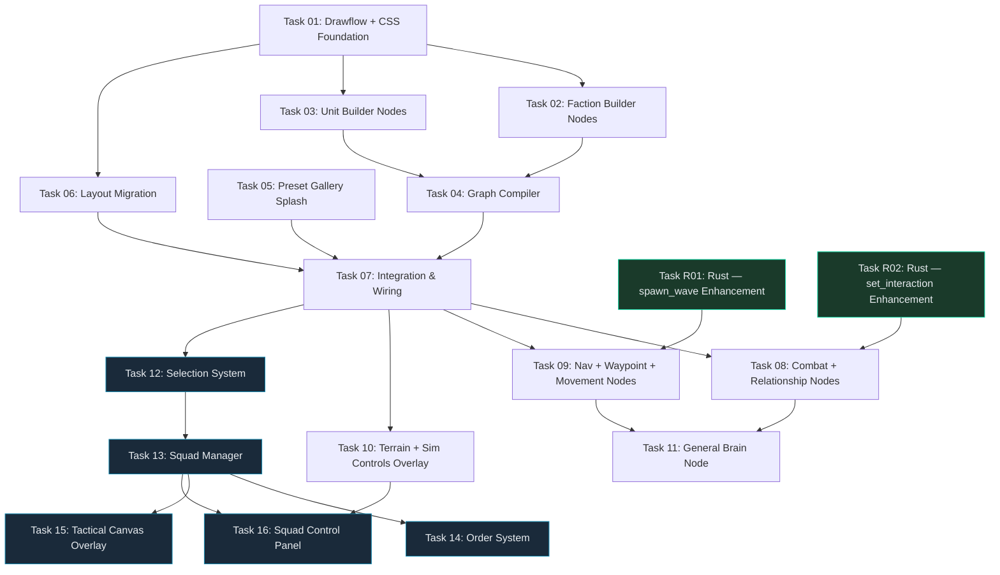

# Playground Redesign — Dual-Builder Node System

## Goal

Replace the current form-based sidebar playground UI with a **visual node-based rule editor** (Drawflow) using a **floating overlay layout** matching the training page. Users design battle scenarios by connecting **Faction**, **Unit**, **Combat**, **Navigation**, and **Death** nodes, then press **▶ Launch** to compile the graph into existing WS commands.

> [!IMPORTANT]
> **Strategy Brief Integration:** This plan directly converts the research in `strategy_brief.md` into implementation tasks. All node types, engine mappings, and layout decisions come from the strategist's verified analysis.

---

## User Review Required

> [!WARNING]
> **Drawflow Version:** The library will be installed via `npm i drawflow`. This adds a zero-dependency library (~4KB gzipped) to the Vite build. Confirm this is acceptable vs CDN-only approach.

> [!IMPORTANT]
> **Engine Gap — Resolved by Tasks R01 + R02:**
> The WS `spawn_wave` command currently does NOT accept `class_id` or `movement_config` — it uses `UnitClassId::default()` and a hardcoded `MovementConfig`. Similarly, `set_interaction` doesn't parse `source_class`, `target_class`, or `cooldown_ticks` from WS commands.
>
> **Tasks R01 and R02** (Rust micro-core) add these optional fields to the WS handlers with full backward compatibility. They can execute in parallel with Phase 1 frontend tasks.

> [!NOTE]
> **Focus Mode (Q1 — Resolved):** The Drawflow container uses a **Focus Mode toggle** that transitions opacity between **30%** (see-through, live sim visible) and **90%** (strong frost/blur, focused editing). The toggle lives in the top bar as a button. Default: 30% (semi-transparent). CSS uses `backdrop-filter: blur(20px) saturate(1.8)` at 90% for the frost glass effect.

> [!IMPORTANT]
> **Sidebar Removal Strategy:**
> The current sidebar (`<aside class="sidebar">`) and all 8 playground panels will be removed from `index.html`. Per the DOM Deletion gotcha (`.agents/knowledge/workflow/gotcha_dom_deletion_crashing_modules.md`), we must leave DOM stubs for any elements that out-of-scope legacy JS modules query at load time. The Integration task (Task 07) handles the final cleanup.

---

## Architecture Overview

```
┌─── playground index.html ────────────────────────────────────────┐
│                                                                   │
│  FULLSCREEN CANVAS (100vw × 100vh, position: fixed)              │
│  ├── canvas-bg (z-1)                                             │
│  ├── canvas-entities (z-4)                                       │
│                                                                   │
│  ┌── Overlay Root (#playground-overlay-root) ────────────────┐   │
│  │                                                            │   │
│  │  ┌── Top Bar (fixed, z-1000) ─────────────────────────┐   │   │
│  │  │ SWARMCONTROL v0.3.0  [Presets▾] [▶ Launch] [⚙] [−] │   │   │
│  │  └────────────────────────────────────────────────────┘   │   │
│  │                                                            │   │
│  │  ┌── Node Editor Region (#drawflow-container, z-10) ──┐   │   │
│  │  │  Drawflow canvas (pan/zoom, glassmorphic nodes)     │   │   │
│  │  │  Semi-transparent over simulation canvas            │   │   │
│  │  └────────────────────────────────────────────────────┘   │   │
│  │                                                            │   │
│  │  ┌── Bottom Toolbar (fixed bottom, z-999) ────────────┐   │   │
│  │  │ [+ Faction][+ Unit][+ Combat][+ Nav][+ Death]      │   │   │
│  │  │ [🎨 Terrain] [⏯ Sim Controls]    [📐 Minimap]     │   │   │
│  │  └────────────────────────────────────────────────────┘   │   │
│  │                                                            │   │
│  │  ┌── Side Cards (right, z-999) ───────────────────────┐   │   │
│  │  │ Telemetry strip │ Entity Inspector                  │   │   │
│  │  └────────────────────────────────────────────────────┘   │   │
│  │                                                            │   │
│  │  ┌── Minimized Strip (hidden when expanded) ──────────┐   │   │
│  │  │ TPS: 1201 │ Tick: 4499 │ Entities: 98              │   │   │
│  │  └────────────────────────────────────────────────────┘   │   │
│  └────────────────────────────────────────────────────────────┘   │
│                                                                   │
│  ┌── Preset Splash Modal (z-2000, shown on first load) ──────┐   │
│  │  Glassmorphic fullscreen overlay with scenario cards       │   │
│  └────────────────────────────────────────────────────────────┘   │
└───────────────────────────────────────────────────────────────────┘
```

---

## Shared Contracts

### Node Data Schema (Drawflow `data` field)

Every Drawflow node stores its configuration in the `data` object. These schemas are the contract between the Node Renderer (Task 02) and the Graph Compiler (Task 04).

```javascript
// ── Faction Node ──
{
  nodeType: 'faction',
  factionId: 0,             // auto-assigned, unique per graph
  name: 'Alpha',
  color: '#ef476f',
  spawnCount: 200,
  spawnX: 400,
  spawnY: 500,
  spawnSpread: 100,
}

// ── Relationship Node ──
{
  nodeType: 'relationship',
  relationType: 'hostile',   // 'hostile' | 'neutral' | 'allied'
}

// ── Unit Node ──
{
  nodeType: 'unit',
  unitName: 'Infantry',
  classId: 0,               // auto-assigned, unique per graph
}

// ── Stat Node ──
{
  nodeType: 'stat',
  label: 'HP',
  statIndex: 0,             // 0–7, auto-assigned
  initialValue: 100,
}

// ── Combat Node ──
{
  nodeType: 'combat',
  attackType: 'melee',       // 'melee' | 'ranged' | 'siege'
  damage: -10,
  range: 15,
  cooldownTicks: 0,          // 0 = continuous
}

// ── Navigation Node ──
{
  nodeType: 'navigation',
  // No properties — derived from connections
}

// ── Waypoint Node ──
{
  nodeType: 'waypoint',
  x: 500,
  y: 500,
}

// ── Movement Node ──
{
  nodeType: 'movement',
  speedPreset: 'normal',     // 'slow' | 'normal' | 'fast'
  maxSpeed: 100,
  steeringFactor: 1.0,
  separationRadius: 10,
  engagementRange: 15,
}

// ── Death Node ──
{
  nodeType: 'death',
  condition: 'LessThanEqual', // 'LessThanEqual' | 'GreaterThanEqual'
  threshold: 0,
}
```

### Node Port Definitions

```javascript
// Port names used by Drawflow connections (input_name / output_name)
const NODE_PORTS = {
  faction: {
    outputs: ['units', 'relationship', 'trait', 'general'],
  },
  relationship: {
    inputs: ['faction_a', 'faction_b'],
  },
  unit: {
    inputs: ['from_faction', 'stats', 'combat', 'death'],
    outputs: ['attacker', 'target'],
  },
  stat: {
    outputs: ['value'],
  },
  combat: {
    inputs: ['attacker', 'target', 'damage_stat'],
  },
  navigation: {
    inputs: ['follower', 'target_faction', 'waypoint'],
  },
  waypoint: {
    outputs: ['position'],
  },
  movement: {
    inputs: ['unit'],
  },
  death: {
    inputs: ['check_stat'],
  },
};
```

### Graph Compiler Output Contract

The `compileGraph(editor)` function returns:

```javascript
/** @returns {CompiledScenario} */
{
  spawns: [
    { faction_id, amount, x, y, spread, stats: [{ index, value }] }
  ],
  navigation: { rules: [{ follower_faction, target: { type, ... } }] },
  interaction: { rules: [{ source_faction, target_faction, range, effects, cooldown_ticks }] },
  removal: { rules: [{ stat_index, threshold, condition }] },
  aggro: [
    { source, target, allow_combat: true|false }
  ],
  brains: [
    { factionId, modelPath, decisionInterval, mode }  // Phase 3
  ],
  errors: string[],   // validation errors (missing connections, etc.)
}
```

---

## DAG Execution Phases



### Phase 0: Rust Core Enhancement (Parallel — Tasks R01–R02)

| Task | Name | Language | Target Files | Deps |
|------|------|---------|--------------|------|
| R01 | `spawn_wave` Enhancement | Rust | `micro-core/src/systems/ws_command.rs` | None |
| R02 | `set_interaction` Enhancement | Rust | `micro-core/src/systems/ws_command.rs` | None |

> [!TIP]
> R01 and R02 can run in parallel with ALL Phase 1 frontend tasks. They are independent and touch only Rust code.

### Phase 1: Foundation (Parallel — Tasks 01–06)

| Task | Name | Model Tier | Target Files | Deps |
|------|------|-----------|--------------|------|
| 01 | Drawflow + CSS Foundation | `standard` | `package.json`, `src/styles/node-editor.css`, `src/node-editor/drawflow-setup.js` | None |
| 02 | Faction Builder Nodes | `standard` | `src/node-editor/nodes/faction.js`, `src/node-editor/nodes/relationship.js` | T01 |
| 03 | Unit Builder Nodes | `standard` | `src/node-editor/nodes/unit.js`, `src/node-editor/nodes/stat.js`, `src/node-editor/nodes/death.js` | T01 |
| 04 | Graph Compiler | `advanced` | `src/node-editor/compiler.js` | T02, T03 |
| 05 | Preset Gallery Splash | `standard` | `src/node-editor/preset-gallery.js`, `src/styles/preset-gallery.css` | None |
| 06 | Layout Migration | `advanced` | `index.html`, `src/playground-main.js` | T01 |

### Phase 2: Integration + Expansion (Tasks 07–10)

| Task | Name | Model Tier | Target Files | Deps |
|------|------|-----------|--------------|------|
| 07 | Integration & Wiring | `advanced` | `src/playground-main.js`, `index.html`, `vite.config.js` | T04, T05, T06 |
| 08 | Combat + Relationship Nodes | `standard` | `src/node-editor/nodes/combat.js`, `src/node-editor/nodes/relationship.js` (extend), `src/node-editor/compiler.js` (extend) | T07, R02 |
| 09 | Nav + Waypoint + Movement | `standard` | `src/node-editor/nodes/navigation.js`, `src/node-editor/nodes/waypoint.js`, `src/node-editor/nodes/movement.js`, `src/node-editor/compiler.js` (extend) | T07, R01 |
| 10 | Terrain + Sim Controls Overlay | `standard` | `src/panels/playground/terrain-overlay.js`, `src/panels/playground/sim-controls-overlay.js`, `src/styles/playground-overlay.css` | T07 |

### Phase 3: Brain Integration (Task 11)

| Task | Name | Model Tier | Target Files | Deps |
|------|------|-----------|--------------|------|
| 11 | General Brain Node | `advanced` | `src/node-editor/nodes/general.js`, `src/node-editor/brain-runner.js`, `src/node-editor/compiler.js` (extend) | T08, T09 |

### Phase 4: Tactical Canvas — Squad Control (Tasks 12–16)

> [!NOTE]
> **No Rust changes needed.** Phase 4 is 100% frontend. All squad commands use the existing `inject_directive` WS command to send `SplitFaction`, `MergeFaction`, `UpdateNavigation`, `Hold`, and `Retreat` directives. Entity positions are already available client-side in `S.entities` (broadcast every tick by `ws_sync_system`).

| Task | Name | Model Tier | Target Files | Deps |
|------|------|-----------|--------------|------|
| 12 | Selection System (Box-Select + Faction-Click) | `standard` | `src/controls/selection.js`, `src/state.js` (extend) | T07 |
| 13 | Squad Manager (Sub-Faction Lifecycle) | `advanced` | `src/squads/squad-manager.js`, `src/state.js` (extend) | T12 |
| 14 | Order System (Right-Click Commands) | `standard` | `src/squads/order-system.js`, `src/controls/init.js` (extend) | T13 |
| 15 | Tactical Canvas Overlay (Arrows, Banners, Rally Points) | `standard` | `src/draw/tactical-overlay.js`, `src/draw/entities.js` (extend), `src/styles/tactical.css` | T13 |
| 16 | Squad Control Panel (Overlay Card) | `standard` | `src/panels/playground/squad-panel.js`, `src/styles/playground-overlay.css` (extend) | T13, T10 |

---

## File Summary

All paths relative to `debug-visualizer/`:

| File | Status | Owner Task | Purpose |
|------|--------|-----------|---------|
| `package.json` | MODIFY | T01 | Add `drawflow` dependency |
| `src/styles/node-editor.css` | NEW | T01 | Drawflow overrides + glassmorphic node styling |
| `src/styles/preset-gallery.css` | NEW | T05 | Preset splash modal styling |
| `src/styles/playground-overlay.css` | NEW | T10 | Playground-specific overlay panels |
| `src/node-editor/drawflow-setup.js` | NEW | T01 | Drawflow init, pan/zoom config, node registration |
| `src/node-editor/nodes/faction.js` | NEW | T02 | Faction node renderer + HTML template |
| `src/node-editor/nodes/relationship.js` | NEW | T02, T08 | Relationship node (basic in T02, extended in T08) |
| `src/node-editor/nodes/unit.js` | NEW | T03 | Unit node renderer |
| `src/node-editor/nodes/stat.js` | NEW | T03 | Stat node renderer |
| `src/node-editor/nodes/death.js` | NEW | T03 | Death node renderer |
| `src/node-editor/nodes/combat.js` | NEW | T08 | Combat node with presets |
| `src/node-editor/nodes/navigation.js` | NEW | T09 | Navigation node |
| `src/node-editor/nodes/waypoint.js` | NEW | T09 | Waypoint node |
| `src/node-editor/nodes/movement.js` | NEW | T09 | Movement node |
| `src/node-editor/nodes/general.js` | NEW | T11 | General (Brain) node |
| `src/node-editor/compiler.js` | NEW | T04 | Graph → WS commands compiler |
| `src/node-editor/brain-runner.js` | NEW | T11 | ONNX.js inference loop |
| `src/node-editor/preset-gallery.js` | NEW | T05 | Preset splash overlay |
| `index.html` | MODIFY | T06, T07 | Sidebar → floating overlay layout |
| `src/playground-main.js` | NEW | T06, T07 | New playground entry point |
| `src/main.js` | MODIFY | T07 | Remove playground-specific code (becomes shared/legacy) |
| `vite.config.js` | MODIFY | T07 | Add playground entry point |
| `micro-core/src/systems/ws_command.rs` | MODIFY | R01, R02 | Enhanced spawn_wave + set_interaction handlers |
| `src/panels/playground/terrain-overlay.js` | NEW | T10 | Terrain paint as overlay card |
| `src/panels/playground/sim-controls-overlay.js` | NEW | T10 | Sim controls as overlay card |
| `src/controls/selection.js` | NEW | T12 | Box-select + faction-click selection |
| `src/squads/squad-manager.js` | NEW | T13 | Squad (sub-faction) lifecycle management |
| `src/squads/order-system.js` | NEW | T14 | Right-click command dispatch |
| `src/draw/tactical-overlay.js` | NEW | T15 | Selection rect, squad banners, order arrows |
| `src/panels/playground/squad-panel.js` | NEW | T16 | Squad info overlay card |
| `src/styles/tactical.css` | NEW | T15 | Tactical overlay styling |

---

## Feature Details

Due to plan size, detailed contracts and strict instructions are split into feature files:

- [Feature 0: Rust Core Enhancements](./implementation_plan_feature_0.md) — Tasks R01, R02
- [Feature 1: Foundation & Layout](./implementation_plan_feature_1.md) — Tasks 01, 05, 06
- [Feature 2: Node Types & Compiler](./implementation_plan_feature_2.md) — Tasks 02, 03, 04
- [Feature 3: Integration & Expansion](./implementation_plan_feature_3.md) — Tasks 07, 08, 09, 10, 11
- [Feature 4: Tactical Canvas](./implementation_plan_feature_4.md) — Tasks 12, 13, 14, 15, 16

---

## Anti-Patterns & Gotchas

> [!CAUTION]
> **DOM Deletion Crash** (`.agents/knowledge/workflow/gotcha_dom_deletion_crashing_modules.md`): When removing the sidebar from `index.html`, leave hidden `<div>` stubs for any IDs that legacy panel JS queries at module load time (e.g., `panel-scroll`, `tab-bar`). Task 06 handles this.

> [!CAUTION]
> **Orphaned CSS** (`.agents/knowledge/frontend/gotcha_orphaned_css_files.md`): New CSS files (`node-editor.css`, `preset-gallery.css`) must be imported in `playground-main.js`, NOT linked from `index.html`. Vite handles CSS bundling from JS imports.

> [!WARNING]
> **Module Re-export** (`.agents/knowledge/frontend/gotcha_es_module_extraction_scope.md`): If any function is moved from an existing module, the original module must re-export it to prevent import breakage in out-of-scope files.

> [!WARNING]
> **Human Code is Concept** (`.agents/rules/multi-agents-planning.md §4`): The strategy brief's code examples show API patterns but may contain incorrect method signatures. Executors must verify against the actual Drawflow API and WS protocol.

---

## Verification Plan

### Automated Tests

- **Graph Compiler:** Unit test file `src/node-editor/__tests__/compiler.test.js` — verify JSON output matches expected WS command payloads for each preset scenario
- **Drawflow Integration:** Verify Drawflow initializes without errors in Vite dev server

### Manual Verification (Browser)

1. `npm run dev` → open `http://localhost:5173/` (playground)
2. Verify preset gallery appears on first load
3. Select "Swarm vs Defender" preset → verify node graph loads
4. Press ▶ Launch → verify simulation starts (entities spawn, combat occurs)
5. Create custom scenario from scratch: add Faction → Unit → Stat → Death → Combat chain
6. Verify terrain paint mode still works
7. Verify entity inspector still works (click entity on canvas)
8. Verify training page (`/training.html`) is unaffected
9. Test minimize/expand toggle
10. Test on mobile viewport (375px) — verify bottom sheet behavior
11. **Squad Control:** Box-select a group of faction entities → verify selection highlight
12. **Squad Control:** Right-click to set move waypoint → verify entities navigate to target
13. **Squad Control:** Create squad from selection → verify squad banner appears
14. **Squad Control:** Issue Hold and Retreat orders → verify entities respond

### Rust Tests (R01 + R02 + Regression)
```bash
cd micro-core && cargo test spawn_wave        # R01 new tests
cd micro-core && cargo test set_interaction   # R02 new tests
cd micro-core && cargo test                   # Full regression suite
cd micro-core && cargo clippy                 # Lint
```

---

---

*Version: v0.3.0 — Node Editor + Squad Control*
