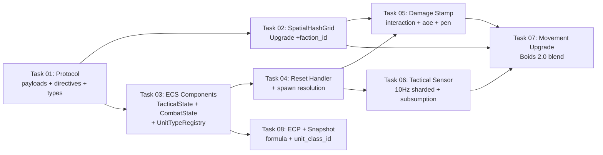

# Contextual Vector Blending — Boids 2.0

> **Goal:** Upgrade the Micro-Core movement system to support per-class tactical micro-behaviors (The Captain), enabling emergent formations like tank screening and ranger kiting, using contract-driven Contextual Vector Blending with zero performance regression.

## Background

The ML Brain (The General) issues macro orders to the swarm. Currently ALL entities blindly follow the same flow field — there is no per-class execution. The Micro-Core must act as **The Captain**: translating macro orders into class-specific tactical execution.

### The Mathematical Foundation

Current steering formula (2 vectors):
$$V_{desired} = (V_{flow} \times W_{flow}) + (V_{sep} \times W_{sep})$$

Upgraded formula (3 vectors — **Boids 2.0**):
$$V_{desired} = (V_{flow} \times W_{flow}) + (V_{sep} \times W_{sep}) + (V_{tactical} \times W_{tactical})$$

| Vector | Source | Role | Frequency |
|--------|--------|------|-----------|
| $V_{flow}$ | Flow Field | The General's order | 60 Hz (hot loop) |
| $V_{sep}$ | Boids separation | Physics — don't overlap | 60 Hz (hot loop) |
| $V_{tactical}$ | Tactical Sensor | The Captain's override | **10 Hz (cached)** |

### Performance Architecture

```
┌──────────────────────────────────────────────────────────────────┐
│ 60 Hz hot loop (par_iter_mut, O(1) per entity)                  │
│   ┌─────────────┐  ┌──────────────┐  ┌────────────────────────┐ │
│   │ V_flow      │  │ V_sep        │  │ V_tactical (CACHED)    │ │
│   │ grid sample │  │ 6-unit query │  │ read from component    │ │
│   └─────────────┘  └──────────────┘  └────────────────────────┘ │
│                           ↓                                      │
│                   V_desired = blend (Subsumption: highest weight │
│                   tactical behavior wins, not sum)               │
└──────────────────────────────────────────────────────────────────┘

┌──────────────────────────────────────────────────────────────────┐
│ 10 Hz tactical sensor (ENTITY SHARDED across 6 frames)          │
│   Frame N processes entities where entity.index() % 6 == N % 6  │
│   → Zero CPU spikes, perfectly even load distribution           │
│   Only entities WITH tactical behaviors are processed           │
│   Queries SpatialHashGrid with behavior-specific radius         │
│   Writes V_tactical + W_tactical into TacticalState component   │
└──────────────────────────────────────────────────────────────────┘

┌──────────────────────────────────────────────────────────────────┐
│ SpatialHashGrid stores (Entity, Vec2, u32_faction_id)           │
│   +4 bytes per entity → eliminates ECS random-access lookups    │
│   Engagement range + tactical sensor read faction from grid     │
└──────────────────────────────────────────────────────────────────┘

┌──────────────────────────────────────────────────────────────────┐
│ 60 Hz interaction system (already exists)                       │
│   On damage: stamps last_damaged_tick into CombatState          │
│   +1 field write per damage event, zero overhead                │
└──────────────────────────────────────────────────────────────────┘
```

## User Review Required

> [!IMPORTANT]
> **Live System Impact: `additive`** — All protocol changes use `serde(default)`. Existing spawn configs and profiles work unchanged. Without `unit_types` in the reset payload, no tactical behaviors activate, and the movement formula collapses to the current 2-vector blend. Training does NOT need to be paused.

> [!WARNING]
> **Engagement Range is a gameplay-critical parameter.** If misconfigured, Rangers will either charge to melee (range too low) or never engage (range too high). The engagement range MUST match the combat rule `range` for fidelity. This is a curriculum design responsibility — the engine just enforces the value.

---

## Proposed Changes

### Component 1: Protocol Contract Layer

#### [MODIFY] [payloads.rs](file:///Users/manifera/Documents/GitHub/mass-swarm-ai-simulator/micro-core/src/bridges/zmq_protocol/payloads.rs)

**Add `UnitTypeDefinition`, `TacticalBehavior`, and per-spawn `movement` override:**

```rust
/// Tactical behavior rule from game profile.
/// Each variant produces a V_tactical steering vector.
/// Evaluated at 10 Hz by the tactical_sensor_system.
#[derive(Serialize, Deserialize, Debug, Clone, PartialEq)]
#[serde(tag = "type")]
pub enum TacticalBehaviorPayload {
    /// Flee from nearest enemy within trigger_radius.
    /// V_tactical = normalize(self.pos - enemy.pos)
    Kite {
        trigger_radius: f32,
        weight: f32,
    },
    /// Rush toward a distressed ally of a specific class.
    /// V_tactical = normalize(ally.pos - self.pos)
    PeelForAlly {
        target_class: u32,
        search_radius: f32,
        #[serde(default)]
        require_recent_damage: bool,
        weight: f32,
    },
}

/// Unit type definition from game profile.
/// Maps a class_id to stats, movement, engagement range, and tactical behaviors.
#[derive(Serialize, Deserialize, Debug, Clone, PartialEq)]
pub struct UnitTypeDefinition {
    pub class_id: u32,
    #[serde(default)]
    pub stats: Vec<SpawnStatEntry>,
    #[serde(default)]
    pub movement: Option<MovementConfigPayload>,
    /// Distance at which this unit stops approaching enemies.
    /// When nearest enemy is within this range, W_flow drops to 0.
    /// 0.0 = charge to melee (default). 150.0 = ranger standoff.
    #[serde(default)]
    pub engagement_range: f32,
    /// Tactical micro-behaviors. Evaluated at 10 Hz.
    /// Empty = no tactical override (pure flow field follower).
    #[serde(default)]
    pub tactical_behaviors: Vec<TacticalBehaviorPayload>,
}

/// Stat indices whose PRODUCT forms the ECP threat value.
/// Example: [0, 4] → ECP = stat[0] × stat[4] (HP × armor).
/// Empty = use single ecp_stat_index (backward compat).
#[derive(Serialize, Deserialize, Debug, Clone, PartialEq)]
pub struct EcpFormulaPayload {
    pub stat_indices: Vec<usize>,
}
```

**Add optional `movement` to `SpawnConfig`:**

```diff
 pub struct SpawnConfig {
     // ... existing fields ...
+    #[serde(default)]
+    pub movement: Option<MovementConfigPayload>,
 }
```

#### [MODIFY] [directives.rs](file:///Users/manifera/Documents/GitHub/mass-swarm-ai-simulator/micro-core/src/bridges/zmq_protocol/directives.rs)

**Add `unit_types` and `ecp_formula` to `AiResponse::ResetEnvironment`:**

```diff
 ResetEnvironment {
     // ... existing fields ...
+    #[serde(default)]
+    unit_types: Option<Vec<UnitTypeDefinition>>,
+    #[serde(default)]
+    ecp_formula: Option<EcpFormulaPayload>,
 }
```

#### [MODIFY] [types.rs](file:///Users/manifera/Documents/GitHub/mass-swarm-ai-simulator/micro-core/src/bridges/zmq_protocol/types.rs)

**Add `unit_class_id` to `EntitySnapshot`:**

```diff
 pub struct EntitySnapshot {
     // ... existing fields ...
+    #[serde(default)]
+    pub unit_class_id: u32,
 }
```

---

### Component 2: SpatialHashGrid Upgrade

#### [MODIFY] [hash_grid.rs](file:///Users/manifera/Documents/GitHub/mass-swarm-ai-simulator/micro-core/src/spatial/hash_grid.rs)

**Upgrade grid payload from `(Entity, Vec2)` to `(Entity, Vec2, u32)` where `u32` = faction_id.**

This +4 bytes per entity eliminates hundreds of thousands of ECS random-access `q_ro.get()` calls per frame that would otherwise be needed for faction checks during engagement range and tactical sensor queries.

```diff
 pub struct SpatialHashGrid {
     pub cell_size: f32,
-    grid: HashMap<IVec2, Vec<(Entity, Vec2)>>,
+    grid: HashMap<IVec2, Vec<(Entity, Vec2, u32)>>,
 }
```

```diff
-pub fn rebuild(&mut self, entities: &[(Entity, Vec2)]) {
+pub fn rebuild(&mut self, entities: &[(Entity, Vec2, u32)]) {
```

```diff
-pub fn for_each_in_radius<F>(&self, center: Vec2, radius: f32, mut f: F)
-where F: FnMut(Entity, Vec2),
+pub fn for_each_in_radius<F>(&self, center: Vec2, radius: f32, mut f: F)
+where F: FnMut(Entity, Vec2, u32),
```

```diff
-pub fn query_radius(&self, center: Vec2, radius: f32) -> Vec<(Entity, Vec2)> {
+pub fn query_radius(&self, center: Vec2, radius: f32) -> Vec<(Entity, Vec2, u32)> {
```

#### [MODIFY] [hash_grid.rs](file:///Users/manifera/Documents/GitHub/mass-swarm-ai-simulator/micro-core/src/spatial/hash_grid.rs) — `update_spatial_grid_system`

```diff
 pub fn update_spatial_grid_system(
     mut grid: ResMut<SpatialHashGrid>,
-    query: Query<(Entity, &Position)>,
+    query: Query<(Entity, &Position, &FactionId)>,
 ) {
-    let entities: Vec<(Entity, Vec2)> = query
+    let entities: Vec<(Entity, Vec2, u32)> = query
         .iter()
-        .map(|(e, p)| (e, Vec2::new(p.x, p.y)))
+        .map(|(e, p, f)| (e, Vec2::new(p.x, p.y), f.0))
         .collect();
     grid.rebuild(&entities);
 }
```

> [!WARNING]
> **Breaking internal change.** All callers of `for_each_in_radius`, `query_radius`, and `rebuild` must be updated to accept the new `u32` faction field. This includes:
> - `movement_system` (separation loop)
> - `interaction_system` (neighbor query)
> - `aoe_interaction_system`
> - `penetration_interaction_system`
> - All unit tests
>
> The change is mechanical — add `_` or `_faction` to destructuring patterns.

---

### Component 3: ECS Components & Resources

#### [NEW] [tactical.rs](file:///Users/manifera/Documents/GitHub/mass-swarm-ai-simulator/micro-core/src/components/tactical.rs)

```rust
/// Cached tactical steering vector. Written at 10 Hz by tactical_sensor_system,
/// read at 60 Hz by movement_system. O(1) memory per entity.
#[derive(Component, Debug, Clone, Copy, Default)]
pub struct TacticalState {
    /// Cached tactical direction (normalized or zero).
    pub v_tactical: Vec2,
    /// Weight for blending into movement. 0.0 = no override.
    /// Higher values overpower the flow field (e.g., 3.0 for emergency peel).
    pub w_tactical: f32,
}

/// Combat timestamp tracking. Updated by interaction systems on damage.
/// Used by tactical_sensor_system for "recent damage" checks.
#[derive(Component, Debug, Clone, Copy, Default)]
pub struct CombatState {
    /// Tick when this entity last took damage. 0 = never damaged.
    pub last_damaged_tick: u32,
}
```

#### [MODIFY] [components/mod.rs](file:///Users/manifera/Documents/GitHub/mass-swarm-ai-simulator/micro-core/src/components/mod.rs)

Register and re-export `TacticalState` and `CombatState`.

#### [NEW] [config/unit_registry.rs](file:///Users/manifera/Documents/GitHub/mass-swarm-ai-simulator/micro-core/src/config/unit_registry.rs)

```rust
/// Runtime unit type registry. Built from reset payload, keyed by class_id.
/// Loaded once per episode. Systems read this to look up engagement_range
/// and tactical behaviors for each entity's UnitClassId.
#[derive(Resource, Debug, Clone, Default)]
pub struct UnitTypeRegistry {
    pub types: HashMap<u32, UnitTypeEntry>,
}

/// Runtime-resolved unit type. Pre-processes TacticalBehaviorPayload into
/// internal representation with precomputed max_search_radius.
#[derive(Debug, Clone)]
pub struct UnitTypeEntry {
    pub class_id: u32,
    pub engagement_range: f32,
    pub tactical_behaviors: Vec<TacticalBehavior>,
    /// Precomputed: max search_radius across all behaviors.
    /// Used by tactical_sensor_system to size the spatial query.
    pub max_search_radius: f32,
}

/// Runtime tactical behavior enum (deserialized from TacticalBehaviorPayload).
#[derive(Debug, Clone)]
pub enum TacticalBehavior {
    Kite { trigger_radius: f32, weight: f32 },
    PeelForAlly {
        target_class: u32,
        search_radius: f32,
        require_recent_damage: bool,
        weight: f32,
    },
}
```

---

### Component 3: Reset Handler Updates

#### [MODIFY] [reset.rs](file:///Users/manifera/Documents/GitHub/mass-swarm-ai-simulator/micro-core/src/bridges/zmq_bridge/reset.rs)

**Add `unit_types` + `ecp_formula` to `ResetRequest` and update spawn resolution:**

```rust
pub struct ResetRequest {
    // ... existing fields ...
    pub unit_types: Option<Vec<UnitTypeDefinition>>,
    pub ecp_formula: Option<EcpFormulaPayload>,
}
```

**Spawn resolution update (pseudocode):**
```rust
// Build UnitTypeRegistry from reset payload
let mut registry = UnitTypeRegistry::default();
if let Some(ref types) = reset.unit_types {
    for ut in types {
        registry.types.insert(ut.class_id, UnitTypeEntry::from(ut));
    }
}
commands.insert_resource(registry);

// Update ECP formula in DensityConfig
if let Some(ref formula) = reset.ecp_formula {
    density_config.ecp_formula = Some(formula.stat_indices.clone());
}

for spawn in &reset.spawns {
    let unit_type = registry.types.get(&spawn.unit_class_id);

    // Stats: spawn inline > unit_type > empty
    let stat_defaults = if !spawn.stats.is_empty() {
        spawn.stats.iter().map(|e| (e.index, e.value)).collect()
    } else if let Some(ut) = unit_type {
        ut.stats.iter().map(|e| (e.index, e.value)).collect()
    } else { vec![] };

    // Movement: spawn > unit_type > global > default
    let movement = spawn.movement.as_ref()
        .or_else(|| unit_type.and_then(|ut| ut.movement.as_ref()))
        .or(reset.movement_config.as_ref())
        .map(|mc| MovementConfig { ... })
        .unwrap_or_default();

    for i in 0..spawn.count {
        commands.spawn((
            EntityId { id: next_id },
            Position { x, y },
            Velocity::default(),
            FactionId(spawn.faction_id),
            StatBlock::with_defaults(&stat_defaults),
            UnitClassId(spawn.unit_class_id),
            movement,
            TacticalState::default(),   // NEW
            CombatState::default(),     // NEW
        ));
    }
}
```

#### [MODIFY] [systems.rs](file:///Users/manifera/Documents/GitHub/mass-swarm-ai-simulator/micro-core/src/bridges/zmq_bridge/systems.rs)

**Forward `unit_types` + `ecp_formula` from `AiResponse::ResetEnvironment` to `ResetRequest`.**

---

### Component 5: Interaction Damage Stamp

#### [MODIFY] [interaction.rs](file:///Users/manifera/Documents/GitHub/mass-swarm-ai-simulator/micro-core/src/systems/interaction.rs)

**Add `CombatState` write query, `TickCounter` resource, and stamp `last_damaged_tick`:**

```diff
 pub fn interaction_system(
     // ... existing params ...
+    tick: Res<TickCounter>,
     // Query 2: Stat mutation + combat state
-    mut q_rw: Query<&mut StatBlock>,
+    mut q_rw: Query<(&mut StatBlock, &mut CombatState)>,
```

After damage is applied to a target:
```rust
if applied_any_effect {
    if let Ok((_, mut combat_state)) = q_rw.get_mut(target_entity) {
        combat_state.last_damaged_tick = tick.tick;
    }
}
```

> [!NOTE]
> The same stamp must also be added to `aoe_interaction_system` and `penetration_interaction_system`. These systems already iterate targets — the change is +1 field write per damage event.

---

### Component 6: Tactical Sensor System (NEW)

#### [NEW] [tactical_sensor.rs](file:///Users/manifera/Documents/GitHub/mass-swarm-ai-simulator/micro-core/src/systems/tactical_sensor.rs)

**10 Hz system — entity-sharded across 6 frames. Uses Subsumption Architecture for behavior priority.**

```rust
/// Tactical sensor loop. Evaluates TacticalBehavior rules for entities
/// with non-empty behavior lists. Caches result in TacticalState component.
///
/// ## Performance: Entity Sharding
/// Instead of processing all entities on tick % 6 == 0 (causing CPU spikes),
/// we distribute evenly: each frame processes entities where
/// `entity.index() % 6 == tick % 6`. This guarantees 1/6th of entities
/// per frame — zero heartbeat stutter.
///
/// ## Behavior Priority: Subsumption Architecture
/// When multiple behaviors produce vectors, the HIGHEST WEIGHT wins
/// exclusively. This prevents conflicting vectors (Kite LEFT + Peel RIGHT)
/// from canceling into a zero vector while w_tactical remains high.
///
/// ## Faction Lookups: Grid-Embedded
/// SpatialHashGrid stores (Entity, Vec2, u32_faction_id) — no ECS
/// random-access needed for faction checks. CombatState and UnitClassId
/// still require q_read.get() but only for ally-class matching (rare).
///
/// ## Scheduling
/// Runs AFTER spatial_grid_update_system (needs fresh grid)
/// Runs BEFORE movement_system (movement reads cached V_tactical)
pub fn tactical_sensor_system(
    tick: Res<TickCounter>,
    grid: Res<SpatialHashGrid>,
    registry: Res<UnitTypeRegistry>,
    // Read-only: position, faction, class, combat state
    q_read: Query<(Entity, &Position, &FactionId, &UnitClassId, &CombatState)>,
    // Write: tactical state
    mut q_tac: Query<&mut TacticalState>,
) {
    let shard = (tick.tick % 6) as u32;

    for (entity, pos, faction, class_id, _) in q_read.iter() {
        // Entity sharding: only process 1/6th of entities per frame
        if entity.index() % 6 != shard {
            continue;
        }

        let Some(unit_type) = registry.types.get(&class_id.0) else {
            continue; // No type definition = no behaviors
        };
        if unit_type.tactical_behaviors.is_empty() {
            continue; // Skip entities with no behaviors
        }

        // Subsumption: highest weight behavior wins exclusively
        let mut best_weight = 0.0f32;
        let mut best_vector = Vec2::ZERO;
        let center = Vec2::new(pos.x, pos.y);

        for behavior in &unit_type.tactical_behaviors {
            match behavior {
                TacticalBehavior::Kite { trigger_radius, weight } => {
                    let mut nearest_enemy: Option<(Vec2, f32)> = None;
                    // Grid now provides faction_id — no ECS lookup needed
                    grid.for_each_in_radius(center, *trigger_radius, |_n_ent, n_pos, n_faction| {
                        if n_faction != faction.0 { // Enemy — pure grid data
                            let dist_sq = (n_pos - center).length_squared();
                            if nearest_enemy.is_none()
                                || dist_sq < nearest_enemy.unwrap().1
                            {
                                nearest_enemy = Some((n_pos, dist_sq));
                            }
                        }
                    });

                    if let Some((enemy_pos, _)) = nearest_enemy {
                        let flee = (center - enemy_pos).normalize_or_zero();
                        if *weight > best_weight {
                            best_weight = *weight;
                            best_vector = flee;
                        }
                    }
                }

                TacticalBehavior::PeelForAlly {
                    target_class, search_radius,
                    require_recent_damage, weight,
                } => {
                    let mut distressed_ally: Option<(Vec2, f32)> = None;
                    grid.for_each_in_radius(center, *search_radius, |n_ent, n_pos, n_faction| {
                        if n_faction == faction.0 { // Same faction — grid data
                            // Class + combat state require ECS lookup (rare: only allies)
                            if let Ok((_, _, _, n_class, n_combat)) = q_read.get(n_ent) {
                                if n_class.0 == *target_class
                                    && (!require_recent_damage
                                        || (tick.tick.saturating_sub(n_combat.last_damaged_tick) < 120))
                                {
                                    let dist_sq = (n_pos - center).length_squared();
                                    if distressed_ally.is_none()
                                        || dist_sq < distressed_ally.unwrap().1
                                    {
                                        distressed_ally = Some((n_pos, dist_sq));
                                    }
                                }
                            }
                        }
                    });

                    if let Some((ally_pos, _)) = distressed_ally {
                        let rush = (ally_pos - center).normalize_or_zero();
                        if *weight > best_weight {
                            best_weight = *weight;
                            best_vector = rush;
                        }
                    }
                }
            }
        }

        // Cache result for 60 Hz movement system
        if let Ok(mut tac) = q_tac.get_mut(entity) {
            tac.v_tactical = best_vector.normalize_or_zero();
            tac.w_tactical = best_weight;
        }
    }
}
```

---

### Component 7: Movement System Upgrade

#### [MODIFY] [movement.rs](file:///Users/manifera/Documents/GitHub/mass-swarm-ai-simulator/micro-core/src/systems/movement.rs)

**Add TacticalState + UnitTypeRegistry to query. Implement 3-vector blend + engagement range.**

```diff
 pub fn movement_system(
     // ... existing params ...
+    registry: Res<UnitTypeRegistry>,
     mut query: Query<(
         Entity,
         &mut Position,
         &mut Velocity,
         &FactionId,
         &MovementConfig,
         &EntityId,
+        &UnitClassId,
+        &TacticalState,
     ), Without<EngineOverride>>,
 ) {
```

**Engagement range uses grid-embedded faction (Option C):**

```diff
-let desired = (macro_dir * mc.flow_weight) + (separation_dir * mc.separation_weight);
+// --- Engagement Range: The Captain stops approach when in firing range ---
+let mut w_flow = mc.flow_weight;
+let engagement_range = registry.types
+    .get(&class_id.0)
+    .map(|ut| ut.engagement_range)
+    .unwrap_or(0.0);
+
+if engagement_range > 0.0 {
+    let mut enemy_in_range = false;
+    // Grid provides faction_id — zero ECS lookups!
+    grid.for_each_in_radius(current_pos, engagement_range, |n_ent, _n_pos, n_faction| {
+        if n_ent != entity && n_faction != faction.0 {
+            enemy_in_range = true;
+        }
+    });
+    if enemy_in_range {
+        w_flow = 0.0; // Stop following The General — hold position
+    }
+}
+
+// --- 3-Vector Contextual Blend ---
+let desired = (macro_dir * w_flow)
+    + (separation_dir * mc.separation_weight)
+    + (tac_state.v_tactical * tac_state.w_tactical);
 let desired = desired.normalize_or_zero() * mc.max_speed;
```

**Separation loop update (accept new grid payload):**

```diff
 // --- 2. MICRO PUSH: Boids Separation (Zero-Allocation) ---
-grid.for_each_in_radius(current_pos, mc.separation_radius, |n_ent, n_pos| {
+grid.for_each_in_radius(current_pos, mc.separation_radius, |n_ent, n_pos, _n_faction| {
     // ... existing separation logic unchanged ...
 });
```

> [!NOTE]
> **Engagement range faction check is now O(0) ECS cost** thanks to the grid-embedded faction_id (Option C). The `for_each_in_radius` closure reads `n_faction` directly from the grid payload — no `q_ro.get()` call, no cache miss, no borrow conflict. This makes the engagement range check in the 60Hz `par_iter_mut` loop perfectly safe and fast.

---

### Component 8: ECP Formula Upgrade

#### [MODIFY] [config/buff.rs](file:///Users/manifera/Documents/GitHub/mass-swarm-ai-simulator/micro-core/src/config/buff.rs) — `DensityConfig`

```diff
 pub struct DensityConfig {
     pub max_density: f32,
     pub max_entity_ecp: f32,
     pub ecp_stat_index: Option<usize>,
+    /// Multi-stat ECP formula. Product of stat values at these indices.
+    /// When present, overrides single ecp_stat_index.
+    /// Example: [0, 4] → ECP = stat[0] × stat[4]
+    pub ecp_formula: Option<Vec<usize>>,
 }
```

#### [MODIFY] [state_vectorizer.rs](file:///Users/manifera/Documents/GitHub/mass-swarm-ai-simulator/micro-core/src/systems/state_vectorizer.rs)

**Update `build_ecp_density_maps` to support multi-stat formula:**

The snapshot builder already passes `(x, y, faction, primary_stat, damage_mult)` tuples. We change this to pass the full `StatBlock` reference and compute ECP inside the function using the formula.

```rust
// In snapshot builder, when collecting ECP data:
let ecp_value = if let Some(ref formula) = density_config.ecp_formula {
    // Multi-stat product: stat[0] × stat[4] × ...
    let mut product = 1.0f32;
    for &idx in formula {
        product *= stat_block.0.get(idx).copied().unwrap_or(0.0);
    }
    product * damage_mult
} else {
    // Legacy single-stat
    primary_stat * damage_mult
};
```

#### [MODIFY] [snapshot.rs](file:///Users/manifera/Documents/GitHub/mass-swarm-ai-simulator/micro-core/src/bridges/zmq_bridge/snapshot.rs)

**Include `UnitClassId` in entity snapshot query and output:**

```diff
 for (eid, pos, faction, stat_block) in query.iter() {
+    // Read UnitClassId (default 0 for backward compat)
```

```diff
     entities.push(EntitySnapshot {
         id: eid.id,
         x: pos.x,
         y: pos.y,
         faction_id: faction.0,
         stats: stat_block.0.to_vec(),
+        unit_class_id: class_id.0,
     });
```

---

## DAG Execution Plan



| Phase | Task | Files | Est. Lines | Live Impact |
|-------|------|-------|-----------|-------------|
| 1 | **T01**: Protocol Contract | `payloads.rs`, `directives.rs`, `types.rs` | +60 | `additive` |
| 1 | **T02**: SpatialHashGrid Upgrade | `hash_grid.rs`, all callers | +20 (net) | `refactor` |
| 1 | **T03**: ECS Components + Registry | `tactical.rs` (NEW), `unit_registry.rs` (NEW), `mod.rs` ×2 | +100 | `additive` |
| 2 | **T04**: Reset Handler + Spawn | `reset.rs`, `systems.rs` | +50 | `additive` |
| 2 | **T05**: Interaction Damage Stamp | `interaction.rs`, `aoe_interaction.rs`, `penetration.rs` | +30 | `additive` |
| 2 | **T06**: Tactical Sensor System | `tactical_sensor.rs` (NEW), `systems/mod.rs` | +130 | `additive` |
| 2 | **T07**: Movement System Upgrade | `movement.rs` | +40 | `behavioral` |
| 3 | **T08**: ECP Formula + Snapshot | `buff.rs`, `state_vectorizer.rs`, `snapshot.rs` | +30 | `additive` |

**Total: ~460 new lines of Rust. Zero Python logic changes.**

---

## Emergent Behavior Validation

The plan produces these emergent behaviors with zero hardcoded AI:

```
Scenario: Brain orders "AttackCoord (500, 300)"

1. Tank (class 0, engagement=25):
   → Charges forward (W_flow=1.0, no tactical behaviors)
   → Stops at 25 units from enemies (engagement range)
   → Fights at melee range

2. Ranger (class 1, engagement=150, Kite trigger=50):
   → Follows flow field toward target
   → Stops at 150 units (engagement range) — stays BEHIND tanks
   → If flanker gets within 50 units → Kite activates
   → V_tactical pushes AWAY from flanker → ranger retreats while shooting

3. Protector (class 2, engagement=25, PeelForAlly target_class=1):
   → Charges to front with tanks
   → Ranger takes damage → last_damaged_tick updates
   → 10Hz sensor: PeelForAlly detects distressed Ranger within 150 units
   → W_tactical=3.0 > W_flow=1.0 → OVERRIDES flow field
   → Protector spins around, rushes to protect Ranger
   → Flanker dies → 2 seconds pass → distress signal expires
   → W_tactical drops to 0 → Protector returns to front line
```

---

## Resolved Design Decisions

> [!TIP]
> **Engagement range faction check → Option C: Grid-Embedded Faction ID.**
> The `SpatialHashGrid` cell payload is upgraded from `(Entity, Vec2)` to `(Entity, Vec2, u32)`. This +4 bytes per entity eliminates all ECS random-access `q_ro.get()` lookups for faction detection in both the 60Hz movement loop and the 10Hz tactical sensor. The engagement range check and Kite behavior read faction directly from the grid — zero cache misses.

> [!TIP]
> **10Hz CPU spike → Entity Sharding.**
> Instead of `if tick % 6 != 0 { return; }` (all entities on one frame), the tactical sensor uses `entity.index() % 6 != (tick % 6)` to process exactly 1/6th of entities per frame. Load is perfectly distributed — zero heartbeat stutter.

> [!TIP]
> **Conflicting behaviors → Subsumption Architecture.**
> When multiple behaviors fire simultaneously, the highest-weight behavior wins exclusively. This prevents Kite (flee LEFT) + PeelForAlly (rush RIGHT) from creating a canceled zero vector with high w_tactical, which would freeze the entity.

> [!NOTE]
> **Tactical behaviors are currently limited to `Kite` and `PeelForAlly`.** The `TacticalBehavior` enum is extensible — future variants (e.g., `FormLine`, `Ambush`, `Retreat`) can be added without structural changes. Each new variant is a new match arm in the tactical sensor, a new JSON tag in the payload.

---

## Verification Plan

### Automated Tests

**Rust — per task:**
```bash
cd micro-core && cargo test
```

| Task | Test Cases |
|------|-----------|
| T01 | `test_unit_type_definition_serde_roundtrip`, `test_tactical_behavior_kite_serde`, `test_tactical_behavior_peel_serde`, `test_spawn_config_with_movement_serde` |
| T02 | `test_grid_rebuild_with_faction`, `test_for_each_provides_faction`, `test_query_radius_provides_faction`, existing grid tests updated |
| T03 | `test_tactical_state_default`, `test_combat_state_default`, `test_unit_type_registry_lookup` |
| T04 | `test_reset_spawns_with_tactical_components`, `test_unit_type_registry_loaded` |
| T05 | `test_interaction_stamps_last_damaged_tick`, `test_no_damage_no_stamp` |
| T06 | `test_kite_produces_flee_vector`, `test_peel_produces_rush_vector`, `test_peel_requires_recent_damage`, `test_subsumption_highest_weight_wins`, `test_entity_sharding_distributes_load` |
| T07 | `test_engagement_range_stops_movement`, `test_tactical_vector_overrides_flow`, `test_no_registry_entry_defaults_to_charge`, `test_backward_compat_no_tactical` |
| T08 | `test_ecp_multi_stat_formula`, `test_ecp_single_stat_backward_compat`, `test_entity_snapshot_includes_class_id` |

**All 181+ existing tests must pass unchanged (backward compatibility).**

### Manual Verification
```bash
cd micro-core && cargo run -- --smoke-test
```
- Start training with existing profile (no `unit_types`) → must work identically to before
- Verify zero performance regression via telemetry: `movement_us` should not increase by >10%
