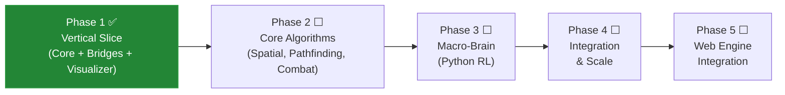

# Decoupled Headless Mass-Swarm AI Simulation — Phase Roadmap

> **Scope:** Strategic phase breakdown of [CASE_STUDY.md](file:///Users/manifera/Documents/Study/mass-swarm-ai-simulator/CASE_STUDY.md). Each phase will be expanded into detailed DAG tasks in a subsequent planning pass.

---

## Phase Overview

> [!NOTE]
> **Strategy: Vertical Slice First.** Phase 1 wires the entire tri-node pipeline end-to-end with minimal logic. Once you can spawn simple entities and watch them move on the canvas, every subsequent phase gets immediate visual feedback for debugging.

---

## Phase 1 — Vertical Slice (Core + Bridges + Visualizer) ✅ COMPLETE

**TDD Reference:** Sections 2.1, 4.1, 4.2, 5

### Scope
Stand up the complete tri-node pipeline with **minimal game logic**. The goal is a working feedback loop: Rust spawns basic entities → broadcasts via WebSocket → browser renders them on canvas → user sends commands back. No advanced algorithms yet — just enough to prove the wiring works.

### Micro-Core (Rust/Bevy)
- Project scaffold (`micro-core/`) with `Cargo.toml`, Bevy 0.18 headless
- Minimal ECS components: `Position`, `Velocity`, `Team`
- One trivial system: `movement_system` (entities drift in a direction — random or fixed)
- Fixed-timestep loop via `MinimalPlugins` + `ScheduleRunnerPlugin` (60 TPS)
- Basic entity spawning at startup (e.g., 100 entities, two teams)

### IPC Bridges
- **WS Bridge** (`ws_bridge.rs`): Async tokio task, broadcasts entity positions over `ws://localhost:8080`
- **ZMQ Bridge** (`zmq_bridge.rs`): Stub socket on `tcp://localhost:5555`, sends/receives a round-trip test message (no real AI yet)
- JSON message schema with `"type"` discriminator field
- Delta-sync tracking: spawn/move/die diffing

### Debug Visualizer
- `debug-visualizer/index.html` — single static page, zero build step
- Canvas rendering loop via `requestAnimationFrame()`
- Draw circles: red (swarm) vs. blue (defenders)
- Delta-sync buffer: store incoming WS payloads, redraw at monitor refresh rate
- Basic controls: spawn button, pause/resume, entity count HUD

### Success Criteria
- All three nodes start and connect (`Micro-Core → WS → Browser`, `Micro-Core → ZMQ → stub`)
- Browser renders ~100 moving entities smoothly
- Spawn button triggers new entities visible on canvas
- `cargo build` + `cargo clippy` clean, zero warnings

### Dependencies
None — this is the project's starting point.

---

## Phase 2 — Core Algorithms (Spatial, Pathfinding, Combat)

**TDD Reference:** Sections 2.2

### Scope
Implement the **real simulation logic** inside the Micro-Core. This is where the swarm becomes intelligent at the individual level: entities detect neighbors, follow flow fields, and engage in combat. The existing Debug Visualizer provides immediate visual feedback for all of this.

### Deliverables
- `Health` component + `combat_system` (proximity-based damage)
- Spatial partitioning via **Hash Grid** for O(1) proximity/neighbor queries
- **Dijkstra Maps / Vector Flow Fields** for mass pathfinding
- `FlowFieldFollower` component — entities follow the velocity vector of their current grid cell
- `spawning_system` with configurable wave spawning
- Visualizer upgrades: draw pathfinding lines, grid weight overlays, health bars
- C-ABI preparation: structure core logic for future `#[no_mangle] pub extern "C"` export

### Success Criteria
- 10,000 entities tick at 60 TPS without frame drops
- Entities navigate via flow fields (visible in the Debug Visualizer)
- Combat system triggers entity deaths (visible as entities disappearing)
- Unit tests for spatial grid lookups, flow field generation, and combat resolution

### Dependencies
- **Phase 1** (the tri-node pipeline must be working for visual debugging)

---

## Phase 3 — Macro-Brain & RL Training (Python / PyTorch)

**TDD Reference:** Section 3

### Scope
Build the AI training pipeline. Python wraps the Rust simulation as a Gymnasium environment and trains a PPO agent to issue macro-level swarm commands. With the Visualizer already running, training episodes can be observed in real-time.

### Deliverables
- Python project scaffold (`macro-brain/`) with `requirements.txt`
- Custom `gymnasium.Env` wrapping ZMQ communication (`SwarmEnv`)
- State vectorization: JSON → flat tensor / low-res heatmap
- Observation space and action space definitions
- PPO training loop via Ray RLlib
- Reward function design (e.g., territory captured, defenders eliminated)
- Macro-action vocabulary: `TRIGGER_FRENZY`, `FLANK_LEFT`, etc.
- Trained model checkpoint

### Success Criteria
- `SwarmEnv.reset()` and `SwarmEnv.step(action)` round-trip correctly with the Rust core
- Training loop runs for N episodes without crashes
- Agent shows measurable learning (reward curve trends upward)
- Macro-actions are visible in the Debug Visualizer (swarm behavior changes in response)

### Dependencies
- **Phase 2** (Core algorithms must be in place — the AI needs real game state to train against)

---

## Phase 4 — Integration, Tuning & Scale

**TDD Reference:** Sections 2.2 (spatial perf), 4.1 (binary serialization)

### Scope
Stress-test the full system at target scale and optimize for sustained performance. All three nodes running simultaneously over extended sessions.

### Deliverables
- Full tri-node startup orchestration (documented startup order, health checks)
- Simultaneous AI training + debug visualization against the same Micro-Core
- Serialization upgrade: JSON → Bincode/MessagePack for high entity counts
- Performance profiling and bottleneck resolution
- Configuration system for tick rate, AI eval frequency, entity cap
- End-to-end integration tests

### Success Criteria
- All three nodes stable over extended sessions (>10 min)
- 10,000+ entities with AI evaluation + debug visualization without degradation
- Documented performance benchmarks (tick time, ZMQ latency, WS throughput)

### Dependencies
- **Phase 3** (Macro-Brain must be functional to test the full loop)

---

## Phase 5 — Web Engine Integration Test (WASM + ONNX Runtime Web)

**TDD Reference:** Section 6

### Scope
Prove the **"zero-gap engine integration"** thesis by consuming the Rust core and trained AI model inside a web-based game engine. This validates the full production pipeline without requiring Unity/Unreal knowledge — pure web tech the team already knows.

### Deliverables
- **Rust → WASM:** Compile the Micro-Core simulation logic to WebAssembly (`wasm32-unknown-unknown` target via `wasm-pack`)
- **ONNX Model Export:** `torch.onnx.export` → `macro_brain.onnx`
- **ONNX Runtime Web:** Load and run the trained model in-browser via `onnxruntime-web`
- **3D Rendering:** A web game engine (Three.js or Babylon.js) renders entities at coordinates provided by the WASM module — the engine's only job is visuals, exactly as described in TDD Section 6
- **Integration Demo:** A standalone web page that loads the WASM core + ONNX model + 3D engine, runs the full simulation loop, and renders it in 3D
- **Native C-ABI reference build:** Also produce a `.dylib`/`.so`/`.dll` with `#[no_mangle] pub extern "C"` wrappers + `cbindgen` headers, documenting the path for future Unity/Unreal integration

### Success Criteria
- Web demo runs the simulation in-browser: WASM ticks entities, ONNX model issues macro-actions, Three.js/Babylon.js renders the scene
- 3D engine is purely a renderer — all game logic runs in WASM, proving the decoupled architecture
- Native `.dylib` builds successfully and is callable from a minimal C test harness
- Integration guide documents both paths (web WASM + native C-ABI)

### Dependencies
- **Phase 4** (stable, tuned system with a trained model)

---

## Resolved Decisions

| Question | Decision |
|----------|----------|
| **Scale target** | **10,000+ entities is the hard minimum.** Modern devices handle 1K trivially — there is no point in optimizing for that baseline. The entire architecture exists to solve the 10K+ problem. |
| **Phase 5 scope** | **Web-based engine integration test.** Compile Rust to WASM, run ONNX in-browser, render with Three.js/Babylon.js. This proves zero-gap integration without requiring commercial engine expertise. Native C-ABI build is also produced as a reference artifact. |

---

## Phase Status

| Phase | Status | Completed | Micro-Phases |
|-------|--------|-----------|-------------|
| **Phase 1** | ✅ Complete | 2026-04-04 | MP1 (ECS), MP2 (WS Bridge), MP3 (ZMQ Bridge), MP4 (Debug Visualizer) |
| **Phase 2** | ⬜ Not Started | — | — |
| **Phase 3** | ⬜ Not Started | — | — |
| **Phase 4** | ⬜ Not Started | — | — |
| **Phase 5** | ⬜ Not Started | — | — |

> [!NOTE]
> This roadmap was approved at the start of the project. Per-phase implementation plans are created via the `/planner` workflow and archived in `.agents/history/` after completion. See `features.md` for detailed per-feature records.
