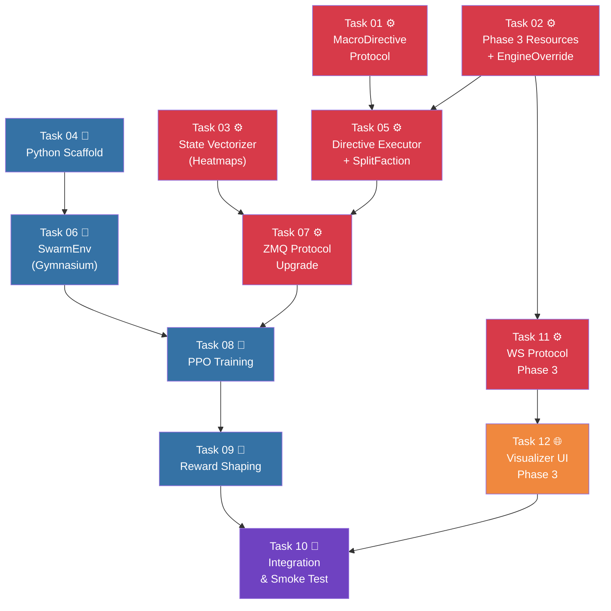

# Phase 3: Macro-Brain & RL Training — The Multi-Master Arbitration Architecture

> **Phase:** 3 of 5 | **Depends on:** Phase 2 (Complete)
> **TDD Reference:** Section 3 + Case Study: ML Communication Protocol (Q&A)

---

## Problem Statement

Phase 2 delivered a fully functional simulation with terrain, fog of war, flow fields, and combat. But the simulation currently runs on **static rules** — no learning, no adaptation. Phase 3 introduces the **Macro-Brain**: a Python RL agent (PPO via SB3) that observes the simulation via spatial heatmaps and issues macro-level strategic directives to control swarm behavior.

The central design challenge is the **Multi-Master Arbitration Problem**: when multiple authority sources (Game Engine, ML Brain, Physics Core) attempt to control the same entities simultaneously, who wins?

The deeper challenge (from the case study question) is the **ID-blind Swarm Splitting Paradox**: how can the ML brain command "100 flank left, 50 flank right" when it never sees individual Entity IDs? The answer lies in three complementary strategies:

1. **Pheromone Gravity Wells** (fuzzy splitting via flow field attractors)
2. **Dynamic Sub-Faction Tagging** (precise splitting via `SplitFaction`)
3. **Boids Self-Organizing Flanking** (emergent behavior from separation physics)

The RL agent must learn **when to use which strategy** — this IS the Phase 3 training objective.

## Core Design Principles

### 1. Subsumption Architecture (Three-Tier Authority)

| Tier | Authority | Scope | Examples |
|------|-----------|-------|----------|
| **Tier 1: Engine** | Absolute Override | Micro (specific Entity IDs) | Cutscenes, player abilities, scripted events |
| **Tier 2: ML Brain** | Strategic Control | Macro (factions, rulesets, flow fields) | Navigation targets, aggro masks, faction splits |
| **Tier 3: Rust Core** | Autonomic Execution | Universal (all entities) | Boids, flow field following, collision, damage |

### 2. ID-Blind Macromanagement

ML Brain **never** touches Entity IDs. It controls:
- **Where** entities go → `UpdateNavigation`, `SetZoneModifier`
- **Which group** goes → `SplitFaction`, `MergeFaction`
- **Who fights whom** → `SetAggroMask`
- **How fast** they move → `TriggerFrenzy`

Rust Core translates these macro-commands into per-entity behavior.

### 3. Data Isolation via Disjoint ECS Queries

The `EngineOverride` component pattern uses Bevy's `Without<T>` / `With<T>` filters to create **zero-cost branching**.

### 4. Tensor-Friendly Observation Space

10,000+ entities compressed into spatial heatmaps (density grids per faction). Sub-factions get their own density channel.

### 5. MDP Safety via Intervention Flags

Engine overrides trigger `intervention_active: true` → Python masks reward for that step.

### 6. Data Isolation: Physics vs NN Concerns

Rust exports **raw** density data (`HashMap<u32, Vec<f32>>`). Python packs it into fixed NN channels. Channel count, packing order, and tensor reshaping are NN architecture decisions — never embedded in the simulation core.

---

## Safety Invariants (v3 Patches)

> [!CAUTION]
> **Eight** critical vulnerabilities were identified during architectural review (4 Rust, 4 Python). All patches are **mandatory** and have corresponding regression tests.

### Rust Core (P1–P4)

| # | Vulnerability | Severity | Fix | Regression Test |
|---|--------------|----------|-----|----------------|
| **P1** | **Vaporization Bug** — `ref` reads directive without consuming; SplitFaction fires 60×/sec | 🔴 Critical | `latest.directive.take()` — consume once | `test_vaporization_guard_*` |
| **P2** | **Moses Effect** — negative cost_modifier on wall tile makes it traversable | 🔴 Critical | `if cost == u16::MAX { continue; }` before overlay | `test_moses_effect_*` |
| **P3** | **Ghost State Leakage** — MergeFaction doesn't purge zones/buffs/aggro | 🟠 High | Deep cleanup of ALL registries | `test_ghost_state_*` |
| **P4** | **f32 Sort Panic** — `f32` doesn't impl `Ord`, full sort is O(N log N) | 🔴 Critical | `select_nth_unstable_by` with `partial_cmp` — O(N) | `test_split_faction_quickselect_*` |

See [Feature 1 (v3)](./implementation_plan_feature_1.md) for full Rust patch details and code.

### Python RL (P5–P8)

| # | Vulnerability | Severity | Fix | Regression Test |
|---|--------------|----------|-----|----------------|
| **P5** | **Pacifist Flank Exploit** — sub-faction runs to map corner, earns infinite flanking reward | 🔴 Critical | Distance cutoff + attenuation in `flanking_bonus` | `test_patch5_pacifist_flank_*` |
| **P6** | **Static Epicenter** — hardcoded split point misses swarm → agent learns "split is useless" | 🟠 High | Dynamic epicenter from density centroid | `test_patch6_dynamic_epicenter_*` |
| **P7** | **Sub-Faction Desync** — Python tracks ghost IDs locally, diverges from Rust truth | 🟠 High | Read `active_sub_factions` from Rust snapshot | `test_patch7_sub_factions_*` |
| **P8** | **ZMQ Deadlock + MDP Pollution** — timeout crashes SB3; interventions poison value estimates | 🔴 Critical | Timeout → truncate episode; Tick swallowing loop (recv→send ordering) | `test_patch8_*` |

See [Feature 3 (v3)](./implementation_plan_feature_3.md) for full Python patch details and code.

### Knowledge Base

See [ecs_safety_patterns.md](file:///Users/manifera/Documents/Study/mass-swarm-ai-simulator/.agents/skills/rust-code-standards/ecs_safety_patterns.md) for permanent Rust knowledge base entry.

---

## User Review Required

> [!IMPORTANT]
> **Full Vocabulary from Day 1:** The plan includes the **complete 8-action** `MacroDirective` vocabulary with `SplitFaction`, `MergeFaction`, and `SetAggroMask` for the Flanking Playbook.

> [!IMPORTANT]
> **DAG Restructured: Debug Visualizer First (v5).** Feature 5 (T11 + T12) has been moved from Phase 3–4 to **Phase 1** so that every subsequent task has visual debugging tools available. This is achieved by expanding T02 to define ALL Phase 3 resource types (data-only structs) alongside `EngineOverride`. T05 still implements the logic (systems) that operates on those resources. No circular dependencies introduced.

---

## Proposed Changes

### DAG Execution Phases (v5 — Visualizer First)

> [!TIP]
> **Key Change:** T02 is expanded to "Phase 3 Resource Scaffolding" — defines ALL resource structs (`ActiveZoneModifiers`, `AggroMaskRegistry`, `LatestDirective`, etc.) as data-only types. This unblocks T11 (WS backend) to run in Phase 1, giving developers visual debugging tools before any core logic is implemented.



| Phase | Tasks | Parallelism | Rationale |
|-------|-------|-------------|----------|
| **Phase 1** | T01, T02, T03, T04, T11, T12 | All parallel (T02→T11→T12 chain, rest independent) | Debug tools ready before logic |
| **Phase 2** | T05, T06 | Parallel (Rust / Python) | Core executor needs T01+T02 resource types |
| **Phase 3** | T07 | Sequential | Bridges Rust↔Python, needs T03+T05 |
| **Phase 4** | T08 | Sequential | PPO needs env (T06) + protocol (T07) |
| **Phase 5** | T09, T10 | Sequential | Reward tuning, then end-to-end smoke test |

> **Phase count reduced from 6 → 5** because T11/T12 now run in Phase 1.

---

## Feature Details

- [Feature 1: Rust Input Contracts & Override System](./implementation_plan_feature_1.md) — Tasks 01, 02, 05
- [Feature 2: State Vectorization & ZMQ Protocol Upgrade](./implementation_plan_feature_2.md) — Tasks 03, 07
- [Feature 3: Python Gymnasium Environment & Training](./implementation_plan_feature_3.md) — Tasks 04, 06, 08, 09
- [Feature 4: Integration & Smoke Test](./implementation_plan_feature_4.md) — Task 10
- [Feature 5: Debug Visualizer — Phase 3 Observability](./implementation_plan_feature_5.md) — Tasks 11, 12


---

## Shared Contracts (Cross-Feature)

### Contract 1: `MacroDirective` Enum — Full Vocabulary (Rust ↔ Python)

The complete macro-level action vocabulary, enabling all three swarm-splitting strategies:

```rust
// micro-core/src/bridges/zmq_protocol.rs

#[derive(Serialize, Deserialize, Debug, Clone, PartialEq)]
#[serde(tag = "directive")]
pub enum MacroDirective {
    // ── Strategy Selection ──

    /// Action 0: Maintain current behavior (no-op)
    Hold,

    // ── Navigation Control ──

    /// Action 1: Redirect a faction's flow field
    UpdateNavigation {
        follower_faction: u32,
        target: NavigationTarget,
    },

    /// Action 2: Temporary speed boost for a faction
    TriggerFrenzy {
        faction: u32,
        speed_multiplier: f32,
        duration_ticks: u32,
    },

    /// Action 3: Pull faction toward a coordinate (retreat waypoint)
    Retreat {
        faction: u32,
        retreat_x: f32,
        retreat_y: f32,
    },

    // ── Spatial Control (Strategy 1: Pheromone Gravity Wells) ──

    /// Action 4: Create/modify a flow field cost zone
    /// Positive cost_modifier = repel (entities avoid this zone)
    /// Negative cost_modifier = attract (entities drawn to this zone)
    SetZoneModifier {
        target_faction: u32,
        x: f32,
        y: f32,
        radius: f32,
        cost_modifier: f32,
    },

    // ── Formation Control (Strategy 2: Sub-Faction Tagging) ──

    /// Action 5: Split a percentage of a faction into a new sub-faction
    /// Rust selects entities nearest to `epicenter` first
    SplitFaction {
        source_faction: u32,
        new_sub_faction: u32,
        percentage: f32,        // 0.0 to 1.0
        epicenter: [f32; 2],    // Spatial selection bias
    },

    /// Action 6: Merge a sub-faction back into its parent
    MergeFaction {
        source_faction: u32,
        target_faction: u32,
    },

    // ── Combat Control ──

    /// Action 7: Toggle combat between two factions
    /// "The Blinders" — lets a flanking unit pass through the frontline
    SetAggroMask {
        source_faction: u32,
        target_faction: u32,
        allow_combat: bool,
    },
}

/// Navigation target: dynamic (chase a faction) or static (go to a point)
#[derive(Serialize, Deserialize, Debug, Clone, PartialEq)]
#[serde(tag = "type")]
pub enum NavigationTarget {
    Faction { faction_id: u32 },
    Waypoint { x: f32, y: f32 },
}
```

### Contract 2: `EngineOverride` Component (unchanged)

```rust
#[derive(Component, Debug, Clone)]
pub struct EngineOverride {
    pub forced_velocity: Vec2,
    pub ticks_remaining: Option<u32>,
}
```

### Contract 3: Enhanced State Snapshot (Rust → Python)

```rust
pub struct StateSnapshot {
    // ... existing fields ...

    /// Spatial density heatmap per faction (including sub-factions).
    /// Key = faction_id, Value = flat Vec<f32> of size (grid_w × grid_h).
    /// Values normalized to [0.0, 1.0].
    pub density_maps: HashMap<u32, Vec<f32>>,

    /// True if any Tier 1 (Engine) override is active this tick.
    pub intervention_active: bool,

    /// Active zone modifiers for observation feedback
    pub active_zones: Vec<ZoneModifierSnapshot>,

    /// List of currently active sub-factions (created by SplitFaction)
    pub active_sub_factions: Vec<u32>,

    /// Current aggro mask state per faction pair
    pub aggro_masks: HashMap<String, bool>,  // "0_1" → true/false
}

pub struct ZoneModifierSnapshot {
    pub target_faction: u32,
    pub x: f32,
    pub y: f32,
    pub radius: f32,
    pub cost_modifier: f32,
    pub ticks_remaining: u32,
}
```

### Contract 4: Python Observation & Action Spaces

```python
# Observation: Dict space
observation_space = Dict({
    # Density heatmap — 4 channels (faction 0, 1, sub-faction slot 0, sub-faction slot 1)
    "density_ch0": Box(low=0.0, high=1.0, shape=(50, 50), dtype=np.float32),
    "density_ch1": Box(low=0.0, high=1.0, shape=(50, 50), dtype=np.float32),
    "density_ch2": Box(low=0.0, high=1.0, shape=(50, 50), dtype=np.float32),
    "density_ch3": Box(low=0.0, high=1.0, shape=(50, 50), dtype=np.float32),
    # Terrain hard cost map — 50×50
    "terrain": Box(low=0.0, high=1.0, shape=(50, 50), dtype=np.float32),
    # Summary: [own_count, enemy_count, own_avg_health, enemy_avg_health,
    #           sub_faction_count, active_zones_count]
    "summary": Box(low=0.0, high=1.0, shape=(6,), dtype=np.float32),
})

# Action: Discrete(8) — maps to MacroDirective enum
# 0=Hold, 1=UpdateNav(→enemy), 2=TriggerFrenzy, 3=Retreat(→spawn),
# 4=SetZoneModifier(center, attract), 5=SplitFaction(30%, →nearest cluster),
# 6=MergeFaction(sub→parent), 7=SetAggroMask(toggle)
action_space = Discrete(8)
```

### Contract 5: ZMQ Message Flow

```
Rust → Python (REQ):
{
  "type": "state_snapshot",
  "tick": 1234,
  "density_maps": { "0": [...], "1": [...], "101": [...] },
  "terrain_hard": [...],
  "summary": { "faction_counts": {0: 3500, 1: 200, 101: 1500}, ... },
  "intervention_active": false,
  "active_zones": [{ "target_faction": 0, "x": 500, "y": 500, "radius": 100, "cost_modifier": -50, "ticks_remaining": 60 }],
  "active_sub_factions": [101],
  "aggro_masks": { "101_1": false }
}

Python → Rust (REP):
{
  "type": "macro_directive",
  "directive": "SplitFaction",
  "source_faction": 0,
  "new_sub_faction": 101,
  "percentage": 0.3,
  "epicenter": [700.0, 200.0]
}
```

---

## File Summary

| Task | File | Action | Domain |
|------|------|--------|--------|
| T01 | `micro-core/src/bridges/zmq_protocol.rs` | MODIFY | Rust |
| T02 | `micro-core/src/components/engine_override.rs` | NEW | Rust |
| T02 | `micro-core/src/components/mod.rs` | MODIFY | Rust |
| T03 | `micro-core/src/systems/state_vectorizer.rs` | NEW | Rust |
| T03 | `micro-core/src/systems/mod.rs` | MODIFY | Rust |
| T04 | `macro-brain/requirements.txt` | MODIFY | Python |
| T04 | `macro-brain/src/env/__init__.py` | NEW | Python |
| T04 | `macro-brain/src/env/spaces.py` | NEW | Python |
| T04 | `macro-brain/src/utils/__init__.py` | NEW | Python |
| T04 | `macro-brain/src/utils/vectorizer.py` | NEW | Python |
| T04 | `macro-brain/src/training/__init__.py` | NEW | Python |
| T05 | `micro-core/src/systems/directive_executor.rs` | NEW | Rust |
| T05 | `micro-core/src/systems/engine_override.rs` | NEW | Rust |
| T05 | `micro-core/src/systems/mod.rs` | MODIFY | Rust |
| T05 | `micro-core/src/systems/movement.rs` | MODIFY | Rust |
| T05 | `micro-core/src/config.rs` | MODIFY | Rust |
| T05 | `micro-core/src/rules/interaction.rs` | MODIFY | Rust |
| T05 | `micro-core/src/rules/navigation.rs` | MODIFY | Rust |
| T06 | `macro-brain/src/env/swarm_env.py` | NEW | Python |
| T07 | `micro-core/src/bridges/zmq_bridge/systems.rs` | MODIFY | Rust |
| T07 | `micro-core/src/bridges/zmq_protocol.rs` | MODIFY | Rust |
| T07 | `micro-core/src/bridges/zmq_bridge/mod.rs` | MODIFY | Rust |
| T07 | `micro-core/src/systems/flow_field_update.rs` | MODIFY | Rust |
| T08 | `macro-brain/src/training/train.py` | NEW | Python |
| T08 | `macro-brain/src/training/callbacks.py` | NEW | Python |
| T09 | `macro-brain/src/env/rewards.py` | NEW | Python |
| T10 | `micro-core/src/main.rs` | MODIFY | Rust |
| T11 | `micro-core/src/bridges/ws_protocol.rs` | MODIFY | Rust |
| T11 | `micro-core/src/systems/ws_sync.rs` | MODIFY | Rust |
| T11 | `micro-core/src/systems/ws_command.rs` | MODIFY | Rust |
| T12 | `debug-visualizer/index.html` | MODIFY | HTML |
| T12 | `debug-visualizer/style.css` | MODIFY | CSS |
| T12 | `debug-visualizer/visualizer.js` | MODIFY | JS |

---

## Resolved Design Decisions

| # | Question | Decision | Rationale | Phase 4 Upgrade |
|---|---------|----------|-----------|----------------|
| **Q1** | SB3 vs RLlib? | **SB3 (PPO)** | Single-machine, simpler API, `MultiInputPolicy` supports Dict obs natively. ~2 steps/sec is acceptable for Phase 3 prototyping. | RLlib for distributed multi-env training |
| **Q2** | Heatmap grid size? | **50×50** | Matches `TerrainGrid` dimensions (50×50 cells at 20px). 2,500 cells × 4 bytes = 10 KB/channel — well within ZMQ real-time budget. | Experiment with 100×100 |
| **Q3** | Fixed vs dynamic density channels? | **Fixed 4-channel** | Standard CNNs need fixed input dims. Ch0=own, Ch1=enemy, Ch2-3=sub-faction slots. Python vectorizer packs dynamically (Data Isolation principle). | Attention-based encoder for N-faction |
| **Q4** | AI evaluation frequency? | **2 Hz (every 30 ticks)** | Macro strategy doesn't need per-frame decisions. Matches flow field update rate. Lower freq = less ZMQ overhead = faster training. | Experiment with 5 Hz |
| **Q5** | Discrete(8) vs parameterized actions? | **Discrete(8) with preset templates** | Simpler exploration, each action equally likely. Dynamic epicenter (P6 fix) already makes `SplitFaction` context-aware via density centroid. | Hybrid continuous/discrete action space |

---

## Verification Plan

### Automated Tests

**Rust Side:**
```bash
cd micro-core && cargo test
cd micro-core && cargo clippy -- -D warnings
```

Expected new tests:
- `MacroDirective` serde roundtrip (all 8 variants)
- `NavigationTarget` serde roundtrip (Faction + Waypoint)
- `EngineOverride` lifecycle (insert, countdown, auto-remove)
- State vectorizer: density heatmap, summary stats (NO channel packing in Rust)
- Directive executor: all 8 directives handled correctly
- `SplitFaction`: correct percentage of entities reassigned by `epicenter` proximity
- `MergeFaction`: entities return to parent faction + deep cleanup verified
- `SetAggroMask`: interaction system respects aggro mask
- `SetZoneModifier`: flow field cost map modified within radius
- Engine override system: tick countdown, auto-removal, velocity forcing
- Movement system: `Without<EngineOverride>` filter, speed buff application

**Mandatory Patch Regression Tests (8):**
- `test_vaporization_guard_directive_consumed_once` — SplitFaction executes once, not 60×/sec
- `test_vaporization_guard_latest_is_none_after_execution` — directive is None after system runs
- `test_moses_effect_wall_remains_impassable` — u16::MAX tiles immune to zone modifiers
- `test_moses_effect_non_wall_reduced_by_modifier` — normal tiles correctly modified
- `test_ghost_state_merge_cleans_zones` — MergeFaction purges zone modifiers
- `test_ghost_state_merge_cleans_speed_buffs` — MergeFaction purges speed buffs
- `test_ghost_state_merge_cleans_aggro_masks` — MergeFaction purges aggro masks
- `test_split_faction_quickselect_correct_count` — O(N) selection, f32-safe

**Python Side:**
```bash
cd macro-brain && python -m pytest tests/ -v
```

Expected new tests:
- Vectorizer: JSON snapshot → numpy 4-channel tensor conversion (packing done in Python)
- Space definitions: observation/action space shapes
- Action-to-directive mapping for all 8 actions
- Reward components: survival, kill, territory, health, flanking bonus
- Intervention flag → reward masking
- SwarmEnv: offline mocked tests for all action types

### End-to-End Smoke Test

1. Start Rust core: `cd micro-core && cargo run`
2. Start training: `cd macro-brain && python -m src.training.train --timesteps 5000`
3. Verify: reward curve non-zero, entities respond to directives
4. SplitFaction test: observe sub-faction entities split on Debug Visualizer
5. SetAggroMask test: flanking units pass through frontline without fighting
6. Moses Effect test: place wall, apply zone modifier, verify entities don't clip through
